# 第一章 Java 编程语言概述

## 一、走进 Java 语言

1、 Java 由 SUN 公司研发，后来被 Oracle 收购

2、Java 之父：James Gosling

3、Java 由 1995 年发布，正事版本由 1996 年1月发布（jdk1.0）


## 二、Java 的特点

面向对象

分布式

简单化

多线程

安全

跨平台移植 ---- JVM Java 虚拟机


## 三、Java 的三大平台体系

JavaSE （Java Standard Edition）Java 标准版：适用于开发 C/S（Client/Server） 架构的应用程序

JavaEE（Java Enterprise Edition）Java 企业版：适用于开发B/S（Browser/Server）架构的应用程序

JavaME（Java Micro Edition）Java 微型版：---->  Android


## 四、开发第一个应用程序

### 1、搭建开发环境

JVM （Java Virtual Machine）Java 虚拟机：用于与操作系统进行交互


JRE（Java Runtime Environment）Java 运行环境：JVM + Java 提供的核心类库

JDK（Java Development Kit）Java 开发工具集：JRE + Java 开发工具包（javac.exe java.exe javadoc.exe）


### 2、下载安装 JDK

①通过命令提示符到 JDK 安装路径的bin路径下，执行 javac

②配置 path 环境变量： JDK 安装路径的bin路径下

​	目的：在任意路径下执行 javac

​	执行流程：先在当前路径下找是否有 javac.exe,若没有再到 path 环境变量中从前往后依次查找

③配置 JAVA_HOME ：配置到 JDK 安装路径的根目录。 如： d:\java\jdk1.8.0.1


### 3、开发第一个应用程序的步骤

①编写：.java 源文件。 【HelloWorld.java】

```java
public class HelloWorld{
    public static void main(String[] args){
        System.out.println("HelloWorld!");
    } 
}
```

②编译：通过 javac 命令，生成一个或多个 .class 字节码文件。【javac HelloWorld.java】

③运行：通过 java 命令，将一个或多个 .class 字节码文件加载到内存中。【java HelloWorld】


### 4、开发第一个应用程序的注意

①以.java结尾的文件称为 .java 源文件

②一个.java 源文件中可以有多个类

③一个 .java 源文件中只能有一个 public 修饰的类

④public 修饰类的名称必须与 .java 源文件名称一致

⑤每条语句以 ";" 分号结尾

⑥Java 严格区分大小写

⑦一类中只能有一个 main 方法，称为主方法，是程序的入口

```java
 public static void main(String[] args){}
```


## 五、注释语句

不会被 JVM 解释执行的语句。利用注释语句解释说明一段代码


//单行注释


/*

多行注释

注意：多行注释不能嵌套

*/


/**

Java 特有的注释：文档注释

可以通过 javadoc -d mydoc -author -version HelloWorld.java 命令生成说明文档

*/


# 第二章 Java 基础语法1

## 一、标识符

Java 中凡是自己命名的地方，都叫标识符。如：包名、类名、接口名、方法名、变量名、常量名


关键字：就是被 Java 赋予了特殊含义的单词

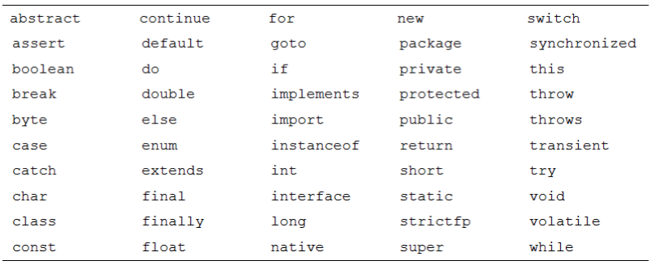


### 1、命名规则（必须遵守，若不遵守编译不能通过）

①只能有字母 a-z A-Z, 数字 0-9，特殊字符 下划线"_" 和 美元符"$"

②数字不能开头

③名字之间不可以包含空格

④不能使用关键字和保留字，但是可以包含关键字和保留字

⑤Java 严格区分大小写，但是长度无限制


### 2、命名规范（可以不遵守，但是会受到鄙视）

①包名：所有字母都小写。 如：xxxyyyzzz

②类名、接口名：若由多个单词组成，所有单词的首字母都大写。 如： XxxYyyZzz

③变量名、方法名：若由多个单词组成，第一个单词首字母小写，其余单词首字母大写。如：xxxYyyZzz

④常量名：所有字母都大写，每个单词之间以 "_" 隔开。如： XXX_YYY_ZZZ


## 二、变量

保存数据


**局部变量**  &  成员变量


1. 变量的格式：数据类型 变量名 = 值;   如： int var = 10;

   //声明一个变量

   int var;

   //为变量赋值

   var = 10;

   var = 20;

2. 变量的概念：

   ①在内存中开辟一块内存中间

   ②该空间有名称（变量名）有类型（数据类型）

   ③变量可以在指定的范围内不断的变化

3. 变量的注意：

   ①在同一个作用域内变量名不能重复

   ②作用域：变量作用在所属的那对 {} 内

   ③**局部变量在使用前必须赋值**

   ④先声明，后使用


## 三、进制之间的转换（了解）


## 四、变量的数据类型

1、基本数据类型（8种）

​	 整型：byte(8位  -128 ~ 127)  short(16位)  int（32位）-默认类型  long(64位)

​	 浮点型：float(32位)  double(64位)-默认类型

​	 字符型：char(2个字节-16位)

​	 布尔型：boolean

2、引用数据类型

​		|--类(class)  ------------  String

​		|--接口(interface)

​		|--数组([])

3、声明变量的注意

①声明 long 型变量时，值后必须加 L 或 l 。  如：long l1 = 12223453**L**;

②声明 float 型变量时，值后必须加 F 或 f 。如：float f1 = 15.6F;

③声明 double 型变量时，值后可以 D 或 d 。 如： double d1 = 15.6D;

④声明 char 型变量时，值必须使用单引号。char 型变量只能存储单个字符

   char 以 Unicode 编码存储（包含中文、日文、特殊字符等）

​	如：char c1 = 'a';

​		char c2 = '中';

​		char c3 = '\n';

​		char c4 = '\u0004';

⑤声明 String 型变量时，值后必须使用双引号


## 五、数据类型之间的转换

自动类型转换（自动升级）：小容量转大容量。系统自动完成。

​	①byte short char ---> int ---> **long  --->  float**  --->  double

​	②byte short char 三者之间不做运算，若运算将自动提升为 int 再做运算

​	③boolean 不参与运算的


​	④任何基本数据类型与 String 使用连接符(+), 都将串接为 String

强制类型转换：大容量转小容量。需要使用强转符“(需要转换的类型)” 

​			   可能损失精度

int i1 = 123;

byte b1 = (byte)i1;


## 六、运算符

算数运算符 ：+ -  *  /  %  前++ 后++  前-- 后--  连接符(+)  +  -

//除法：

int res = 1234 / 1000 * 1000;  //1000

//取模

int res = -1 % 5;

//++ 运算符

int i = 10;

int j = i++;

System.out.println(i);

//关于 ++ 的面试题

int i = 10;

i = i++;

System.out.println(i);//i=10

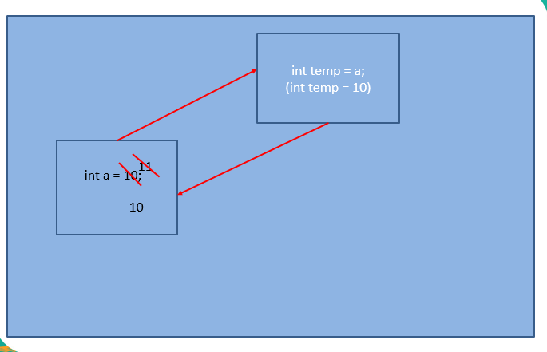


//考试题

int x = 1, y = 1;

if(x++ == 2 && ++y == 1){

​	x = 7;

}

System.out.println(x);//x=2


赋值运算符: =  +=  -=  *=  /=  %=

【面试题】

short s = 1;

s = s + 1;//编译？NO

s += 1; //s = (short)(s + 1)编译？YES


比较运算符（关系运算符）：==  !=  >  <  >=  <=

​	结果都为 boolean 值

逻辑运算符：&&-短路与   ||-短路或   !-逻辑非   &-逻辑与   |-逻辑或   ^-逻辑异或

​	结果都为 boolean 值

​	需求：判断一个数是不是大于 10 小于 20

​	int a = 10;

​	//10 < a < 20; 错误的做法

​	boolean boo = a > 10 && a < 20;

【面试题】&& 与 & 的区别？     ||  与  |  的区别？

​	&& ：称为短路与，当左边表达式结果为 false 时，右边表达式将不再计算

​	&：是位运算符，当用于逻辑运算时，无论左边表达式结果为 true 还是false ，右边都计算

位运算符：~  &  |  ^   <<   >>  >>>

【面试题】用最快的速度计算 2 * 8 结果

  2 << 3;

三元运算符

 	格式：条件表达式 ?  表达式1 : 表达式2;

​	①若条件表达式结果为 true 执行表达式1，否则执行表达式2

​	②表达式1和表达式2结果的类型需要保持一致

​	int a = 10;

​	int b = 20;

​	//a > b ? a : "哈哈哈"；错误的写法

​	//System.out.println(a > b ? a : "哈哈哈"); 不建议使用

# 第三章 Java 基础语法2

## 一、流程控制

### 顺序结构

### 分支结构

​	条件判断

​		①

​			if(条件表达式){

​				//若 条件表达式 结果为 true 时，需要执行的语句 

​			}


​		②

​			if(条件表达式){

​				//若 条件表达式 结果为 true 时，需要执行的语句 

​			}else{

​				//若 条件表达式 结果为 false 时，需要执行的语句

​			}

​		③

​			if(条件表达式1){

​				//若 条件表达式1 结果为 true 时，需要执行的语句

​			}else if(条件表达式2){

​				//若 条件表达式2 结果为 true 时，需要执行的语句

​			}

​			……

​			else{

​				//若上述条件表达式结果都为 false 时，需要执行的语句

​			}

​		注意：

​			①若某个条件表达式结果为 true 时，执行相应语句，其他 else-if 将不再执行

​			②if-else 语句可以嵌套

​	选择结构

​		switch(表达式){

​			case 值1:

​				//需要执行的语句

​				break;

​			case 值2:

​				//需要执行的语句

​				break;

​			case 值3:

​				//需要执行的语句

​				break;

​			……

​			default:

​				//需要执行的语句

​				break;

​		}

​		注意：

​			①表达式结果的类型只能是 byte short char  int  String(jdk1.7后)  枚举

​			②default 是可选的

​			③case 后只能写常量值不能写表达式

​			④break 是可选的, 若某个 case 后的值匹配成功，依次向下执行，直到遇到 break 为止

​			⑤表达式结果的类型需要与 case 后值的类型保持一致！


​		//需求：若一个数大于2小于等于5，打印 “2-5---”

​		//int a = 3;

​		char ch = '2';

​		switch(ch){

​			case 2:

​			case 3:

​			case 4:

​			case 5:

​				System.out.println("2-5");

​				break;

​		}

### 循环结构

重复的执行某语句


①初始化值

②循环条件

③迭代条件

④循环体


1、for 循环

​	for(① ; ② ; ③){

​		④

​	}


​	如：

​	for(int i = 0; i < 5; i++){

​		System.out.println(i);

​	}

​	

​	int i = 0;

​	for(; i < 5; i++){}

​	执行流程：①②④③②④③……②


2、while 循环

​	①

​	while(②){

​		④


​		③

​	}


3、do-while 循环

​	①

​	do{

​		④

​		③

​	}while(②);


while 和 do-while 的区别？

while ： 先判断循环条件，再执行循环体

do-while : 先执行循环体，再判断循环条件。（do-while 至少执行一次）


嵌套循环：一个循环充当另一个循环的循环体

```java
//打印100以内的质数
boolean flag = true;
for(int i = 2; i <= 100; i++){
    for(int j = 2; j < i; j++){
        if(i % j == 0){
            //该数一定不是一个质数
            flag = false;
            break;
        }
    }
    
    if(flag){
        System.out.println(i);
    }
    flag = true;
}
```

## 二、特殊流程控制语句

break:用于结束“当前”循环。可用于 switch-case，用于结束switch-case

continue:用于结束“当次”循环。

```javascript
for(int i = 0; i <= 10; i++){
    if(i == 3){
        System.out.println(i);
        //break;
        continue;
    }
    System.out.println(i);
}
```

```java
label:for(int i = 0; i <= 10; i++){
    for(int j = 0; j <= 10; j++){
        if(j == 3){
            System.out.println(j);
            break label;
        }
    }
}
```


# 第四章 方法的声明和使用

## 一、方法

也叫函数，是一个功能的定义，是一个类中最基本的功能单元

## 二、方法的格式

​	修饰符 返回值类型 方法名(参数列表){

​		//功能语句

​		return 返回值;

​	}


​	①修饰符：暂时使用 public static

​	②返回值类型：说明该方法运行后有结果，那个结果的数据类型

​	③参数列表：就是局部变量，可以有0个或多个，每个参数之间以 "," 隔开

​	④** return : 用于结束当前方法

​	⑤返回值：方法运行结束后，那个结果具体的值


## 三、方法的注意

①“返回值类型”与“返回值”的数据类型需要保持一致！

②通过方法名+参数列表调用方法，方法名与参数列表（参数的个数、参数的类型）必须相同

③若方法声明了“返回值类型”说明该方法运行后有结果，若调用者需要用到该结果，可以声明变量接收

④若方法运行后不需要返回结果给调用者，“返回值类型”处声明为：void

​	void：无返回值

⑤方法中可以调用其他方法，不能声明方法


## 四、声明方法前两点明确

①是否需要返回结果给调用者（确定是否需要返回值）

②是否有未知的数据参与运算（确定是否需要参数，需要几个参数，参数的类型）


```java
public class MethodTest{
    
    public static void main(String[] args){
        //需求：计算一个数 * 2 + 1 的结果
        /*int num = 10;
        int res = num * 2 + 1;
        
        num = 5;
        res = num * 2 + 1;*/
        
        int res = calc(10);//实际参数
        System.out.println(res);
    }
    
    //
    public static int calc(int n){//形式参数：用于接收调用者传递的实际参数值
        return n * 2 + 1;
    }
    
    //需求：打印九九乘法表
    public static void print99(){
        calc(10);
    }
    
}
```


## 五、参数的值传递

基本数据类型：将基本数据类型作为参数，传递给方法，方法运行结束后，原值不会发生改变

```java
public class MethodTest{
    
    public static void main(String[] args){
        
        int a = 10;
        int b = 20;
        
        add(a, b);
        
        System.out.println("a=" + a + "," + "b=" + b);//a=10 b=20
    }
    
    //需求：改变两个数的值
    public static void add(int a, int b){//方法运行时，参数列表一定有值
        a += 1;
        b += 2;
    }
    
}
```


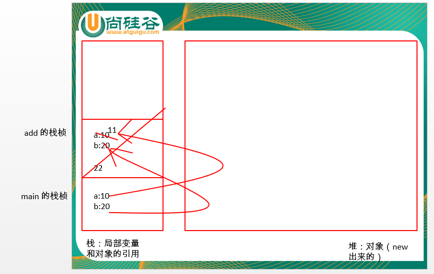

引用数据类型：

## 六、重载方法Overload

在同一个类中

①方法名相同

②参数列表不同（参数的类型、参数的个数）

注意：返回值类型无关


如：println() 该方法是典型的重载方法


**public void show(int a, char c){}**


public void show(char x, int a){} 


public double show(int a, char c, double d){}


public void shows(){}


# 第五章 面向对象编程（上）

## 一、面向对象编程（Object Oriented Programming  OOP）

1、面向对象与面向过程

面向过程：强调的是功能行为

面向对象：将功能行为封装进对象，调用具备了功能行为的对象


【例子】把大象装冰箱一共分几步？

①打开冰箱  ②把大象装进去（存储大象） ③关闭冰箱


如何运用面向对象思想思考上述问题？

人{

​	拉（冰箱）{

​		冰箱.打开（）

​	}


​	指挥（动物）{

​		动物.进入（）

​	}


​	推（冰箱）{

​		冰箱.关闭（）

​	}

}


冰箱{

​	打开（）{}

​	存储（）{}

​	关闭（）{}

}


大象{

​	进入（）{}

}


大海豚{

​	进入（）{}

}


2、面向对象更加注重前期的设计

①就是对类的设计

②设计类就是设计类的成员（属性&方法）


3、面向对象思想融入Java代码的过程

将现实生活中一类事物的共性内容进行提取，抽象成相应的 Java 类，使用Java类对其进行描述

现实生活中的一类事物：小猫 小狗 

共性的内容：名称  年龄  性别  吃饭的功能  睡觉的功能


class Animal{

​	//属性

​	String name;

​	int age = 1;

​	char gender;


​	//方法-功能行为

​	public void eat(){	

​		int a = 10;

​	}


​	public void sleep(){

​	}

}

​    

类本身是抽象的，因为类描述的是现实生活中的“一类”事物。

若需要具体到某一个事物，需要通过 **new** 关键字创建对象

如：Animal ani = new Animal();

​        ani.name = “花花”;

​        ani.age = 1;

​        ani.gender= '公';

​	ani.eat();

​	ani.sleep();

​	Animal ani1 = new Animal();

4、类和对象

类:抽象的，描述的是现实生活中的一类事物。类似于“汽车设计图”

对象:一个实实在在的个体。类似于“实实在在的汽车”

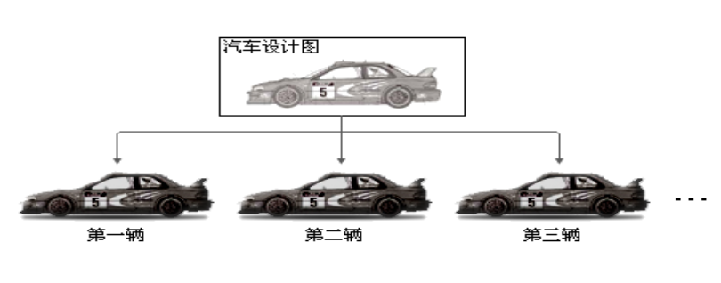

## 二、对象的属性和方法

### 属性的特点

1、属性：也叫成员变量，也叫实例变量

2、局部变量与成员变量的区别？

①内存中的位置不同

②作用域不同

③成员变量有默认值，局部变量没有默认值

3、属性的默认值

基本数据类型：

​	byte short int ---> 0

​	long  --->  0L

​	float  ----> 0.0F

​	double ----> 0.0D

​	char ---->  '\u0000'

​	boolean  ---->  false

引用数据类型：  ---->    **null**

​	|--类(class)

​	|--接口（interface）

​	|--数组([])

4、为属性的赋值方式

①默认值（缺省值）

②直接显示赋值


### 方法的参数传递

基本数据类型：将基本数据类型作为参数，传递给方法，方法运行结束后，原值不会发生改变

（内存图详见第四章）

引用数据类型：将引用数据类型作为参数，传递给方法，方法运行结束后，原属性值会发生改变

//变量的格式：数据类型 变量名 = 值;   int a = 10;    Number n = new Number();

```java
class Number{
    
    int a;
    int b;
    
}

class MethodTest{
    
    public static void main(String [] args){
        MethodTest mt = new MethodTest();
        
        Number num = new Number();
        num.a=10;
        num.b=20;
        
        mt.add(num);
        
        System.out.println("num.a=" + num.a + ", num.b=" + num.b);//
    }
    
    public void add(Number num){//当方法运行时，该参数类似于：Number num = new Number();
        num.a += 1;
        num.b += 2;
    }
    
}
```

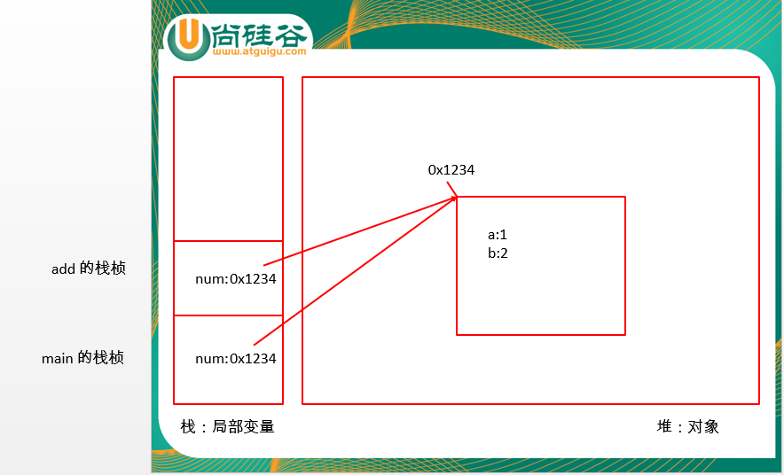


## 三、Java 的内存管理和垃圾回收

内存管理：

分配：由JVM自动的为其分配内存空间

释放：由JVM通过垃圾回收机制释放内存空间


垃圾回收机制（GC）：将内存中的垃圾对象从内存中释放

垃圾对象：不再被任何引用指向的对象


Person p = new Person();//分配内存

Person p1 = new Person();

p = p1;


System.gc() : 通知垃圾回收机制可以释放内存空间，但是垃圾回收机制并不会立即执行。

​			可以加快垃圾回收机制的运行。


## 四、面向对象的特性之一：封装性

1、封装的理解：该隐藏的隐藏起来，该暴露的暴露出来


2、访问控制修饰符：

public : 代表公共的，可用于修饰属性、方法、类。在任何地方都就可以访问

private ：代表私有的，可用于修饰属性、方法。只能在本类中


3、封装的步骤

①属性私有化（private）

②提供公共的（public） get/set 方法


```java
class EncapsulationTest{
    public static void main(String[] args){
        Animal ani = new Animal();
        //ani.legs = -10;
        
        ani.setLegs(-10);
    }
}

class Animal{
    private int legs; //描述腿的个数
    
    public void setLegs(int legs){
        if(legs > 0 && legs % 2 == 0){
            this.legs = legs;
        }
    }
    
    public int getLegs(){
        return legs;
    }
}
```

## 五、this 关键字

使用在本类中，代表当前对象，可用于调用属性、方法、构造器。

this.属性

this.方法

this(……);  调用本类构造器

​	①this 调用本类构造器，使用在当前构造器中可执行代码的首行

​	②避免递归构造器调用（至少有一个构造器中不使用 this）


谁让拥有this关键字的方法运行了，谁就是当前对象

```java
class Animal{
    private int legs; //描述腿的个数
    
    public void setLegs(int legs){
        if(legs > 0 && legs % 2 == 0){
            this.legs = legs;//区分局部变量和成员变量
        }
    }
    
    public int getLegs(){
        return legs;
    }
    
    public String say(){
        return getLegs();
    }
}
```

## 六、声明和使用构造器

### 1、构造器：也叫构造器方法，是类的成员之一

属性

方法

构造器

### 2、构造器的格式

访问控制修饰符 类名(参数列表){

​	//功能语句

}


### 3、构造器的作用

①创建对象  ： Person p = new Person();

②用于为对象进行初始化


### 4、构造器的注意

①构造器的名称必须与类名保持一致！

②若一个类中没有显示提供任何构造器时，系统会默认提供一个 无参构造器

​	public Person(){}

③若一个类中显示的提供了任何构造器时，系统默认无参构造器将不再提供

④构造器没有返回值，因此也不需要return

⑤构造器之间可以构成重载


### 5、构造器的重载

在同一个类中

①构造器的名称相同

②参数列表不同（参数的类型、参数的个数）

```java
class Person{
    private String name;
    private int age;
    private char gender;
    private double weight;
    
    //声明构造器
    public Person(){
        //this("", 18); 会发生递归构造器调用问题
        System.out.println("Person's Constructor……");
        cry();
    }
    
    public Person(String name, int age){
        this();
        this.name = name;
        this.age = age;
    }
    
    public Person(String name, int age, char gender, double weight){
        this(name, age);
        this.gender = gender;
        this.weight = weight;
    }
    
    public void setName(String name){
        this.name = name;
    }
    
    public String getName(){
        return name;
    }
    
    public void cry(){
        System.out.println("哭");
    }
}
```

## 七、包的管理

包的作用：

①区分重命名

②可用于控制访问权限

③可利用包划分项目结构层次，将功能相近的类划分到同一个包中


package ：确定当前类的位置

​	①使用在当前 .java 源文件中可执行代码的首行

​	②包的命名规范：所有字母都小写。通常使用所在公司域名的倒置

​		www.atguigu.com  ---->   com.atguigu.项目名.模块名;

​	③包中的每个 "." 代表一层目录


import ：确定需要引入类的位置

​	①使用在 package 和 class 关键字之间

​	②import 语句可以有多个，并排列出

​	③import com.atguigu.java.*  : 导入包中所有的类和接口。（不包括 包）

​	④若在一个类中使用了两个相同类名，不同包名的两个类

​		选择一个使用 import 导包的方式： import java.sql.Date;

​		选择另外一个使用全限定类名(全类名)的方式：java.util.Date date = new java.util.Date(1234);

 	⑤import static 静态导包：导入一个类中所有的静态内容（在类中使用静态成员时，可以省略类名.）

# 第六章 声明和使用数组

## 一、数组

用于批量保存一类数据，是引用数据类型之一


变量的格式：数据类型 变量名 = 值;

```java
int i = 0;
int i;
i = 10;
```

## 二、声明一个数组

```java
int[] scores;
String[] names;
Person[] persons;
```

## 三、为数组初始化并赋值

1、静态初始化：初始化操作和赋值操作同时进行

```java
scores = new int[]{55,66,77,88,99};
```

2、动态初始化：初始化操作和赋值操作分开进行

```java
names = new String[3];
names[0] = "张三";
names[1] = "李四";
names[2] = "王五";
```

```java
persons = new Person[3];
persons[0] = new Person();
persons[1] = new Person("张三", 18);
persons[2] = new Person("李四", 20);
```

## 四、数组的遍历

```java
int score = scores[0];
System.out.println(score);
System.out.println(scores[1]);
System.out.println(socres[2]);
System.out.println(socres[3]);
System.out.println(socres[4]);
```

1、普通 for 循环遍历数组

```java
for(int i = 0; i < scores.length; i++){
    int score = scores[i];
    System.out.println(score);
}
```

```java
for(int i = 0; i < persons.length; i++){
    Person p = persons[i];
    System.out.println(p.say());
}
```


2、增强 for 循环遍历数组

for(被遍历数组中元素的数据类型 变量名 : 被遍历的数组){

}

```java
for(int score : scores){
    System.out.println(score);
}
```

```java
for(Person p : persons){
    System.out.println(p.say());
}
```

注意：增强 for 循环不擅长改变数组中元素的值

## 五、数组的特点

1、数组无论是静态初始化还是动态初始化必须指明长度

2、数组中每个元素的位置都具有索引值（下角标、下标），索引值从0开始，到 数组的长度-1

3、获取数组长度的属性：length


## 六、数组的常见异常

```java
int[] array = new int[3];
array[8] = 100; //数组越界异常：ArrayIndexOutOfBoundsException
```

```java
Person[] persons = new Person[3];//{null, new Person(), new Person("张三", 18)}
persons[1] = new Person();
persons[2] = new Person("张三", 18);

for(Person p : persons){
    p.say();//null.say();//空指针异常：NullPointerEception
}
```

## 七、数组的默认值

基本数据类型：

​	byte short int --> 0

​	long --> 0L

​	float ---> 0.0F

​	double ---> 0.0D

​	char ---> '\u0000'

​	boolean ---> false;

引用数据类型： --->  null

​	|-- 类(class)

​	|-- 接口(interface)

​	|--数组([])

## 八、二维数组

1、声明一个二维数组

```java
int[][] array;
```

2、二维数组的初始化并赋值

①静态初始化：初始化操作和赋值操作同时进行

```java
array = new int[][]{ {1,2,3}, {4,5,6}, {7,8} };
```

②动态初始化: 初始化操作和赋值操作分开进行

方式一：

```java
array = new int[2][3];//{ {0,11,0}, {0,0,5} }
array[0][1] = 11;
array[1][2] = 5;
```

方式二：

```java
array = new int[3][];//{null, {0,0,0}, {0,0,66,0,0}}
array[1] = new int[3];
array[2] = new int[5];
array[2][2] = 66;
```

3、二维数组的遍历

```java
for(int i = 0; i < array.length; i++){
    int[] as = array[i];
    for(int j = 0; j < as.length; j++){
        System.out.println(as[j] + "\t");
    }
    System.out.println();
}
```

```java
for(int i = 0; i < array.length; i++){
    for(int j = 0; j < array[i].length; j++){
        System.out.print(array[i][j] + "\t");
    }
    System.out.println();
}
```

```java
for(int[] as : array){
    for(int a : as){
        System.out.print(a + "\t");
    }
    System.out.println();
}
```

## 九、命令行参数（了解）

```java
class HelloWorld{
    public static void main(String[] args){//args:命令行参数
        for(int i = 0; i < args.length; i++){
            String str = args[i];
        }
        
        //将 String 类型转换为 int 类型
        int num = Integer.parseInt(args[0]);
    }
}
```

通过 java HelloWorld 123 bbb ccc, JVM 将参数封装进 String 数组，传递给 main 方法

## 十、可变参数

```java
//需求：计算两个整数的和
public int add(int a, int b){
    return a + b;
}

//需求：计算三个整数的和
public int add(int a, int b, int c){
    return a + b + c;
}

//需求：计算 N 个整数的和
/*public static int add(int[] arr){
    int sum = 0;
    for(int i = 0; i < arr.length; i++){
        sum += arr[i];
    }
    return sum;
}*/

//可变参数解决上述问题，可变参数低层是数组，数组中数据如何获取，可变参数的数据就如何获取
public static int add(int ... arr){//... 表示可变参数，当调用方法时，可以传0个或多个int类型的参数
    int sum = 0;
    for(int i = 0; i < arr.length; i++){
        sum += arr[i];
    }
    return sum;
}

public static void add(Person ... persons){//可以接受0个或多个 Person 的对象
    for(Person p : persons){
        p.say();
    }
}

public static void add(int num, String ... args){
    
}

public static void main(String[] args){
    //int[] arr = new int[]{1,2,3,4,5};
    //add(arr);//每次传递参数时，还需要创建一个数组，有点麻烦
    
    add(1,2,3,4,5);//调用可变参数的方法
}
```

可变参数的注意：

​	①可变参数与相同类型数组参数之间不能构成重载

​	②可变参数必须使用在参数列表的末尾


# 第七章 面向对象编程（下）

## 一、面向对象的特性之二：继承

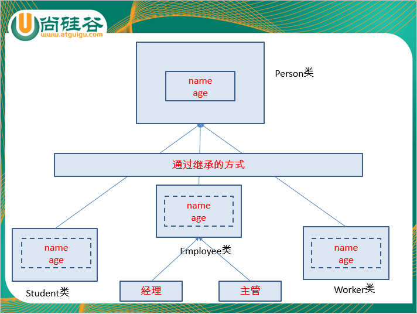


### 1、为什么使用继承

①提高代码的复用性

②利于维护

③继承让类与类之间产生了关系，可以创建更加特殊的数据类型（多态）


### 2、如何使用继承

关键字：extends  ---> 扩展，明确子类是父类的扩展

​	class A extends B{

​	}

​	子类：A      父类（超类、基类、SuperClass）：B

### 3、通过继承，子类可以继承父类中所有的属性和方法

包括可以继承私有的（private）修饰的属性，但是因为 private 修饰符的作用，子类不能直接访问私有属性

若需要访问，可以通过公共的 get/set 方法

```java
class Person{
    private String name;
    
    public void setName(String name){
        this.name = name;
    }
    
    public String getName(){
        return name;
    }
}

class Student extends Person{
    /*
    相当于子类拥有
    private String name;
    private int age;
    */
}

class ExtendsTest{
    public static void main(String[] args){
        Student stu = new Student();
        stu.setName("学生张三");
        String name = stu.getName();
    }
    
}
```

### 4、继承的注意

①不能为了简化代码，获取某功能而继承。若要继承两个类之间要有一定的所属关系：is a

```java
class A{
    void test1(){}
    void test2(){}
}

class B extends A{
    //void test1(){}
    //void test2(){}
}
```

②Java 只支持单继承，不支持多继承。（一个父类可以有多个子类，一个子类只能有一个父类）

```java
class A{
    void test1(){
        //11111111
    }
}

class B{
    void test1(){
        //22222222
    }
}
//假设
class C extends A, B{
    
}
C c = new C();
c.test1();
//注意：后续接口（多实现）可以解决类似问题
```

③Java 支持多层继承。


## 二、方法的重写（方法的覆盖 Override）

若父类中的方法对于子类来说不适用，子类可以对父类中的方法进行重写。

前提：子类继承父类

①方法名和参数列表必须相同

②子类重写方法的访问控制修饰符不能小于父类被重写方法的访问控制修饰符

③子类重写方法的返回值类型可以是父类被重写方法返回值类型的子类（仅在这种情况下，可以不同）

（通常情况下，重写时方法签名一模一样）


【面试题】Override 和 Overload 的区别？


## 三、super 关键字

super 关键字和 this 关键字使用方式一模一样


this ： 使用在本类中，代表当前对象的引用

super ： 使用在子类中，代表父类对象的引用


super.属性

super.方法

super() : 调用父类的构造器

​	①：子类继承父类后，子类中所有构造器中默认第一行第一句有一个隐式的：super()

​		super() 作用：调用父类无参构造器

​		super() 目的：子类继承父类后，继承了父类中所有的属性和方法，因此子类需要知道

​					  父类是如何为对象进行初始化

​       ②：若父类没有提供无参构造器，子类所有构造器中必须显示调用父类的有参构造器

​       ③：super() 只能写在当前构造器中可执行代码的首行

​	      this() 只能写在当前构造器中可执行代码的首行

​	      因此，super() 和 this() 二者不能同时出现！

## 四、四种访问控制修饰符

public ：公共的，可用于修饰属性、方法、类。 在任何地方都可以访问

protected ：受保护的，可用于修饰属性、方法。在本类中、本包中、子类中

default : 默认的（缺省的），可用于修饰 属性、方法、类。 可以在本类中、本包中

​		(default 并不是访问控制修饰符的关键，在什么都不加的情况下就是 default)

private ：私有的，可用于修饰属性、方法。只能在本类中访问

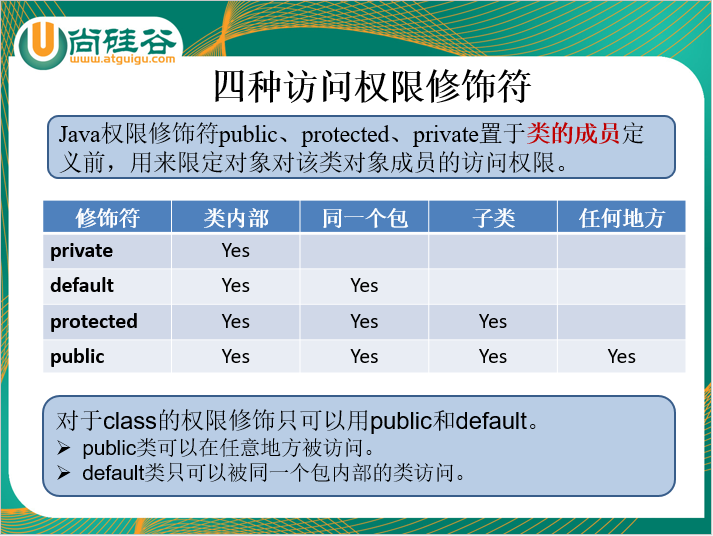

## 五、面向对象三大特性之一：多态

一类事物的多种表现形态。  人  -  男人  女人


### 1、多态的体现

①方法的重载与重写

②对象的多态性


### 2、对象的多态性

父类的引用指向子类的对象。

```java
Person p = new Man();//多态
p.eat();
p.sleep();

//p.smoking();//编译？不能通过
```

Java 程序的运行分为两种状态：

​	在多态的情况下：

​	编译时：“看左边”，看的是父类的引用。（而父类中不具备子类特有的方法）

​	运行时：“看右边”，看的是子类的对象。（实际运行的是子类重写父类的方法）

​		—————— 虚拟方法调用（动态绑定）

### 3、多态的前提

①要有继承关系

②要有方法的重写（为了完成虚拟方法调用）


### 4、引用数据类型之间的转换

前提：要有继承关系

向上转型：子类转父类。 系统自动完成

向下转型：父类转子类。需要使用强转符“(需要转换的类型)”

```java
Person p = new Man();//向上转型

Man man = (Man)p;//向下转型
man.smoking();//调用子类特有的方法

Woman woman = (Woman)p;//编译？可以通过   运行？会发生异常：ClassCastException
```


### 5、instanceof 运算符

Java 为上述问题提供的相应的解决办法

使用方式例如：

​	p instanceof Man : p 引用指向的对象是不是 Man 的本类类型及子类类型，如果是则返回true

```java
if(p instanceof Woman){
    Woman woman = (Woman)p;
}
```


### 6、多态的应用

①多态数组

``` java
Person[] persons = new Person[3]; //可以存Person本类类型的对象及子类类型的对象
persons[0] = new Person(); //本态
persons[1] = new Man(); //多态
persons[2] = new Woman();

for(int i = 0; i < persons.length; i++){
    /*Person p = persons[i];
    p.eat();
    p.sleep();
    */
    persons[i].eat(); //虚拟方法调用
    persons[i].sleep();
}
```

②多态参数

```java
//需求：展示一个男人吃饭和睡觉的功能
/*public void show(Man man){
    man.eat();
    man.sleep();
}

//需求：展示一个女人吃饭和睡觉的功能
public void show(Woman woman){
    woman.eat();
    woman.sleep();
}*/

public void show(Person p){//可以接收 Person 本类类型的对象及子类类型的对象
    p.eat(); //虚拟方法调用（动态绑定）
    p.sleep();
}
```

## 六、对象的关联

简单的说，就是指一个对象在中使用了另一个对象

```java
class Computer{
    
    public String getDetails(){
        return "一台计算机";
    }
}

class Person{
    String name = "张三";//也是对象
    int age;
    
    Computer computer;
    
    public Person(){}
    
    public Person(String name, int age, Computer computer){
        this.name = name;
        this.age =  age;
        this.computer = computer;
    }
    
    public String say(){
        return name + "," + age + "," + computer.getDetails();
    }
}
```

## 七、java.lang.Object 类

是所有类的父类。若一个类没有显示的继承任何类时，默认 extends java.lang.Object

①既然 Object 类时所有类的父类，因此Object类中的内容是最具共性的，所有类都适用

②既然 Object 类时所有类的父类，子类可以继承 Object 类中所有的方法

③既然 Object 类时所有类的父类，若Object类中的方法对于子类来说不适用，子类可以对其进行重写


```java
class Person /*extends java.lang.Object*/{
    
}

class Student extends Person{
    
}
```

### 1、public boolean equals(Object obj)

#### 【面试题】"==" 和 equals() 的区别

##### ①“==” 运算符：

比较基本数据类型：比较两个基本数据类型的值是否相等

比较引用数据类型：比较两个引用数据类型的地址值是否相等

```java
int a = 65;
char ch = 'A';

System.out.println(a == ch);//true

Person p1 = new Person("张三", 18);
Person p2 = new Person("张三", 18);

Person p3 = p1;

System.out.println(p1 == p2);//false 
System.out.println(p1 == p3);//true;
```


#### ②public boolean equals(Object obj):

- 在 java.lang.Object 类中
- equals 只能比较两个引用数据类型

- Object 类中的 equals() 方法比较的是两个对象的地址值。（通过查看源码发现，实际就是用 == 完成）

- 若 Object 类中的 equals() 对于我们来说不适用，可以重写 Object 类中的 equals 方法

  ```java
  String str1 = new String("AA");
  String str2 = new String("AA");
  
  System.out.println(str1.equals(str2));//true
  
  Person p1 = new Person("张三", 18);
  Person p2 = new Person("张三", 18);
  
  //若两个人的姓名和年龄一样，希望视为同一个人，Person 中可以重写 equals()
  System.out.println(p1.equals(p2));//false
  ```

  

```java
class Person /*extends java.lang.Object*/{

	private String name;
	private int age;
	
	public Person(){}
	
	public Person(String name, int age){
        this.name = name;
        this.age = age;
	}
    
    //重写 Object 的 equals 方法
    public boolean equals(Object obj){
        if(this == obj){
            return true;
        }
        
        if(obj instanceof Person){
            Person p = (Person)obj;
            
            if(this.name.equals(p.name) && this.age == p.age){
                return true;
            }
        }
        
        return false;
    }
    
    //重写 Object 类中的 toString()
    public String toString(){
        return name + "," + age;
    }
}

//Person p1 = new Person("张三", 18);
//Person p2 = new Person("张三", 18);
//System.out.println(p1.equals(p2));//true
```

### 2、public String toString()

返回当前对象的字符串表现形式

①在 java.lang.Object 类中

②Object 类中的 toString() 方法返回值的格式如下：

​		getClass().getName() + '@' + Integer.toHexString(hashCode());

③若 Object 类中的 toString() 对于我们来说不适用，我们可以对其进行重写

④当直接输出对象的引用时，默认调用 toString()

```java
System.out.println(p1.toString());
System.out.println(p1);
```

## 八、static 关键字

代表静态的，可用于修饰 属性、方法、代码块、**内部类


### 1、static 修饰的属性（静态变量或类变量）

①随着类的加载而加载，随着类的消失而消失。（生命周期最长）

②static 修饰的属性被所有该类的对象所共享

③若某个对象修改了该属性值，其他对象的该属性值也会随之改变

④静态变量的存在是优先于对象

⑤可以通过“类名.类变量”的方式


### 2、 static 修饰的方法（静态方法或类方法）

①随着类的加载而加载

②静态方法的存在优先于对象

③可以通过 “类名.类方法”的方式

④静态方法中不能使用非静态成员，非静态方法中可以使用静态成员

⑤静态方法中不能使用 this 和 super


### 3、类变量与实例变量的区别

①内存中的位置不同

②生命周期不同


## 九、类的成员之一：代码块

类的成员（属性、方法、构造器、代码块）


### 1、非静态代码块（初始化块）

①格式: 类中的一对 {}

②每次创建对象时执行

③用于为对象进行初始化（通常用于为重载构造器中的共性内容进行初始化）

④非静态代码块的执行优先于构造器

⑤非静态代码块可以有多个，顺序执行


### 2、为属性赋初始值的方式

①默认值（缺省值）

②直接显示赋值

③构造器赋值

④代码块赋值

顺序：①   ②④   ③

注意：②④ 顺序执行


### 3、静态代码块

①格式：static{}

②随着类的加载而加载，并且只加载一次

③静态代码块的执行优先于非静态代码块

④静态代码块中不能使用非静态成员

⑤静态代码块可以有多个，依次向下的顺序执行


## 十、final 修饰符

代表最终的，可用于修饰 **变量**、方法、类。


1、final 修饰的类不能被继承

2、final 修饰的方法不能被重写

3、final 修饰的变量叫常量，一旦被赋值，值不能改变。

​		①常量的命名规范：所有字母都大写，每个单词之间以“_”隔开。 如：XXX_YYY_ZZZ

​		②常量没有默认值，因此在使用前必须赋初始值。（直接显示赋值、构造器、代码块）

​			若选择使用构造器赋值，必须保证所有构造器都为该常量赋初始值

# 第八章 高级类特性

## 一、抽象类

### 1、为什么使用抽象类

类用于描述现实生活中的一类事物。类中有属性、有方法。方法都有方法体

某种情况下，父类只能知道子类应该具备一个怎样的方法，但是不能明确知道子类如何实现该方法。

如：几何图形，所有几何图形都应该具备一个计算面积的功能，但是不同几何图形计算面积的方式不同。


Java 为上述问题提供了解决办法：

Java 允许父类只是提供一个方法的声明，不提供具体的实现，具体的实现交给子类来完成

该方法称为“抽象方法”，拥有一个或多个抽象方法的类，称为“抽象类”。


### 2、如何使用抽象：abstract

#### 1、使用 abstract 修饰的类，称为“抽象类”

①格式：public **abstract** class Person{}

②拥有一个或多个抽象方法的类必须是抽象类

③抽象类中可以有非抽象方法, 抽象类中可以没有抽象方法

④**抽象不能创建实例

⑤抽象类可以声明构造器。

​		目的：子类继承父类后，继承父类中所有的属性和方法，因此子类需要通过构造器中的父类是如何为对			    象进行初始化


#### 2、使用 abstract 修饰的方法，称为“抽象方法”

①格式：访问控制修饰符 abstract 返回值类型 方法名(参数列表);

②若子类重写了父类中所有的抽象方法，该类为具体类，可以创建实例

③若子类没有重写父类中所有的抽象方法，该类必须是抽象类，不能创建实例


### 3、abstract 关键的使用注意

① abstract 与 private 不能同时使用

② abstract 与 static 不能同时使用

③ abstract 与 final 不能同时使用


```java
abstract class Person{
	private String name;
	
	public Person(){}
	
	public void setName(String name){
        this.name = name;
	}
    
    //人都应该具备一个说话的功能，但是不同的人说话的方式不一样
    public abstract void speak();
    
    public abstract void show();
}
```

```java
class Chinese extends Person{
    public void speak(){
        System.out.println("中国人说汉语");
    }
}
```

```java
abstract class American extends Person{
    public void speak(){
        
    }
    
    //public abstract void show();
}
```

## 二、接口

可以定义多个不相关事物的相同功能


### 1、如何使用接口(jdk1.7)

①接口与类时平级的

​	使用关键字：interface

​	如： public interface Flyer{}

②可以把接口理解为特殊的抽象类，因为接口中只能有“全局静态常量”和“抽象方法”

```java
//全局静态常量
int NUM = 100;//public static final 
//抽象方法
void fly();//public abstract 
```

③接口中不能有一般方法、变量、构造器、代码块

④**接口不能创建实例**

⑤接口就是用来被实现的

​	使用关键字：implements

​	如：class Bird implements Flyer{}

⑥实现接口的类称为“实现类”，实现类的功能和“继承”一样，可以继承接口中所有的成员

⑦若实现类实现了接口中所有的抽象方法，该类为具体类，可以创建实例

​    若实现类没有实现接口中所有的抽象方法，该类必须是抽象类，不能创建实例

⑧接口可以多实现。 ----- 解决了 Java 中单继承的局限性

​	如： class Bird implements Flyer, Runner{}

⑨接口不能继承任何类。接口可以继承接口，并且可以多继承接口。

⑩一个类可以继承另一个类，同时实现多个接口

​	如：class Bird extends Animal implements Flyer, Runner{}

​	注意：先继承，后实现

## 三、内部类

### 1、成员内部类

​	①是类的成员之一（属性、方法、构造器、代码块）

​	②可以使用四种访问控制修饰符（public protected default private）

​	③static  final 

​	④与类具有相同的特性

```java
//创建静态内部类对象
Person.Mobile m = new Person.Mobile();
m.show();

//创建非静态内部类对象
Person p = new Person();
Person.Computer pc = p.new Computer();
```


```java
class Person{
    
    private Stirng name;
    private String age;
    
    public Person(){}
    
    public void setName(String name){
        this.name = name;
    }
    
    //成员内部类
    public class Computer{
        private String name;
        
        public void setName(String name){
            System.out.println(name);//局部变量参数的 name
            System.out.println(this.name); //当前 Computer 对象的 name
            System.out.println(Person.this.name); //当前外部类 Person 对象的 name
       		System.out.println(age);//不涉及区分的问题，直接使用
        }
    }
    
    //可以实现对类的隐藏
    private class Head{
        
    }
    
    //静态内部类
    static class Mobile{
        public void show(){
            System.out.println("静态内部类中的方法");
        }
    }
    
}
```


### 2、局部内部类

//注意：局部内部类使用同级别的局部变量时，该变量必须为 final

jdk1.7前必须显示加 final，jdk1.8后，默认为final

```java
class InnerClass{

    //局部内部类：若某个类仅适用于当前方法，可以选择使用局部内部类
    //如下方式使用较少
    public void show(){
        final int num = 10;
        class Inner{
            
            public void test(
            	System.out.println(num);//注意：局部内部类使用同级别的局部变量时，该变量必须为 final
            )
            
        }
    }

    public static Comparator getComparator(){
        return new MyComparator();
    }
    
    //若 MyComparator 类仅适用于当前方法时，可以选择声明为局部内部类
    public static Comparator getComparator1(){
        class MyComparator implements Comparator{
    
            int compare(Object o1, Object o2){
                //实现接口中抽象方法
                return 0;
            }

		}
        
        return new MyComparator();
    }
    
    //匿名内部类的方式
    public static Comparator getComparator2(){
        Comparator com = new Comparator(){
            int compare(Object o1, Object o2){
                //实现接口中抽象方法
                return 0;
            }  
        };
        
        return com;
    }
    
    //匿名内部类+匿名对象
    public static Comparator getComparator3(){
        return new Comparator(){
            int compare(Object o1, Object o2){
                //实现接口中抽象方法
                return 0;
            } 
        };
    }
    
    public static void main(String[] args){
        Comparator com = getCompartor();//多态
        com.compare(1,1);//虚拟方法调用
    }
}

class MyComparator implements Comparator{
    
    int compare(Object o1, Object o2){
        //实现接口中抽象方法
        return 0;
    }
    
}
```

## 四、枚举

jdk1.5后的特性，可以定义有限数量的可穷举数据集。

简而言之，当确定一个类有几个对象时，使用枚举。


1、自定义枚举

​	①私有化构造器

​	②类的内部创建对象

```java
package com.atguigu.java;

//自定义枚举类
public class Season {

    private String seasonName;
    private String seasonDesc;

    //2. 类的内部创建对象
    public static final Season SPRING = new Season("春天", "春眠不觉晓");
    public static final Season SUMMER = new Season("夏天", "处处蚊子咬");
    public static final Season AUTUMN = new Season("秋天", "秋天叶子黄");
    public static final Season WINTER = new Season("冬天", "冬天雪花飘");

    //1. 私有化构造器
    private Season(String seasonName, String seasonDesc){
        this.seasonName = seasonName;
        this.seasonDesc = seasonDesc;
    }

    public String getSeasonName() {
        return seasonName;
    }

    public void setSeasonName(String seasonName) {
        this.seasonName = seasonName;
    }

    public String getSeasonDesc() {
        return seasonDesc;
    }

    public void setSeasonDesc(String seasonDesc) {
        this.seasonDesc = seasonDesc;
    }

    @Override
    public String toString() {
        return "Season{" +
                "seasonName='" + seasonName + '\'' +
                ", seasonDesc='" + seasonDesc + '\'' +
                '}';
    }
}

```

2、使用 enum 关键

- valueOf(String name) : 根据枚举类对象的字符串名称，获取对应的枚举类对象
- values() : 获取当前枚举类中所有的枚举类对象，组成的数组

```java
package com.atguigu.java;

//通过 enum 关键字定义枚举类
public enum Season {
    
    SPRING,
    SUMMER,
    AUTUMN,
    WINTER;

}
```

```java
public static void main(String[] args){
    Season spring = Season.SPRING;
    
    switch(spring){
        case SPRING:
        	System.out.println("春天");
        	break;
        case SUMMER:
        	System.out.println("夏天");
        	break;
        
    }
    
    Season sea = Season.valueOf("SPRING");
    Season[] seasons = Season.values();
}
```

3、枚举类实现接口

```java
package com.atguigu.java;

//枚举类实现接口
public enum Season3 implements MyInterface{

    SPRING{
        public void show(){
            System.out.println("春天");
        }
    },
    SUMMER{
        public void show(){
            System.out.println("夏天");
        }
    },
    AUTUMN{
        public void show(){
            System.out.println("秋天");
        }
    },
    WINTER{
        public void show(){
            System.out.println("冬天");
        }
    };

    /*public void show(){
        System.out.println("季节");
    }*/

}

```

## 五、注解

jdk1.5后的特性，是一个代码级别的说明，是一个元数据。

注解在 Java 中以“@注解名”的形式呈现的。


1、JDK 内置的常用注解

​	@Override ：用于描述方法，说明该方法必须是一个重写方法

​	@Deprecated ：用于注解属性、方法、类。 说明已经过时

​	@SuppressWarnings ：用于抑制编译器警告


2、自定义注解

```java
@Documented
public @interface MyAnnotation{
    
    String value() default "atguigu";
    
}
```

​	

3、元注解

```
@Retention : 描述注解的生命周期
@Target: 描述注解可以修饰哪些程序元素
@Documented ：描述注解可以随之生成说明文档,生命周期必须是 Runtime
@Inherited ：描述注解拥有继承性
```


# 第九章 使用基础 API

## 一、包装类（包裹类 Wrapper）

Java 针对八种基本数据类型提供了对应的包装类

基本数据类型	包装类

byte			Byte

short		      Short

int		           Integer

long		        Long

float			Float

double		    Double

char			Character

boolean		 Boolean

```java
1. 基本数据类型与包装类之间的转换
装箱：将基本数据类型转换成对应的包装类
①使用对应包装类的构造器
②通过对应包装类的静态方法 valueOf()

拆箱：将包装类转换成对应的基本数据类型
①通过对应包装类的 xxxValue() 方法。   xxx:代表基本数据类型

2. 自动装箱与自动拆箱（jdk1.5后）
	Integer num = 123; //自动装箱
	int i = num; //自动拆箱

3. 基本数据类型、包装类 与 String 之间的转换
1) 基本数据类型、包装类 转换成 String
①对应包装类的静态方法 toString()
② String str4 = i2 + "";
③使用 String 类的静态方法 valueOf()

2) String 转换成 基本数据类型、包装类
①使用对应包装类的构造器
②使用对应包装类的静态方法 parseXxx() 。  Xxx：代表基本数据类型，注意：没有 parseChar()
③使用对应包装类的静态方法 valueOf()
```

【面试题】

```java
Integer num1 = 100;
Integer num2 = 100;

System.out.println(num1 == num2);//true

Integer num3 = 130;
Integer num4 = 130;

System.out.println(num3 == num4);//false
```

Integer 提供了一个小的缓存，目的是提高效率，该缓存在的取值范围在（-128~127），若需要装箱的值在该取值范围内，则从缓存中取一个 Integer 的实例，若需要装箱的值超出了该取值范围，则重写 new Integer() 的实例


## 二、java.lang.String 类

**不可变的字符序列**。

【面试题】如下 str1 与 str2 的区别？

```java
String str1 = "abc";
String str2 = new String("abc");
```

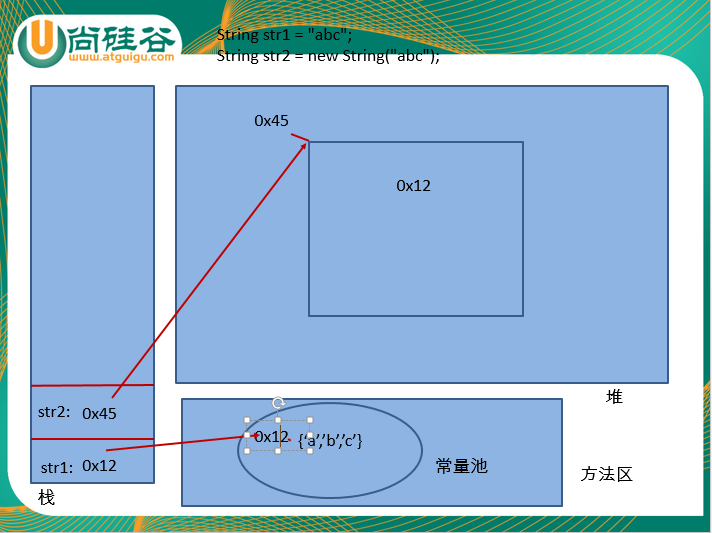

str1:代表一个对象，至少在内存中开辟一块内存空间

str2:代表两个对象，至少在内存中开辟两块内存空间

```
二、String类的常用方法
 * 1. 获取字符串的方法：
 * 		①String concat(String str)：串接字符串
 * 		②String substring(int beginIndex)：获取取字符串的子串
 * 		  String substring(int beginIndex, endIndex) : 包含头不包含尾
 * 		③String toLowerCase()和String toUpperCase()：转换为小写/大写
 * 		④String trim()：删除首尾空格或制表符
 * 2. 搜索方法：
 * 		①int indexOf(int ch) : 获取指定字符在字符串中的位置,若没有指定的字符，返回 -1
 * 		 int indexOf(int ch, int fromIndex) : 从指定位置开始搜索
 * 		 int indexOf(String str)
 * 		 int indexOf(String str, int fromIndex)
 * 		 int lastIndexOf(int ch) : 反向获取指定字符位置
 * 3. 判断方法：
 *  	① boolean equals(Object obj)：判断是否相等
 *  	   boolean equalsIgnoreCase(String str)：判断是否相等,不考虑大小写
 *  	② boolean contains(String str) :判断是否包含某字符串
 *	   	③ boolean startsWith(String str)和 boolean endsWith(String str)：判断是否以指定字符串开始/结尾
 *	   	④ boolean isEmpty():判断字符串是否为空
  * 4. 其它方法：
 * 		①length()：返回字符串长度
 * 		②char charAt(int index):返回索引处的字符
 * 		③将字符数组转换为字符串
 * 			构造器：
 * 				  String(char[] ch)
 * 				  String(char[] ch, offset, count) : 将数组中一部分转换为字符串, count 代表转几个
 * 			静态方法：
 * 				  static String copyValueOf(char[] ch)
 * 				  static String copyValueOf(char[] ch, offset, count)
 * 				  static String valueOf(char[])
 * 		 将字符串转换字符数组: char[] toCharArray()
 * 		④String replace(char oldCahr, char newCahr) ： 替换字符串中字符
 * 		  String replace(String oldStr, String oldStr)：替换字符串中字符串
 *		⑤String[] split(String r):根据指定符号切割
 * 
 */
```

## 三、StringBuffer 和 StringBuilder 

可变的字符序列。二者具有兼容的 API。

StringBuffer : 是线程安全的，因此效率低

StringBuilder : 是线程不安全的，因此效率高

```java
* StringBuffer 和 StringBuilder 的常用方法：
*  ① StringBuffer append(String str) : 添加
*   StringBuffer insert(int offset, String str) ： 插入
*   StringBuffer replace(int start, int end, String str)：替换
*
*  ② int indexOf(String str) ：返回子串的位置索引
*   int lastIndexOf()
*
*  ③ String substring(int start, int end)：取子字符串序列
*  ④ StringBuffer delete(int start, int end)：删除一段字符串
*      StringBuffer deleteCharAt(int index):删除指定位置字符
*  ⑤ String toString()：转换为String对象
```

## 四、其他常用类

java.lang.System : 系统类

​	currentTimeMillis() : 获取当前时间对象的毫秒值

java.lang.Math : 用于数学运算的类

java.math.BigInteger : 支持任意精度的整数

java.math.BigDecimal : 支持任意精度的浮点数

java.util.Date : 日期类

java.text.DateFormat : 是一个抽象类，可以用于时间日期的格式化

​	|--java.text.SimpleDateFormat : 是 DateFormat 的子类

```java
@Test
public void test2() throws ParseException {
    Date date = new Date();
    SimpleDateFormat sdf = new SimpleDateFormat("yyyy-MM-dd HH:mm:ss E");

    String strDate = sdf.format(date);
    System.out.println(strDate);

    Date newDate = sdf.parse(strDate);
    System.out.println(newDate);

}
```

# 第十章 异常

不可预知的非正常情况。

Java 中的异常都是以对象形式存在的，一旦某句代码发生异常，会在该代码处生成一个异常对象

然后以堆栈式抛出，若不对该异常对象进行处理，最终程序终止运行。

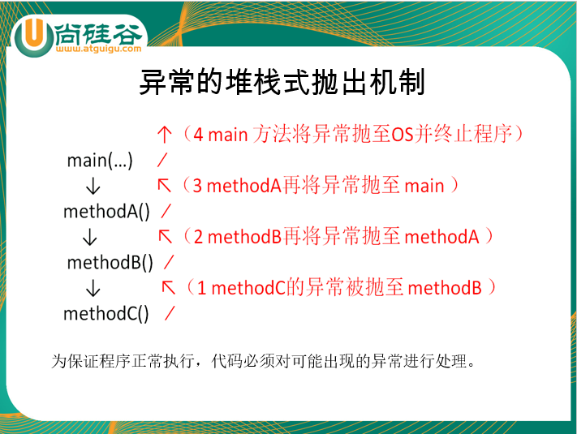

## 一、异常的结构体系

java.lang.Throwable : 所有错误和异常的父类

​	|--java.lang.Error : 错误，一些严重的错误。 如：内存溢出、系统错误。我们不在代码中进行处理

​	|--java.lang.Exception : 异常，我们尽可能的预知并处理的异常。如：用户输入不匹配、网络连接失败等。

​			|--编译时异常（受检异常 checked）：编译时对其进行检查，若不处理，编译不能通过。

​			|--运行时异常（非受检异常 unchecked）: 可以保证程序正常执行，但是一旦发生该异常，会在该

​												 代码处生成一个异常对象，然后堆栈式抛出，若不处理

​												 程序终止运行。

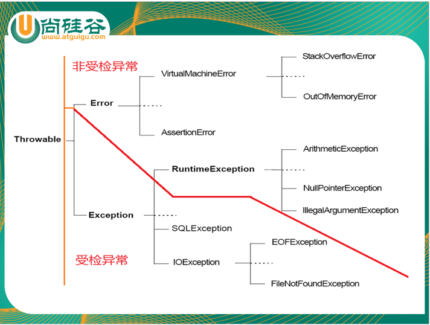


## 二、异常的处理

Java 中异常的处理采用的是抓抛模型

“抛”：一旦某句代码发生异常，会在该代码处生成一个异常对象，然后抛出

“抓”：将上述抛出的异常对象进行捕获处理


```java
try{

	//可能发生异常的语句

}catch(异常类型 变量名){

	//异常的处理语句

}catch(Exception1 e1){

	//异常的处理语句

}catch(Exception2 e2){

	//异常的处理语句

}
……
finally{
	//一定执行的语句
}
```

try-catch-finally 使用的注意：

①catch 块可以有多个，若多个异常类型具有子父类关系，则需要子上父下

②catch 块可以有多个，若生成的异常对象与某个 catch 块的异常类型匹配成功，则其他 catch 块将不再执行

③try-catch 可以嵌套

④finally 一定执行的语句，即使try-catch中有return语句

```java
       FileInputStream fis = null;
        try {
            fis = new FileInputStream("adsfasd");

            int len = 0;
            while ((len = fis.read()) != -1) {
                //
            }


        } catch (FileNotFoundException e) {
            e.printStackTrace();
        } catch (IOException e) {
            e.printStackTrace();
        } finally{
            try{
                fis.close();
            }catch (IOException e){
                e.printStackTrace();
            }catch (NullPointerException e){
                e.printStackTrace();
            }
        }
```

## 三、异常的常用方法

printStackTrace() : 打印异常的详细（堆栈）信息

getMessage() : 返回异常的描述信息


## 四、处理异常的方式之二：throws

throws ：处理异常的方式之一，只不过处理异常的方式是将异常抛出，交给调用者进行处理

​	throws 使用在方法的声明处，后面跟异常的类型

​	如：

```java
public void show() throws FileNotFoundException, IOException{}
```

[方法重写的补充]子类重写方法抛出的异常类型范围不能大于父类被重写方法异常类型的范围

## 五、throw 关键字

制造异常，throw 可以替代 return 语句

​	throw 使用在方法体内，后面跟异常对象。

​	如：

```java
public int div(int a , int b){
    if(b == 0){
        throw new RuntimeException("除数不能为零！");
    }
    return a / b;
}
```

throw 不仅可以抛出 Java 提供的异常类对象，还可以抛出 自定义异常

## 六、自定义异常

1、声明一个类继承一个异常类

（若自定义异常需要是运行时异常，则继承 RuntimeException，若自定义异常需要是编译时异常，则继承 Exception）

2、提供一个有参构造器，目的是为 getMessage() 方法设置异常描述信息。

```java
class MyException extends RuntimeException{
    
    public MyException(){}
    
    public MyException(String message){
        super(message);
    }
    
}
```

# 第十一章 集合与泛型

集合，就像是一种容器，用于存储、获取、操作对象的容器


## 一、集合的特点

### 1、数组的弊端

①数组的长度不可变 ②数组没有提供可以查看数组中有效元素个数的方法


### 2、集合的特点

①集合的长度是可变

②集合可以存储任意类型的对象

③集合只能存储对象


## 二、集合框架

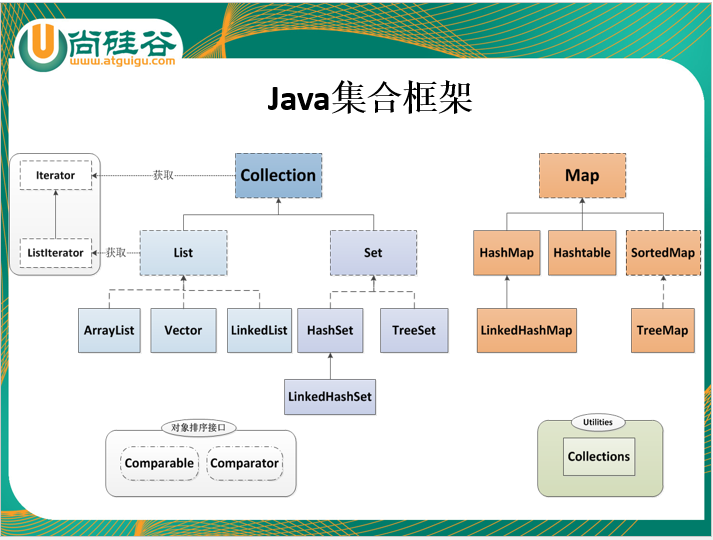

java.util.Collection : 集合层次的根接口

​	|--java.util.List : 有序的，允许重复的。（List 系列集合都具有索引值）

​		|--java.util.ArrayList : 采用数组结构。当查询操作多时选择

​		|--java.util.LinkedList: 采用双向链表结构。当增删操作多时选择

​		|--java.util.Vector :

​	|--java.util.Set : 无序的，不允许重复的。

​		|--java.util.HashSet: 是 Set 接口的典型实现类。

​			判断元素是否存在的依据是：哈希算法（jdk1.7数组+链表），先比较 hashCode() 值，若 hashCode 值对应数组中位置没有对象，则直接存储，若有对象则通过 equals() 方法比较两个对象的内容

​			注意：重写 hashCode() 方法与 equals() 方法时，二者保持一致！

​			（若对象的内容相同，则hashCode相同，同时 equals() 方法返回true）

​			|--java.util.LinkedHashSet:相较于 HashSet 多了链表结构。增删效率低于 HashSet。遍历效率高于 HashSet

​		|--java.util.TreeSet:拥有指定的排序方式

​			|--自然排序：Comparable

​				①需要添加 TreeSet 中对象的类实现 Comparable 接口

​				②实现接口中的 compareTo(Object o1)

​			|--定制排序：Comparator

​				①声明一个类实现 Comparator 接口

​				②实现接口中的 compare(Object o1, Object o2)

​				③将该实现类的实例，作为参数传递给 TreeSet 的构造器

## 三、集合的遍历

```java
List list = new ArrayList();
list.add("AA");
list.add("BB");
```

### 1、使用增强 for 循环

​	格式：for(被遍历集合中元素的数据类型 变量名 : 被遍历的集合){}

```java
for(Object obj : list){
    System.out.println(obj);
}
```

### 2、使用 Iterator 迭代器

```java
//获取当前集合的迭代器
Iterator it = list.iterator();

//通过 hasNext() 与 next() 进行迭代
while(it.hasNext()){
    Object obj = it.next();
}
```

3、(了解)ListIterator ： 是List系列集合特有的迭代器


## 四、Map 系列映射集合

用于操作成对对象的集合。具有key(键)-value(值)对映射关系。一个key对应着一个value。key不允许重复的。

|--HashMap : 是 Map 接口的典型实现类。是线程不安全的，因此效率高。

​	|--LinkedHashMap:

|--Hashtable : 是一个古老的实现，是线程安全的，因此效率低。

​	|--Properties: 用于操作属性文件。 key 与 value 都是 String 类型

|--TreeMap :  根据 key 拥有指定的排序方式

​	|--自然排序：Comparable

​	|--定制排序：Comparator


### 1、Map 集合的常用方法

```
添加、删除操作：
Object put(Object key,Object value)
Object remove(Object key)
void putAll(Map t)
void clear()

元素查询的操作：
Object get(Object key)
boolean containsKey(Object key)
boolean containsValue(Object value)
int size()
boolean isEmpty()
boolean equals(Object obj)

```

### 2、Map 集合的遍历

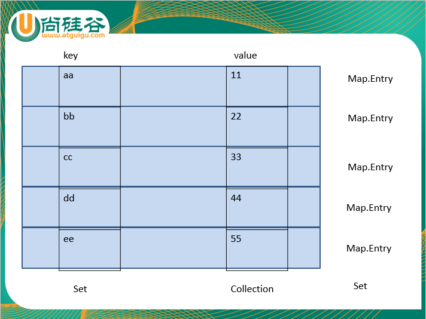

```java
    //Map 的遍历
    @Test
    public void test1(){
        Map map = new HashMap();
        map.put("AA",11);
        map.put("BB",55);
        map.put("CC",66);
        map.put("DD",44);
        map.put("EE",88);

        //方式一：获取 Map 中所有的 key 组成的 Set.
        //方法：keySet()
        Set keySet = map.keySet();

        for(Object key : keySet){
            Object value = map.get(key);
            System.out.println(key + "=" + value);
        }

        System.out.println("-------------------------------------");

        //方式二：获取 Map 中所有的 value 组成的 Collection
        //方法： values()
        Collection coll = map.values();

        Iterator it = coll.iterator();
        while(it.hasNext()){
            Object value = it.next();
            System.out.println(value);
        }

        System.out.println("-------------------------------------");

        //方式三：获取 Map 中所有的 Entry（Entry是Map的内部类，一个Entry对应着一个key和一个value）组成的 Set。
        //方法：entrySet()
        Set entrySet = map.entrySet();

        for(Object o : entrySet){
            Entry entry = (Entry)o;

            Object key = entry.getKey();
            Object value = entry.getValue();

            String strKey = (String)key;
            Integer numValue = (Integer)value;

            System.out.println(strKey.toLowerCase() + "=" + value);
        }

        System.out.println("-------------------------------------");

        Iterator it2 = entrySet.iterator();

        while(it2.hasNext()){
            Entry entry = (Entry)it2.next();

            String key = (String)entry.getKey();
            Integer value = (Integer)entry.getValue();

            System.out.println(key.toLowerCase() + "=" + value);
        }
    }
```

### 3、Properties 操作属性文件

```java
    //利用 Properties 操作属性文件
    @Test
    public void test1() throws IOException {
        //1. 创建 Properties 的对象
        Properties props = new Properties();

        //2. 通过 load() 方法加载属性文件
        props.load(new FileInputStream("jdbc.properties"));

        //3. 通过 getProperty() 根据 key 获取对应的 value
        String username = props.getProperty("username");
        String password = props.getProperty("password");

        System.out.println(username);
        System.out.println(password);
    }
```

## 五、泛型

泛型在 Java 中以"<>" 形式呈现的，"<>" 中写引用数据类型，用于限制数据类型

### 1、集合中使用泛型

集合中不使用泛型的弊端：若集合中不使用泛型，意味着集合中可以添加任意类型的对象，若需要具体到某一个类型时，就要强制类型转换，容易引发 ClassCastException

```java
	//集合中不使用泛型的弊端
    @Test
    public void test2(){
        List list = new ArrayList();
        list.add("AA");
        list.add("BB");
        list.add(11);

        Iterator it = list.iterator();

        while(it.hasNext()){
            Object obj = it.next();
            //若调用 Object 子类的特有方法时
            String str = (String) obj;
            System.out.println(str.toLowerCase());
        }
    }
```

```java
	//集合中使用泛型
    @Test
    public void test3(){
        List<String> list = new ArrayList<String>();
        list.add("AA");
        list.add("BB");

        Iterator<String> it = list.iterator();

        while(it.hasNext()){
            String str = it.next();
            System.out.println(str.toLowerCase());
        }
    }

    @Test
    public void test4(){
        Map<String, Integer> map = new HashMap<>();
        map.put("AA", 11);
        map.put("BB", 22);

        //遍历Map：获取 Map 中所有的 Entry（一个 Entry 对应着一个 key 和一个 value） 组成的 Set
        Set<Entry<String, Integer>> entrySet = map.entrySet();

        Iterator<Entry<String, Integer>> it = entrySet.iterator();

        while(it.hasNext()){
            Entry<String, Integer> entry = it.next();
            String key = entry.getKey();
            Integer value = entry.getValue();

            System.out.println(key + "=" + value);
        }
    }
```


### 2、自定义泛型类、接口、方法

若在编译时出现不确定的数据类型时，可以自定义泛型

```java
public class DAO<T>{//T : Type  E:Element K：key  V：value  R：return
    
    private List<T> list = new ArrayList<T>();
    
    public void add(T t){
        list.add(t);
    }
    
    public T get(int id){
        return list.get(id);
    }
    
    //自定义泛型方法
    public <E> E show(E e){//传递参数时指定泛型类型
        return e;
    }
}

//运行时确定具体的数据类型
DAO<Person> dao = new DAO<>();
dao.add(new Person());
Person p = dao.get(1);

String str = dao.show(String str);
```

### 3、通配符 ?

虽然 Man 是 Person 的子类，但是 List<Man> 就不是 List<Person> 的子类。

没有子父类关系，就不能使用多态。会大大降低程序的灵活性


List<?> ： 可以接收任意类型泛型的集合。

List<? extends Person> : 可以接收 Person 本类类型泛型的集合，及Person子类类型泛型的集合

List<? super Person> :可以接收 Person 本类类型泛型的集合，及Person父类类型泛型的集合

```java
Man man = new Man();
Person p = man; //多态

Man[] mans = new Man[3];
Person[] persons = mans;//多态

List<Man> manList = new ArrayList<>();
List<Person> pList = manList;//错误的写法

List<?> list = manList; //正确的做法
```

```java
//展示一堆男人吃饭和睡觉的功能
/*public void show(List<Man> list){
    for(Man man : list){
        man.eat();
        man.sleep();
    }
}

//展示一堆女人吃饭和睡觉的功能
public void show(List<Woman> list){
    for(Woman w : list){
        w.eat();
        w.sleep();
    }
}*/

public void show(List<? extends Person> list){
    for(Person p : list){//多态
        p.eat();//虚拟方法调用（动态绑定）
        p.sleep();
    }
}
```

# 第十二章 IO流

## 一、IO 流的分类

按流向不同：输入流、输出流（以程序为主体）

按类型不同：字节流、字符流（字符流用于操作文本文件 .txt .java 字节流用于操作非文本文件 .avi  .jpg  .mp3）

按角色不同：节点流、处理流

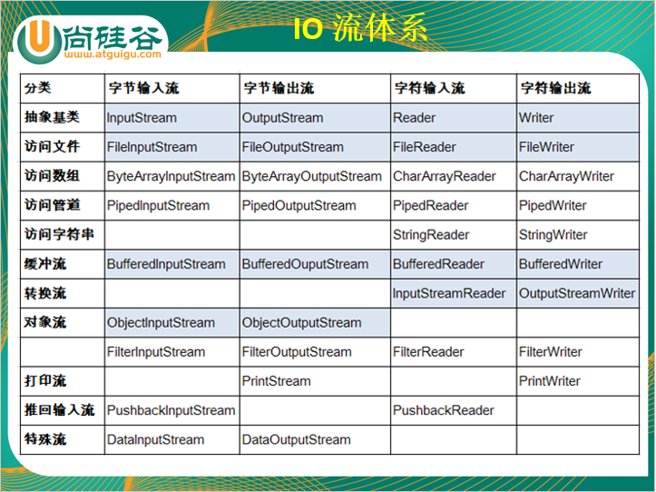

## 二、IO 体系结构

抽象基类				节点流						缓冲流（处理流的一种）

InputStream			 FileInputStream			       BufferedInputStream	

OutputStream		      FileOutputStream			    BufferedOutputStream(flush()-清空缓冲区)

Reader				   FileReader				         BufferedReader（readLine()）

Writer				     FileWriter					   BufferedWriter （newLine()）


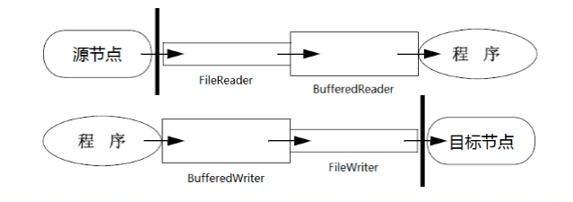

​	

```java
    //非文本文件的复制
    @Test
    public void test1() {
        String src = "C:\\Users\\LI\\Desktop\\1.jpg";
        String dest = "C:\\Users\\LI\\Desktop\\2.jpg";
        copyFile(src, dest);
    }

    public void copyFile(String src, String dest) {
        BufferedInputStream bis = null;
        BufferedOutputStream bos = null;
        try {
            //1. 创建 FileInputStream 的实例，同时打开指定文件
            FileInputStream fis = new FileInputStream(src);

            //2. 创建 FileOutputStream 的实例，同时打开指定文件
            FileOutputStream fos = new FileOutputStream(dest);

            //3. 创建 BufferedInputStream 的实例，包装节点流，用于提高效率
            bis = new BufferedInputStream(fis);

            //4. 创建 BufferedOutputStream 的实例，包装节点流，用于提高效率
            bos = new BufferedOutputStream(fos);

            //5. 读取指定文件的内容
            byte[] b = new byte[1024];
            int len = 0;

            while ((len = bis.read(b)) != -1) {
                //6. 将读取的内容写到目标地点
                bos.write(b, 0, len);
            }
        } catch (IOException e) {
            e.printStackTrace();
        } finally {

            //7. 关闭流
            if (bos != null) {
                try {
                    bos.close();
                } catch (IOException e) {
                    e.printStackTrace();
                }
            }

            if (bis != null) {
                try {
                    bis.close();
                } catch (IOException e) {
                    e.printStackTrace();
                }
            }
        }

    }

```

## 三、对象流：ObjectInputStream & ObjectOutputStream

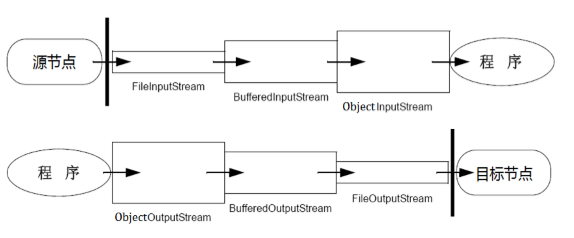

### 1、对象的序列化

将内存中的对象永久的以二进制形式保存到磁盘中

使用步骤：

①创建 FileOutputStream 的实例，同时打开指定文件

②（可选）创建缓冲流，包装节点流，用于提高效率

③创建 ObjectOutputStream 的实例，包装缓冲流，用于完成序列化

④通过 wirteXxx() 方法，完成序列化

⑤关闭流

⑥需要序列化对象的类实现 java.io.Serializable

⑦提供序列号 private static final long serialVersionUID = 324353453L;


注意：使用 transient 和 static 修饰的属性不能被序列化！

### 2、反序列化

将磁盘中的对象进行读取


```java
package com.atguigu.review;

import org.junit.Test;

import java.io.*;
import java.util.ArrayList;
import java.util.Iterator;
import java.util.List;

/*
编写Person类，包含姓名、年龄、体重等属性，提供对应的访问方法；
编写测试类1，在main方法中创建三个不同的Person对象，将这三个对象序列化到文件中；
编写测试类2，在main方法中从文件中反序列化三个Person对象，打印输出。验证序列化的正确；
在测试类1中，将三个Person对象放到数组中，序列化该数组到一个独立的文件中。再将三个Person对象放到List集合中，序列化该集合到另一个独立的文件中；
在测试类2中，将三个Person对象从数组文件中反序列化，并打印；
将三个Person对象从List集合文件中反序列，并打印。验证数组对象和集合对象的序列化。
 */
public class ObjectStreamExer {

    @Test
    public void test2(){
        ObjectInputStream ois = null;
        try {
            FileInputStream fis = new FileInputStream("person.dat");
            BufferedInputStream bis = new BufferedInputStream(fis);
            ois = new ObjectInputStream(bis);

            /*Person[] persons = (Person[])ois.readObject();

            for (Person person : persons) {
                System.out.println(person);
            }*/

            List<Person> list = (List<Person>)ois.readObject();

            Iterator<Person> it = list.iterator();

            while(it.hasNext()){
                System.out.println(it.next());
            }

        } catch (IOException e) {
            e.printStackTrace();
        } catch (ClassNotFoundException e) {
            e.printStackTrace();
        } finally {
            if(ois != null){
                try {
                    ois.close();
                } catch (IOException e) {
                    e.printStackTrace();
                }
            }
        }
    }
    
    @Test
    public void test1(){
        Person p1 = new Person("张三", 18, 100.88);
        Person p2 = new Person("张三", 22, 100.88);
        Person p3 = new Person("张三", 33, 100.88);

//        Person[] persons = new Person[]{p1, p2, p3};
        List<Person> list = new ArrayList<>();
        list.add(p1);
        list.add(p2);
        list.add(p3);

        ObjectOutputStream oos = null;

        try {
            //1. 创建节点流对象，同时打开指定文件
            FileOutputStream fos = new FileOutputStream("./person.dat");

            //2. 创建缓冲流，包装节点流，用于提高效率
            BufferedOutputStream bos = new BufferedOutputStream(fos);

            //3. 创建对象流，包装缓冲流，用于序列化
            oos = new ObjectOutputStream(bos);

            //4. 完成序列化操作
            /*oos.writeObject(p1);
            oos.writeObject(p2);
            oos.writeObject(p3);*/

//            oos.writeObject(persons);

            oos.writeObject(list);
        } catch (IOException e) {
            e.printStackTrace();
        } finally {
            //5. 关闭流
            if(oos != null){
                try {
                    oos.close();
                } catch (IOException e) {
                    e.printStackTrace();
                }
            }
        }

    }
    
}

```

## 四、控制台IO

System.in : “标准”的输入流

System.out : "标准"的输出流

System.err : "标准"的错误输出流

```java
    @Test
    public void test3() throws IOException { //本例暂时 throws 但是你们需要 try-catch
        InputStream in = System.in;

        byte[] b = new byte[1024];
        int len = 0;

        while((len = in.read(b)) != -1){
            System.out.println(new String(b, 0, len));
        }

        in.close();
    }
```

打印流：PrintStream & PrintWriter

## 五、转换流

InputStreamReader & OutputStreamWriter

字节流通向字符流的桥梁

编码：字符串 -> 字节数组

解码：字节数组  -> 字符串

```java
    //解码
    @Test
    public void test6() throws IOException {
        FileInputStream fis = new FileInputStream("./hello.txt");
        InputStreamReader isr = new InputStreamReader(fis, "UTF-8");
        BufferedReader br = new BufferedReader(isr);

        String str = null;
        while((str = br.readLine()) != null){
            System.out.println(str);
        }

        br.close();
    }

    //编码
    @Test
    public void test5() throws IOException {
        String str = "helloworldhahahahah我大尚硅谷威武！";

        //本例测试转换流，因此用字节流操作文本文件
        FileOutputStream fos = new FileOutputStream("./hello.txt");
        OutputStreamWriter osw = new OutputStreamWriter(fos, "UTF-8");
        BufferedWriter bw = new BufferedWriter(osw);

        bw.write(str);

        bw.close();
    }
```

## 六、（了解）其他IO流

数据流：DataInputStream & DataOutoutStream

随机存取数据流：RandomAccessFile 

​	getFilePointer() : 获取记录指针的位置

​	seek() : 移动记录指针的位置

## 七、java.io.File 类

用于描述文件、目录。可用于对文件目录进行 新建、删除、重命名等基本操作。

若需要操作文件的内容，File 类对象将无能为力。

若需要操作文件的内容，需要使用 IO 流。通常 File 对象可以与 IO 流配合使用。

```java
    访问文件名：
    getName() : 获取文件或目录名
    getPath() ： 获取相对路径
    getAbsoluteFile() ： 获取绝对路径对应的 File 对象
    getAbsolutePath() ： 获取绝对路径
    getParent() ： 获取父路径
    renameTo(File newName) : 重命名
        file1.renameTo(file2) ： file1必须存在，file2必须不存在
    文件检测
    exists() : 判断是否存在
    canWrite() ： 判断是否可写
    canRead() ： 判断是否可读
    isFile() ： 判断是不是一个文件
    isDirectory() ： 判断是不是一个目录
    获取常规文件信息
    lastModified() : 获取最后修改时间
    length() ： 获取文件的大小。注意：目录没有大小
    文件操作相关
    createNewFile() ： 新建文件
    delete() : 删除文件或目录。注意：删除目录时需要保证目录中没有内容
    目录操作相关
    mkDir() : 新建目录
    mkDirs() ： 新建完整路径对应的目录
    list() : 获取指定目录下所有文件名称列表
    listFiles() ： 获取指定目录下所有文件或目录的 File 对象
```

```java
   //利用递归方法调用完成目录或文件的删除
   public static boolean deleteFile(File file){
        //1. 判断是否存在
        if(!file.exists()){
            return true;
        }

        if(file.isDirectory()){
            //
            File[] files = file.listFiles();

            for (File f : files) {
                deleteFile(f);//递归方法调用
            }

            return file.delete();

        }else{
            return file.delete();
        }
    }
```


只要有必胜的信念就没有“**不可能**”