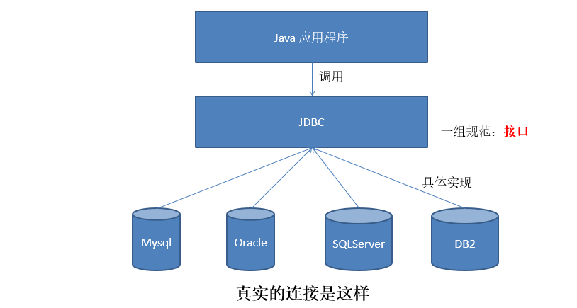
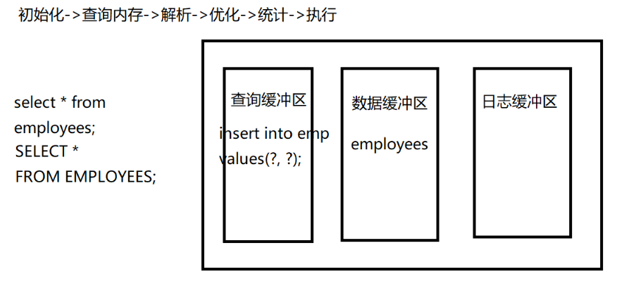
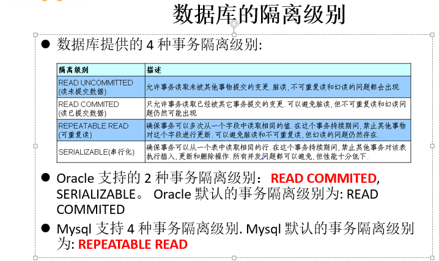
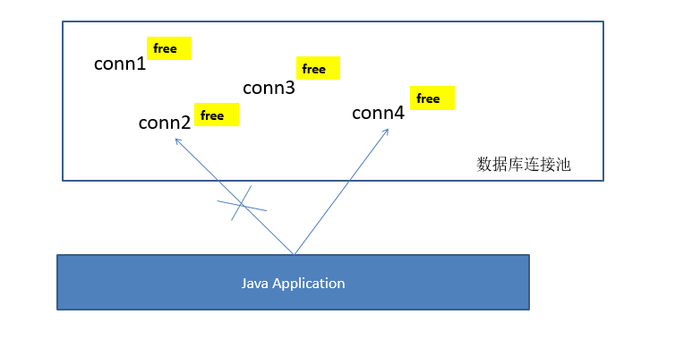

# JDBC(Java Database Connectivity) 

Java 与数据库的连接，一组 API




JDBC是sun公司提供一套用于数据库操作的接口，java程序员只需要面向这套接口编程即可。不同的数据库厂商，需要针对这套接口，提供不同实现。不同的实现的集合，即为不同数据库的驱动。————面向接口编程

## java.sql.Driver

连接数据库的驱动，数据库厂商必须实现该接口

## java.sql.Connection

表示与指定数据库的连接

```java
/*
 * JDBC Java Database Connectivify 与远程数据库建立连接
 * 
 * java.sql.Driver : 每个厂商提供的驱动程序类必须实现该接口
 * 
 * 导入厂商提供驱动的步骤：
 * ①mysql-connector-java-5.1.7-bin.jar 复制到当前项目路径下 lib
 * ②普通 Java 工程复制后，需要点击该.jar 包右键->build path-> add to build path
 * 	idea 中需要点击该.jar 包右键->add as libary
 * 
 */
public class DriverTest {
	
	//优化最终版（重要）:将四个连接数据库必须的字符串，提取到属性文件中
	@Test
	public void test5() throws Exception{
		Properties props = new Properties();
		props.load(this.getClass().getClassLoader().getResourceAsStream("jdbc.properties"));
		String driverClassName = props.getProperty("driverClassName");
		String url = props.getProperty("url");
		String user = props.getProperty("user");
		String password = props.getProperty("password");
		
		//1. 加载驱动
		Class.forName(driverClassName);
		
		//2. 获取连接
		Connection conn = DriverManager.getConnection(url, user, password);
		
		System.out.println(conn);
	}
	
	//优化方式四：利用 Class.forName("com.mysql.jdbc.Driver"); 加载驱动
	//四个连接数据库必须的字符串，写在代码中，不易于修改
	@Test
	public void test4() throws Exception{
		String driverClassName = "com.mysql.jdbc.Driver";
		String url = "jdbc:mysql://192.168.0.107:3306/test";
		String user = "root";
		String password = "123456";
		
		//1. 加载驱动
		Class.forName(driverClassName);
		
		//2. 获取连接
		Connection conn = DriverManager.getConnection(url, user, password);
		
		System.out.println(conn);
	}
	
	//优化方式三：利用 DriverManager(驱动管理类) 的 getConnection(String url, String user, String password)
	//缺点：注册驱动的操作，数据库厂商已经提供，不需要我们自己完成
	@Test
	public void test3() throws Exception{
		String driverClassName = "com.mysql.jdbc.Driver";
		String url = "jdbc:mysql://127.0.0.1:3306/test";
		String user = "root";
		String password = "123456";
		
		Class clazz = Class.forName(driverClassName);
		Driver driver = (Driver) clazz.newInstance();
		
		//1. 注册驱动
		DriverManager.registerDriver(driver);
		
		//2. 获取连接
		Connection conn = DriverManager.getConnection(url, user, password);
		
		System.out.println(conn);
	}
	
	//优化方式二：利用反射，获取指定厂商提供驱动类的实例
	//缺点：每次需要创建 Properties 实例，麻烦。
	@Test
	public void test2() throws Exception{
		Driver driver = null;
		
		//1. 获取驱动
		String driverClassName = "com.mysql.jdbc.Driver";
		Class clazz = Class.forName(driverClassName);
		driver = (Driver) clazz.newInstance();
		
		//2. 获取连接
		String url = "jdbc:mysql://127.0.0.1:3306/test";
		Properties info = new Properties();
		info.setProperty("user", "root");
		info.setProperty("password", "123456");
		Connection conn = driver.connect(url, info);
		
		System.out.println(conn);
	}
	
	//原生方式一：根据 MySQL 厂商提供的驱动，获取与 MySQL 数据库的连接
	//缺点：直接创建了驱动类的实例，意味着绕过了 JavaAPI ，可以执行差
	@Test
	public void test1() throws SQLException{
		Driver driver = null;
		
		//1. 获取驱动
		driver = new com.mysql.jdbc.Driver();
		
		//2. 获取连接
		String url = "jdbc:mysql://127.0.0.1:3306/test";
		Properties info = new Properties();
		info.setProperty("user", "root");
		info.setProperty("password", "123456");
		
		Connection conn = driver.connect(url, info);
		
		System.out.println(conn);
	}

}

```

## java.sql.Statement

## 	|--java.sql.PreparedStatement

用于发送 SQL 语句给数据库服务器

【面试题】Statement 和 PreparedStatment 的区别？

1. Statement 发送的SQL 语句需要拼接字符串的形式，非常麻烦。而 PreparedStatment 使用 “?占位符即可 
2. Statement 存在 SQL 注入的问题（当用户录入信息时，可以用利用拼接字符串的方式找一些SQL语句的漏洞）
3. PreparedStatment 是预编译的 SQL，因此效率高于 Statement



## 使用 PreparedStatement 完成增删改查

```java
	//通用的增删改，适用于任何表
	public int update(String sql, Object ... args){
		int row = 0;
		
		//1. 获取连接
		Connection conn = null;
		//2. 获取 PreparedStatement，用于发送 SQL
		PreparedStatement ps = null;
		
		try {
			conn = JDBCUtils.getConnection();
			
			ps = conn.prepareStatement(sql);
			
			//3. 填充占位符
			for (int i = 0; i < args.length; i++) {
				ps.setObject(i+1, args[i]);
			}
			
			//4. 执行 SQL
			row = ps.executeUpdate();
		} catch (Exception e) {
			e.printStackTrace();
		} finally {
			//5. 关闭连接
			JDBCUtils.close(conn, ps);
		}
		
		return row;
	}
```

## java.sql.ResultSet

执行查询获取的结果集，对应着执行查询后得到的数据表

​	next() : 移动记录指针到下一行，若没有更多行返回 false

​	getXxx(int columnIndex) : 根据列索引获取对应结果集列中的数据

​	getXxx(String columnLabel):有列别名按别名获取列值，没别名按列名获取

```java
	public List<Customer> getList(String sql, Object ...args){
		List<Customer> list = new ArrayList<>();
		
		Connection conn = null;
		PreparedStatement ps = null;
		ResultSet rs = null;
		try {
			conn = JDBCUtils.getConnection();
			
			ps = conn.prepareStatement(sql);
			
			for (int i = 0; i < args.length; i++) {
				ps.setObject(i+1, args[i]);
			}
			
			rs = ps.executeQuery();
			
			while(rs.next()){
				int id = rs.getInt("id");
				String name = rs.getString("name");
				String email = rs.getString("email");
				Date birth = rs.getDate("birth");
				
				Customer cust = new Customer(id, name, email, birth);
				list.add(cust);
			}
		} catch (Exception e) {
			e.printStackTrace();
		} finally {
			JDBCUtils.close(conn, ps, rs);
		}
		
		return list;
	}
	
	//获取单个 Customer 对象
	public Customer get(String sql, Object ... args){
		Customer cust = null;
		
		//1. 获取连接
		Connection conn = null;
		//2. 获取 PreparedStatement，用于发送 SQL
		PreparedStatement ps = null;
		//4. 执行查询
		ResultSet rs = null;
		try {
			conn = JDBCUtils.getConnection();
			
			ps = conn.prepareStatement(sql);
			
			//3. 填充占位符 
			for (int i = 0; i < args.length; i++) {
				ps.setObject(i+1, args[i]);
			}
			
			rs = ps.executeQuery();
			
			//5. 获取结果集中的数据
			while(rs.next()){
				int id = rs.getInt("id");
				String name = rs.getString("name");
				String email = rs.getString("email");
				Date birth = rs.getDate("birth");
				
				cust = new Customer(id, name, email, birth);
			}
		} catch (Exception e) {
			e.printStackTrace();
		} finally {
			//6. 关闭连接
			JDBCUtils.close(conn, ps, rs);
		}
		
		return cust;
	}
```

## 使用 PreparedStatement 完成图片处理

```java
public class PreparedStatementTest3 {
	
	//查询图片
	@Test
	public void test2(){
		Connection conn = null;
		PreparedStatement ps = null;
		ResultSet rs = null;
		InputStream in = null;
		FileOutputStream fos = null;
		try {
			conn = JDBCUtils.getConnection();
			
			String sql = "select id, name, email, birth, photo from customers where id = ?";
			ps = conn.prepareStatement(sql);
			
			ps.setInt(1, 31);
			
			rs = ps.executeQuery();
			
			while(rs.next()){
				int id = rs.getInt("id");
				String name = rs.getString("name");
				String email = rs.getString("email");
				Date birth = rs.getDate("birth");
				
				Customer customer = new Customer(id, name, email, birth);
				System.out.println(customer);
				
				//**获取结果集中的图片
				Blob blob = rs.getBlob("photo");
				in = blob.getBinaryStream();
				fos = new FileOutputStream("2.jpg");
				byte[] b = new byte[1024];
				int len = 0;
				while((len = in.read(b)) != -1){
					fos.write(b, 0, len);
				}
			}
		} catch (Exception e) {
			e.printStackTrace();
		} finally {
			if(fos != null){
				try {
					fos.close();
				} catch (IOException e) {
					e.printStackTrace();
				}
			}
			
			if(in != null){
				try {
					in.close();
				} catch (IOException e) {
					e.printStackTrace();
				}
			}
			
			JDBCUtils.close(conn, ps, rs);
		}
		
	}
	
	//添加图片到数据库中
	@Test
	public void test1(){
		
		//1. 获取连接
		Connection conn = null;
		PreparedStatement ps = null;
		try {
			conn = JDBCUtils.getConnection();
			
			//2. 获取 PreparedStatement，用于发送 SQL
			String sql = "insert into customers(id, name, email, birth, photo) values(?,?,?,?,?)";
			ps = conn.prepareStatement(sql);
			
			//3. 填充占位符
			ps.setInt(1, 31);
			ps.setString(2, "张振龙");
			ps.setString(3, "zzl@abc.com");
			ps.setString(4, "1998-8-8");
			
			//4. 添加图片
			ps.setBlob(5, new FileInputStream("1.jpg"));
			
			//5. 执行 SQL
			int row = ps.executeUpdate();
			System.out.println("已影响" + row + "行");
		} catch (Exception e) {
			e.printStackTrace();
		} finally {
			
			//关闭连接
			JDBCUtils.close(conn, ps);
		}
		
	}
```

## 使用 PreparedStatement 完成批量处理

```java
package com.atguigu.jdbc;

import java.sql.Connection;
import java.sql.PreparedStatement;

import org.junit.Test;

/*
 * 使用 PreparedStatement 完成批量处理
 * 
 * 注意事项：
 * 1.MySQL 驱动版本过低不支持
 * 2.MySQL 默认批量处理处于关闭状态，需要通过 URL 将批量处理开启
 */
public class PreparedStatementTest4 {
	
	@Test
	public void test1(){
		Connection conn = null;
		PreparedStatement ps = null;
		try {
			conn = JDBCUtils.getConnection();
			String sql = "insert into emp(id, name) values(?,?)";
			ps = conn.prepareStatement(sql);
			
			for (int i = 0; i < 100499; i++) {
				ps.setInt(1, i+1);
				ps.setString(2, "abc");
				
				//积攒 SQL 语句
				ps.addBatch();//相当于装车
				
				if((i+1) % 500 == 0){
					//批量执行 SQL 语句
					ps.executeBatch();//相当于送货
					
					//清空积攒的 SQL 语句
					ps.clearBatch();//相当于卸货
				}
			}

			ps.executeBatch();
		} catch (Exception e) {
			e.printStackTrace();
		} finally {
			JDBCUtils.close(conn, ps);
		}
	}

}

```

## ORM（Object Relational Mapping）对象关系映射

数据库中的一张表  --- Java 中的一个类

数据表中的一个字段 --- Java 中的一个属性

数据表中的一条数据  --- Java 中的一个对象


## 事务处理

一组逻辑操作单元，使数据从一种状态变换到另一种状态。

（一个 commit 和一个 rollback 之间的一个或多个 DML）

```java
public class TransactionTest {
	
	@Test
	public void test1(){
		Connection conn = null;
		
		try{
			conn = JDBCUtils.getConnection();
			
			//1. 取消自动提交(开启事务)
			conn.setAutoCommit(false);
			
			String sql1 = "update user_table set balance = balance - 100 where user = ?";
			update(conn, sql1, "AA");
			
			//模拟故障
			int i = 10 / 0;
			
			String sql2 = "update user_table set balance = balance + 100 where user = ?";
			update(conn, sql2, "BB");
			
			//2. 提交，所做操作永久生效
			conn.commit();
		} catch(Exception e){
			//回滚，所做操作回滚到最初状态（上一次commit）
			try {
				conn.rollback();
			} catch (SQLException e1) {
				e1.printStackTrace();
			}
			
			e.printStackTrace();
		}finally{
			JDBCUtils.close(conn, null);
		}
		
	}
	
	//查询一个Student对象
	public Student get(Connection conn, String sql, Object ...args){
		Student stu = null;
		//2. 获取 PreparedStatement，用于发送 SQL
		PreparedStatement ps = null;
		//4. 执行 SQL，获取 ResultSet 结果集
		ResultSet rs = null;
		try {
			ps = conn.prepareStatement(sql);
			
			//3. 填充占位符
			for (int i = 0; i < args.length; i++) {
				ps.setObject(i+1, args[i]);
			}
			
			rs = ps.executeQuery();
			
			//5. 获取结果集中的数据，并封装进对象
			while(rs.next()){
				int flowID = rs.getInt("FlowID");
				int type = rs.getInt("Type");
				String idCard = rs.getString("IDCard");
				String examCard = rs.getString("ExamCard");
				String studentName = rs.getString("StudentName");
				String location = rs.getString("Location");
				int grade = rs.getInt("Grade");
				
				stu = new Student(flowID, type, idCard, examCard, studentName, location, grade);
			}
		} catch (Exception e) {
			e.printStackTrace();
		} finally {
			//6. 关闭连接(考虑事务的问题，不能关闭连接，什么时候用，什么时候关闭连接)
			JDBCUtils.close(null, ps, rs);
		}
		
		return stu;
		
	}
	
	//考虑事务的通用的增删改，适用于任何表
	public int update(Connection conn, String sql, Object ... args){
		int row = 0;
		//2. 获取 PreparedStatement，用于发送 SQL
		PreparedStatement ps = null;
		
		try {
			ps = conn.prepareStatement(sql);
			
			//3. 填充占位符
			for (int i = 0; i < args.length; i++) {
				ps.setObject(i+1, args[i]);
			}
			
			//4. 执行 SQL
			row = ps.executeUpdate();
		} catch (Exception e) {
			e.printStackTrace();
		} finally {
			//5. 关闭连接
			JDBCUtils.close(null, ps);
		}
		
		return row;
	}

}
```


### 事务的 ACID 属性

Ø1. 原子性（Atomicity）
 原子性是指事务是一个不可分割的工作单位，事务中的操作要么都发生，要么都不发生。 

Ø2. 一致性（Consistency）
 事务必须使数据库从一个一致性状态变换到另外一个一致性状态。

Ø3. 隔离性（Isolation）
 事务的隔离性是指一个事务的执行不能被其他事务干扰，即一个事务内部的操作及使用的数据对并发的其他事务是隔离的，并发执行的各个事务之间不能互相干扰。

Ø4. 持久性（Durability）
 持久性是指一个事务一旦被提交，它对数据库中数据的改变就是永久性的，接下来的其他操作和数据库故障不应该对其有任何影响

### 事务的隔离级别

l对于同时运行的多个事务, 当这些事务访问数据库中相同的数据时, 如果没有采取必要的隔离机制, 就会导致各种并发问题:

Ø**脏读**: 对于两个事务 T1, T2, T1 读取了已经被 T2 更新但还**没有被提交**的字段. 之后, 若 T2 回滚, T1读取的内容就是临时且无效的.

Ø**不可重复读**: 对于两个事务T1, T2, T1 读取了一个字段, 然后 T2 **更新**了该字段. 之后, T1再次读取同一个字段, 值就不同了.

Ø**幻读**: 对于两个事务T1, T2, T1 从一个表中读取了一个字段, 然后 T2 在该表中**插入**了一些新的行. 之后, 如果 T1 再次读取同一个表, 就会多出几行.



## 数据库连接池

传统的数据库连接使用 DriverManager 完成，每次需要操作时，先获取一个连接，操作后立马释放连接

频繁的获取（需要将 Connection 加载到内存中，并验证用户名密码）与释放连接，耗费资源，每个连接用完使用，并没有得到重复的利用。



### C3P0 与 Druid 连接池

#### C3P0 的操作步骤：

 1. 将 c3p0-0.9.1.2.jar 复制到项目中，普通Java project 需要手动 build path

 2. 在 src 根路径下创建 c3p0-config.xml 文件（注意：文件名不能有错）

 3. 在 配置文件中编写连接数据库的字符串以及连接池的配置

 4. 创建开源组织针对 javax.sql.DataSource 的实现类 ComboPooledDataSource 的实例

    ```java
    ComboPooledDataSource cpds = new ComboPooledDataSource("helloc3p0");
    Connection conn = cpds.getConnection();
    ```

   5.通过 getConection() 从连接池中获取连接

c3p0-config.xml

```java
<c3p0-config>

  <named-config name="helloc3p0"> 
  	<!-- 连接数据库的四个必须字符串 -->
  	<property name="driverClass">com.mysql.jdbc.Driver</property>
  	<property name="jdbcUrl">jdbc:mysql://127.0.0.1:3306/test</property>
  	<property name="user">root</property>
  	<property name="password">123456</property>
  
  	<!-- 若连接池中的连接用尽，一次性获取几个连接 -->
    <property name="acquireIncrement">5</property>
    
    <!-- 连接池的初始连接个数 -->
    <property name="initialPoolSize">10</property>
    
    <!-- 连接池中最小连接个数 -->
    <property name="minPoolSize">5</property>
    
    <!-- 连接池中最多连接个数 -->
    <property name="maxPoolSize">10</property>

	<!-- 连接池中最多管理 Statement 的个数 -->
    <property name="maxStatements">5</property> 
    
    <!-- 每个连接中最多管理 Statement 的个数 -->
    <property name="maxStatementsPerConnection">5</property>
  </named-config>
  
</c3p0-config>
```

### Druid 连接池的步骤：

德鲁伊连接池的有点是将 c3p0、DBCP、proxool 进行了整合

1. 将 druid-1.1.10.jar 复制到 lib 下

2. 创建连接池实例获取连接

   

```java
	@Test
	public void test1() throws SQLException{
		DruidDataSource dds = new DruidDataSource();
		dds.setDriverClassName("com.mysql.jdbc.Driver");
		dds.setUrl("jdbc:mysql://127.0.0.1:3306/test");
		dds.setUsername("root");
		dds.setPassword("123456");
		
		dds.setInitialSize(10);
		dds.setMaxActive(10);
		
		Connection conn = dds.getConnection();
		
		System.out.println(conn);
	}
```

## DBUtils 工具类

详见 api

```java
package com.atguigu.jdbc;

import java.sql.Connection;
import java.sql.SQLException;
import java.util.List;
import java.util.Map;
import java.util.Map.Entry;
import java.util.Set;

import org.apache.commons.dbutils.QueryRunner;
import org.apache.commons.dbutils.handlers.BeanHandler;
import org.apache.commons.dbutils.handlers.BeanListHandler;
import org.apache.commons.dbutils.handlers.MapListHandler;
import org.apache.commons.dbutils.handlers.ScalarHandler;
import org.junit.Test;

import com.atguigu.exer.JDBCUtils;
import com.mchange.v2.c3p0.ComboPooledDataSource;

/*
 * JavaBean :
 * 	类中有一个无参构造器
 *  有属性并且提供公共的 get/set 方法
 */
public class DBUtilsTest {
	public QueryRunner qr = new QueryRunner(new ComboPooledDataSource("helloc3p0"));
	
	//(不考虑事务的查询)获取单个特殊值
	@Test
	public void test5() throws SQLException{
		
//		String sql = "select max(birth) from customers";
//		Date maxBirth = (Date) qr.query(sql, new ScalarHandler());
		
		String sql = "select count(*) from customers where id < ?";
		Long count = (Long) qr.query(sql, new ScalarHandler(), 32);
		
		System.out.println(count);
	}
	
	//将结果集中列名与列值封装到 Map 集合，再将多个 Map 存入 List 集合
	@Test
	public void test4(){
		Connection conn = null;
		try {
			conn = JDBCUtils.getConnectionForC3P0();
			String sql = "select id, name, email, birth from customers where id <= ?";
			
			List<Map<String, Object>> list = qr.query(conn, sql, new MapListHandler(), 32);
			
			for (Map<String, Object> map : list) {
				
				Set<Entry<String,Object>> entrySet = map.entrySet();
				
				for (Entry<String, Object> entry : entrySet) {
					System.out.println(entry.getKey() + "====" + entry.getValue());
				}
				
				System.out.println("----------------------------------------------------");
			}
		} catch (SQLException e) {
			e.printStackTrace();
		} finally {
			JDBCUtils.close(conn, null);
		}
	}
	
	//考虑事务问题查询多个对象并封装到 List 中
	@Test
	public void test3(){
		Connection conn = null;
		
		
		try {
			conn = JDBCUtils.getConnectionForC3P0();
			
			conn.setAutoCommit(false);//取消自动提交（开启事务）
			
			String sql = "select id, name, email, birth from customers where id <= ?";
			List<Customer> list = qr.query(conn, sql, new BeanListHandler<>(Customer.class), 32);
			
			for (Customer customer : list) {
				System.out.println(customer);
			}
			
			conn.commit();//提交
		} catch (SQLException e) {
			
			try {
				conn.rollback();//回滚
			} catch (SQLException e1) {
				e1.printStackTrace();
			}
			
			e.printStackTrace();
		} finally {
			JDBCUtils.close(conn, null);
		}
		
	}
	
	//查询一个对象
	@Test
	public void test2(){
		Connection conn = null;
		try {
			conn = JDBCUtils.getConnectionForC3P0();
			String sql = "select id, name, email, birth from customers where id = ?";
			Customer cust = qr.query(conn, sql, new BeanHandler<>(Customer.class), 32);
			System.out.println(cust);
		} catch (SQLException e) {
			e.printStackTrace();
		} finally {
			JDBCUtils.close(conn, null);
		}
		
	}
	
	@Test
	public void test1(){
		Connection conn = null;
		try {
			
			conn = JDBCUtils.getConnectionForC3P0();
			String sql = "insert into customers(id, name, email, birth) values(?,?,?,?)";
			int row = qr.update(conn, sql, 32, "王刚", "wangg@abc.com", "1999-9-9");
			System.out.println("已影响" + row + "行");
			
		} catch (SQLException e) {
			e.printStackTrace();
		} finally {
			JDBCUtils.close(conn, null);
		}
	}

}

```

## 元数据

DatabaseMetaData：获取数据库信息的元数据

ResultSetMetaData: 描述ResultSet结果集的元数据

​	通过 ResultSet 的 getMetaData() 方法获取

​	常用方法：

​		getColumnCount() 获取结果集中列的总数

​		getColumnLabel() : 获取结果集列的别名，若没有别名内部调用 getColumnName() 获取列名

```java

/*
 * （了解）
 * 元数据：描述数据的数据
 * 
 * ResultSet
 * ResultSetMetaData : 用于描述结果集的元数据
 * 		getColumnCount() : 获取结果集的列数
 * 		getColumnLabel() : 获取结果集的列别名，没有别名内部调用 getColumnName() 获取列名
 */
public class MetaDataTest {
	
	@Test
	public void test2() throws Exception{
		Connection conn = JDBCUtils.getConnection();
		
		String sql = "select * from customers";
		PreparedStatement ps = conn.prepareStatement(sql);
		
		//ps.setInt(1, 30);
		
		ResultSet rs = ps.executeQuery();
		
		ResultSetMetaData rsmd = rs.getMetaData();
		
		//获取结果集的列数
		int columnCount = rsmd.getColumnCount();
		
		while(rs.next()){
			for (int i = 0; i < columnCount; i++) {
				//获取列的别名，有别名获取别名，没别名获取列名
				String columnName = rsmd.getColumnLabel(i+1);
				Object columnValue = rs.getObject(columnName);
				
				System.out.println(columnName + "---- " + columnValue);
			}
		}
		
		JDBCUtils.close(conn, ps, rs);
	}
	
	@Test
	public void test1() throws Exception{
		Connection conn = JDBCUtils.getConnection();
		
		DatabaseMetaData dmd = conn.getMetaData();
		
		String productName = dmd.getDatabaseProductName();
		String productVersion = dmd.getDatabaseProductVersion();
		
		System.out.println(productName);
		System.out.println(productVersion);
		
		ResultSet rs = dmd.getCatalogs();
		
		while(rs.next()){
			String str = rs.getString(1);
			System.out.println(str);
		}
	}

}

```

