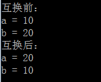
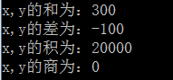
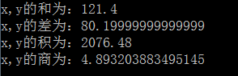

# day01课后练习

# 基础题目:

## 第一题

* 按步骤编写代码，效果如图所示：


* 编写步骤：

1. 定义类 Test1

2. 定义 main方法

3. 控制台输出5行字符串类型常量值

4. 控制台输出5行字符类型常量值

```java
class Test1{
    public static void main(String[] args){
        System.out.println("善学如春起之苗");
        System.out.println("不见其增，日有所长");
        System.out.println("假学如磨刀之石");
        System.out.println("不见其损，年有所亏");
        System.out.println("加油吧！少年");
        
        System.out.println("J");
        System.out.println("A");
        System.out.println("V");
        System.out.println("A");
        System.out.println("!");
    }
}
```


## 第二题

- 按步骤编写代码，效果如图所示：

  


* 编写步骤：
  1. 定义类 Test5
  2. 定义 main方法
  3. 定义2个 float类型变量,分别赋值,并输出在控制台.
  4. 定义2个 double类型变量,分别赋值,并输出在控制台.


## 第三题

- 按步骤编写代码，效果如图所示：

  

- 步骤图解：

  

- 开发提示：定义变量不赋值的格式

  ```java
  // 	数据类型 变量名 ；
  	int temp；
  ```

- 编写步骤：

  1. 定义类 Test7
  2. 定义 main方法
  3. 定义两个整数变量a，b并赋值
  4. 控制台输出变量a，b互换前的值
  5. 定义一个第三方变量temp，使a，b的值互换
  6. 控制台输出变量a，b互换后的值

```java
public class Test7 {

	public static void main(String[] args) {
		int a = 10;
		int b = 20;
		System.out.println("互换前：");
		System.out.println("a = " + a);
		System.out.println("b = " + b);
		
		int temp = a;
		a = b;
		b = temp;
		System.out.println("互换后：");
		System.out.println("a = " + a);
		System.out.println("b = " + b);
	}

}
```


# 扩展题目:

## 第四题

- 按步骤编写代码，效果如图所示：




* 开发提示：四则运算的符号

  ```java
  加: +
  减: -
  乘: *
  除: /
  ```

* 编写步骤：

  1. 定义类 Test8
  2. 定义 main方法
  3. 定义2个int类型变量x、y，x赋值为100，y赋值为200
  4. 定义新变量add，保存变量x，y的和并打印到控制台
  5. 定义新变量sub，保存变量x，y的差并打印到控制台
  6. 定义新变量mul，保存变量x，y的积并打印到控制台
  7. 定义新变量div，保存变量x，y的商并打印到控制台

```java
public class Test8 {

	public static void main(String[] args) {
		int x = 100;
		int y = 200;
		System.out.println("x,y的和为：" + (x+y));
		System.out.println("x,y的差为：" + (x-y));
		System.out.println("x,y的积为：" + (x*y));
		System.out.println("x,y的商为：" + (x/y));
	}

}
```


## 第五题

- 按步骤编写代码，效果如图所示：

  

- 开发提示：观察小数类型数值运算后的结果.

  ```java
   小数运算经常出现精度丢失的问题,不建议使用基本类型运算.
  ```

- 编写步骤：

  1. 定义类 Test9
  2. 定义 main方法
  3. 定义2个double类型变量x、y，x赋值为100.8，y赋值为20.6
  4. 定义新变量add，保存变量x，y的和并打印到控制台
  5. 定义新变量sub，保存变量x，y的差并打印到控制台
  6. 定义新变量mul，保存变量x，y的积并打印到控制台
  7. 定义新变量div，保存变量x，y的商并打印到控制台

* 提示：
  1. 加法：+
  2. 减法：-
  3. 乘法：*
  4. 除法：/

```java
public class Test9 {

	public static void main(String[] args) {
		double x = 100.8;
		double y = 20.6;
		
		double add = x + y;
		System.out.println("x,y的和为：" + add);
		
		double sub = x - y;
		System.out.println("x,y的差为：" + sub);
		
		double mul = x * y;
		System.out.println("x,y的积为：" + mul);
		
		double div = x / y;
		System.out.println("x,y的商为：" + div);
	}

}
```


# 简答题

1、如何用最有效的的方法计算2乘以8

```java
2<<3
```

