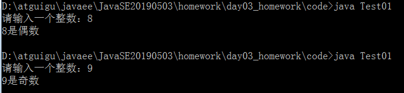
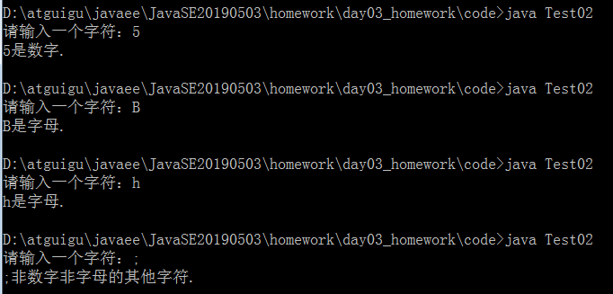
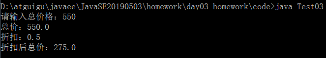
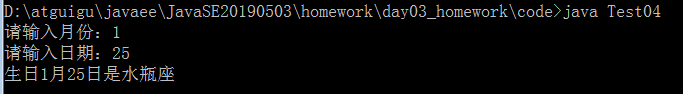

# day02_课后练习

# 编程题

## 第一题

语法点：变量，运算符，if...else

案例：从键盘输入一个整数，判断它是奇数还是偶数（这里把0归为偶数）



开发提示：

​	键盘输入需要用到Scanner类。

```java
java.util.Scanner input = new java.util.Scanner(System.in);//准备从键盘输入的扫描仪
int num = input.nextInt();//输入整数
```

​	能够被2整除的是偶数，不能被2整除的是奇数

```java
public class Test01{
	public static void main(String[] args){
		java.util.Scanner input = new java.util.Scanner(System.in);
		System.out.print("请输入一个整数：");
		int num = input.nextInt();
		if(num % 2 == 0){
			System.out.println(num + "是偶数");
		}else{
			System.out.println(num + "是奇数");
		}
	}
}

```

## 第二题

语法点：变量，运算符，if...else

案例：从键盘输入一个字符，判断它是字母还是数字，还是其他字符



开发提示：

​	键盘输入需要用到Scanner类。

```java
java.util.Scanner input = new java.util.Scanner(System.in);//准备接收从键盘输入的扫描仪
char c = input.next().charAt(0);//输入单个字符
```

​	数字范围：'0'-'9'

​	字母范围：'A'-'Z'，'a'-'z'

```java
public class Test02{
	public static void main(String[] args){
		java.util.Scanner input = new java.util.Scanner(System.in);
		System.out.print("请输入一个字符：");
		char c = input.next().charAt(0);
		if(c >= '0' && c <= '9'){
			System.out.println(c + "是数字.");
		}else if(c >= 'A' && c <= 'Z' || c >= 'a' && c <= 'z'){
			System.out.println(c + "是字母.");
		}else{
			System.out.println(c + "非数字非字母的其他字符.");
		}
	}
}
```


## 第三题

* 语法点：变量，运算符，if...else

* 按步骤编写代码，效果如图所示：

  

* 编写步骤：

  1. 定义类 Test2
  2. 定义 main方法
  3. 定义变量折扣 discount，初始化为1, 总价totalPrice的值从键盘输入
  4. 判断当`totalPrice >=500` ,discount赋值为0.5
  5. 判断当`totalPrice >=400` 且`<500`时,discount赋值为0.6
  6. 判断当`totalPrice >=300` 且`<400`时,discount赋值为0.7
  7. 判断当`totalPrice >=200` 且`<300`时,discount赋值为0.8
  8. 判断当`totalPrice >=0` 且`<200`时,discount赋值为1
  9. 判断当`totalPrice<0`时，显示输入有误
  10. 输出结果

* 开发提示：

  键盘输入需要用到Scanner类。

  ```java
  java.util.Scanner input = new java.util.Scanner(System.in);//准备接收从键盘输入的扫描仪
  double totalPrice = input.nextDouble();//输入double值
  ```

```java
public class Test03{
	public static void main(String[] args){
		java.util.Scanner input = new java.util.Scanner(System.in);
		System.out.print("请输入总价格：");
		double discount = 1;
		double totalPrice = input.nextDouble();
		if(totalPrice>=500){
			discount = 0.5;
		}else if(totalPrice>=400){
			discount = 0.6;
		}else if(totalPrice>=300){
			discount = 0.7;
		}else if(discount>=200){
			discount = 0.8;
		}else if(discount >= 0){
			discount = 1;
		}else{
			System.out.println("输入有误！");
		}
		System.out.println("总价：" + totalPrice);
		System.out.println("折扣：" + discount);
		System.out.println("折扣后总价：" + totalPrice*discount);
	}
}
```


## 第四题

语法点：变量，运算符，if...else

案例：从键盘输入生日，判断星座



* 开发提示：
  1. 各个星座的日期范围如下：


```java
public class Test04 {
	public static void main(String[] args) {
		java.util.Scanner input = new java.util.Scanner(System.in);
		System.out.print("请输入月份：");
		int month = input.nextInt();

		System.out.print("请输入日期：");
		int day = input.nextInt();

		if ((month == 1 && day >= 20) || (month == 2 && day <= 18)) {
			System.out.println("生日" + month + "月" + day + "日是水瓶座");
		} else if ((month == 2 && day >= 19) || (month == 3 && day <= 20)) {
			System.out.println("生日" + month + "月" + day + "日是双鱼座");
		}else if ((month == 3 && day >= 21) || (month == 4 && day <= 19)) {
			System.out.println("生日" + month + "月" + day + "日是白羊座");
		}else if ((month == 4 && day >= 20) || (month == 5 && day <= 20)) {
			System.out.println("生日" + month + "月" + day + "日是金牛座");
		}else if ((month == 5 && day >= 21) || (month == 6 && day <= 21)) {
			System.out.println("生日" + month + "月" + day + "日是双子座");
		}else if ((month == 6 && day >= 22) || (month == 7 && day <= 22)) {
			System.out.println("生日" + month + "月" + day + "日是巨蟹座");
		}else if ((month == 7 && day >= 23) || (month == 8 && day <= 22)) {
			System.out.println("生日" + month + "月" + day + "日是狮子座");
		}else if ((month == 8 && day >= 23) || (month == 9 && day <= 22)) {
			System.out.println("生日" + month + "月" + day + "日是处女座");
		}else if ((month == 9 && day >= 23) || (month == 10 && day <= 23)) {
			System.out.println("生日" + month + "月" + day + "日是天平座");
		}else if ((month == 10 && day >= 24) || (month == 11 && day <= 22)) {
			System.out.println("生日" + month + "月" + day + "日是天蝎座");
		}else if ((month == 11 && day >= 23) || (month == 12 && day <= 21)) {
			System.out.println("生日" + month + "月" + day + "日是射手座");
		}else if ((month == 12 && day >= 22) || (month == 1 && day <= 19)) {
			System.out.println("生日" + month + "月" + day + "日是摩羯座");
		}
	}
}
```


