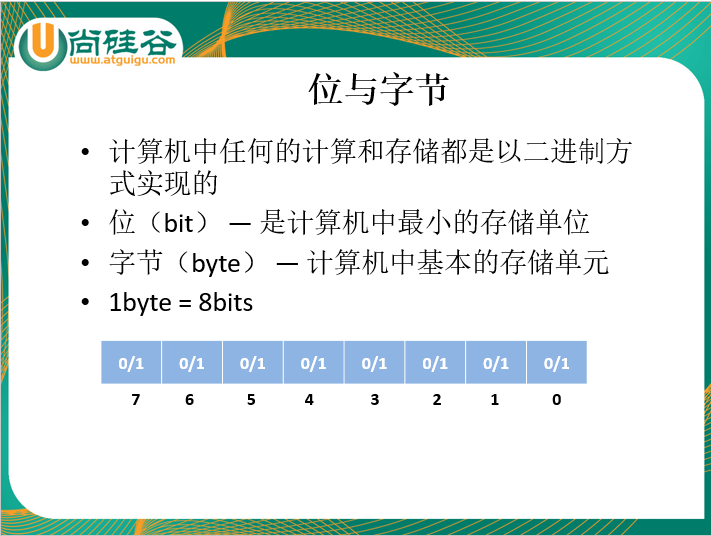

# 第一章 Java 编程语言概述

## 一、走进 Java 语言

1、Java 由 SUN 公司研发，后来 SUN 被 Oracle 收购

2、Java 之父：James Gosling

3、Java 由 1995 年发布，正式版本由 1996年1月发布（jdk1.0）


## 二、Java 的特点

1、面向对象

2、分布式

3、简单化

4、多线程

5、安全

6、跨平台移植 ------ JVM Java Virtual Machine Java 虚拟机


## 三、Java 的三大平台体系

JavaSE Java Standard Edition Java 标准版：适用于开发 C/S （Client/Server）架构的应用程序

JavaEE Java Enterprise Edition Java 企业版：适用于开发 B/S （Browser/Server）架构的应用程序

JavaME Java Micro Edition Java 微型版：-------  Android


## 四、开发第一个应用程序

### 1、搭建开发环境

JVM Java Virtual Machine Java 虚拟机：用于与操作系统进行交互


JRE Java Runtime Enviroment Java 运行环境：JVM + Java 提供的核心类库

JDK Java Development Kit Java 开发工具集：JRE + Java 提供的开发工具集（javac.exe java.exe javadoc.exe）


### 2、下载安装配置 JDK

①下载安装 JDK

②通过命令提示符到 JDK 安装路径的 bin 路径下，执行 javac

③配置 path 环境变量：JDK 安装路径的 bin

​		目的：在任意路径下执行 javac

​		执行流程：先在当前路径下找是否有 javac.exe ，若没有再到 path 环境变量中从前往后依次查找

④配置 JAVA_HOME : 配置到 JDK 的安装路径。 如： d:\Java\jdk1.8.0_141

⑤将path 环境变量修改为： %JAVA_HOME%\bin


### 3、开发第一个应用程序的步骤

①编写： .java 源文件 【HelloWorld.java】

```java
public class HelloWorld{
    public static void main(String[] args){
        System.out.println("HelloWorld");
    }
}
```

②编译：通过 javac 命令，生成一个或多个的 .class 字节码文件。【javac HelloWorld.java】

③运行：通过 java 命令，将一个或多个 .class 字节码文件加载到内存中。【java HelloWorld】


### 4、开发第一个应用程序的注意

①以 .java 结尾的文件称为 .java 源文件

②一个 .java 源文件中可以有多个类

③一个 .java 源文件中只能有一个 public 修饰的类

④public 修饰类的名称必须与源文件名称一致

⑤每条语句以 ";" 结尾

⑥Java 严格区分大小写

⑦若一个需要执行，该类中必须提供一个主方法，是程序的入口

```java
public static void main(String[] args){}
```


## 五、注释语句

不会被 JVM 解释执行的语句，用于解释说明一段代码

//单行注释


/*

​	多行注释：

​		注意：多行注释不能嵌套

*/


/**

​	Java 特有的注释：文档注释

​	可以通过 javadoc -d e:\mydoc -author -version HelloWorld.java

*/


# 第二章 Java 基础语法1

## 一、标识符

凡是自己明明的地方都叫标识符。例如：包名、类名、接口名、方法名、变量名、常量名


关键字：被 Java 赋予了特殊含义的单词


### 1、命名的规则（必须遵守，若不遵守编译不能通过）

①只能有字母 a-z A-Z  数字 0-9  特殊字符 "_" 下划线 和  "$" 美元符

②数字不能开头

③名字之间不能有空格

④不能使用关键字和保留字，但是可以包含关键字和保留字

⑤Java 严格区分大小写，但是长度无限制


### 2、命名的规范（可以不遵守，但是会受到鄙视）

①包名：所有字母都小写。 如： xxxyyyzzz

②类名、接口名：若有多个单词组成，每个单词首字母都大写。 如：XxxYyyZzz

③方法名、变量名：若有多个单词组成，第一个单词首字母小写，其余单词首字母都大写。 如：xxxYyyZzz

④常量名：所有字母都大写，每个单词之间以 "_" 隔开。 如：XXX_YYY_ZZZ


## 二、变量

保存数据


变量：**局部变量** & 成员变量


### 1、变量的格式

数据类型 变量名 = 值;

如： int var = 10;

//声明一个变量

int var;

//为变量赋值

var = 10;


### 2、变量的概念

①在内存中开辟一块内存空间

②该空间有类型（数据类型）有名称（变量名）

③变量可以在指定的范围内不断的变化


### 3、变量的注意

①在同一个作用范围内变量名不能重复

②作用域：变量作用在所属的那对 {} 内

**③局部变量在使用前必须赋值**

④先声明，后使用


## 三、进制之间的转换（了解）




