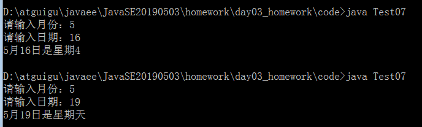

# day03_课后练习

# 编程题

## 第一题

语法点：变量，运算符，switch...case

案例需求：编写一个程序，为一个给定的年份找出其对应的中国生肖。中国的生肖基于12年一个周期，每年用一个动物代表：rat（鼠）、ox（牛）、tiger（虎）、rabbit（兔）、dragon（龙）、snake（蛇）、

​      horse（马）、sheep（羊）、monkey（候）、rooster（鸡）、dog（狗）、pig（猪）。

提示：2017年：鸡   2017 % 12 == 1


```java
public class Test05 {

	public static void main(String[] args) {
		java.util.Scanner input = new java.util.Scanner(System.in);
		System.out.print("请输入年份：");
		int year = input.nextInt();
		
		switch(year%12){
		case 1:
			System.out.println("鸡");
			break;
		case 2:
			System.out.println("狗");
			break;
		case 3:
			System.out.println("猪");
			break;
		case 4:
			System.out.println("鼠");
			break;
		case 5:
			System.out.println("牛");
			break;
		case 6:
			System.out.println("虎");
			break;
		case 7:
			System.out.println("兔");
			break;
		case 8:
			System.out.println("龙");
			break;
		case 9:
			System.out.println("蛇");
			break;
		case 10:
			System.out.println("马");
			break;
		case 11:
			System.out.println("羊");
			break;
		case 0:
			System.out.println("猴");
			break;
		}
	}

}
```


## 第二题

语法点：变量，运算符，if和switch...case

案例：已知2019年1月1日是星期二，从键盘输入2019年的任意一天，请判断它是星期几



* 开发提示：

1. 先统计这一天是这一年的第几天days
2. 然后声明一个变量week，初始化为2
3. 然后week加上days-1
4. 然后求week与7的模数
5. 然后输出结果，考虑星期天的特殊判断

```java
public class Test07 {
	public static void main(String[] args){
		//1、从键盘分别输入年、月、日
		java.util.Scanner input = new java.util.Scanner(System.in);
		
		System.out.print("月：");
		int month = input.nextInt();
		
		System.out.print("日：");
		int day = input.nextInt();
		
		//判断这一天是当年的第几天==>从1月1日开始，累加到xx月xx日这一天
		//(1)[1,month-1]个月满月天数
		//(2)第month个月的day天
		//(3)单独考虑2月份是否是29天（依据是看year是否是闰年）
		
		//2、声明一个变量days，用来存储总天数
		//int days = 0;
		//累加第month个月的day天
		//days += day;
		
		//修改上面的代码，直接把days初始化为day
		int days = day;
		
		//3、累加[1,month-1]个月满月天数
		switch(month){
			case 12:
				//累加的1-11月
				days += 30;//这个30是代表11月份的满月天数
				//这里没有break，继续往下走
			case 11:
				//累加的1-10月
				days += 31;//这个31是代表10月的满月天数
				//这里没有break，继续往下走
			case 10:
				days += 30;//9月
			case 9:
				days += 31;//8月
			case 8:
				days += 31;//7月
			case 7:
				days += 30;//6月
			case 6:
				days += 31;//5月
			case 5:
				days += 30;//4月
			case 4:
				days += 31;//3月
			case 3:
				days += 28;//2月，因为2019年的2月是28天
			case 2:
				days += 31;//1月
		}
		
		//days 里面存的是这一天是这一年的第几天
		//已知2019年1月1日是星期二
		//假设我输入的就是1月1日，那么days中就是1
		int week = 1;//2018年12月31日的星期
		week += days;
		week %= 7;
		System.out.print(month+"月" + day +"日是这一年的第"+days+"天，是星期" + (week==0?"天":week)) ;
		
	}
}	   
```


# 简答题

1、switch是否能作用在byte上，是否能作用在long上，是否能作用在String上？

```
可以作用在byte上，
不能作用在long上
可以作用在String上
```

