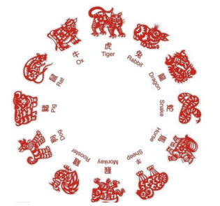

# day03_课后练习

# 编程题

## 第一题

语法点：变量，运算符，switch...case

案例需求：编写一个程序，为一个给定的年份找出其对应的中国生肖。中国的生肖基于12年一个周期，每年用一个动物代表：rat（鼠）、ox（牛）、tiger（虎）、rabbit（兔）、dragon（龙）、snake（蛇）、

​      horse（马）、sheep（羊）、monkey（候）、rooster（鸡）、dog（狗）、pig（猪）。

提示：2017年：鸡   2017 % 12 == 1

switch(year%12){

case 1:鸡break;

case 2:狗break;

....

}

## 第二题

语法点：变量，运算符，if和switch...case

案例：已知2019年1月1日是星期二，从键盘输入2019年的任意一天，请判断它是星期几

* 开发提示：

1. 先统计这一天是这一年的第几天days
2. 然后声明一个变量week，初始化为2
3. 然后week加上days-1
4. 然后求week与7的模数
5. 然后输出结果，考虑星期天的特殊判断

# 简答题

1、switch是否能作用在byte上，是否能作用在long上，是否能作用在String上？

