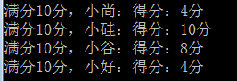
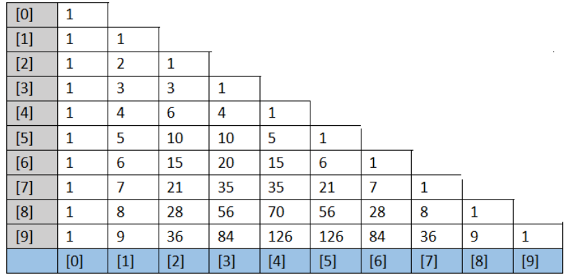
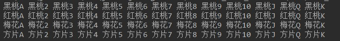

# day07课后练习

# 一维数组基础题目

## 第一题：需求实现

* 模拟大乐透号码：

  * 一组大乐透号码由10个1-99之间的数字组成
  * 打印大乐透号码信息

* 代码实现，效果如图所示：

  

* 开发提示：

  * 使用数组保存录入或随机产生的号码
  * 如果使用键盘输入，需要用到java.util.Scanner
  * 如果使用随机产生，可以使用Math.random()或java.util.Random的nextInt(bounds)


## 第二题：需求实现

* 打印扑克牌.


* 代码实现，效果如图所示：

  

* 开发提示：

  * 使用两个字符串数组，分别保存花色和点数
  * 再用一个字符串数组保存最后的扑克牌
  * 遍历显示

## 第三题：需求实现

* 模拟在一副牌中，抽取第1张，第5张，第50张扑克牌。

* 代码实现，效果如图所示：

  

  


## 第四题：需求实现

* 统计字符

  * 字符数组：{'a','l','f','m','f','o','b','b','s','n'}
  * 统计每个字符出现的次数并打印到控制台。

* 代码实现，部分效果如图所示：

  

* 开发提示：

  * 将数字强制转换，根据ASCII码表转换为字符。
  * 可以定义长度26的数组，每个元素，对应去保存每种字符的出现次数，比如0索引保存a的次数，1索引保存b的次数，以此类推。


## 第五题：需求实现

* 统计高于平均分的分数有多少个。
  * 定义数组[95, 92, 75, 56, 98, 71, 80, 58, 91, 91]。


* 代码实现，效果如图所示：

  

  步骤：

  （1）先求总分

  （2）求平均分

  （3）遍历数组，统计比平均分高的个数


## 第六题：需求实现

* 判断数组中的元素值是否对称.

* 代码实现，效果如图所示：

  

* 开发提示：

  * 数组中元素首尾比较。

  


## 第七题：需求实现

* 比较两个数组内容是否完全一致。

* 代码实现，效果如图所示：

  

* 开发提示：

  * 长度一致，内容一致，定义为完全一致。

  

## 第八题：需求实现

- 根据标准答案【ADBCD】，每题2分共10分，求出每名学生最终得分。

  - 四名同学答案分别为：
    - 小尚：【DCBAD】
    - 小硅：【ADBCD】
    - 小谷：【ADBCA】
    - 小好：【ABCDD】
  - 每答对一题，得2分，输出四名同学的最终得分。

- 代码实现，效果如图所示：

  

提示：标准答案放到一个一维数组中，每个同学答案也各自放到一个一维数组中，然后分别统计得分


## 第九题：

案例：从键盘输入本组学员的人数，和本组学员的成绩，用数组存储成绩，然后实现从高到低排序


## 第十题：

案例：从键盘输入本组学员的人数，和本组学员的姓名，用数组存储姓名，然后再从键盘输入一个姓名，查找它是否在之前的数组中，如果存在，就显示它的下标


## 第十一题：

案例：从键盘输入一个英语单词，然后查找这个单词中是否存在'a'字母

提示：把字符串转成字符数组，可以使用String类型的toCharArray()方法

```java
String str = "hello";
char[] arr = str.toCharArray();//arr数组中就是{'h','e','l','l','o'}
```


## 第十二题：

随机验证码。

* 随机生成十组六位字符组成的验证码。
* 验证码由大小写字母、数字字符组成。


开发提示：

* 使用字符数组保存原始字符，利用Random类生成随机索引。

# 二维数组基础题目

## 第1题：

* 使用二维数组打印一个 10 行杨辉三角.

  1

  1 1

  1 2 1

  1 3 3  1

  1 4 6  4  1

  1 5 10 10 5 1

   ....

* 开发提示

1. 第一行有 1 个元素, 第 n 行有 n 个元素

2. 每一行的第一个元素和最后一个元素都是 1

3. 从第三行开始, 对于非第一个元素和最后一个元素的元素. 

   ```
   yanghui[i][j] = yanghui[i-1][j-1] + yanghui[i-1][j];
   ```

   

## 第2题：

   * 打印扑克牌，效果如图所示：

     

   * 开发提示：

     * 使用一个两行的二维的字符串数组，分别保存花色和点数
     * 然后遍历显示这个二维数组

## 第3题：

需求：保存全班的每个组的成绩，并对成绩做统计

1. 从键盘输入一共有几组
2. 从键盘输入每一组分别有多少人
3. 从键盘输入每一个同学的成绩
4. 统计每一组的最高分、最低分
5. 统计每一组的平均分
6. 统计全班的最高分、最低分
7. 统计全班的平均分
8. 统计全班的总人数