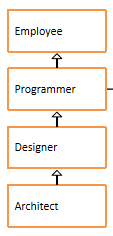

# day10_课后练习

# 代码阅读分析题

## 第1题

考核知识点：属性与多态无关

```java
package com.atguigu.test01;

public class Test01 {
	public static void main(String[] args) {
		A a = new B();
		System.out.println(a.num);
		System.out.println(((B)a).num);
		System.out.println(((A)((B)a)).num);
		System.out.println("-------------------");
		B b = new B();
		System.out.println(b.num);
		System.out.println(((A)b).num);
		System.out.println(((B)((A)b)).num);
	}
}
class A{
	int num = 1;
}
class B extends A{
	int num = 2;
}
```

```java
/*
 * 多态性现象：编译时类型与运行时类型不一致
 * 但是多态性是针对方法来说，方法有动态绑定一说。
 * 属性没有多态性。属性都是按照编译时类型处理的。
 */
public class Test01 {
	public static void main(String[] args) {
		A a = new B();
		System.out.println(a.num);//a编译时类型就是A  1
		System.out.println(((B)a).num);//编译后，因为a被强制成B类，是B类型  2
		System.out.println(((A)((B)a)).num);//编译后，a转成B又转成A，是A类型   1
		System.out.println("-------------------");
		B b = new B();
		System.out.println(b.num);//b编译时类型就是B   2
		System.out.println(((A)b).num);//b被强制升级为A类型，按A类型处理， 1
		System.out.println(((B)((A)b)).num);//b先转A又转B，最终是B类型  2
	}
}
class A{
	int num = 1;
}
class B extends A{
	int num = 2;
}
```

## 第2题

考核知识点：实例初始化方法，属性与多态无关

```java
package com.atguigu.test02;

public class Test02 {
	public static void main(String[] args) {
		Father f = new Son();
		System.out.println(f.x);
	}
}
class Father{
	int x = 10;
	public Father(){
		this.print();
		x = 20;
	}
	public void print(){
		System.out.println("Father.x = " + x);
	}
}
class Son extends Father{
	int x = 30;
	public Son(){
		this.print();
		x = 40;
	}
	public void print(){
		System.out.println("Son.x = " + x);
	}
}
```

```java
package com.atguigu.test02;

/*
 * 1、Father f = new Son();
 * 实例初始化的过程：
 * （1）父类的实例初始化
 * <init>(){
 * 		x = 10;//父类的x
 * 		this.print();//子类的print，因为this代表的是正在创建的子类对象，而子类重写了print，所以是子类的print'
 * 				System.out.println("Son.x = " + x);//子类的x，此时还没有赋值，那么是默认值x=0
		x = 20;//父类的x
 * }
 * （2）子类的实例初始化
 * <init>(){
 * 		x = 30;//子类的x
 * 		this.print();//子类的print
 * 			System.out.println("Son.x = " + x);//子类的x，此时已经赋值x=30
		x = 40;//子类的x
 * }
 * 
 * 2、执行System.out.println(f.x);
 * 属性没有多态性，只看编译时类型，那么此时f.x表示父类的x
 */
public class Test02 {
	public static void main(String[] args) {
		Father f = new Son();
		System.out.println(f.x);
	}
}
class Father{
	int x = 10;
	public Father(){
		this.print();
		x = 20;
	}
	public void print(){
		System.out.println("Father.x = " + x);
	}
}
class Son extends Father{
	int x = 30;
	public Son(){
		this.print();
		x = 40;
	}
	public void print(){
		System.out.println("Son.x = " + x);
	}
}
```

## 第3题

考核知识点：多态，重写，实例初始化过程

```java
package com.atguigu.test03;

public class Test03 {
	public static void main(String[] args) {
		Base b1 = new Base();
		Base b2 = new Sub();
	}
}

class Base {
	Base() {
		method(100);
	}

	public void method(int i) {
		System.out.println("base : " + i);
	}
}

class Sub extends Base {
	Sub() {
		super.method(70);
	}

	public void method(int j) {
		System.out.println("sub : " + j);
	}
}
```

```java
package com.atguigu.test03;
/*
 * 1、Base b1 = new Base();
 * 父类的实例初始化，和子类无关
 * 
 * <init>(){
 * 		method(100);
 * 			System.out.println("base : " + i);  base:100
 * }
 * 
 * 2、Base b2 = new Sub();
 * （1） 父类的实例初始化
 * 
 * <init>(){
 * 		method(100);//执行了子类重写的method()
 * 			System.out.println("sub : " + j);  sub:100
 * }
 * 
 * （2）子类的实例初始化
 * <init>(){
 * 		super.method(70);
 * 			System.out.println("base : " + i);	base:70
 * }
 */
public class Test03 {
	public static void main(String[] args) {
		Base b1 = new Base();
		Base b2 = new Sub();
	}
}

class Base {
	Base() {
		method(100);
	}

	public void method(int i) {
		System.out.println("base : " + i);
	}
}

class Sub extends Base {
	Sub() {
		super.method(70);
	}

	public void method(int j) {
		System.out.println("sub : " + j);
	}
}
```


## 第4题

考核知识点：多态、重载、重写

```java
public class Test04 {
	public static void main(String[] args) {
		A a1 = new A();
		A a2 = new B();
		B b = new B();
		C c = new C();
		D d = new D();
		System.out.println("(1)" + a1.show(b));
		System.out.println("(2)" + a2.show(d));
		System.out.println("(3)" + b.show(c));
		System.out.println("(4)" + b.show(d));
	}
}
class A{
	public String show(D obj){
		return ("A and D");
	}
	public String show(A obj){
		return "A and A";
	}
}
class B extends A{
	public String show(B obj){
		return "B and B";
	}
	public String show(A obj){
		return "B and A";
	}
}
class C extends B{
	
}
class D extends B{
	
}
```

```java
/*
 * 1、分析方法列表和继承关系
 * A类：
 * 	public String show(D obj) 
 * 	public String show(A obj)
 * B类：
 * 	public String show(D obj)继承的
 * 	public String show(A obj)重写
 * 	public String show(B obj)自定义的
 * C->B->A
 * D->B->A
 * 
 * 2、方法重载：找最合适的形参类型
 * 3、方法重写：如果子类重写，就执行重写的
 * 4、分析执行结果
 * a1.show(b)：a1没有多态引用，直接找A类的方法，b是B类对象，只能选择public String show(A obj)   A and A
 * a2.show(d)：a2多态引用，执行子类的方法，d是D类对象，选最合适的public String show(D obj)   A and D
 * b.show(c)：b没有多态引用，直接找B类的方法，c是C类的对象，选择最合适的public String show(B obj) B and B
 * b.show(d)：b没有多态引用，直接找B类的方法，d是D类对象，选最合适的public String show(D obj)   A and D
 */
public class Test04 {
	public static void main(String[] args) {
		A a1 = new A();
		A a2 = new B();
		B b = new B();
		C c = new C();
		D d = new D();
		System.out.println("(1)" + a1.show(b));
		System.out.println("(2)" + a2.show(d));
		System.out.println("(3)" + b.show(c));
		System.out.println("(4)" + b.show(d));
	}
}

class A {
	public String show(D obj) {
		return ("A and D");
	}

	public String show(A obj) {
		return "A and A";
	}
}

class B extends A {
	public String show(B obj) {
		return "B and B";
	}

	public String show(A obj) {
		return "B and A";
	}
}

class C extends B {

}

class D extends B {

}
```

## 第5题

考核知识点：多态、重载、重写

```java
public class Test05 {
	public static void main(String[] args) {
		A a1 = new A();
		A a2 = new B();
		B b = new B();
		C c = new C();
		D d = new D();
		System.out.println("(1)" + a1.show(b));
		System.out.println("(2)" + a2.show(d));
		System.out.println("(3)" + b.show(c));
		System.out.println("(4)" + b.show(d));
	}
}

class A {
	public String show(C obj) {
		return ("A and C");
	}

	public String show(A obj) {
		return "A and A";
	}
}

class B extends A {
	public String show(B obj) {
		return "B and B";
	}

	public String show(A obj) {
		return "B and A";
	}
}

class C extends B {

}

class D extends B {

}
```

```java
package com.atguigu.test02;

/*
 * 1、分析每个类的方法列表和继承关系
 * A类：
 * 	public String show(C obj) 
 * 	public String show(A obj)
 * B类：
 * 	public String show(C obj)继承的
 * 	public String show(A obj)重写
 * 	public String show(B obj)自定义的
 * C->B->A
 * D->B->A
 * 
 * 2、方法重载：找最合适的形参类型
 * 3、方法重写：如果子类重写，就执行重写的
 * 4、如果特殊的重载，那么多态时，编译时先从父类中查找最合适的形参类型，然后如果子类如果有重写，执行子类重写的，如果没有重写，执行父类的。
 * 5、分析执行结果
 * a1.show(b)：a1没有多态引用，直接找A类的方法，b是B类对象，只能选择public String show(A obj)   A and A
 * a2.show(d)：a2多态引用，执行子类的方法，d是D类对象，但是因为此时编译时按A类编译，所以在编译期间先确定是调用
 * 		public String show(A obj)，而后执行子类重写的public String show(A obj)       B and A
 * 		而不是直接选最合适的public String show(B obj)
 * b.show(c)：b没有多态引用，直接找B类的方法，c是C类的对象，选择最合适的public String show(C obj) A and C
 * b.show(d)：b没有多态引用，直接找B类的方法，d是D类对象，选最合适的public String show(B obj)   B and B
 */
public class Test02 {
	public static void main(String[] args) {
		A a1 = new A();
		A a2 = new B();
		B b = new B();
		C c = new C();
		D d = new D();
		System.out.println("(1)" + a1.show(b));
		System.out.println("(2)" + a2.show(d));
		System.out.println("(3)" + b.show(c));
		System.out.println("(4)" + b.show(d));
	}
}

class A {
	public String show(C obj) {
		return ("A and C");
	}

	public String show(A obj) {
		return "A and A";
	}
}

class B extends A {
	public String show(B obj) {
		return "B and B";
	}

	public String show(A obj) {
		return "B and A";
	}
}

class C extends B {

}

class D extends B {

}
```


## 第6题

考核知识点：属性与多态无关

```java
public class Test06 {
	public static void main(String[] args) {
		Base b = new Sub();
		System.out.println(b.x);
	}
}
class Base{
	int x = 1;
}
class Sub extends Base{
	int x = 2;
}
```

```java
package com.atguigu.test06;

/*
 * 属性没有多态性，只看编译时类型
 */
public class Test06 {
	public static void main(String[] args) {
		Base b = new Sub();
		System.out.println(b.x);
	}
}
class Base{
	int x = 1;
}
class Sub extends Base{
	int x = 2;
}
```

## 第7题

考核知识点：权限修饰符

如下代码是否可以编译通过，如果能，结果是什么，如果不能，为什么？

```java
public class Father{
	private String name = "atguigu";
	int age = 0;
}
public class Child extends Father{
	public String grade;
	
	public static void main(String[] args){
		Father f = new Child();
		System.out.println(f.name);
	}
}
```

```java
package com.atguigu.test07;

public class Child extends Father{
	public String grade;
	
	public static void main(String[] args){
		Father f = new Child();
//		System.out.println(f.name);//编译错误，因为name私有化
	}
}

```


## 第8题

考核知识点：继承，super，static

如下代码是否可以编译通过，如果能，结果是什么，如果不能，为什么？

```java
public class Person{
	public Person(){
		System.out.println("this is a Person.");
	}
}
public class Teacher extends Person{
	private String name = "tom";
	public Teacher(){
		System.out.println("this is a teacher.");
		super();
	}
	public static void main(String[] args){
		Teacher tea = new Teacher();
		System.out.println(this.name);
	}
}
```

```java
package com.atguigu.test08;

public class Teacher extends Person{
	private String name = "tom";
	public Teacher(){
		System.out.println("this is a teacher.");
//		super();//错误，super()必须在构造器首行
	}
	public static void main(String[] args){
		Teacher tea = new Teacher();
//		System.out.println(this.name);//错误，static方法中不能使用this
	}
}

```


# 代码编程题


## 第9题

案例：

​	1、在com.atguigu.test13包中声明员工类、程序员类、设计师类、架构师类，



* 员工类属性：编号、姓名、年龄、薪资

* 程序员类属性：编程语言，默认都是"java"

* 设计师类属性：奖金

* 架构师类属性：持有股票数量

  要求：属性私有化，无参有参构造，get/set，getInfo方法（考虑重写）

  

  2、在com.atguigu.test13包中声明Test13测试类

  （1）在main中有一些常量和一个二维数组

  ```
  final int EMPLOYEE = 10;//表示普通员工
  final int PROGRAMMER = 11;//表示程序员
  final int DESIGNER = 12;//表示设计师
  final int ARCHITECT = 13;//表示架构师
      
  String[][] EMPLOYEES = {
          {"10", "1", "段誉", "22", "3000"},
          {"13", "2", "令狐冲", "32", "18000", "15000", "2000"},
          {"11", "3", "任我行", "23", "7000"},
          {"11", "4", "张三丰", "24", "7300"},
          {"12", "5", "周芷若", "28", "10000", "5000"},
          {"11", "6", "赵敏", "22", "6800"},
          {"12", "7", "张无忌", "29", "10800","5200"},
          {"13", "8", "韦小宝", "30", "19800", "15000", "2500"},
          {"12", "9", "杨过", "26", "9800", "5500"},
          {"11", "10", "小龙女", "21", "6600"},
          {"11", "11", "郭靖", "25", "7100"},
          {"12", "12", "黄蓉", "27", "9600", "4800"}
      };
  ```

  （2）创建一个员工数组

  （3）根据以上数据，初始化员工数组

  提示：把字符串转为int和double类型的值，可以使用如下方式：

  ```java
  String idStr = "1";
  int id = Integer.parseInt(idStr);
  
  String salaryStr = "7300";
  double salary = Double.parseDouble(salaryStr);
  ```

  （4）遍历数组，使用如下格式

  ```
  编号	姓名	年龄	薪资	语言	奖金	股票
  .....
  ```

  ```java
  package com.atguigu.test13;
  
  public class Employee {
  	private int id;
  	private String name;
  	private int age;
  	private double salary;
  	
  	public Employee() {
  		super();
  	}
  
  	public Employee(int id, String name, int age, double salary) {
  		super();
  		this.id = id;
  		this.name = name;
  		this.age = age;
  		this.salary = salary;
  	}
  
  	public int getId() {
  		return id;
  	}
  
  	public void setId(int id) {
  		this.id = id;
  	}
  
  	public String getName() {
  		return name;
  	}
  
  	public void setName(String name) {
  		this.name = name;
  	}
  
  	public int getAge() {
  		return age;
  	}
  
  	public void setAge(int age) {
  		this.age = age;
  	}
  
  	public double getSalary() {
  		return salary;
  	}
  
  	public void setSalary(double salary) {
  		this.salary = salary;
  	}
  	
  	public String getInfo(){
  		return id + "\t" + name + "\t" + age + "\t" + salary;
  	}
  }
  ```

  ```java
  package com.atguigu.test13;
  
  public class Programmer extends Employee{
  	private String language = "java";
  
  	public Programmer() {
  		super();
  	}
  
  	public Programmer(int id, String name, int age, double salary) {
  		super(id, name, age, salary);
  	}
  
  	public Programmer(int id, String name, int age, double salary, String language) {
  		super(id, name, age, salary);
  		this.language = language;
  	}
  
  	public String getLanguage() {
  		return language;
  	}
  
  	public void setLanguage(String language) {
  		this.language = language;
  	}
  
  	@Override
  	public String getInfo() {
  		return super.getInfo() + "\t" + language;
  	}
  	
  }
  
  ```

  ```java
  package com.atguigu.test13;
  
  public class Designer extends Programmer {
  	private double bonus;
  
  	public Designer() {
  		super();
  	}
  
  	public Designer(int id, String name, int age, double salary, double bonus) {
  		super(id, name, age, salary);
  		this.bonus = bonus;
  	}
  
  	public Designer(int id, String name, int age, double salary, String language, double bonus) {
  		super(id, name, age, salary, language);
  		this.bonus = bonus;
  	}
  
  	public double getBonus() {
  		return bonus;
  	}
  
  	public void setBonus(double bonus) {
  		this.bonus = bonus;
  	}
  
  	@Override
  	public String getInfo() {
  		return super.getInfo()+ "\t" + bonus;
  	}
  	
  }
  
  ```

  ```java
  package com.atguigu.test13;
  
  public class Architect extends Designer {
  	private int stock;
  
  	public Architect() {
  		super();
  	}
  
  	public Architect(int id, String name, int age, double salary, double bonus, int stock) {
  		super(id, name, age, salary, bonus);
  		this.stock = stock;
  	}
  
  	public Architect(int id, String name, int age, double salary, String language, double bonus, int stock) {
  		super(id, name, age, salary, language, bonus);
  		this.stock = stock;
  	}
  
  	public int getStock() {
  		return stock;
  	}
  
  	public void setStock(int stock) {
  		this.stock = stock;
  	}
  
  	@Override
  	public String getInfo() {
  		return super.getInfo() + "\t" + stock;
  	}
  	
  }
  
  ```

  ```java
  package com.atguigu.test13;
  
  public class Test13 {
  
  	public static void main(String[] args) {
  		final int EMPLOYEE = 10;//表示普通员工
  		final int PROGRAMMER = 11;//表示程序员
  		final int DESIGNER = 12;//表示设计师
  		final int ARCHITECT = 13;//表示架构师
  		    
  		String[][] EMPLOYEES = {
  		        {"10", "1", "段誉", "22", "3000"},
  		        {"13", "2", "令狐冲", "32", "18000", "15000", "2000"},
  		        {"11", "3", "任我行", "23", "7000"},
  		        {"11", "4", "张三丰", "24", "7300"},
  		        {"12", "5", "周芷若", "28", "10000", "5000"},
  		        {"11", "6", "赵敏", "22", "6800"},
  		        {"12", "7", "张无忌", "29", "10800","5200"},
  		        {"13", "8", "韦小宝", "30", "19800", "15000", "2500"},
  		        {"12", "9", "杨过", "26", "9800", "5500"},
  		        {"11", "10", "小龙女", "21", "6600"},
  		        {"11", "11", "郭靖", "25", "7100"},
  		        {"12", "12", "黄蓉", "27", "9600", "4800"}
  		    };
  		
  		Employee[] all = new Employee[EMPLOYEES.length];
  		for (int i = 0; i < all.length; i++) {
  			int type = Integer.parseInt(EMPLOYEES[i][0]);
  			int id = Integer.parseInt(EMPLOYEES[i][1]);
  			String name = EMPLOYEES[i][2];
  			int age = Integer.parseInt(EMPLOYEES[i][3]);
  			double salary = Double.parseDouble(EMPLOYEES[i][4]);
  			
  			if(type == EMPLOYEE){
  				all[i] = new Employee(id, name, age, salary);
  			}else if(type == PROGRAMMER){
  				all[i] = new Programmer(id, name, age, salary);
  			}else if(type == DESIGNER){
  				double bonus = Integer.parseInt(EMPLOYEES[i][5]);
  				all[i] = new Designer(id, name, age, salary, bonus);
  			}else if(type == ARCHITECT){
  				double bonus = Double.parseDouble(EMPLOYEES[i][5]);
  				int stock = Integer.parseInt(EMPLOYEES[i][6]);
  				all[i] = new Architect(id, name, age, salary, bonus, stock);
  			}
  		}
  		
  		System.out.println("编号\t姓名\t年龄\t薪资\t语言\t奖金\t股票");
  		for (int i = 0; i < all.length; i++) {
  			System.out.println(all[i].getInfo());
  		}
  	}
  
  }
  
  ```

  

## 第10题

案例：

​	1、在com.atguigu.test14包中声明图形Graphic、圆Circle、矩形Rectangle类、三角形Triangle类

​	2、图形Graphic类中有：

​		①public double getArea()方法：返回面积

​		②public double getPerimeter()方法：返回周长

​		③public String getInfo()方法：返回图形信息

​	3、圆类和矩形类重写这两个方法

​	4、在com.atguigu.test14包中声明测试类Test14_1

​	(1)请设计一个方法，可以用于比较两个图形的面积是否相等

​	(2)请设计一个方法，可以用于找出两个图形中面积大的那个

​	(3)public static void main(String[] args){}

​	在主方法中，创建1个圆、1个矩形、1个三角形对象，并分别调用(1)、(2)方法进行测试。

​	5、在com.atguigu.test14包中测试类Test14_2

​	(1)请设计一个方法，可以用于遍历一个图形数组

​	(2)请设计一个方法，可以用于给一个图形数组进行按照面积从小到大排序

​	(3)public static void main(String[] args){}

​	在主方法中，创建1个圆、1个矩形、1个三角形对象，放到数组中，遍历显示，然后排序后再遍历显示。

```java
package com.atguigu.test14;

public class Graphic {
	public double getArea(){
		return 0.0;
	}
	public double getPerimeter(){
		return 0.0;
	}
	public String getInfo(){
		return "面积：" + getArea() + "，周长：" + getPerimeter();
	}
}

```

```java
package com.atguigu.test14;

public class Circle extends Graphic{
	private double radius;

	public Circle() {
		super();
	}

	public Circle(double radius) {
		super();
		this.radius = radius;
	}

	public double getRadius() {
		return radius;
	}

	public void setRadius(double radius) {
		this.radius = radius;
	}

	@Override
	public double getArea() {
		return 3.14 * radius * radius;
	}

	@Override
	public double getPerimeter() {
		return 2 * 3.14 * radius;
	}

	@Override
	public String getInfo() {
		return "半径：" + radius + "," + super.getInfo();
	}
	
}

```

```java
package com.atguigu.test14;

public class Rectangle extends Graphic{
	private double length;
	private double width;
	public Rectangle(double length, double width) {
		super();
		this.length = length;
		this.width = width;
	}
	public Rectangle() {
		super();
	}
	public double getLength() {
		return length;
	}
	public void setLength(double length) {
		this.length = length;
	}
	public double getWidth() {
		return width;
	}
	public void setWidth(double width) {
		this.width = width;
	}
	@Override
	public double getArea() {
		return length * width;
	}
	@Override
	public double getPerimeter() {
		return 2 * (length + width);
	}
	@Override
	public String getInfo() {
		return "长：" + length + "，宽：" + width + "," + super.getInfo();
	}
	
}

```

```java
package com.atguigu.test14;

public class Triangle extends Graphic{
	private double a;
	private double b;
	private double c;
	public Triangle() {
		super();
	}
	public Triangle(double a, double b, double c) {
		super();
		this.a = a;
		this.b = b;
		this.c = c;
	}
	public double getA() {
		return a;
	}
	public void setA(double a) {
		this.a = a;
	}
	public double getB() {
		return b;
	}
	public void setB(double b) {
		this.b = b;
	}
	public double getC() {
		return c;
	}
	public void setC(double c) {
		this.c = c;
	}
	@Override
	public double getArea() {
		double p = (a + b + c)/2;
		return Math.sqrt(p * (p-a) * (p-b) * (p-c));
	}
	@Override
	public double getPerimeter() {
		return a+b+c;
	}
	@Override
	public String getInfo() {
		return "边长为：" + a + "," + b +"," + c+"," + super.getInfo();
	}
	
}

```

```java
package com.atguigu.test14;

public class Test14_01 {
	public static void main(String[] args) {
		Circle c1 = new Circle(2);
		Rectangle r1 = new Rectangle(2, 3);
		Triangle t1 = new Triangle(3, 4, 5);
		System.out.println("c1的面积：" + c1.getArea());
		System.out.println("r1的面积：" + r1.getArea());
		System.out.println("t1的面积：" + t1.getArea());
		
		System.out.println("c1和r1的面积是否相等：" + equal(c1, r1));
		System.out.println("c1和t1的面积是否相等：" + equal(c1, t1));
		System.out.println("r1和t1的面积是否相等：" + equal(r1, t1));
		
		Graphic max1 = getMax(c1, r1);
		System.out.println("c1和r1中面积大的是：" + max1.getArea());
		Graphic max2 = getMax(c1, t1);
		System.out.println("c1和t1中面积大的是：" + max2.getArea());
		Graphic max3 = getMax(r1, t1);
		System.out.println("r1和t1中面积大的是：" + max3.getArea());
	}
	
	public static boolean equal(Graphic g1, Graphic g2){
		return g1.getArea() == g2.getArea();
	}
	
	public static Graphic getMax(Graphic g1, Graphic g2){
		return g1.getArea() > g2.getArea() ? g1 : g2;
	}
}

```

```java
package com.atguigu.test14;

public class Test14_02 {
	public static void main(String[] args) {
		Graphic[] all = new Graphic[3];
		all[0] = new Circle(2);
		all[1] = new Rectangle(2, 3);
		all[2] = new Triangle(3, 4, 5);
		
		System.out.println("排序前：");
		print(all);
		
		sort(all);
		
		System.out.println("排序后：");
		print(all);
		
	}
	public static void print(Graphic[] all){
		for (int i = 0; i < all.length; i++) {
			System.out.println(all[i].getInfo());
		}
	}
	
	public static void sort(Graphic[] all){
		for (int i = 1; i < all.length; i++) {
			for (int j = 0; j < all.length-i; j++) {
				if(all[j].getArea() > all[j+1].getArea()){
					Graphic temp = all[j];
					all[j] = all[j+1];
					all[j+1] = temp;
				}
			}
		}
	}
}

```


## 第11题

案例：

​	1、在com.atguigu.test15包中声明人Person、男人Man、女人Woman类

​	（1）在Person类中，包含

​		①public void eat()：打印吃饭

​		②public void toilet()：打印上洗手间

​	（2）在Man类中，包含

​		①重写上面的方法

​		②增加  public void smoke()：打印抽烟

​	（3）在Woman类中，包含

​		①重写上面的方法

​		②增加 public void makeup()：打印化妆

​	2、在com.atguigu.test15包中声明测试类Test15

​	（1）public static void meeting(Person...  ps)

​		在该方法中，每一个人先吃饭，然后上洗手间，然后如果是男人，随后抽根烟，如果是女人，随后化个妆

​	（2）public static void main(String[] args)

​		在主方法中，创建多个男人和女人对象，并调用meeting()方法进行测试

```java
package com.atguigu.test15;

public class Person {
	public void eat(){
		System.out.println("吃饭");
	}
	public void toilet(){
		System.out.println("上洗手间");
	}
}

```

```java
package com.atguigu.test15;

public class Man extends Person{

	@Override
	public void eat() {
		System.out.println("细嚼慢咽吃饭");
	}

	@Override
	public void toilet() {
		System.out.println("坐着上洗手间");
	}
	public void smoke(){
		System.out.println("抽烟爽爽");
	}
}

```

```java
package com.atguigu.test15;

public class Woman extends Person{

	@Override
	public void eat() {
		System.out.println("狼吞虎咽吃饭");
	}

	@Override
	public void toilet() {
		System.out.println("站着上洗手间");
	}
	
	public void makeup(){
		System.out.println("化妆美美");
	}

}

```

```java
package com.atguigu.test15;

public class Test15 {
	public static void main(String[] args) {
		meeting(new Woman(),new Man(), new Woman(), new Man());
	}
	
	public static void meeting(Person... ps){
		for (int i = 0; i < ps.length; i++) {
			ps[i].eat();
			ps[i].toilet();
			if(ps[i] instanceof Woman){
				((Woman)ps[i]).makeup();
			}else if(ps[i] instanceof Man){
				((Man)ps[i]).smoke();
			}
		}
	}
}
```

