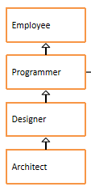

# day10_课后练习

# 代码阅读分析题

## 第1题

考核知识点：属性与多态无关

```java
package com.atguigu.test01;

public class Test01 {
	public static void main(String[] args) {
		A a = new B();
		System.out.println(a.num);
		System.out.println(((B)a).num);
		System.out.println(((A)((B)a)).num);
		System.out.println("-------------------");
		B b = new B();
		System.out.println(b.num);
		System.out.println(((A)b).num);
		System.out.println(((B)((A)b)).num);
	}
}
class A{
	int num = 1;
}
class B extends A{
	int num = 2;
}
```

## 第2题

考核知识点：实例初始化方法，属性与多态无关

```java
package com.atguigu.test02;

public class Test02 {
	public static void main(String[] args) {
		Father f = new Son();
		System.out.println(f.x);
	}
}
class Father{
	int x = 10;
	public Father(){
		this.print();
		x = 20;
	}
	public void print(){
		System.out.println("Father.x = " + x);
	}
}
class Son extends Father{
	int x = 30;
	public Son(){
		this.print();
		x = 40;
	}
	public void print(){
		System.out.println("Son.x = " + x);
	}
}
```

## 第3题

考核知识点：多态，重写，实例初始化过程

```java
package com.atguigu.test03;

public class Test03 {
	public static void main(String[] args) {
		Base b1 = new Base();
		Base b2 = new Sub();
	}
}

class Base {
	Base() {
		method(100);
	}

	public void method(int i) {
		System.out.println("base : " + i);
	}
}

class Sub extends Base {
	Sub() {
		super.method(70);
	}

	public void method(int j) {
		System.out.println("sub : " + j);
	}
}
```

## 第4题

考核知识点：多态、重载、重写

```java
public class Test04 {
	public static void main(String[] args) {
		A a1 = new A();
		A a2 = new B();
		B b = new B();
		C c = new C();
		D d = new D();
		System.out.println("(1)" + a1.show(b));
		System.out.println("(2)" + a2.show(d));
		System.out.println("(3)" + b.show(c));
		System.out.println("(4)" + b.show(d));
	}
}
class A{
	public String show(D obj){
		return ("A and D");
	}
	public String show(A obj){
		return "A and A";
	}
}
class B extends A{
	public String show(B obj){
		return "B and B";
	}
	public String show(A obj){
		return "B and A";
	}
}
class C extends B{
	
}
class D extends B{
	
}
```

## 第5题

考核知识点：多态、重载、重写

```java
public class Test05 {
	public static void main(String[] args) {
		A a1 = new A();
		A a2 = new B();
		B b = new B();
		C c = new C();
		D d = new D();
		System.out.println("(1)" + a1.show(b));
		System.out.println("(2)" + a2.show(d));
		System.out.println("(3)" + b.show(c));
		System.out.println("(4)" + b.show(d));
	}
}

class A {
	public String show(C obj) {
		return ("A and C");
	}

	public String show(A obj) {
		return "A and A";
	}
}

class B extends A {
	public String show(B obj) {
		return "B and B";
	}

	public String show(A obj) {
		return "B and A";
	}
}

class C extends B {

}

class D extends B {

}
```

## 第6题

考核知识点：属性与多态无关

```java
public class Test06 {
	public static void main(String[] args) {
		Base b = new Sub();
		System.out.println(b.x);
	}
}
class Base{
	int x = 1;
}
class Sub extends Base{
	int x = 2;
}
```

## 第7题

考核知识点：权限修饰符

如下代码是否可以编译通过，如果能，结果是什么，如果不能，为什么？

```java
public class Father{
	private String name = "atguigu";
	int age = 0;
}
public class Child extends Father{
	public String grade;
	
	public static void main(String[] args){
		Father f = new Child();
		System.out.println(f.name);
	}
}
```

## 第8题

考核知识点：继承，super，static

如下代码是否可以编译通过，如果能，结果是什么，如果不能，为什么？

```java
public class Person{
	public Person(){
		System.out.println("this is a Person.");
	}
}
public class Teacher extends Person{
	private String name = "tom";
	public Teacher(){
		System.out.println("this is a teacher.");
		super();
	}
	public static void main(String[] args){
		Teacher tea = new Teacher();
		System.out.println(this.name);
	}
}
```


# 代码编程题

## 第9题

案例：

​	1、在com.atguigu.test13包中声明员工类、程序员类、设计师类、架构师类，



* 员工类属性：编号、姓名、年龄、薪资

* 程序员类属性：编程语言，默认都是"java"

* 设计师类属性：奖金

* 架构师类属性：持有股票数量

  要求：属性私有化，无参有参构造，get/set，getInfo方法（考虑重写）

  

  2、在com.atguigu.test13包中声明Test13测试类

  （1）在main中有一些常量和一个二维数组

  ```java
  final int EMPLOYEE = 10;//表示普通员工
  final int PROGRAMMER = 11;//表示程序员
  final int DESIGNER = 12;//表示设计师
  final int ARCHITECT = 13;//表示架构师
      
  String[][] EMPLOYEES = {
          {"10", "1", "段誉", "22", "3000"},
          {"13", "2", "令狐冲", "32", "18000", "15000", "2000"},
          {"11", "3", "任我行", "23", "7000"},
          {"11", "4", "张三丰", "24", "7300"},
          {"12", "5", "周芷若", "28", "10000", "5000"},
          {"11", "6", "赵敏", "22", "6800"},
          {"12", "7", "张无忌", "29", "10800","5200"},
          {"13", "8", "韦小宝", "30", "19800", "15000", "2500"},
          {"12", "9", "杨过", "26", "9800", "5500"},
          {"11", "10", "小龙女", "21", "6600"},
          {"11", "11", "郭靖", "25", "7100"},
          {"12", "12", "黄蓉", "27", "9600", "4800"}
      };
  ```

  （2）创建一个员工数组

  （3）根据以上数据，初始化员工数组

  提示：把字符串转为int和double类型的值，可以使用如下方式：

  ```java
  String idStr = "1";
  int id = Integer.parseInt(idStr);
  
  String salaryStr = "7300";
  double salary = Double.parseDouble(salaryStr);
  ```

  （4）遍历数组，使用如下格式

  ```
  编号	姓名	年龄	薪资	语言	奖金	股票
  .....
  ```

  

## 第10题

案例：

​	1、在com.atguigu.test14包中声明图形Graphic、圆Circle、矩形Rectangle类、三角形Triangle类

​	2、图形Graphic类中有：

​		①public double getArea()方法：返回面积

​		②public double getPerimeter()方法：返回周长

​		③public String getInfo()方法：返回图形信息

​	3、圆类和矩形类重写这两个方法

​	4、在com.atguigu.test14包中声明测试类Test14_1

​	(1)请设计一个方法，可以用于比较两个图形的面积是否相等

​	(2)请设计一个方法，可以用于找出两个图形中面积大的那个

​	(3)public static void main(String[] args){}

​	在主方法中，创建1个圆、1个矩形、1个三角形对象，并分别调用(1)、(2)方法进行测试。

​	5、在com.atguigu.test14包中测试类Test14_2

​	(1)请设计一个方法，可以用于遍历一个图形数组

​	(2)请设计一个方法，可以用于给一个图形数组进行按照面积从小到大排序

​	(3)public static void main(String[] args){}

​	在主方法中，创建1个圆、1个矩形、1个三角形对象，放到数组中，遍历显示，然后排序后再遍历显示。


## 第11题

案例：

​	1、在com.atguigu.test15包中声明人Person、男人Man、女人Woman类

​	（1）在Person类中，包含

​		①public void eat()：打印吃饭

​		②public void toilet()：打印上洗手间

​	（2）在Man类中，包含

​		①重写上面的方法

​		②增加  public void smoke()：打印抽烟

​	（3）在Woman类中，包含

​		①重写上面的方法

​		②增加 public void makeup()：打印化妆

​	2、在com.atguigu.test15包中声明测试类Test15

​	（1）public static void meeting(Person...  ps)

​		在该方法中，每一个人先吃饭，然后上洗手间，然后如果是男人，随后抽根烟，如果是女人，随后化个妆

​	（2）public static void main(String[] args)

​		在主方法中，创建多个男人和女人对象，并调用meeting()方法进行测试

# 关键字整理

整理目前学过的关键字