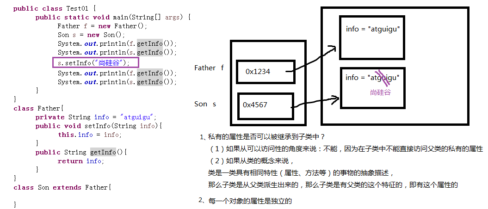
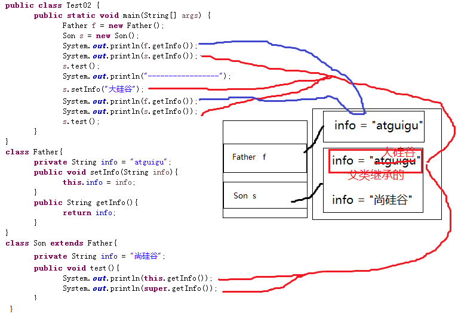
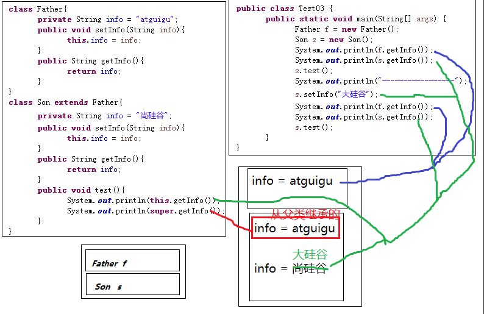

# day11_课后练习

# 代码阅读题

## 第1题

知识点：实例初始化

案例：判断运行结果

```java
package com.atguigu.test01;

class HelloA{
	public HelloA(){
		System.out.println("HelloA");
	}
	{
		System.out.println("I'm A Class");
	}
}

class HelloB extends HelloA{
	public HelloB(){
		System.out.println("HelloB");
	}
	{
		System.out.println("I'm B Class");
	}
}
public class Test01{
	public static void main(String[] args) {
		new HelloB();
	}
}

```

```java
package com.atguigu.test01;

/*
 * 创建对象是通过执行实例初始化方法来完成的。
 * 如果new后面跟无参构造，就说明调用无参的实例初始化方法<init>()，
 * 如果new后面跟有参构造，就说明调用有参的实例初始化方法<init>(形参列表)。
 * 编译器编译后类中没有构造器，而是编译为一个个的实例初始化方法。
 * 实例初始化由：
 * （1）非静态成员变量的显式赋值代码
 * （2）非静态代码块代码
 * （3）构造器代码
 * 其中（1）（2）按编写顺序，（3）在最后
 * 在子类实例初始化首行会有super()或super(实参列表)表示调用父类的实例初始化方法，
 * 如果没写super()或super(实参列表)，那么默认就是super()，因此：
 * （1）先执行父类实例初始化
 * <init>(){
 * 		System.out.println("I'm A Class");
 * 		System.out.println("HelloA");
 * }
 * （2）再执行子类实例初始化
 * <init>(){
 * 		System.out.println("I'm B Class");
 * 		System.out.println("HelloB");
 * }
 */
class HelloA{
	public HelloA(){
		System.out.println("HelloA");
	}
	{
		System.out.println("I'm A Class");
	}
}

class HelloB extends HelloA{
	public HelloB(){
		System.out.println("HelloB");
	}
	{
		System.out.println("I'm B Class");
	}
}
public class Test01{
	public static void main(String[] args) {
		new HelloB();
	}
}

```


## 第2题

知识点：实例初始化

案例：判断运行结果

```java
package com.atguigu.test02;

public class Test02 {
	public static void main(String[] args) {
		new Child("mike");
	}
}

class People {
	private String name;

	public People() {
		System.out.print("1");
	}

	public People(String name) {
		System.out.print("2");
		this.name = name;
	}
}

class Child extends People {
	People father;

	public Child(String name) {
        super();
		System.out.print("3");
		father = new People(name + " F");
	}

	public Child() {
		System.out.print("4");
	}
}

```

```java
package com.atguigu.test02;

/*
 * 实例初始化的过程：
 * (1)父类的实例初始化
 * <init>(){
 * 		System.out.print("1");
 * }
 * (2)子类的实例初始化	
 * <init>(String name){
 * 		System.out.print("3");
 * 		father = new People(name + " F");//创建了一个父类的对象
 * 			调用父类的<init>(String name){
 * 					System.out.print("2");
 * 			}
 * }
 * 
 */
public class Test02 {
	public static void main(String[] args) {
		new Child("mike");
	}
}

class People {
	private String name;

	public People() {
		System.out.print("1");
	}

	public People(String name) {
		System.out.print("2");
		this.name = name;
	}
}

class Child extends People {
	People father;

	public Child(String name) {
		System.out.print("3");
		father = new People(name + " F");
	}

	public Child() {
		System.out.print("4");
	}
}

```

## 第3题

知识点：实例初始化

案例：分析运行结果

```java
package com.atguigu.test03;

public class Test03 {
	public static void main(String[] args) {
		Father f = new Father();
		Child c = new Child();
	}
}
class Father {
	public Father(){
		System.out.println("father create");
	}
}
class Child extends Father{
	public Child(){
		System.out.println("child create");
	}
}
```

```java
package com.atguigu.test03;

/*
 * 1、Father f = new Father();
 * 执行父类的实例初始化方法
 * <init>(){
 * 		System.out.println("father create");
 * }
 * 
 * 2、Child c = new Child();
 * （1）先执行父类的实例初始化方法
 * <init>(){
 * 		System.out.println("father create");
 * }
 * （2）再执行子类的实例初始化方法
 * <init>(){
 * 		System.out.println("child create");
 * }
 */
public class Test03 {
	public static void main(String[] args) {
		Father f = new Father();
		Child c = new Child();
	}
}
class Father {
	public Father(){
		System.out.println("father create");
	}
}
class Child extends Father{
	public Child(){
		System.out.println("child create");
	}
}
```


## 第4题

知识点：继承、属性同名问题

```java
package com.atguigu.test04;

public class Test04 extends Father{
	private String name = "test";
	
	public static void main(String[] args) {
		Test04 test = new Test04();
		System.out.println(test.getName());
	}
}
class Father {
	private String name = "father";

	public String getName() {
		return name;
	}
}
```

```java
package com.atguigu.test04;

/*
 * 当父类与子类有同名的属性时：
 * 通过子类对象调用getName()访问的是父类的name还是子类的name，
 * 那么要看子类是否重写，如果没有重写，就是父类的，重写了就是子类的。
 */
public class Test04 extends Father{
	private String name = "test";
	
	public static void main(String[] args) {
		Test04 test = new Test04();
		System.out.println(test.getName());
	}
}
class Father {
	private String name = "father";

	public String getName() {
		return name;
	}
}
```

## 第5题

知识点：实例初始化、构造器

案例：分析运行结果

```java
package com.atguigu.test05;

public class Test05 {

	public static void main(String[] args) {
		new A(new B());
	}
}

class A {
	public A() {
		System.out.println("A");
	}

	public A(B b) {
		this();
		System.out.println("AB");
	}
}

class B {
	public B() {
		System.out.println("B");
	}
}

```

```java
package com.atguigu.test05;

/*
 * 1、先算new B()
 * 执行B类的实例初始化方法：
 * <init>(){
 * 		System.out.println("B");
 * }
 * 2、再算new A(B对象)
 * 执行A类的实例初始化方法：
 * <init>(B b){
 * 		this();
 * 			即调用本类的无参构造，或者说无参实参初始化方法
 * 			<init>(){
 * 				System.out.println("A");
 * 			}
 *		System.out.println("AB");
 * }
 */
public class Test05 {

	public static void main(String[] args) {
		new A(new B());
	}
}

class A {
	public A() {
		System.out.println("A");
	}

	public A(B b) {
		this();
		System.out.println("AB");
	}
}

class B {
	public B() {
		System.out.println("B");
	}
}

```


## 第6题

知识点：实例初始化

案例：分析运行结果

```java
package com.atguigu.test06;

public class Test06 {
	public static void main(String[] args) {
		Sub s = new Sub();
	}
}
class Base{
	Base(){
		method(100);//  this.method(100);调用当前对象的method，现在new子类对象，当前对象是子类，子类重写了method，这里执行子类的method
	}
	{
		System.out.println("base");
	}
	public void method(int i){
		System.out.println("base : " + i);
	}
}
class Sub extends Base{
	Sub(){
		super.method(70);
	}
	{
		System.out.println("sub");
	}
	public void method(int j){
		System.out.println("sub : " + j);
	}
}
```

```java
package com.atguigu.test06;

/*
 * 创建对象是通过执行实例初始化方法来完成的。
 * 如果new后面跟无参构造，就说明调用无参的实例初始化方法<init>()，
 * 如果new后面跟有参构造，就说明调用有参的实例初始化方法<init>(形参列表)。
 * 编译器编译后类中没有构造器，而是编译为一个个的实例初始化方法。
 * 实例初始化由：
 * （1）非静态成员变量的显式赋值代码
 * （2）非静态代码块代码
 * （3）构造器代码
 * 其中（1）（2）按编写顺序，（3）在最后
 * 在子类实例初始化首行会有super()或super(实参列表)表示调用父类的实例初始化方法，
 * 如果没写super()或super(实参列表)，那么默认就是super()，因此：
 * 1、执行父类的实例初始化方法
 * <ini>(){
 * 		System.out.println("base");
 * 		method(100); //因为此时在创建子类的对象过程中，所以这个method(100)方法是
 * 						子类对象再调用，那么又因为子类重写了method(int)方法，
 * 						所以执行子类的method(int)
 * 					即System.out.println("sub : " + j);
 * }
 * 
 * 2、执行子类的实例初始化方法
 * <init>(){
 * 		System.out.println("sub");
 * 		super.method(70);//因为这里用super.，那么一定是调用父类的method(int)
 * 					即System.out.println("base : " + i);
 * }
 */
public class Test06 {
	public static void main(String[] args) {
		Sub s = new Sub();
	}
}
class Base{
	Base(){
		method(100);
	}
	{
		System.out.println("base");
	}
	public void method(int i){
		System.out.println("base : " + i);
	}
}
class Sub extends Base{
	Sub(){
		super.method(70);
	}
	{
		System.out.println("sub");
	}
	public void method(int j){
		System.out.println("sub : " + j);
	}
}
```


## 第7题

```java
public class Test07 {
	public static void main(String[] args) {
		Son son = new Son();
	}
}
class Father{
	static{
		System.out.println("（1）父类的静态代码块");
	}
	{
		System.out.println("（2）父类的非静态代码块");
	}
	Father(){
		System.out.println("（3）父类的无参构造");
	}
}
class Son extends Father{
	static{
		System.out.println("（4）子类的静态代码块");
	}
	{
		System.out.println("（5）子类的非静态代码块");
	}
	Son(){
		System.out.println("（6）子类的无参构造");
	}
}
```

```java
package com.atguigu.test07;

/*
 * （1）Father类的类初始化
 * ①类变量显式赋值：这里没有
 * ②静态代码块
 * 		System.out.println("（1）父类的静态代码块");
 * （2）Son类的类初始化
 * ①类变量显式赋值：这里没有
 * ②静态代码块
 * 		System.out.println("（4）子类的静态代码块");
 * 
 * （3）执行Father类的是实参初始化方法<init>()
 * ①非静态成员变量的显式赋值：这里没有
 * ②非静态代码块：
 * 		System.out.println("（2）父类的非静态代码块");
 * ③父类的无参构造
 * 		System.out.println("（3）父类的无参构造");
 * 
 * （4）执行Son类的实例初始化方法<init>()
 * ①非静态成员变量的显式赋值：这里没有
 * ②非静态代码块：
 * 		System.out.println("（5）子类的非静态代码块");
 * ③子类的无参构造
 * 		System.out.println("（6）子类的无参构造");
 */
public class Test07 {
	public static void main(String[] args) {
		Son son = new Son();
	}
}
class Father{
	static{
		System.out.println("（1）父类的静态代码块");
	}
	{
		System.out.println("（2）父类的非静态代码块");
	}
	Father(){
		System.out.println("（3）父类的无参构造");
	}
}
class Son extends Father{
	static{
		System.out.println("（4）子类的静态代码块");
	}
	{
		System.out.println("（5）子类的非静态代码块");
	}
	Son(){
		System.out.println("（6）子类的无参构造");
	}
}

```


## 第8题

```java
public class Test08 {
	public static void main(String[] args) {
		Zi zi = new Zi();
	}
}
class Fu{
	private static int i = getNum("（1）i");
	private int j = getNum("（2）j");
	static{
		print("（3）父类静态代码块");
	}
	{
		print("（4）父类非静态代码块，又称为构造代码块");
	}
	Fu(){
		print("（5）父类构造器");
	}
	public static void print(String str){
		System.out.println(str + "->" + i);
	}
	public static int getNum(String str){
		print(str);
		return ++i;
	}
}
class Zi extends Fu{
	private static int k = getNum("（6）k");
	private int h = getNum("（7）h");
	static{
		print("（8）子类静态代码块");
	}
	{
		print("（9）子类非静态代码块，又称为构造代码块");
	}
	Zi(){
		print("（10）子类构造器");
	}
	public static void print(String str){
		System.out.println(str + "->" + k);
	}
	public static int getNum(String str){
		print(str);
		return ++k;
	}
}

```

```java
package com.atguigu.test08;

/*
 * （1）Fu类的类初始化
 * ①类变量显式赋值：
 * 		i = getNum("（1）i");
 * 		public static int getNum(String str){
			print(str);
				print方法代码如下：
				public static void print(String str){
					System.out.println(str + "->" + i);			(1)i -> 0（默认值）
				}
			return ++i;											i=1
		}
 * ②静态代码块
 * 	static{
		print("（3）父类静态代码块");
			print方法代码如下：
			public static void print(String str){
				System.out.println(str + "->" + i);			  （3）父类静态代码块 -> 1
			}
	}
 * （2）Zi类的类初始化
 * ①类变量显式赋值：
 * 	  k = getNum("（6）k");
	 * 	
		public static int getNum(String str){
			print(str);
				print方法代码如下：
				public static void print(String str){
					System.out.println(str + "->" + k);		（6）k -> 0（默认值）
				}
			return ++k;										k=1
		}
 * ②静态代码块
 * 	static{
		print("（8）子类静态代码块");
			print方法代码如下：
			public static void print(String str){
				System.out.println(str + "->" + k);		（8）子类静态代码块 -> 1
			}
	}	
 * 
 * （3）执行Fu类的是实参初始化方法<init>()
 * ①非静态成员变量的显式赋值：
 * 		j = getNum("（2）j");
	 * 	
		public static int getNum(String str){
			print(str);
				print方法代码如下：
				public static void print(String str){
					System.out.println(str + "->" + i);  （2）j -> 1
				}
			return ++i;									i=2
		}
 * ②非静态代码块：
 * 	{
		print("（4）父类非静态代码块，又称为构造代码块");
			print方法代码如下：
			public static void print(String str){
				System.out.println(str + "->" + i);  （4）父类非静态代码块，又称为构造代码块 -> 2
			}
	}	
 * ③父类的无参构造
 *	Fu(){
		print("（5）父类构造器");
			print方法代码如下：
			public static void print(String str){
				System.out.println(str + "->" + i);  （5）父类构造器 -> 2
			}
	} 		
 * 
 * （4）执行Zi类的实例初始化方法<init>()
 * ①非静态成员变量的显式赋值：
 * 	 h = getNum("（7）h");

	public static int getNum(String str){
		print(str);
			print方法代码如下：
			public static void print(String str){
				System.out.println(str + "->" + k);   （7）h ->1
			}
		return ++k;										k=2
	}
 * 
 * ②非静态代码块：
 * 	{
		print("（9）子类非静态代码块，又称为构造代码块");
			print方法代码如下：
			public static void print(String str){
				System.out.println(str + "->" + k);   （9）子类非静态代码块，又称为构造代码块 ->2
			}
	}	
 * ③子类的无参构造
 * 	Zi(){
		print("（10）子类构造器");
			print方法代码如下：
			public static void print(String str){
				System.out.println(str + "->" + k);   （10）子类构造器 ->2
			}
	}	
 */
public class Test08 {
	public static void main(String[] args) {
		Zi zi = new Zi();
	}
}
class Fu{
	private static int i = getNum("（1）i");
	private int j = getNum("（2）j");
	static{
		print("（3）父类静态代码块");
	}
	{
		print("（4）父类非静态代码块，又称为构造代码块");
	}
	Fu(){
		print("（5）父类构造器");
	}
	public static void print(String str){
		System.out.println(str + "->" + i);
	}
	public static int getNum(String str){
		print(str);
		return ++i;
	}
}
class Zi extends Fu{
	private static int k = getNum("（6）k");
	private int h = getNum("（7）h");
	static{
		print("（8）子类静态代码块");
	}
	{
		print("（9）子类非静态代码块，又称为构造代码块");
	}
	Zi(){
		print("（10）子类构造器");
	}
	public static void print(String str){
		System.out.println(str + "->" + k);
	}
	public static int getNum(String str){
		print(str);
		return ++k;
	}
}

```


## 第9题

```java
public class T {
	public static int k = 0;
	public static T t1 = new T("t1");
	public static T t2 = new T("t2");
	public static int i = print("i");
	public static int n = 99;
	
	public int j = print("j");
	{
		print("构造块");
	}

	static{
		print("静态块");
	}
	public T(String str){
		System.out.println((++k) + ":" + str + "  i=" + i + "  n=" + n);
		++n;
		++i;
	}
	public static int print(String str){
		System.out.println((++k) + ":" + str + "  i=" + i + "  n=" + n);
		++n;
		return ++i;
	}
	public static void main(String[] args) {
	
	}
}
```

```java
package com.atguigu.test09;

/*
 * 对于T来说，就完成类初始化
 * 
 * 创建对象，调用类的实例初始化<init>()或<init>(String str)
 * 
 * （1）静态变量的显式赋值
 * 		k = 0;
		t1 = new T("t1");
			<init>(String str)
				①j = print("j");
						print方法代码如下：
						public static int print(String str){
							System.out.println((++k) + ":" + str + "  i=" + i + "  n=" + n);  1：j i=0 n=0
							++n;									n=1  k=1
							return ++i;								i=1
						}
				②	{
					print("构造块");
						print方法代码如下：
						public static int print(String str){
							System.out.println((++k) + ":" + str + "  i=" + i + "  n=" + n);  2：构造块 i=1 n=1
							++n;									n=2  k=2
							return ++i;								i=2
						}
				}
				③public T(String str){
					System.out.println((++k) + ":" + str + "  i=" + i + "  n=" + n);	  3:t1  i=2  n=2	
					++n;											n=3  k=3
					++i;											i=3
				}
 * 		t2 = new T("t2");
			<init>(String str)
				①j = print("j");
						print方法代码如下：
						public static int print(String str){
							System.out.println((++k) + ":" + str + "  i=" + i + "  n=" + n);  4：j i=3 n=3
							++n;									n=4  k=4
							return ++i;								i=4
						}
				②	{
					print("构造块");
						print方法代码如下：
						public static int print(String str){
							System.out.println((++k) + ":" + str + "  i=" + i + "  n=" + n);  5：构造块 i=4 n=4
							++n;									n=5  k=5
							return ++i;								i=5
						}
				}
				③public T(String str){
					System.out.println((++k) + ":" + str + "  i=" + i + "  n=" + n);	  6:t2  i=5  n=5	
					++n;											n=6  k=6
					++i;											i=6
				}
	 i = print("i");
	 		print方法代码如下：
	 		public static int print(String str){
				System.out.println((++k) + ":" + str + "  i=" + i + "  n=" + n);  7：i  i=6 n=6
				++n;									n=7  k=7
				return ++i;								i=7
			}
	n = 99;
 * （2）静态代码块
 * 	static{
		print("静态块");
			print方法代码如下：
			public static int print(String str){
				System.out.println((++k) + ":" + str + "  i=" + i + "  n=" + n);  8：静态块   i=7 n=99
				++n;									n=100  k=8
				return ++i;								i=8
			}
	}
 */
public class T {
	public static int k = 0;
	public static T t1 = new T("t1");
	public static T t2 = new T("t2");
	public static int i = print("i");
	public static int n = 99;
	
	public int j = print("j");
	{
		print("构造块");
	}

	static{
		print("静态块");
	}
	public T(String str){
		System.out.println((++k) + ":" + str + "  i=" + i + "  n=" + n);
		++n;
		++i;
	}
	public static int print(String str){
		System.out.println((++k) + ":" + str + "  i=" + i + "  n=" + n);
		++n;
		return ++i;
	}
	public static void main(String[] args) {
	
	}
}
```

## 第10题

考核知识点：方法的参数传递、final关键字

```java
package com.atguigu.test10;

public class Test10 {
	public static void main(String[] args) {
		Other o = new Other();
		new Test10().addOne(o);
		System.out.println(o.i);
	}
	
	public void addOne(final Other o){
		o.i++;
	}
}
class Other{
	public int i;
}
```

```java
/*
 * 1、final
 * final修饰的是o，不是i，因此o变量的值不能修改，不是说i变量的值不能修改
 * 2、方法的参数传递机制：
 * 形参是基本数据类型，那么实参给形参的是数据值的副本，形参的修改不影响实参；
 * 形参是引用数据类型，那么实参给形参的是地址值的副本，形参对象修改属性相当于实参对象修改属性
 */
public class Test10 {
	public static void main(String[] args) {
		Other o = new Other();
		new Test10().addOne(o);
		System.out.println(o.i);
	}
	
	public void addOne(final Other o){
		o.i++;
	}
}
class Other{
	public int i;
}
```


## 第11题

考核知识点：类初始化，局部变量与类变量，自增自减

```java
package com.atguigu.test11;

public class Test11 {
	static int x, y, z;

	static {
		int x = 5;
		x--;
	}

	static {
		x--;
	}

	public static void main(String[] args) {
		System.out.println("x=" + x);
		z--;
		method();
		System.out.println("result:" + (z + y + ++z));
	}

	public static void method() {
		y = z++ + ++z;
	}
}
```

```java
/*
 * （1）类的初始化
 * <clinit>(){
 * 		int x = 5;//局部变量
		x--;//局部变量		x=4
 * 		Test07.x--;//静态变量      x = -1
 * }
 * （2）执行main方法
 * System.out.println("x=" + x);//静态变量   -1
 * z--;//静态变量   z=-1
 * method();
 * 		y = z++ + ++z;//静态变量   
 * 			①先加载z的值“-1”②z自增，z=0③z自增 z =1④加载z的值“1” ⑤求和  “-1” + “1” = 0⑥把0赋值给y   y=0
 * System.out.println("result:" + (z + y + ++z));
 * 			①加载z的值“1”  ②加载y的值"0" ③z自增  z=2 ④加载z的值“2”  ⑤求和  “1” + “0” + “2”
 * 
 */
public class Test11 {
	static int x, y, z;//类变量，静态变量，成员变量   默认值0

	static {
		int x = 5;//局部变量
		x--;//局部变量
	}

	static {
		x--;//静态变量
	}

	public static void main(String[] args) {
		System.out.println("x=" + x);//静态变量
		z--;//静态变量
		method();
		System.out.println("result:" + (z + y + ++z));//静态变量
	}

	public static void method() {
		y = z++ + ++z;//静态变量
	}
}
```

## 第12题

考核知识点：继承、this

```java
package com.atguigu.test12;

public class Test12 {
	public static void main(String[] args) {
		Father f = new Father();
		Son s = new Son();
		System.out.println(f.getInfo());
		System.out.println(s.getInfo());
		s.setInfo("尚硅谷");
		System.out.println(f.getInfo());
		System.out.println(s.getInfo());
	}
}
class Father{
	private String info = "atguigu";
	public void setInfo(String info){
		this.info = info;
	}
	public String getInfo(){
		return info;
	}
}
class Son extends Father{
	
}
```

```java
/*
1、私有的属性是否可以被继承到子类中？
（1）如果从可以访问性的角度来说：不能，因为在子类中不能直接访问父类的私有的属性，但是可以通过get/set操作
（2）如果从类的概念来说，
类是一类具有相同特性（属性、方法等）的事物的抽象描述，
那么子类是从父类派生出来的，那么子类是有父类的这个特征的，即有这个属性的

2、每一个对象的非静态属性是独立的，其中一个对象修改和另一个对象是无关的
 */
public class Test12 {
	public static void main(String[] args) {
		Father f = new Father();
		Son s = new Son();
		System.out.println(f.getInfo());
		System.out.println(s.getInfo());
		s.setInfo("尚硅谷");
		System.out.println(f.getInfo());
		System.out.println(s.getInfo());
	}
}
class Father{
	private String info = "atguigu";
	public void setInfo(String info){
		this.info = info;
	}
	public String getInfo(){
		return info;
	}
}
class Son extends Father{
	
}
```



## 第13题

考核知识点：继承、this、super

```java
package com.atguigu.test13;

public class Test13 {
	public static void main(String[] args) {
		Father f = new Father();
		Son s = new Son();
		System.out.println(f.getInfo());
		System.out.println(s.getInfo());
		s.test();
		System.out.println("-----------------");
		s.setInfo("大硅谷");
		System.out.println(f.getInfo());
		System.out.println(s.getInfo());
		s.test();
	}
}
class Father{
	private String info = "atguigu";
	public void setInfo(String info){
		this.info = info;
	}
	public String getInfo(){
		return info;
	}
}
class Son extends Father{
	private String info = "尚硅谷";
	public void test(){
		System.out.println(this.getInfo());
		System.out.println(super.getInfo());
	}
}
```

```java
/*
1、私有的属性是否可以被继承到子类中？
（1）如果从可以访问性的角度来说：不能，因为在子类中不能直接访问父类的私有的属性，但是可以通过get/set操作
（2）如果从类的概念来说，
类是一类具有相同特性（属性、方法等）的事物的抽象描述，
那么子类是从父类派生出来的，那么子类是有父类的这个特征的，即有这个属性的

2、每一个对象的非静态属性是独立的，其中一个对象修改和另一个对象是无关的

3、当子类有与父类的属性同名时，那么通过子类对象调用get/set方法操作的是父类继承还是子类自己的属性呢？
要看子类是否重写：
如果没有重写，操作的都是父类的，不管是直接getInfo()还是this.getInfo()，还是super.getInfo()
如果重写了，如果通过子类对象调用，操作的是子类的，例如：getInfo()还是this.getInfo()，
		如果通过super.调用的，操作的是父类的。
 */
public class Test13 {
	public static void main(String[] args) {
		Father f = new Father();
		Son s = new Son();
		System.out.println(f.getInfo());
		System.out.println(s.getInfo());
		s.test();
		System.out.println("-----------------");
		s.setInfo("大硅谷");
		System.out.println(f.getInfo());
		System.out.println(s.getInfo());
		s.test();
	}
}
class Father{
	private String info = "atguigu";
	public void setInfo(String info){
		this.info = info;
	}
	public String getInfo(){
		return info;
	}
}
class Son extends Father{
	private String info = "尚硅谷";
	public void test(){
		System.out.println(this.getInfo());
		System.out.println(super.getInfo());
	}
}
```



## 第14题

考核知识点：继承、this、super、重写

```java
package com.atguigu.test14;

public class Test14 {
	public static void main(String[] args) {
		Father f = new Father();
		Son s = new Son();
		System.out.println(f.getInfo());
		System.out.println(s.getInfo());
		s.test();
		System.out.println("-----------------");
		s.setInfo("大硅谷");
		System.out.println(f.getInfo());
		System.out.println(s.getInfo());
		s.test();
	}
}
class Father{
	private String info = "atguigu";
	public void setInfo(String info){
		this.info = info;
	}
	public String getInfo(){
		return info;
	}
}
class Son extends Father{
	private String info = "尚硅谷";
	public void setInfo(String info){
		this.info = info;
	}
	public String getInfo(){
		return info;
	}
	public void test(){
		System.out.println(this.getInfo());
		System.out.println(super.getInfo());
	}
}
```

```java
/*
1、私有的属性是否可以被继承到子类中？
（1）如果从可以访问性的角度来说：不能，因为在子类中不能直接访问父类的私有的属性，但是可以通过get/set操作
（2）如果从类的概念来说，
类是一类具有相同特性（属性、方法等）的事物的抽象描述，
那么子类是从父类派生出来的，那么子类是有父类的这个特征的，即有这个属性的

2、每一个对象的非静态属性是独立的，其中一个对象修改和另一个对象是无关的

3、当子类有与父类的属性同名时，那么通过子类对象调用get/set方法操作的是父类继承还是子类自己的属性呢？
要看子类是否重写：
如果没有重写，操作的都是父类的，不管是直接getInfo()还是this.getInfo()，还是super.getInfo()
如果重写了，如果通过子类对象调用，操作的是子类的，例如：getInfo()还是this.getInfo()，
		如果通过super.调用的，操作的是父类的。
 */
public class Test14 {
	public static void main(String[] args) {
		Father f = new Father();
		Son s = new Son();
		System.out.println(f.getInfo());
		System.out.println(s.getInfo());
		s.test();
		System.out.println("-----------------");
		s.setInfo("大硅谷");
		System.out.println(f.getInfo());
		System.out.println(s.getInfo());
		s.test();
	}
}
class Father{
	private String info = "atguigu";
	public void setInfo(String info){
		this.info = info;
	}
	public String getInfo(){
		return info;
	}
}
class Son extends Father{
	private String info = "尚硅谷";
	public void setInfo(String info){
		this.info = info;
	}
	public String getInfo(){
		return info;
	}
	public void test(){
		System.out.println(this.getInfo());
		System.out.println(super.getInfo());
	}
}
```



## 第15题

考核知识点：类初始化与实例初始化

```java
package com.atguigu.test15;

class HelloA{
	public HelloA(){
		System.out.println("HelloA");
	}
	{
		System.out.println("I'm A Class");
	}
	static{
		System.out.println("static A");
	}
}

public class HelloB extends HelloA{
	public HelloB(){
		System.out.println("HelloB");
	}
	{
		System.out.println("I'm B Class");
	}
	static{
		System.out.println("static B");
	}

	public static void main(String[] args) {
		new HelloB();
	}

}

```

```java
/*
 * 1、main是Java程序的入口，那么main所在的类需要先完成类初始化，才能执行main方法。
 * 即先完成HelloB的类初始化，才能执行main中的new Hello()
 * 2、但是在类初始化时，如果发现父类还没有初始化，会先初始化父类，即先完成HelloA的类初始化
 * 3、类初始化方法由：
 * （1）静态变量的显式赋值代码
 * （2）静态代码块代码
 * 4、 创建对象是通过执行实例初始化方法来完成的。
 * 如果new后面跟无参构造，就说明调用无参的实例初始化方法<init>()，
 * 如果new后面跟有参构造，就说明调用有参的实例初始化方法<init>(形参列表)。
 * 编译器编译后类中没有构造器，而是编译为一个个的实例初始化方法。
 * 实例初始化由：
 * （1）非静态成员变量的显式赋值代码
 * （2）非静态代码块代码
 * （3）构造器代码
 * 其中（1）（2）按编写顺序，（3）在最后
 * 在子类实例初始化首行会有super()或super(实参列表)表示调用父类的实例初始化方法，
 * 如果没写super()或super(实参列表)，那么默认就是super()，因此：
 * 
 * 因此：
 * 1、先执行HelloA的类初始化
 * <clinit>(){
 * 		System.out.println("static A");
 * }
 * 2、在完成Hello的类初始化
 * <clinit>(){
 * 		System.out.println("static B");
 * }
 * 3、再执行父类HelloA的实例初始化方法
 * <init>(){
 * 		System.out.println("I'm A Class");
 * 		System.out.println("HelloA");
 * }
 * 4、最后执行子类HelloB的是实例初始化方法
 * <init>(){
 * 		System.out.println("I'm B Class");
 * 		System.out.println("HelloB");
 * }
 */
class HelloA{
	public HelloA(){
		System.out.println("HelloA");
	}
	{
		System.out.println("I'm A Class");
	}
	static{
		System.out.println("static A");
	}
}

public class HelloB extends HelloA{
	public HelloB(){
		System.out.println("HelloB");
	}
	{
		System.out.println("I'm B Class");
	}
	static{
		System.out.println("static B");
	}

	public static void main(String[] args) {
		new HelloB();
	}

}

```


# 代码编程题

## 第16题

案例：

1、在com.atguigu.test16包中声明员工类、程序员类、设计师类、架构师类，


* 员工类属性：编号、姓名、年龄、薪资

* 程序员类属性：编程语言，默认都是"java"

* 设计师类属性：奖金

* 架构师类属性：持有股票数量

  要求：属性私有化，无参有参构造，get/set，getInfo方法（考虑重写）

2、在com.atguigu.test16包中声明Test16类，并在main中创建每一个类的对象，并为属性赋值，并调用它们的getInfo()显示信息

```java
package com.atguigu.test16;

public class Employee {
	private int id;
	private String name;
	private int age;
	private double salary;
	
	public Employee() {
		super();
	}

	public Employee(int id, String name, int age, double salary) {
		super();
		this.id = id;
		this.name = name;
		this.age = age;
		this.salary = salary;
	}

	public int getId() {
		return id;
	}

	public void setId(int id) {
		this.id = id;
	}

	public String getName() {
		return name;
	}

	public void setName(String name) {
		this.name = name;
	}

	public int getAge() {
		return age;
	}

	public void setAge(int age) {
		this.age = age;
	}

	public double getSalary() {
		return salary;
	}

	public void setSalary(double salary) {
		this.salary = salary;
	}
	
	public String getInfo(){
		return id + "\t" + name + "\t" + age + "\t" + salary;
	}
}

```

```java
package com.atguigu.test16;

public class Programmer extends Employee{
	private String language = "java";

	public Programmer() {
		super();
	}

	public Programmer(int id, String name, int age, double salary) {
		super(id, name, age, salary);
	}

	public Programmer(int id, String name, int age, double salary, String language) {
		super(id, name, age, salary);
		this.language = language;
	}

	public String getLanguage() {
		return language;
	}

	public void setLanguage(String language) {
		this.language = language;
	}

	@Override
	public String getInfo() {
		return super.getInfo() + "\t" + language;
	}
	
}

```

```java
package com.atguigu.test16;

public class Designer extends Programmer {
	private double bonus;

	public Designer() {
		super();
	}

	public Designer(int id, String name, int age, double salary, double bonus) {
		super(id, name, age, salary);
		this.bonus = bonus;
	}

	public Designer(int id, String name, int age, double salary, String language, double bonus) {
		super(id, name, age, salary, language);
		this.bonus = bonus;
	}

	public double getBonus() {
		return bonus;
	}

	public void setBonus(double bonus) {
		this.bonus = bonus;
	}

	@Override
	public String getInfo() {
		return super.getInfo()+ "\t" + bonus;
	}
	
}

```

```java
package com.atguigu.test16;

public class Architect extends Designer {
	private int stock;

	public Architect() {
		super();
	}

	public Architect(int id, String name, int age, double salary, double bonus, int stock) {
		super(id, name, age, salary, bonus);
		this.stock = stock;
	}

	public Architect(int id, String name, int age, double salary, String language, double bonus, int stock) {
		super(id, name, age, salary, language, bonus);
		this.stock = stock;
	}

	public int getStock() {
		return stock;
	}

	public void setStock(int stock) {
		this.stock = stock;
	}

	@Override
	public String getInfo() {
		return super.getInfo() + "\t" + stock;
	}
	
}

```

```java
package com.atguigu.test16;

public class Test16 {
	public static void main(String[] args) {
		Employee emp = new Employee(1, "张三", 23, 13000);
		Programmer pro = new Programmer(2, "李四", 23, 14000);
		Designer des = new Designer(3, "王五", 25, 15000, "scalar", 2000);
		Architect arc = new Architect(4, "赵六", 26, 16000, 3000, 100);
		
		System.out.println("编号\t姓名\t年龄\t薪资\t语言\t奖金\t股票");
		System.out.println(emp.getInfo());
		System.out.println(pro.getInfo());
		System.out.println(des.getInfo());
		System.out.println(arc.getInfo());
	}
}

```

