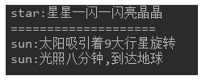

# day12_课后练习


# 接口编程代码题

## 第1题

* 语法点：接口
* 按步骤编写代码，效果如图所示：


* 编写步骤：

1. 定义接口A，普通类B实现接口A
2. A接口中，定义抽象方法showA。 
3. A接口中，定义默认方法showB。
4. B类中，重写showA方法
5. 测试类中，创建B类对象，调用showA方法，showB方法。

```java
package com.atguigu.test01;

public class Test01 {
	public static void main(String[] args) {
		B b = new B();
		b.showA();
		b.showB();
	}
}
interface A{
	void showA();
	default void showB(){
		System.out.println("BBB");
	}
}
class B implements A{

	@Override
	public void showA() {
		System.out.println("AAA");
	}
	
}
```


## 第2题

* 语法点：接口，多态
* 按步骤编写代码，效果如图所示：



* 编写步骤

1. 定义接口Universe，提供抽象方法doAnything。

2. 定义普通类Star，提供成员发光shine方法，打印“star:星星一闪一闪亮晶晶"

3. 定义普通类Sun，

   继承Star类，重写shine方法，打印"sun:光照八分钟，到达地球"

   实现Universe接口，实现doAnything，打印"sun:太阳吸引着9大行星旋转"

4. 测试类中，创建Star对象，调用shine方法

5. 测试类中，多态的方式创建Sun对象，调用doAnything方法，向下转型，调用shine方法。

```java
package com.atguigu.test02;

public class Test02 {
	public static void main(String[] args) {
		Star s = new Star();
		s.shine();
		
		System.out.println("======================");
		Universe u = new Sun();
		u.doAnything();
		Star sun = (Star) u;
		sun.shine();
	}
}
interface Universe{
	void doAnything();
}
class Star{
	public void shine(){
		System.out.println("star:星星一闪一闪亮晶晶");
	}
}
class Sun extends Star implements Universe{
	@Override
	public void shine(){
		System.out.println("sun:光照8分钟到达地球");
	}
	@Override
	public void doAnything() {
		System.out.println("sun:太阳吸引着9大行星旋转");
	}
	
}
```


## 第3题

* 模拟玩家选择角色。
* 定义接口FightAble：
  * 抽象方法：specialFight。
  * 默认方法：commonFight,方法中打印"普通打击"。
* 定义战士类：
  * 实现FightAble接口,重写方法中打印"武器攻击"。
* 定义法师类Mage：
  * 实现FightAble接口,重写方法中打印"法术攻击"。
* 定义玩家类Player：
  * 静态方法：FightAble select(String str)，根据指令选择角色。
    * 法力角色，选择法师。
    * 武力角色，选择战士。
* 代码实现，效果如图所示：


```java
package com.atguigu.test03;

import java.util.Scanner;

public class Test3 {
	public static void main(String[] args) {
		Scanner input = new Scanner(System.in);
		
		System.out.print("选择：");
		String role1 = input.next();
		
		FightAble f1 = Player.select(role1);
		f1.specialFight();
		f1.commonFight();
		
		System.out.println("====================");
		
		System.out.print("选择：");
		String role2 = input.next();
		
		FightAble f2 = Player.select(role2);
		f2.specialFight();
		f2.commonFight();
		
		input.close();
	}
}
interface FightAble{
	void specialFight();
	default void commonFight(){
		System.out.println("普通攻击");
	}
}
class Soldier implements FightAble{

	@Override
	public void specialFight() {
		System.out.println("武器攻击");
	}
	
}
class Mage implements FightAble{

	@Override
	public void specialFight() {
		System.out.println("法术攻击");
	}
	
}
class Player{

	public static FightAble select(String str){
		if("法力角色".equals(str)){
			return new Mage();
		}else if("武力角色".equals(str)){
			return new Soldier();
		}
		return null;
	}
	
}
```


## 第4题

* 模拟工人挑苹果。
* 定义苹果类：
  * 属性：大小，颜色。
  * 提供基本的构造方法和get方法，set方法
* 定义接口CompareAble：
  * 定义默认方法compare，挑选较大苹果。
* 定义接口实现类CompareBig。
* 定义接口实现类CompareColor。挑选红色苹果。
* 定义工人类：
  * 成员方法：挑选苹果public void pickApple(CompareAble c,Apple a1,Apple a2)。
* 测试类：
  * 创建Worker对象。
  * 创建两个Apple对象，一个Apple（5，"青色"）,一个Apple（3，"红色"）
* 代码实现，效果如图所示：


```java
package com.atguigu.test04;

public class Test04 {
	public static void main(String[] args) {
		Worker w = new Worker();
		Apple a1 = new Apple(5, "青色");
		Apple a2 = new Apple(3, "红色");
		
		w.pickApple(new CompareBig(), a1, a2);
		w.pickApple(new CompareColor(), a1, a2);
	}
}
class Apple{
	private double size;
	private String color;
	public Apple(double size, String color) {
		super();
		this.size = size;
		this.color = color;
	}
	public Apple() {
		super();
	}
	public double getSize() {
		return size;
	}
	public void setSize(double size) {
		this.size = size;
	}
	public String getColor() {
		return color;
	}
	public void setColor(String color) {
		this.color = color;
	}
	@Override
	public String toString() {
		return size + "-" + color;
	}
	
}
interface CompareAble{
	default void compare(Apple a1,Apple a2){
		System.out.println("默认挑大的：");
		if(a1.getSize() > a2.getSize()){
			System.out.println(a1);
		}else{
			System.out.println(a2);
		}
	}
}
class CompareBig implements CompareAble{
	
}
class CompareColor  implements CompareAble{

	@Override
	public void compare(Apple a1, Apple a2) {
		System.out.println("挑红的：");
		if("红色".equals(a1.getColor())){
			System.out.println(a1);
		}
		if("红色".equals(a2.getColor())){
			System.out.println(a2);
		}
	}
	
}
class Worker{
	public void pickApple(CompareAble c,Apple a1,Apple a2){
		c.compare(a1, a2);
	}
}
```


## 第5题

* 模拟接待员接待用户，根据用户id，给用户分组。

* 定义用户类：
  * 属性：用户类型，用户id
  * 提供基本的构造方法和get方法，set方法
* 定义接口Filter：
  * 提供抽象方法filterUser（User u）
* 定义实现类V1Filter，实现抽象方法，将用户设置为v1
* 定义实现类V2Filter，实现抽象方法，将用户设置为v2
* 定义实现类AFilter，实现抽象方法，将用户设置为A
* 定义接待员类Receptionist：
  * 属性：接口Filter
  * 提供基本的构造方法和get方法，set方法
  * 成员方法：接待用户方法，设置用户类型。
* 测试类：
  * 初始化15个User对象，id为1-15。
  * 创建三个接待员对象。
    * 第一个接待员，设置接待规则，将1-5号用户类型设置为v1。
    * 第二个接待员，设置接待规则，将6-10号用户类型设置为v2。
    * 第三个接待员，设置接待规则，将11-15号用户类型设置为A。
  * 遍历数组，给用户分区。

* 代码实现，效果如图所示：


```java
package com.atguigu.test05;

public class Test05 {
	public static void main(String[] args) {
		User[] all = new User[15];
		for (int i = 0; i < all.length; i++) {
			all[i] = new User(null,i+1);
		}
		V1Filter v1F = new V1Filter();
		V2Filter v2F = new V2Filter();
		AFilter aF = new AFilter();
		Receptionist r1 = new Receptionist(v1F);
		for (int i = 0; i < 5; i++) {
			r1.recept(all[i]);
		}
		Receptionist r2 = new Receptionist(v2F);
		for (int i = 5; i < 10; i++) {
			r2.recept(all[i]);
		}
		Receptionist r3 = new Receptionist(aF);
		for (int i = 10; i < 15; i++) {
			r3.recept(all[i]);
		}
		for (int i = 0; i < all.length; i++) {
			System.out.println(all[i]);
		}
	}
}
class User{
	private String type;
	private int id;
	public User(String type, int id) {
		super();
		this.type = type;
		this.id = id;
	}
	public String getType() {
		return type;
	}
	public void setType(String type) {
		this.type = type;
	}
	public int getId() {
		return id;
	}
	public void setId(int id) {
		this.id = id;
	}
	@Override
	public String toString() {
		return id + "-" + type;
	}
}
interface Filter{
	void filterUser(User u);
}

class V1Filter implements Filter{

	@Override
	public void filterUser(User u) {
		u.setType("v1");
	}
	
}
class V2Filter implements Filter{

	@Override
	public void filterUser(User u) {
		u.setType("v2");
	}
	
}
class AFilter implements Filter{

	@Override
	public void filterUser(User u) {
		u.setType("A");
	}
	
}

class Receptionist{
	private Filter filter;

	public Receptionist(Filter filter) {
		super();
		this.filter = filter;
	}

	public Filter getFilter() {
		return filter;
	}

	public void setFilter(Filter filter) {
		this.filter = filter;
	}
	public void recept(User u){
		if(u.getType() != null){
			return ;
		}
		filter.filterUser(u);
	}
}

```

