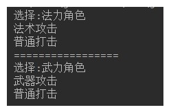

# day12_课后练习

# 接口编程代码题

## 第1题

* 语法点：接口
* 按步骤编写代码，效果如图所示：

* 编写步骤：

1. 定义接口A，普通类B实现接口A
2. A接口中，定义抽象方法showA。 
3. A接口中，定义默认方法showB。
4. B类中，重写showA方法
5. 测试类中，创建B类对象，调用showA方法，showB方法。

## 第2题

* 语法点：接口，多态
* 按步骤编写代码，效果如图所示：

* 编写步骤

1. 定义接口Universe，提供抽象方法doAnything。

2. 定义普通类Star，提供成员发光shine方法，打印“star:星星一闪一闪亮晶晶"

3. 定义普通类Sun，

   继承Star类，重写shine方法，打印"sun:光照八分钟，到达地球"

   实现Universe接口，实现doAnything，打印"sun:太阳吸引着9大行星旋转"

4. 测试类中，创建Star对象，调用shine方法

5. 测试类中，多态的方式创建Sun对象，调用doAnything方法，向下转型，调用shine方法。

## 第3题

* 模拟玩家选择角色。
* 定义接口FightAble：
  * 抽象方法：specialFight。
  * 默认方法：commonFight,方法中打印"普通打击"。
* 定义战士类：
  * 实现FightAble接口,重写方法中打印"武器攻击"。
* 定义法师类Mage：
  * 实现FightAble接口,重写方法中打印"法术攻击"。
* 定义玩家类Player：
  * 静态方法：FightAble select(String str)，根据指令选择角色。
    * 法力角色，选择法师。
    * 武力角色，选择战士。
* 代码实现，效果如图所示：

## 第4题

* 模拟工人挑苹果。
* 定义苹果类：
  * 属性：大小，颜色。
  * 提供基本的构造方法和get方法，set方法
* 定义接口CompareAble：
  * 定义默认方法compare，挑选打印较大苹果。
* 定义接口实现类CompareBig。
* 定义接口实现类CompareColor。挑选打印红色苹果。
* 定义工人类：
  * 成员方法：挑选苹果public void pickApple(CompareAble c,Apple a1,Apple a2)。
* 测试类：
  * 创建两个Worker对象。
  * 创建两个Apple对象，一个Apple（5，"青色"）,一个Apple（3，"红色"）
  * 调用工人对象的pickApple方法，分别用两种方式挑选苹果
* 代码实现，效果如图所示：

## 第5题

* 模拟接待员接待用户，根据用户id，给用户分组。

* 定义用户类：
  * 属性：用户类型，用户id
  * 提供基本的构造方法和get方法，set方法
* 定义接口Filter：
  * 提供抽象方法filterUser（User u）
* 定义实现类V1Filter，实现抽象方法，将用户设置为v1
* 定义实现类V2Filter，实现抽象方法，将用户设置为v2
* 定义实现类AFilter，实现抽象方法，将用户设置为A
* 定义接待员类Receptionist：
  * 属性：接口Filter
  * 提供基本的构造方法和get方法，set方法
  * 成员方法：接待用户方法，设置用户类型。
* 测试类：
  * 初始化15个User对象，id为1-15。
  * 创建三个接待员对象。
    * 第一个接待员，设置接待规则，将1-5号用户类型设置为v1。
    * 第二个接待员，设置接待规则，将6-10号用户类型设置为v2。
    * 第三个接待员，设置接待规则，将11-15号用户类型设置为A。
  * 遍历数组，分别用三个接待员对象，给用户分区。

* 代码实现，效果如图所示：

