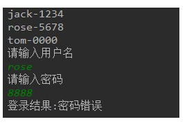
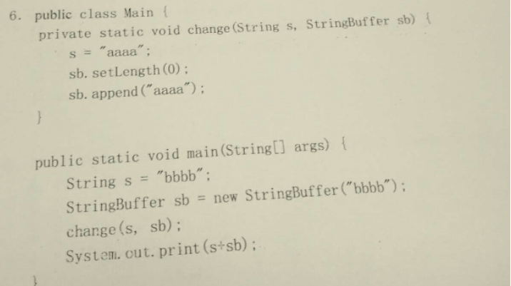
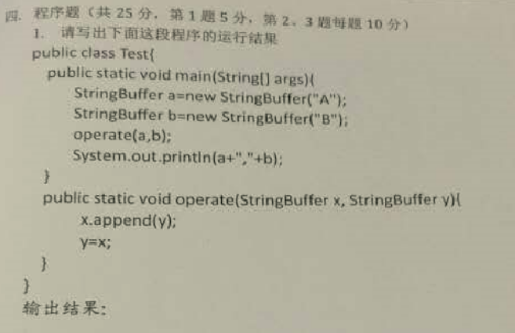
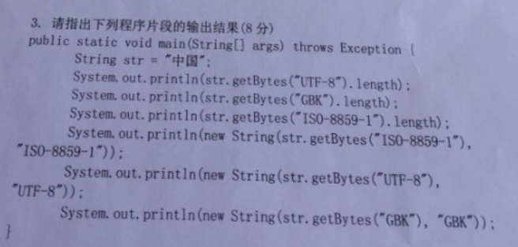

# day14_课后练习

# 代码编程题

## 第1题

* 反转键盘录入的字符串。
* 代码实现，参考效果如图所示：


```java
package com.atguigu.test01;

import java.util.Scanner;

public class Test01 {
	public static void main(String[] args) {
		Scanner input = new Scanner(System.in);
		System.out.print("请键盘输入字符串：");
		String str = input.next();
		
		StringBuilder s = new StringBuilder(str);
		str = s.reverse().toString();
		System.out.println("反转后：" + str);
		input.close();
	}
}

```


## 第2题

* 键盘录入QQ号码，验证格式的正确性。
  * 必须是5—12位数字。
  * 0不能开头。

* 代码实现，参考效果如图所示：

  

```java
package com.atguigu.test02;

import java.util.Scanner;

public class Test02 {
	public static void main(String[] args) {
		Scanner input = new Scanner(System.in);
		System.out.print("请输入qq号码：");
		String qq = input.next();
		
		System.out.print("这个qq号是否正确：");
		if(qq.matches("[1-9][0-9]{4,11}+")){
			System.out.println(true);
		}else{
			System.out.println(false);
		}
		input.close();
	}
}
```


## 第3题

* 字符串查找。
  * 键盘录入一个大字符串，再录入一个小字符串。
  * 统计小字符串在大字符串中出现的次数。

* 代码实现，效果如图所示：

  

```java
package com.atguigu.test03;

import java.util.Scanner;

public class Test03 {
	public static void main(String[] args) {
		Scanner input = new Scanner(System.in);
		System.out.print("请输入大字符串：");
		String big = input.next();
		
		System.out.print("请输入小字符串：");
		String small = input.next();
		
		int index;
		int count = 0;
		while((index = big.indexOf(small))!=-1){
			big = big.substring(index+small.length());
			count++;
		}
		System.out.println(small + "出现了" +count + "次");
		
		input.close();
	}
}

```


## 第4题

* 替换某字符串中的某字符串。

  * 键盘录入一个srcStr字符串，再录入一个delStr字符串。
  * 删除该字srcStr符串中的所有delStr字符串。
  * 并且统计delStr字符串在srcStr中出现的次数

* 代码实现，部分效果如图所示：

  

```java
package com.atguigu.test04;

import java.util.Scanner;

public class Test04 {
	public static void main(String[] args) {
		Scanner input = new Scanner(System.in);
		
		System.out.print("请输入原字符串：");
		String src = input.next();
		
		System.out.print("请输入要删除的字符串：");
		String del = input.next();
		
		String result = src.replaceAll(del, "");
		
		int count = (src.length() - result.length())/del.length();
		System.out.println(del+"共出现了：" + count + "次");
		System.out.println("删除" + del + "后字符串：" + result);
		
		input.close();
	}
}

```


## 第5题

* 生成一个随机100内小数，转换为保留两位小数的字符串，不考虑四舍五入的问题。

* 代码实现，效果如图所示：

  

```java
package com.atguigu.test05;

public class Test05 {
	public static void main(String[] args) {
		double num = Math.random() * 100;
		System.out.println("随机数为：" +num);
		String str = num + "";
		str = str.substring(0,str.indexOf(".") + 3);
		System.out.println("截取小数点后两位后为：" + str);
	}
}
```


## 第6题

* 筛选字符串。

  * 定义数组，存入多个字符串。
  * 删除长度大于5的字符串，打印删除后的数组。

* 代码实现，效果如图所示：

  

```java
package com.atguigu.test06;

import java.util.Arrays;

public class Test06 {
	public static void main(String[] args) {
		String[] arr = {"helloworld","java","chai","atguigu","lin","yan","Iloveyou"};
		
		System.out.println("原字符串：");
		System.out.println( Arrays.toString(arr));
		int index = 0;
		while(index < arr.length){
			if(arr[index].length()>5){
				System.arraycopy(arr, index+1, arr, index, arr.length-index-1);
				arr = Arrays.copyOf(arr, arr.length-1);
			}else{
				index++;
			}
		}
		System.out.println("删除后：");
		System.out.println(Arrays.toString(arr));
	}
}

```


## 第7题

* 判断回文字符串。如果一个字符串，从前向后读和从后向前读，都是一个字符串，称为回文串，比如mom，dad，noon。

* 代码实现，效果如图所示：

  

```java
package com.atguigu.test07;

import org.junit.Test;

public class Test07 {
	@Test
	public void test01() {
		String str = "noon";
		System.out.println(str);
		StringBuilder s = new StringBuilder(str);
		String string = s.reverse().toString();
		System.out.print("回文数：");
		if(str.equals(string)){
			System.out.println(true);
		}else{
			System.out.println(false);
		}
	}

	@Test
	public void test02() {
		String str = "noon";
		System.out.println(str);
		char[] arr = str.toCharArray();
		boolean flag = true;
		for (int left = 0,right=arr.length-1; left <=right; left++,right--) {
			if(arr[left] != arr[right]){
				flag = false;
				break;
			}
		}
		System.out.print("回文数：");
		if(flag){
			System.out.println(true);
		}else{
			System.out.println(false);
		}
	}
}

```


## 第8题

* 校验密码是否合法。

  * 必须至少9个字符。
  * 必须至少2个大写字符。
  * 必须包含小写字母和数字。

* 代码实现，效果如图所示：

  

```java
package com.atguigu.test08;

import org.junit.Test;

public class Test08 {
	@Test
	public void test01(){
		String password = "at1Gui2Gu";
		
		char[] arr = password.toCharArray();
		int upCount = 0;
		int numCount = 0;
		int lowerCount = 0;
		for (int i = 0; i < arr.length; i++) {
			if(arr[i]>='A' && arr[i]<='Z'){
				upCount++;
			}else if(arr[i]>='a' && arr[i]<='z'){
				lowerCount++;
			}else if(arr[i]>='0' && arr[i]<='9'){
				numCount++;
			}
		}
		System.out.print(password+"是否合法：");
		if(password.length() >=9 && upCount>=2 && numCount!=0 && lowerCount!=0){
			System.out.println(true);
		}else{
			System.out.println(false);
		}
		
	}
}

```


## 第9题

* 模拟用户登录。
  * 定义用户类，属性为用户名和密码。
  * 使用数组存储多个用户对象。
  * 录入用户和密码，对比用户信息，匹配成功登录成功，否则登录失败。
  * 登录失败时，当用户名错误，提示没有该用户。
  * 登录失败时，当密码错误时，提示密码有误。
* 代码实现，效果如图所示：



```java
package com.atguigu.test09;

import java.util.Scanner;

public class Test09 {
	public static void main(String[] args) {
		User[] all = new User[3];
		all[0] = new User("atguigu","123");
		all[1] = new User("chailinyan","8888");
		all[2] = new User("java","6666");
		for (int i = 0; i < all.length; i++) {
			System.out.println(all[i]);
		}
		
		Scanner input =new Scanner(System.in);
		System.out.print("请输入用户名：");
		String username = input.next();
		System.out.print("请输入密码：");
		String password = input.next();
		
		boolean flag = false;
		for (int i = 0; i < all.length; i++) {
			if(all[i].getUsername().equals(username) && all[i].getPassword().equals(password)){
				flag = true;
				break;
			}
		}
		System.out.println("登录结果：" +flag);
		input.close();
	}
}
class User{
	private String username;
	private String password;
	public User(String username, String password) {
		super();
		this.username = username;
		this.password = password;
	}
	public User() {
		super();
	}
	public String getUsername() {
		return username;
	}
	public void setUsername(String username) {
		this.username = username;
	}
	public String getPassword() {
		return password;
	}
	public void setPassword(String password) {
		this.password = password;
	}
	@Override
	public String toString() {
		return username + "-" + password;
	}
	
}
```


## 第10题

* 定义Handleable接口，具备一个处理字符串数字的抽象方法方法String handleString(String num);
  * 处理方式1：取整数部分。
  * 处理方式2：保留指定位小数，四舍五入。
* 代码实现，效果如图所示：


开发提示：

* 匿名内部类的方式，调用所有抽象方法。

```java
package com.atguigu.test10;

public interface Handleable {
	String handleString(String num);
}

```

```java
package com.atguigu.test10;

import org.junit.Test;

public class Test01 {
	@Test
	public void test01(){
		String str = "23.23456789";
		System.out.println("原数字：" + str);
		/*
		str = new Handleable() {
			@Override
			public String handleString(String num) {
				//查找小数点.位置
				int index = num.indexOf(".");
				if(index != -1){
					num = num.substring(0, num.indexOf("."));
				}
				return num;
			}
		}.handleString(str);*/
        
        Handleable h = new Handleable() {
			@Override
			public String handleString(String num) {
				//查找小数点.位置
				int index = num.indexOf(".");
				if(index != -1){
					num = num.substring(0, num.indexOf("."));
				}
				return num;
			}
		};
        str = h.handleString(str);
		
		System.out.println("取整后：" + str);
	}
	@Test
	public void test03(){
		String str = "23.99996789";
		System.out.println("原数字：" + str);
		
		final int wei = 4;//截取到小数点后4位，四舍五入
		str = new Handleable() {
			@Override
			public String handleString(String num) {
				BigDecimal big = new BigDecimal(num);
				BigDecimal b = new BigDecimal("1");
				BigDecimal shang = big.divide(b, wei, BigDecimal.ROUND_HALF_UP);
				return shang.toString();
			}
		}.handleString(str);
		System.out.println(str);
	}

```

## 第11题


案例：有一个字符串String abc = “342567891”，请写程序将字符串abc进行升序，可以使用JDK API中的现有的功能方法。

```java
package com.atguigu.test11;

import java.util.Arrays;

public class Test11 {
	public static void main(String[] args) {
		String abc = "342567891";
		char[] arr = abc.toCharArray();
		Arrays.sort(arr);
		abc = new String(arr);
		System.out.println(abc);
	}
}

```


## 第12题

案例：

​	已知一个字符串String str = "1、 hello 2. world 3. java 4.String 5. haha 6、HELLO";

​	要求统计出现次数最多的字母及其出现的次数。不区分大小写。

```java
package com.atguigu.test12;

import org.junit.Test;

public class Test12 {
	@Test
	public void test1(){
		String str = "1、 hellao 2. world 3. java 4.String 5. haha 6、HELLO";
        
		//把字符串转为小写，因为不区分大小写，方便统计
		str = str.toLowerCase();
        //把里面的非字母去掉
        str = str.replaceAll("[^a-z]","");
		//转为字符数组
		char[] arr = str.toCharArray();
		//统计每个字母出现次数
		int[] counts = new int[26];//记录26个字母的次数
        /*
        counts[0]存'a'的次数   'a'=97  97-97->0
        counts[1]存'b'的次数   'b'=98  98-97->1
        */
		for (int i = 0; i < arr.length; i++) {
			counts[arr[i]-97]++;
		}
		
		//找最大值
		int max = counts[0];
		for (int i = 1; i < counts.length; i++) {
			if(max < counts[i]){
				max = counts[i];
			}
		}
		//打印最大值和字母
		for (int i = 0; i < counts.length; i++) {
			if(counts[i] == max){
                //i=0   'a'字母
                //i=1   'b'字母
				System.out.println(((char)(i+97)) + "出现了" + max + "次");
			}
		}
	}
	
}
```


## 第13题

案例：已知字符串String str = "1.hello2.world3.java4.string";要求拆分出每一个单词，并遍历显示

```java
package com.atguigu.test13;

public class Test13 {
	public static void main(String[] args) {
		String str = "1.hello2.world3.java4.string";
		//把开头的1.去掉
        str = str.replaceAll("^\\d\\.","");
		//按照数字.的格式进行拆分
		String[] split = str.split("\\d\\.");
		for (int i = 0; i < split.length; i++) {
			System.out.println(split[i]);
		}
	}
}

```


# 代码阅读题

## 第14题

```java
	public static void main(String[] args) {
		String str = new String("world");
		char[] ch = new char[]{'h','e','l','l','o'};
		change(str,ch);
		System.out.println(str);
		System.out.println(String.valueOf(ch));
	}
	public static void change(String str, char[] arr){
		str = "change";
		arr[0] = 'a';
		arr[1] = 'b';
		arr[2] = 'c';
		arr[3] = 'd';
		arr[4] = 'e';
	}
```

```java
package com.atguigu.test14;

public class Test14 {
	public static void main(String[] args) {
		String str = new String("world");
		char[] ch = new char[]{'h','e','l','l','o'};
		change(str,ch);
		System.out.println(str);//world
		System.out.println(String.valueOf(ch));//abcde
	}
	/*
	 * 方法的参数：引用数据类型传递的是对象地址
	 * 但是字符串对象不可变
	 */
	public static void change(String str, char[] arr){
		str = "change";
		arr[0] = 'a';
		arr[1] = 'b';
		arr[2] = 'c';
		arr[3] = 'd';
		arr[4] = 'e';
	}
}
```


## 第15题

```java
public class Test {
	int a;
	int b;
    String str;
	public void f(){
		a = 0;
		b = 0;
        str = "hello";
		int[] c = {0};
		g(b,c);
		System.out.println(a + " " + b + " " + c[0] + "," + str);
	}
	public void g(int b, int[] c,String s){
		a = 1;
		b = 1;
		c[0] = 1;
        s = "world";
	}
	public static void main(String[] args) {
		Test t = new Test();
		t.f();
	}
}
```

```java
package com.atguigu.test17;

public class Test {
	int a;
	int b;
    String str;
	public void f(){
		a = 0;//成员变量  this.a--> t.a = 0
		b = 0;//成员变量 this.b --> t.b = 0
        str = "hello";//成员变量  this.str -> t.str = "hello"
		int[] c = {0}; //f()方法的局部变量，是一个数组
		g(b,c,str);//this.g(b,c,str);
		System.out.println(a + " " + b + " " + c[0] + "," + str);//101hello
	}
	/*
	 * 形参基本数据类型：传递数据值
	 * 形参引用数据类型：传递地址值，但是字符串对象不可变
	 */
	public void g(int b, int[] c,String s){
		a = 1;//修改成员变量  this.a -> t.a = 1
		b = 1;//修改形参b，局部变量，(1)和成员变量b无关，(2)因为b是基本数据类型，所以和实参b也无关
		c[0] = 1;//c是数组，是引用数据类型，修改元素会影响实参
        s = "world";//s是局部变量， 但是字符串对象不可变，和实参无关
	}
	public static void main(String[] args) {
		Test t = new Test();//t.a = 0, t.b = 0,  t.str = null
		t.f();
	}
}
```


## 第16题



```java
package com.atguigu.test18;

public class Test18 {
	/*
	 * 形参是引用数据类型，实参传递的是地址值
	 */
	private static void change(String s,StringBuffer sb){
		s = "aaaa";//字符串对象是不可变，一旦修改，就是新对象
		sb.setLength(0);//先把sb里面的内容给清空了
		sb.append("aaaa");//再拼接aaaa
	}
	
	
	public static void main(String[] args) {
		String s = "bbbb";
		StringBuffer sb = new StringBuffer("bbbb");
		change(s,sb);
		System.out.println(s+sb);//bbbbaaaa
	}
}

```


## 第17题


```java
package com.atguigu.test19;

public class Example {
	String str = new String("good");
	char[] ch = {'a','b','c'};
	
	public static void main(String[] args) {
		Example ex = new Example();//ex.str = good   ex.ch=  abc
		
		ex.change(ex.str,  ex.ch);
		System.out.print(ex.str + " and ");//good + and + gbc
		System.out.print(ex.ch);
	}
	
	public void change(String str, char[] ch){//形参和实参指向同一个数组
		str = "test ok";//字符串对象不可变，形参的修改，和实参无关
		ch[0] = 'g';//形参对元素的修改，直接修改的是实参元素的值
	}
}

```


## 第18题



```java
package com.atguigu.test20;

public class Test20 {
	public static void main(String[] args) {
		StringBuffer a = new StringBuffer("A");
		StringBuffer b = new StringBuffer("B");

		operate(a, b);

		System.out.println(a + "," + b);// AB , B
	}

	public static void operate(StringBuffer x, StringBuffer y) {
		x.append(y);// 等价于a拼接b x = AB
		y = x;// 一旦修改形参的地址值，那么就和实参无关了，即让形参重新指向新的对象了
        y.append('x');
	}
}

```


## 第19题


```java
package com.atguigu.test21;

class TEXT{
	public int num;
	public String str;
	
	public TEXT(int num, String str){
		this.num = num;
		this.str = str;
	}
}
public class Class4 {
    //tIn是传对象的地址，修改形参的属性，会影响实参
    //intIn是传数据，基本数据类型的形参修改和实参无关
    //Integer和String对象不可变
	public static void f1(TEXT tIn, int intIn, Integer integerIn, String strIn){
		tIn.num =200;
		tIn.str = "bcd";//形参和实参指向的是同一个TEXT的对象，修改了属性，就相当于修改实参对象的属性
		intIn = 200;//基本数据类型的形参是实参的“副本”，无论怎么修改和实参都没关系
		integerIn = 200;//Integer对象和String对象一样都是不可变，一旦修改都是新对象，和实参无关
		strIn = "bcd";
	}
	public static void main(String[] args) {
		TEXT tIn = new TEXT(100, "abc");//tIn.num = 100, tIn.str="abc"
		int intIn = 100;
		Integer integerIn = 100;
		String strIn = "abc";
		
		f1(tIn,intIn,integerIn,strIn);
		
		System.out.println(tIn.num + tIn.str + intIn + integerIn + strIn);
		//200 + bcd + 100 + 100 + abc
	}
}
```


## 第20题



```java
package com.atguigu.test22;

public class Test22 {
	/*
	 * GBK，UTF-8，ISO8859-1所有的字符编码都向下兼容ASCII码
	 */
	public static void main(String[] args) throws Exception {
		String str = "中国";
		System.out.println(str.getBytes("ISO8859-1").length);// 2
		// ISO8859-1把所有的字符都当做一个byte处理，处理不了多个字节
		System.out.println(str.getBytes("GBK").length);// 4 每一个中文都是对应2个字节
		System.out.println(str.getBytes("UTF-8").length);// 6 常规的中文都是3个字节

		/*
		 * 不乱码：（1）保证编码与解码的字符集名称一样（2）不缺字节
		 */
		System.out.println(new String(str.getBytes("ISO8859-1"), "ISO8859-1"));// 乱码
		System.out.println(new String(str.getBytes("GBK"), "GBK"));// 中国
		System.out.println(new String(str.getBytes("UTF-8"), "UTF-8"));// 中国
	}
}
```

