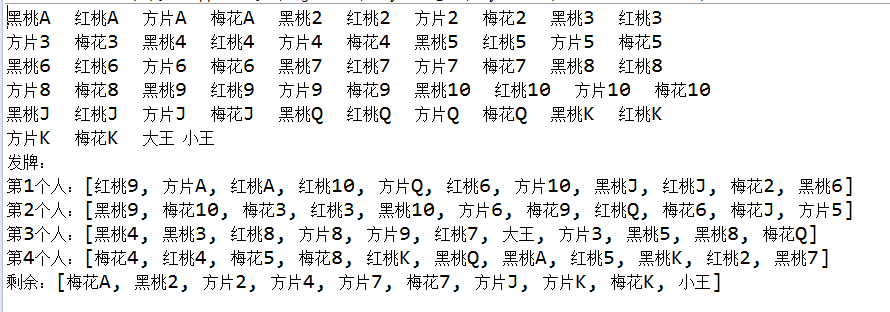
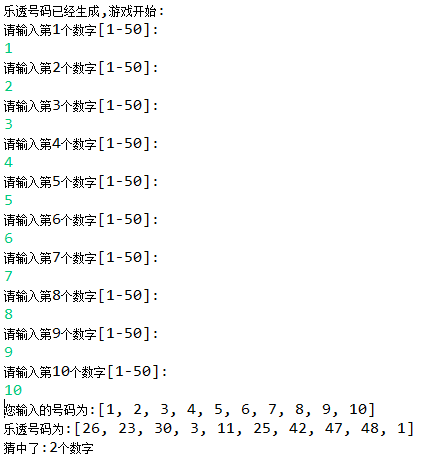
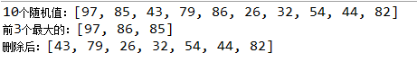
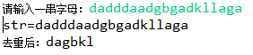
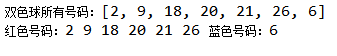

# day16_课后练习题

## 第1题

案例：

​	1、用一个String[]数组存点数

​	2、用一个String[]数组存花色

​	3、用一个String[]数组存大王、小王

​	4、用上面的数组，生成一副扑克牌

​	5、遍历显示全副扑克牌

​	6、模拟给4个人随机发牌，每个人11张牌

​	7、显示每个人的牌和剩余的牌

​	效果如下：



```java
package com.atguigu.test01;

import java.util.ArrayList;
import java.util.Random;

public class Test01 {
	public static void main(String[] args) {
		String[] dian = {"A","2","3","4","5","6","7","8","9","10","J","Q","K"};
		String[] hua = {"黑桃","红桃","方片","梅花"};
		String[] wang = {"大王","小王"};
		
		ArrayList<String> list = new ArrayList<String>();
		for (int i = 0; i < dian.length; i++) {
			for (int j = 0; j < hua.length; j++) {
				list.add(hua[j]+dian[i]);
			}
		}
		for (int i = 0; i < wang.length; i++) {
			list.add(wang[i]);
		}
		
		for (int i = 0; i < list.size(); i++) {
			System.out.print(list.get(i)+"  ");
			if((i+1)%10==0){
				System.out.println();
			}
		}
		System.out.println();
		System.out.println("发牌：");
		
		Random rand = new Random();
		ArrayList<String> one = new ArrayList<String>();
		for (int i = 0; i < 11; i++) {
			one.add(list.remove(rand.nextInt(list.size())));
		}
		
		ArrayList<String> two = new ArrayList<String>();
		for (int i = 0; i < 11; i++) {
			two.add(list.remove(rand.nextInt(list.size())));
		}
		
		ArrayList<String> three = new ArrayList<String>();
		for (int i = 0; i < 11; i++) {
			three.add(list.remove(rand.nextInt(list.size())));
		}
		
		ArrayList<String> four = new ArrayList<String>();
		for (int i = 0; i < 11; i++) {
			four.add(list.remove(rand.nextInt(list.size())));
		}
		
		System.out.println("第1个人：" + one);
		System.out.println("第2个人：" + two);
		System.out.println("第3个人：" + three);
		System.out.println("第4个人：" + four);
		System.out.println("剩余：" + list);
	}
}

```


## 第2题

* 模拟乐透号码。

  * 随机生成10个号码放到集合中，范围1-50，作为乐透号码。不能重复。
  * 键盘录入10个整数放到集合中，范围1-50，不能重复。
  * 录入的整数与乐透号码对比，统计猜中了几个。

* 代码实现，效果如图所示：

  

开发提示：

* 当使用集合时，可以通过contains方法，判断某集合中是否包含某元素

```java
package com.atguigu.test02;

import java.util.ArrayList;
import java.util.Random;
import java.util.Scanner;

public class Test02 {
    public static void main(String[] args) {
        ArrayList<Integer> lotNumList = lotNum();
        System.out.println("乐透号码已经生成,游戏开始:");
        ArrayList<Integer> inputList = inputNum();
        System.out.println("您输入的号码为:"+inputList);
        int count  =  countNum(inputList , lotNumList);
        System.out.println("乐透号码为:"+lotNumList);
        System.out.println("猜中了:"+count+"个数字");
    }

	public static int countNum(ArrayList<Integer> inputList, ArrayList<Integer> lotNumList) {
        int  count  = 0;
        for (int i = 0; i < inputList.size(); i++) {
            Object num  = inputList.get(i);
            if (lotNumList.contains(num)){
                count++;
            }
        }
        return count ;
    }
	
    public static ArrayList<Integer> inputNum(){
        ArrayList<Integer> list = new ArrayList<Integer>();
        Scanner sc = new Scanner(System.in);
        for (int i = 0; i < 10; ) {
            System.out.println("请输入第"+(i+1)+"个数字[1-50]:");
            int num  = sc.nextInt();

            if (num >=1 && num<=50 && !list.contains(num)){
                list.add(num);
                i++;
            }else{
                System.out.println(num+"超过[1-50]范围或重复录入，数字无效，请重新输入");
            }
        }
        sc.close();
        return list;
    }
	
    public static ArrayList<Integer> lotNum(){
        ArrayList<Integer> list = new ArrayList<Integer>();
        Random r = new Random();
        for (int i = 0; i < 10; ) {
            int num  = r.nextInt(50) + 1;

            if (!list.contains(num)){
                list.add(num);
                i++;
            }
        }
        return list;
    }
}
```


## 第3题

案例：

​	1、随机生成10个[1,100]之间的整数，放到List集合中，遍历显示

​	2、找出前3名最大值，删除它们，注意可能重复

​	3、显示删除后的结果

​	效果如下：



```java
package com.atguigu.test03;

import java.util.ArrayList;
import java.util.Random;

public class Test03 {
	public static void main(String[] args) {
		ArrayList<Integer> nums = getNum();
		System.out.println("10个随机值：" + nums);
		
		ArrayList<Integer> maxList = getTop3(nums);
		System.out.println("前3个最大的：" + maxList);
		
		System.out.println("删除后：" + nums);
	}

	public static ArrayList<Integer> getNum() {
		ArrayList<Integer> list = new ArrayList<Integer>();
		Random r = new Random();
		for (int i = 0; i < 10; i++) {
			int n = r.nextInt(100) + 1;
			list.add(n);
		}
		return list;
	}
	
	public static ArrayList<Integer> getTop3(ArrayList<Integer> list){
		ArrayList<Integer> maxList = new ArrayList<Integer>();
		for (int i = 0; i < 3; i++) {
			Integer max = (Integer) list.get(0);
			for (int j = 0; j < list.size(); j++) {
				Integer num = (Integer) list.get(j);
				if(max < num){
					max = num;
				}
				
			}
			maxList.add(max);
			
			while(list.contains(max)){
				list.remove(max);
			}
		}
		
		return maxList;
	}
	
}

```


## 第4题

* 随机生成30个数，范围2-100，获取其中的质数。
* 代码实现，效果如图所示：


开发提示：

* 质数：在一个大于1的整数中，除了1和此整数自身外，没法被其他自然数整除的数。

```java
package com.atguigu.test04;

import java.util.ArrayList;
import java.util.Random;

public class Test04 {
	public static void main(String[] args) {
		ArrayList<Integer> ranNum = getRanNum();
		System.out.println("随机数为:");
		System.out.println(ranNum);
		System.out.println("其中的质数为:");
		ArrayList<Integer> pNum = getPNum(ranNum);
		System.out.println(pNum);
	}

	public static ArrayList<Integer> getPNum(ArrayList<Integer> ranNum) {
		ArrayList<Integer> list = new ArrayList<Integer>();

		for (int i = 0; i < ranNum.size(); i++) {
			Integer integer = (Integer) ranNum.get(i);
			if (isP(integer)) {
				list.add(integer);
			}
		}
		return list;
	}

	public static ArrayList<Integer> getRanNum() {
		Random random = new Random();
		ArrayList<Integer> list = new ArrayList<Integer>();
		for (int i = 0; i < 30; i++) {
			list.add(random.nextInt(99) + 2);
		}
		return list;
	}

	public static boolean isP(int n) {
		boolean isPrime = true;
		for (int i = 2; i < n; i++) {
			if (n % i == 0) {
				isPrime = false;
				break;
			}
		}
		return isPrime;
	}
}

```


## 第5题

案例：

​	1、请定义方法public static int listTest(Collection list,String s)统计集合中指定元素出现的次数

​	2、创建集合，集合存放随机生成的30个小写字母

​	3、用listTest统计，某些元素的出现次数

​	4、效果如下

```java
package com.atguigu.test05;

import java.util.ArrayList;
import java.util.Collection;
import java.util.Random;

public class Test05 {
	public static void main(String[] args) {
		ArrayList<String> list = new ArrayList<String>();
		Random rand = new Random();
		for (int i = 0; i < 30; i++) {
			list.add((char)(rand.nextInt(26)+97)+"");
		}
		System.out.println(list);
		System.out.println("a:"+listTest(list, "a"));	
		System.out.println("b:"+listTest(list, "b"));	
		System.out.println("c:"+listTest(list, "c"));
		System.out.println("x:"+listTest(list, "x"));	
	}

	public static int listTest(Collection<String> list, String string) {
		int count = 0;
		for (String object : list) {
			if(string.equals(object)){
				count++;
			}
		}
		return count;
	}
}

```


## 第6题

案例：键盘录入一个字符串，去掉其中重复字符，打印出不同的那些字符，必须保证顺序。例如输入：aaaabbbcccddd，打印结果为：abcd。效果如图：



提示：LinkedHashSet的使用

```java
package com.atguigu.test06;

import java.util.LinkedHashSet;
import java.util.Scanner;

public class Test06 {
	public static void main(String[] args) {
		Scanner input = new Scanner(System.in);
		
		System.out.print("请输入一串字母：");
		String str = input.nextLine();
		System.out.println("str=" + str);
		
		LinkedHashSet<Character> set = new LinkedHashSet<Character>();
		for (int i = 0; i < str.length(); i++) {
			set.add(str.charAt(i));
		}
		
		System.out.print("去重后：");
		String result = "";
		for (Character object : set) {
			result += object;
		}
		System.out.println(result);
	}
}

```


## 第7题

案例：双色球规则：双色球每注投注号码由6个红色球号码和1个蓝色球号码组成。红色球号码从1—33中选择；蓝色球号码从1—16中选择；请随机生成一注双色球号码。（要求同色号码不重复）



开发提示：可以使用TreeSet和ArrayList结合

```java
package com.atguigu.test07;

import java.util.ArrayList;
import java.util.Random;
import java.util.TreeSet;

public class Test07 {
	public static void main(String[] args) {
		TreeSet<Integer> red = new TreeSet<Integer>();
		Random rand = new Random();
		while(red.size()<6){
			red.add(rand.nextInt(33)+1);
		}
		ArrayList<Integer> list = new ArrayList<Integer>();
		list.addAll(red);
		list.add(rand.nextInt(16)+1);//蓝色号码
		System.out.println("双色球所有号码：" + list);
		
		System.out.print("红色号码：");
		for (int i = 0; i < list.size()-1; i++) {
			System.out.print(list.get(i)+" ");
		}
		System.out.println("蓝色号码：" + list.get(list.size()-1));
	}
}

```


## 第8题

案例：有如下四个学生的成绩：


（1）用Comparable接口对下列四位同学的成绩做降序排序，如果成绩一样，那在成绩排序的基础上按照年龄由小到大排序。

（2）用Comparator实现按照姓名排序

（3）效果如下


```java
package com.atguigu.test08;

import java.util.Comparator;
import java.util.TreeSet;

public class Test08 {
	public static void main(String[] args) {
		System.out.println("按照成绩和年龄排序：");
		TreeSet<Student> set = new TreeSet<Student>();
		set.add(new Student("liusan",20,90.0));
		set.add(new Student("lisi",22,90.0));
		set.add(new Student("wangwu",20,99.0));
		set.add(new Student("sunliu",22,100.0));
		for (Object object : set) {
			System.out.println(object);
		}
		
		System.out.println("按照姓名排序：");
		TreeSet<Student> all = new TreeSet<Student>(new Comparator<Student>() {

			@Override
			public int compare(Student o1, Student o2) {
				return o1.getName().compareTo(o2.getName());
			}
		});
		for (Student object : set) {
			all.add(object);
		}
		for (Student object : all) {
			System.out.println(object);
		}
	}
}
class Student implements Comparable<Student>{
	private String name;
	private int age;
	private double score;
	public Student(String name, int age, double score) {
		super();
		this.name = name;
		this.age = age;
		this.score = score;
	}
	public Student() {
		super();
	}
	public String getName() {
		return name;
	}
	public void setName(String name) {
		this.name = name;
	}
	public int getAge() {
		return age;
	}
	public void setAge(int age) {
		this.age = age;
	}
	public double getScore() {
		return score;
	}
	public void setScore(double score) {
		this.score = score;
	}
	@Override
	public String toString() {
		return "Student [name=" + name + ", age=" + age + ", score=" + score + "]";
	}
	@Override
	public int compareTo(Student o) {
		if(this.getScore()>o.getScore()){
			return -1;
		}else if(this.getScore() < o.getScore()){
			return 1;
		}
		return this.getAge() - o.getAge();
	}
	
}
```

