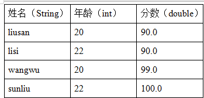
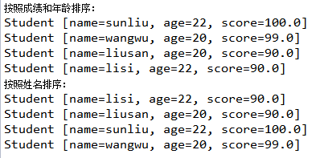
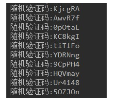
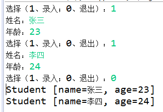

# day18_课后练习

# 泛型练习题

## 第1题

案例：有如下四个学生的成绩：



（1）用Comparable接口对下列四位同学的成绩做降序排序，如果成绩一样，那在成绩排序的基础上按照年龄由小到大排序。请正确指定泛型

（2）用Comparator实现按照姓名排序，请正确指定泛型

（3）效果如下



```java
package com.atguigu.test01;

import java.util.Comparator;
import java.util.TreeSet;

public class Test01 {
	public static void main(String[] args) {
		System.out.println("按照成绩和年龄排序：");
		TreeSet<Student> set = new TreeSet<>();
		set.add(new Student("liusan",20,90.0));
		set.add(new Student("lisi",22,90.0));
		set.add(new Student("wangwu",20,99.0));
		set.add(new Student("sunliu",22,100.0));
		for (Student student : set) {
			System.out.println(student);
		}
		
		System.out.println("按照姓名排序：");
		TreeSet<Student> all = new TreeSet<>(new Comparator<Student>() {

			@Override
			public int compare(Student o1, Student o2) {
				return o1.getName().compareTo(o2.getName());
			}
		});
		all.addAll(set);
		
		for (Student student : all) {
			System.out.println(student);
		}
	}
}
class Student implements Comparable<Student>{
	private String name;
	private int age;
	private double score;
	public Student(String name, int age, double score) {
		super();
		this.name = name;
		this.age = age;
		this.score = score;
	}
	public Student() {
		super();
	}
	public String getName() {
		return name;
	}
	public void setName(String name) {
		this.name = name;
	}
	public int getAge() {
		return age;
	}
	public void setAge(int age) {
		this.age = age;
	}
	public double getScore() {
		return score;
	}
	public void setScore(double score) {
		this.score = score;
	}
	@Override
	public String toString() {
		return "Student [name=" + name + ", age=" + age + ", score=" + score + "]";
	}
	@Override
	public int compareTo(Student stu) {
		if(this.getScore()>stu.getScore()){
			return -1;
		}else if(this.getScore() < stu.getScore()){
			return 1;
		}
		return this.getAge() - stu.getAge();
	}
	
}
```

## 第2题

案例：

​	1、声明一个坐标类Coordinate<T>，它有两个属性：x,y，都为T类型

​	2、在测试类中，创建两个不同的坐标类对象，分别指定T类型为String和Double，并为x,y赋值，打印对象

```java
package com.atguigu.test02;

public class Test02 {
	public static void main(String[] args) {
		Coordinate<Double> c1 = new Coordinate<>(123.5, 30.0);
		System.out.println(c1);
		
		Coordinate<String> c2 = new Coordinate<>("东经123.5°", "北纬30°");
		System.out.println(c2);
	}
}
class Coordinate<T>{
	private T x;
	private T y;
	public Coordinate(T x, T y) {
		super();
		this.x = x;
		this.y = y;
	}
	public Coordinate() {
		super();
	}
	public T getX() {
		return x;
	}
	public void setX(T x) {
		this.x = x;
	}
	public T getY() {
		return y;
	}
	public void setY(T y) {
		this.y = y;
	}
	@Override
	public String toString() {
		return "Coordinate [x=" + x + ", y=" + y + "]";
	}
	
}
```


## 第3题

案例：

​	1、声明泛型方法，可以实现任意引用类型数组指定位置元素交换。

​	**public static** <T> **void** method( T[] arr,**int** a,**int** b)

​	2、在主方法中调用测试

```java
package com.atguigu.test03;

public class Test03 {
	public static void main(String[] args) {
		Integer[] arr = {1,2,3,4,5,6};
        method(arr,0,1);
        for (Integer num : arr) {
			System.out.println(num);
		}
	}
	public static <T> void method( T[] arr,int a,int b){
		 //元素互换
        T temp = arr[a];
        arr[a] = arr[b];
        arr[b] = temp;
	}
}

```


## 第4题

案例：

​	1、声明泛型方法，可以接收一个任意引用类型的数组，并反转数组中的所有元素

​	public static <T> void reverse(T[] arr)

​	2、在主方法中调用测试

```java
package com.atguigu.test04;

import java.util.Arrays;

public class Test04 {
	public static void main(String[] args) {
		Integer[] arr = {1,2,3,4,5,6};
		reverse(arr);
		System.out.println(Arrays.toString(arr));
	}
	public static <T> void reverse(T[] arr){
		for (int i = 0; i < arr.length/2; i++) {
			T temp = arr[i];
			arr[i] = arr[arr.length-1-i];
			arr[arr.length-1-i] = temp;
		}
	}
}

```


## 第5题

案例：

​	1、声明泛型方法，可以给任意对象数组按照元素的自然排序实现从小到大排序，用冒泡排序实现

​	public static <T> void sort(T[] arr)

​	2、声明泛型方法，可以给任意对象数组按照指定的比较器实现从小到大排序，用冒泡排序实现

​	public static <T> void sort(T[] arr, Comparator<? super T> c)

```java
package com.atguigu.test05;

import java.util.Arrays;
import java.util.Comparator;

public class Test05 {
	public static void main(String[] args) {
		Integer[] arr = {2,4,7,1,3};
		sort(arr);
		System.out.println(Arrays.toString(arr));
		
		String[] all = {"hello","Hello","Chai","chai"};
		sort(all,new Comparator<String>() {

			@Override
			public int compare(String o1, String o2) {
				return o1.compareToIgnoreCase(o2);
			}
		});
		System.out.println(Arrays.toString(all));
	}
	public static <T extends Comparable<T>> void sort(T[] arr){
		for (int i = 1; i < arr.length; i++) {
			for (int j = 0; j < arr.length-i; j++) {
				if(arr[j].compareTo(arr[j+1])>0){
					T temp = arr[j];
					arr[j] = arr[j+1];
					arr[j+1] = temp;
				}
			}
		}
	}
	public static <T> void sort(T[] arr, Comparator<? super T> c){
		for (int i = 1; i < arr.length; i++) {
			for (int j = 0; j < arr.length-i; j++) {
				if(c.compare(arr[j], arr[j+1])>0){
					T temp = arr[j];
					arr[j] = arr[j+1];
					arr[j+1] = temp;
				}
			}
		}
	}
}

```

# 集合练习题

## 第1题

* 随机验证码。

  * 随机生成十组六位字符组成的验证码。
  * 验证码由大小写字母、数字字符组成。

* 代码实现，效果如图所示：

  

  

* 开发提示：

  * 使用字符数组保存原始字符，利用Random类生成随机索引。
  * 将十组验证码放到集合中
  * 用Iterator迭代器遍历集合

```java
package com.atguigu.test01;

import java.util.Collection;
import java.util.ArrayList;
import java.util.Iterator;
import java.util.Random;

public class Test01 {
	@SuppressWarnings("all")
	public static void main(String[] args) {
		char[] arr = new char[26+26+10];
		
		//使用字符数组保存原始字符
		for (int i = 0; i < arr.length; i++) {
			if(i<10){//前10个放数字
				arr[i] = (char)(i+48);
			}else if(i<10+26){//中间26个放大写字母
				arr[i] = (char)(i+65-10);
			}else{//剩下的放小写字母
				arr[i] = (char)(i+97-10-26);
			}
		}
		
		//随机生成10组验证码
		Collection<String> list = new ArrayList<String>();
		Random rand = new Random();
		for (int i = 0; i < 10; i++) {
			String str = "";
			for (int j = 0; j < 6; j++) {
				int index = rand.nextInt(arr.length);
				str += arr[index];
			}
			list.add(str);
		}
		
		Iterator<String> iter = list.iterator();
		while(iter.hasNext()){
			System.out.println("随机验证码：" + iter.next());
		}
	}
}

```


## 第2题

* 键盘录入学生信息，保存到集合中。

  * 循环录入的方式，1：表示继续录入，0：表示结束录入。
  * 定义学生类，属性为姓名，年龄，使用学生对象保存录入数据。
  * 使用ArrayList集合，保存学生对象，录入结束后，用foreach遍历集合。

* 代码实现，效果如图所示：

  

```java
package com.atguigu.test02;

import java.util.Collection;
import java.util.ArrayList;
import java.util.Scanner;

public class Test02 {
	public static void main(String[] args) {
		Collection<Student> list = new ArrayList<Student>();
		
		Scanner input = new Scanner(System.in);
		while(true){
			System.out.print("选择（1、录入；0、退出）：");
			int select = input.nextInt();
			if(select == 0){
				break;
			}
			System.out.print("姓名：");
			String name = input.next();
			System.out.print("年龄：");
			int age = input.nextInt();
			
			Student stu = new Student(name,age);
			list.add(stu);
		}
		
		for (Student stu : list) {
			System.out.println(stu);
		}
	}
}
class Student{
	private String name;
	private int age;
	public Student(String name, int age) {
		super();
		this.name = name;
		this.age = age;
	}
	public Student() {
		super();
	}
	public String getName() {
		return name;
	}
	public void setName(String name) {
		this.name = name;
	}
	public int getAge() {
		return age;
	}
	public void setAge(int age) {
		this.age = age;
	}
	@Override
	public String toString() {
		return "Student [name=" + name + ", age=" + age + "]";
	}
	
}
```

