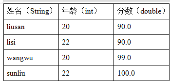
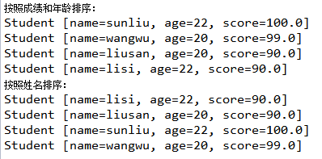
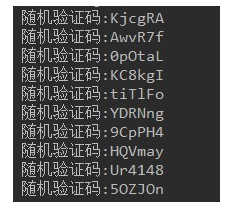
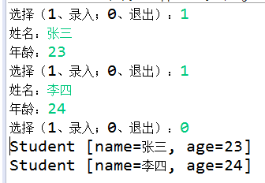

# day18_课后练习

# 泛型练习题

## 第1题

案例：有如下四个学生的成绩：

（1）用Comparable接口对下列四位同学的成绩做降序排序，如果成绩一样，那在成绩排序的基础上按照年龄由小到大排序。请正确指定泛型

（2）用Comparator实现按照姓名排序，请正确指定泛型

（3）效果如下

## 第2题

案例：

​	1、声明一个坐标类Coordinate<T>，它有两个属性：x,y，都为T类型

​	2、在测试类中，创建两个不同的坐标类对象，分别指定T类型为String和Double，并为x,y赋值，打印对象

## 第3题

案例：

​	1、声明泛型方法，可以实现任意引用类型数组指定位置元素交换。

​	**public static** <T> **void** method( T[] arr,**int** a,**int** b)

​	2、在主方法中调用测试

## 第4题

案例：

​	1、声明泛型方法，可以接收一个任意引用类型的数组，并反转数组中的所有元素

​	public static <T> void reverse(T[] arr)

​	2、在主方法中调用测试

## 第5题

案例：

​	1、声明泛型方法，可以给任意对象数组按照元素的自然排序实现从小到大排序，用冒泡排序实现

​	public static <T> void sort(T[] arr)

​	2、声明泛型方法，可以给任意对象数组按照指定的比较器实现从小到大排序，用冒泡排序实现

​	public static <T> void sort(T[] arr, Comparator<? super T> c)

# 集合练习题

## 第1题

* 随机验证码。

  * 随机生成十组六位字符组成的验证码。
  * 验证码由大小写字母、数字字符组成。

* 代码实现，效果如图所示：

  

  

* 开发提示：

  * 使用字符数组保存原始字符，利用Random类生成随机索引。
  * 将十组验证码放到集合中
  * 用Iterator迭代器遍历集合

## 第2题

* 键盘录入学生信息，保存到集合中。

  * 循环录入的方式，1：表示继续录入，0：表示结束录入。
  * 定义学生类，属性为姓名，年龄，使用学生对象保存录入数据。
  * 使用ArrayList集合，保存学生对象，录入结束后，用foreach遍历集合。

* 代码实现，效果如图所示：

  

