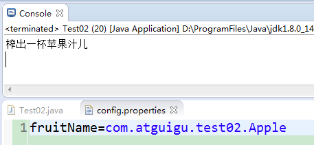
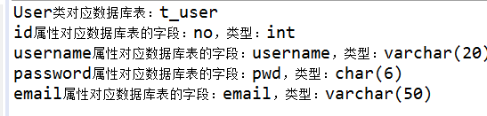

# day23_课后练习

## 第1题

案例：用反射获取某个类的信息，并用反射使用某个类

开发提示：

​	1、声明一个类：com.atguigu.test01.demo.AtguiguDemo，

​	（1）包含静态变量：学校school（显式初始化为"尚硅谷"）

​	（2）包含属性：班级名称className

​	（3）并提供构造器，get/set等

​	（4）实现Serializable和Comparable接口（按照班级名称排序）

​	2、把com.atguigu.test01.demo.AtguiguDemoclass导出为一个atguigu.jar并放到D:\ProgramFiles\Java\jdk1.8.0_141\jre\lib\ext目录（注意，以你自己的JDK安装目录为准）

​	3、在测试类Test01的test01()测试方法中，用反射获取AtguiguDemo类的Class对象，并获取它的所有信息，包括类加载器、包名、类名、父类、父接口、属性、构造器、方法们等。

​	4、在测试类Test01的test02()测试方法中，用反射获取school的值，并修改school的值为“尚硅谷大学”，然后再获取school的值

​	5、在测试类Test01的test03()测试方法中，用反射创建AtguiguDemo类的对象，并设置班级名称className属性的值，并获取它的值

​	6、在测试类Test01的test04()测试方法中，用反射获取有参构造创建2个AtguiguDemo类的对象，并获取compareTo方法，调用compareTo方法，比较大小。

```java
package com.atguigu.test01;

import java.lang.reflect.Constructor;
import java.lang.reflect.Field;
import java.lang.reflect.Method;
import java.lang.reflect.Modifier;
import java.lang.reflect.ParameterizedType;
import java.util.Arrays;

import org.junit.Test;

public class Test01 {
	@Test
	public void test01() throws ClassNotFoundException{
		Class clazz = Class.forName("com.atguigu.test01.demo.AtguiguDemo");
		
		ClassLoader classLoader = clazz.getClassLoader();
		System.out.println("类加载器：" + classLoader);
		
		Package pkg = clazz.getPackage();
		System.out.println("包名：" + pkg.getName());
		
		int cMod = clazz.getModifiers();
		System.out.println("类的修饰符：" + Modifier.toString(cMod));
		
		System.out.println("类名：" + clazz.getName());
		System.out.println("父类：" + clazz.getSuperclass().getName());
		Class[] interfaces = clazz.getInterfaces();
		System.out.println("父接口们："+Arrays.toString(interfaces));
		
		Field[] declaredFields = clazz.getDeclaredFields();
		for (int i =0 ;i<declaredFields.length; i++) {
			System.out.println("第" + (i+1) + "个字段：");
			int fMod = declaredFields[i].getModifiers();
			System.out.println("修饰符：" + Modifier.toString(fMod));
			System.out.println("数据类型："  + declaredFields[i].getType().getName());
			System.out.println("属性名：" + declaredFields[i].getName());
		}
		
		Constructor[] declaredConstructors = clazz.getDeclaredConstructors();
		for (int i = 0; i < declaredConstructors.length; i++) {
			System.out.println("第" + (i+1) + "个构造器：");
			int csMod = declaredConstructors[i].getModifiers();
			System.out.println("修饰符：" + Modifier.toString(csMod));
			System.out.println("构造器名：" + declaredConstructors[i].getName());
			System.out.println("形参列表：" + Arrays.toString(declaredConstructors[i].getParameterTypes()));
		}
		
		Method[] declaredMethods = clazz.getDeclaredMethods();
		for (int i = 0; i < declaredMethods.length; i++) {
			System.out.println("第" + (i+1) + "个成员方法：");
			int csMod = declaredMethods[i].getModifiers();
			System.out.println("修饰符：" + Modifier.toString(csMod));
			System.out.println("返回值类型：" + declaredMethods[i].getReturnType().getName());
			System.out.println("方法名：" + declaredMethods[i].getName());
			System.out.println("形参列表：" + Arrays.toString(declaredMethods[i].getParameterTypes()));
		}
	}
	
	@Test
	public void test02() throws Exception{
		Class clazz = Class.forName("com.atguigu.test01.demo.AtguiguDemo");
		Field field = clazz.getDeclaredField("school");
		field.setAccessible(true);
		Object value = field.get(null);
		System.out.println("school = " + value);
		
		field.set(null, "尚硅谷大学");
		value = field.get(null);
		System.out.println("school = " + value);
	}
	
	@Test
	public void test03() throws Exception{
		Class clazz = Class.forName("com.atguigu.test01.demo.AtguiguDemo");
		Object object = clazz.newInstance();
		Field field = clazz.getDeclaredField("className");
		field.setAccessible(true);
		Object value = field.get(object);
		System.out.println("className = " + value);
		
		field.set(object, "190513班");
		value = field.get(object);
		System.out.println("className = " + value);
	}
	
	@Test
	public void test04() throws Exception{
		Class clazz = Class.forName("com.atguigu.test01.demo.AtguiguDemo");
		Constructor c = clazz.getDeclaredConstructor(String.class);
		Object obj1 = c.newInstance("190513BJ班");
		Object obj2 = c.newInstance("190325SH班");
		
		Method m = clazz.getDeclaredMethod("compareTo", Object.class);
		System.out.println("obj1与obj2比较结果：" + m.invoke(obj1, obj2));
	}
}

```

```java
package com.atguigu.test01.demo;

import java.io.Serializable;

public class AtguiguDemo implements Serializable,Comparable<AtguiguDemo>{
	private static final long serialVersionUID = 1L;
	private static String school = "尚硅谷";
	private String className;
	public AtguiguDemo(String className) {
		super();
		this.className = className;
	}
	public AtguiguDemo() {
		super();
	}
	public static String getSchool() {
		return school;
	}
	public static void setSchool(String school) {
		AtguiguDemo.school = school;
	}
	public String getClassName() {
		return className;
	}
	public void setClassName(String className) {
		this.className = className;
	}
	@Override
	public String toString() {
		return "AtguiguDemo [className=" + className + "]";
	}
	@Override
	public int compareTo(AtguiguDemo o) {
		return this.className.compareTo(o.getClassName());
	}
}

```


## 第2题	

案例：榨汁机(Juicer)榨汁的案例，分别有水果(Fruit)苹果(Apple)香蕉(Banana)桔子(Orange)榨汁(squeeze)

效果：



开发提示：

​	1、声明(Fruit)水果接口，包含榨汁抽象方法：void squeeze();

​	2、声明榨汁机(Juicer)，包含运行方法：public void run(Fruit f)，方法体中，调用f的榨汁方法squeeze()

​	3、声明各种水果类，实现(Fruit)水果接口，并重写squeeze();

​	4、在src下，建立配置文件：config.properties，并在配置文件中配上fruitName=xxx（其中xx为某种水果的全类名）

​	5、在Test02测试类中，

​	（1）读取配置文件，获取水果类名，并用反射创建水果对象，

​	（2）创建榨汁机对象，并调用run()方法

```java
package com.atguigu.test02;

import java.util.Properties;

public class Test02 {
	public static void main(String[] args) throws Exception {
		Properties pro = new Properties();
		pro.load(Test02.class.getClassLoader().getResourceAsStream("config.properties"));
		Class<?> clazz = Class.forName(pro.getProperty("fruitName"));
		Fruit f = (Fruit) clazz.newInstance(); 
		Juicer j = new Juicer();
		j.run(f);
	}

}

interface Fruit {
	public void squeeze();
}

class Juicer {
	public void run(Fruit f) {
		f.squeeze();
	}

}
class Apple implements Fruit {
	public void squeeze() {
		System.out.println("榨出一杯苹果汁儿");
	}
}

class Orange implements Fruit {
	public void squeeze() {
		System.out.println("榨出一杯桔子汁儿");
	}
}


```


## 第3题

代码填空题

```java
package com.atguigu.test03;

import java.lang.reflect.ParameterizedType;

public class Test03 {
	public static void main(String[] args) {
		SubA a = new SubA();
		System.out.println(a.getType());
		
		SubB b = new SubB();
		System.out.println(b.getType());
	}
}
abstract class Base<T>{
	private Class type;
	
	public Base(){
		//为type属性赋值为T的实际类型
        
        _____________________________________
	}

	public Class getType() {
		return type;
	}
}
class SubA extends Base<String>{

}
class SubB extends Base{

}
```

```java
package com.atguigu.test03;

import java.lang.reflect.ParameterizedType;

public class Test03 {
	public static void main(String[] args) {
		SubA a = new SubA();
		System.out.println(a.getType());
		
		SubB b = new SubB();
		System.out.println(b.getType());
	}
}
abstract class Base<T>{
	private Class type;
	
	public Base(){
		Class<? extends Base> clazz = this.getClass();
		try {
			ParameterizedType pt = (ParameterizedType) clazz.getGenericSuperclass();
			type = (Class) pt.getActualTypeArguments()[0];
		} catch (Exception e) {
			type = Object.class;
		}
	}

	public Class getType() {
		return type;
	}
}
class SubA extends Base<String>{

}
class SubB extends Base{

}
```


## 第4题

案例：

​	1、声明自定义注解@Table

​	（1）加上String类型的配置参数value

​	（2）并限定@Table的使用位置为类上

​	（3）并指定生命周期为“运行时”

​	2、声明自定义注解@Column

​	（1）加上String类型的配置参数name，表示表格的列名

​	（2）加上String类型的配置参数type，表示表格的列数据类型

​	（3）并限定@Column的使用位置在属性上

​	（4）并指定生命周期为“运行时”

​	3、声明User类，

​	（1）属性：id, username, password, email

​	（2）在User类上，标记@Table注解，并为value赋值为"t_user"

​	（3）在User类的每一个属性上标记@Column，并为name和type赋值，例如：

​		id：name赋值为no，type赋值为int

​		username：name赋值为username，type赋值为varchar(20)

​		password：name赋值为pwd，type赋值为char(6)

​		email：name赋值为email，type赋值为varchar(50)

​	4、在测试类Test04中，通过反射，获取User类以及每一个属性声明的注解，并获取注解值

​	运行效果：



```java
package com.atguigu.test04;

import java.lang.annotation.ElementType;
import java.lang.annotation.Retention;
import java.lang.annotation.RetentionPolicy;
import java.lang.annotation.Target;

@Target(ElementType.TYPE)
@Retention(RetentionPolicy.RUNTIME)
public @interface Table {
	String value();
}

```

```java
package com.atguigu.test04;

import java.lang.annotation.ElementType;
import java.lang.annotation.Retention;
import java.lang.annotation.RetentionPolicy;
import java.lang.annotation.Target;

@Target(ElementType.FIELD)
@Retention(RetentionPolicy.RUNTIME)
public @interface Column {
	String name();
	String type();
}
```

```java
package com.atguigu.test04;

@Table("t_user")
public class User {
	@Column(name="no",type="int")
	private int id;
	
	@Column(name="username",type="varchar(20)")
	private String username;
	
	@Column(name="pwd",type="char(6)")
	private String password;
	
	@Column(name="email",type="varchar(50)")
	private String email;
	
	public User(int id, String username, String password, String email) {
		super();
		this.id = id;
		this.username = username;
		this.password = password;
		this.email = email;
	}
	public User() {
		super();
	}
	public int getId() {
		return id;
	}
	public void setId(int id) {
		this.id = id;
	}
	public String getUsername() {
		return username;
	}
	public void setUsername(String username) {
		this.username = username;
	}
	public String getPassword() {
		return password;
	}
	public void setPassword(String password) {
		this.password = password;
	}
	public String getEmail() {
		return email;
	}
	public void setEmail(String email) {
		this.email = email;
	}
	@Override
	public String toString() {
		return "User [id=" + id + ", username=" + username + ", password=" + password + ", email=" + email + "]";
	}
	
}
```

```java
package com.atguigu.test04;

import java.lang.reflect.Field;

public class Test04 {
	public static void main(String[] args) throws Exception {
		Class clazz = User.class;
		
		Table t = (Table) clazz.getAnnotation(Table.class);
		String table = t.value();
		System.out.println("User类对应数据库表：" + table);
		
		Field idField = clazz.getDeclaredField("id");
		Column idColumn = idField.getAnnotation(Column.class);
		String idName = idColumn.name();
		String idType = idColumn.type();
		System.out.println("id属性对应数据库表的字段：" + idName + "，类型：" + idType);
		
		Field usernameField = clazz.getDeclaredField("username");
		Column usernameColumn = usernameField.getAnnotation(Column.class);
		String usernameName = usernameColumn.name();
		String usernameType = usernameColumn.type();
		System.out.println("username属性对应数据库表的字段：" + usernameName + "，类型：" + usernameType);
		
		Field passwordField = clazz.getDeclaredField("password");
		Column passwordColumn = passwordField.getAnnotation(Column.class);
		String passwordName = passwordColumn.name();
		String passwordType = passwordColumn.type();
		System.out.println("password属性对应数据库表的字段：" + passwordName + "，类型：" + passwordType);
		
		Field emailField = clazz.getDeclaredField("email");
		Column emailColumn = emailField.getAnnotation(Column.class);
		String emailName = emailColumn.name();
		String emailType = emailColumn.type();
		System.out.println("email属性对应数据库表的字段：" + emailName + "，类型：" + emailType);
	}
}

```

