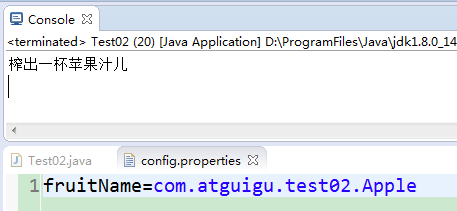
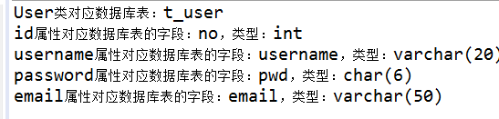

# day23_课后练习

## 第1题

案例：用反射获取某个类的信息，并用反射使用某个类

开发提示：

​	1、声明一个类：com.atguigu.test01.demo.AtguiguDemo，

​	（1）包含静态变量：学校school（显式初始化为"尚硅谷"）

​	（2）包含属性：班级名称className

​	（3）并提供构造器，get/set等

​	（4）实现Serializable和Comparable接口（按照班级名称排序）

​	2、把com.atguigu.test01.demo.AtguiguDemoclass导出为一个atguigu.jar并放到D:\ProgramFiles\Java\jdk1.8.0_141\jre\lib\ext目录（注意，以你自己的JDK安装目录为准）

​	3、在测试类Test01的test01()测试方法中，用反射获取AtguiguDemo类的Class对象，并获取它的所有信息，包括类加载器、包名、类名、父类、父接口、属性、构造器、方法们等。

​	4、在测试类Test01的test02()测试方法中，用反射获取school的值，并修改school的值为“尚硅谷大学”，然后再获取school的值

​	5、在测试类Test01的test03()测试方法中，用反射创建AtguiguDemo类的对象，并设置班级名称className属性的值，并获取它的值

​	6、在测试类Test01的test04()测试方法中，用反射获取有参构造创建2个AtguiguDemo类的对象，并获取compareTo方法，调用compareTo方法，比较大小。

## 第2题	

案例：榨汁机(Juicer)榨汁的案例，分别有水果(Fruit)苹果(Apple)香蕉(Banana)桔子(Orange)榨汁(squeeze)

效果：



开发提示：

​	1、声明(Fruit)水果接口，包含榨汁抽象方法：void squeeze();

​	2、声明榨汁机(Juicer)，包含运行方法：public void run(Fruit f)，方法体中，调用f的榨汁方法squeeze()

​	3、声明各种水果类，实现(Fruit)水果接口，并重写squeeze();

​	4、在src下，建立配置文件：config.properties，并在配置文件中配上fruitName=xxx（其中xx为某种水果的全类名）

​	5、在Test02测试类中，

​	（1）读取配置文件，获取水果类名，并用反射创建水果对象，

​	（2）创建榨汁机对象，并调用run()方法


## 第3题

代码填空题

```java
package com.atguigu.test03;

import java.lang.reflect.ParameterizedType;

public class Test03 {
	public static void main(String[] args) {
		SubA a = new SubA();
		System.out.println(a.getType());
		
		SubB b = new SubB();
		System.out.println(b.getType());
	}
}
abstract class Base<T>{
	private Class type;
	
	public Base(){
		//为type属性赋值为T的实际类型
        
        _____________________________________
	}

	public Class getType() {
		return type;
	}
}
class SubA extends Base<String>{

}
class SubB extends Base{

}
```


## 第4题

案例：

​	1、声明自定义注解@Table

​	（1）加上String类型的配置参数value

​	（2）并限定@Table的使用位置为类上

​	（3）并指定生命周期为“运行时”

​	2、声明自定义注解@Column

​	（1）加上String类型的配置参数name，表示表格的列名

​	（2）加上String类型的配置参数type，表示表格的列数据类型

​	（3）并限定@Column的使用位置在属性上

​	（4）并指定生命周期为“运行时”

​	3、声明User类，

​	（1）属性：id, username, password, email

​	（2）在User类上，标记@Table注解，并为value赋值为"t_user"

​	（3）在User类的每一个属性上标记@Column，并为name和type赋值，例如：

​		id：name赋值为no，type赋值为int

​		username：name赋值为username，type赋值为varchar(20)

​		password：name赋值为pwd，type赋值为char(6)

​		email：name赋值为email，type赋值为varchar(50)

​	4、在测试类Test04中，通过反射，获取User类以及每一个属性声明的注解，并获取注解值

​	运行效果：

