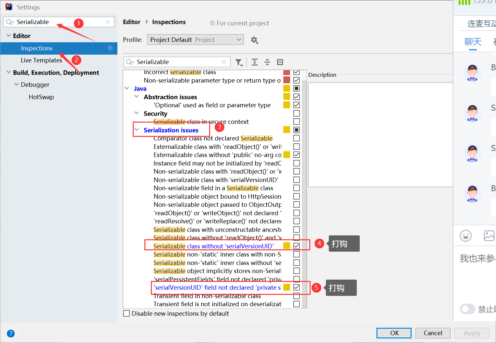

# 第十六章 文件与IO流

## 16.1 File文件类(了解)

### 16.1.1 File类概述

​	 理解：  File类是java.io包下代表与平台(操作系统)无关的文件和目录(文件夹)
 	功能： 对文件和目录的操作(新建、删除、改名、获得目录下的内容、文件的大小、文件的各种路径)   访问不到文件的内容

### 16.1.2 构造器

```java
new File(String pathname)  //根据文件或目录的路径字符串构造一个File对象
                /*绝对路径：从根目录开始的路径(windows系统是从盘符开始的，linux根目录就是一个/)
                相对路径：找一个参照物(当前文件/当前项目)
                    ./   当前文件所在的文件夹(./在java中指的是当前项目[Project])
                        day19_IO是项目下的一个模块
                    ../   当前文件所在文件夹的上一级(当前项目的上一级)
                        没有   .../  符号*/
 new File(File parent,String child) //根据父级File对象和子级字符串名称构建File对象
 new File(String parent,String child)// 根据父级的字符串路径和子级字符串名称构建File对象
```

### 16.1.3 有哪些方法

​	1）: 获取文件和目录基本信息的方法

```java
file.getName();//返回文件或目录名
file.length();//获得文件的内容长度(字节)
file.lastModified();//获得最后一次修改的时间：毫秒数
file.getPath();//返回路径字符串
file.getAbsolutePath();//返回绝对路径
file.getCanonicalPath();//返回规范路径
```

 	2）: 判断信息

```java
file.exists();//判断文件或路径是否存在
file.isFile();//判断是否是文件 (必须存在)
file.isDirectory();//判断是否是目录
file.isAbsolute();//判断是否是用绝对路径创建的对象
file.canRead();//是否可读
file.canWrite();//是否可写
file.isHidden();//是否隐藏
```

​	3）: 文件和目录的创建和删除

```java
file.createNewFile();//只能新建文件(要保证file对象的目录的路径是必须存在的)
file.mkdir();//只能创建一级
file.mkdirs();//创建多级目录
file.delete();//删除文件或空目录
删除文件，直接删除
删除目录，只能删除空目录
```

​	4）: 获取父级信息

```java
file.getParent();//返回当前对象的父级路径(String)
file.getParentFile();//获得当前当前对象的父级对象
```

​	5）：目录的遍历

```java
String[] list();   //返回目录中所有内容(一级)的名称
File[] listFiles();   //返回目录中所有子级File对象
File[] listFiles(FileFilter filter);  //返回目录中符合条件的子级File对象
```

## 16.2 IO流(★)

### 16.2.1 IO流概述


​	IO就是 数据的传输，可以看做是一种数据的流动，按照流动的方向，以内存为基准，分为`输入input` 和`输出output` ，即流向内存是输入流，流出内存的输出流。

​	Java中I/O操作主要是指使用`java.io`包下的内容，进行输入、输出操作。**输入**也叫做**读取**数据，**输出**也叫做作**写出**数据。 

### 16.2.2 IO流的分类

```
① 按方向分(自己的占位)
    输入流(数据从外界[磁盘(此时)，网络(网络编程)，输入设备(Scanner)...]到程序)
    输出流(数据从程序到外界[磁盘、网络、显示设备...])
② 按数据处理类型
    字节流:处理单位是字节(图片、音频、视频...[所有一切用字节形式存储的文件]) ★
    字符流:处理单位是字符(处理长文本)
③ 按角色分
    节点流(原始流)  :  没有经过任何处理的流[效率低]
    处理流 :  在原始流的基础上进行了处理[ ①提高效率  ②提供好用的方法]
```

### 16.2.3 4大根类★

|        | 字节流       | 字符流 |
| ------ | ------------ | ------ |
| 输入流 | InputStream  | Reader |
| 输出流 | OutputStream | Writer |

### 16.2.4 字节输入流

​	InputStream(抽象类)  -->  第一大子类FileInputStream(处理磁盘上的文件的)

#### (1) 构造器

```java
new FileInputStream(File file); //读取file对象指向的文件
new FileInputStream(String path); //读取path路径指向的文件
```

#### (2) 常用方法

```java
int read();   返回的是一个字节的内容(只是采用int[ASCII]值去存储),执行一次读取一个字节
              如果已经没有数据了，返回值是-1(可以采用循环了)
                     循环读取方式：
                        int i=0;
                        while((i=in.read())!=-1){//① in.read()  ② i=值  ③ i!=-1
                            System.out.print((char)i);
                        }
int read(byte[] b); 执行一次，读取多个字节，多个字节存储到b数组中，返回值是读取的字节数
                       文件剩余字节数大于数组的长度，最多就能读取数组长度个字节
                       文件剩余字节数小于数组的长度，读取的字节数就是文件剩余字节数
                   	   如果读到没有数据了，返回值是-1(可以写循环了)
    				 循环读取方式：
    					byte[] b=new byte[10];
                        int len=0;
                        while((len=in.read(b))!=-1){//① read(b) ② 赋值  ③  比较
                             //展示数据
                             System.out.print(new String(b,0,len));//掌握此方式，为以后做铺垫
                        }
int read(byte[] b,int offset,int len);
						从文件开头读取len个字节,从数组的off索引值位置开始存(了解)

close();   进行关闭资源
```

### 16.2.5 字节输出流

#### (1) 构造器

```java
new FileOutputStream(String name);
new FileOutputStream(File file);
	文件是可以不存在的，但是文件所在的目录是必须存在的
	他们在创建流对象时，如果文件是存在的会将内容清空！如果我想追加呢？
new FileOutputStream(String name,boolean append);
new FileOutputStream(File file,boolean append);
	设置追加内容
```

#### (2) 常用方法

```java
write(int i); 将字节写出
write(byte[] b);将数组中所有字节写入   使用几率很小
write(byte[] b,int off,int len);将数组中的数据从off索引位置开始写，写len个
close();  关闭资源

InputStream和OutputStream读写配对情况
int read()     write(int i)
int read(byte[] b)   writer(byte[] b,int off,int len);

```

### 16.2.6 字符输入流

#### (1)构造器

```java
new FileReader(String filename);
new FileReader(File file);
```

#### (2) 常用方法

```java
int read(); 执行一次读取一个字符(采用int值去表示),读到文件末尾在读返回-1
int read(char[] c);执行一次读取多个字符,读取到的字符存放在char数组中，
	返回值是读取的字符数，读到文件末尾在读返回-1
int read(char[] c,int off,int len);执行一次读取len个字符，从数组的off索引位置开始存 (了解)
```

### 16.2.7 字符输出流

#### (1)构造器

```java
new FileWriter(String name);
new FileWriter(String name,boolean append);
new FileWriter(File file);
new FileWriter(File file,boolean append);
```

#### (2) 常用方法

```java
 write(int i)   写一个字符    和  int read()   配合使用
 write(char[] c)  执行一次将char数组中全部数据写出   (了解)
 write(char[] c,int off,int len); 执行一次将char数组中数据从off索引位置开始写，写len个
 write(String str);   将字符串全部内容写入到文件
 write(String str,int off,int len);执行一次将字符串中数据从off索引位置开始写，写len个

close();
flush();//刷新 --> 缓存中的内容应用到文件中
	既然关闭有刷新，为甚还要有刷新呢？
	刷新后，out对象还是可以继续用的！
	关闭后，out对象就不能用了！
flush什么时候用？
	写大量内容的时候,可以多几次刷新，保证内存一直是比较好的状态
```

### 16.2.8 缓冲流★

缓冲流,也叫高效流，按照数据类型分类：

- **字节缓冲流**：`BufferedInputStream`，`BufferedOutputStream` 
- **字符缓冲流**：`BufferedReader`，`BufferedWriter`

缓冲流的基本原理，是在创建流对象时，会创建一个内置的默认大小的缓冲区数组，通过缓冲区读写，减少系统IO次数，从而提高读写的效率。

#### (1)字节输入缓冲流

```java
字节输入缓冲流 BufferedInputStream (对InputStream的处理)
构造器
	BufferedInputStream(InputStream in);
	BufferedInputStream(InputStream in,int size);  设置缓冲区大小
方法
	和InputStream中的三个read方法用法一致(提高了一些效率)
```

#### (2)字节输出缓冲流

```java
字节输出缓冲流 BufferedOutputStream (对OutputStream的处理)
构造器
	new BufferedOutputStream(OutputStream out);
	new BufferedOutputStream(OutputStream out,int size);
方法
	和OutputStream方法一致
```

#### (3)字符输入缓冲流

```java
字符输入缓冲流 BufferedReader(对Reader的处理)
构造器
	new BufferedReader(Reader reader)
	new BufferedReader(Reader reader,int size)
方法
	包含Reader中的三个read方法
	String readLine();  执行一次读取一行,读到没有会返回null
```

#### (4)字符输出缓冲流

```java
字符输出缓冲流 BufferedWriter(对Writer的处理)
构造器
	new BufferedWriter(Writer out)
	new BufferedWriter(Writer out,int size)
方法
	包含五个write方法
	newLine();换行
```

### 16.2.9 转换流

#### 字符编码

​	**字符编码`Character Encoding`** : 就是一套自然语言的字符与二进制数之间的对应规则。

​	按照某种规则，将字符存储到计算机中，称为**编码** 

​	反之，将存储在计算机中的二进制数按照某种规则解析显示出来，称为**解码**

#### 字符集

​	**字符集 `Charset`**：也叫编码表。是一个系统支持的所有字符的集合，包括各国家文字、标点符号、图形符号、数字等。

#### 编码引出的问题

​	如果文件的编码格式和程序的编码格式不一致，会导致乱码的产生！如何解决呢？

#### (1) InputStreamReader类

​	转换流`java.io.InputStreamReader`，是Reader的子类，是从字节流到字符流的桥梁。它读取字节，并使用指定的字符集将其解码为字符。它的字符集可以由名称指定，也可以接受平台的默认字符集。 

```java
new InputStreamReader(InputStream in); 单纯的转换(处理不了中文乱码)
new InputStreamReader(InputStream in,String charsetName); 可以处理乱码问题
```

#### (2) OutputStreamWriter类

​	转换流`java.io.OutputStreamWriter` ，是Writer的子类，是从字符流到字节流的桥梁。使用指定的字符集将字符编码为字节。它的字符集可以由名称指定，也可以接受平台的默认字符集。

```java
new OutputStreamWriter(OutputStream out);  单纯的转换
new OutputStreamWriter(OutputStream out,String charsetName);  指定字符集(采用指定字符集创建文件)
```

### 16.2.10 对象流

#### 序列化

​	Java 提供了一种对象**序列化**的机制。用一个字节序列可以表示一个对象，该字节序列包含该`对象的类型`和`对象中存储的属性`等信息。字节序列写出到文件之后，相当于文件中**持久保存**了一个对象的信息。

```
java中的对象如何序列化
    在对象的类型上实现 一个接口Serializable(该接口下没有抽象方法)
    字节序列是不可读的！计算机可读！
    static、transient修饰的内容不会被序列化的
    如果有对象的关联，要求关联的对象也是需要序列化的
```

#### 反序列化

​	反之，该字节序列还可以从文件中读取回来，重构对象，对它进行**反序列化**。`对象的数据`、`对象的类型`和`对象中存储的数据`信息，都可以用来在内存中创建对象

#### (1) ObjectOutputStream类

```java
 构造器：
 	new ObjectOutputStream(OutputStream out)
 方法：
 	包含OutputStream中的三个write方法
 	writeXXX(XXX xxx);
 	writeObject(Object obj);
```

#### (2) ObjectInputStream类

```java
构造器：
	new ObjectInputStream(InputStream in);
方法：
	包括三个read方法
	XXX readXXX();
	readObject();
采用对象流去读的文件，必须是采用对象流写出的文件(不能是一个普通文件)
读的时候和写的时候顺序要保持一致(按照字节序列操作)
```


### 16.2.11 版本兼容

#### (1) 设置版本号的提示功能



#### (2) serialVersionUID的作用

```
序列化的对象存在serialVersionUID的话，版本改变的话，会存在兼容操作，否则会出现异常
```

# 第十七章 多线程 ★

## 17.1 相关概念

**并发**（concurrency）：指两个或多个事件在**同一个时间段内**发生。指在同一个时刻只能有一条指令执行，但多个进程的指令被快速轮换执行，使得在宏观上具有多个进程同时执行的效果。

**并行**（parallel）：指两个或多个事件在**同一时刻**发生（同时发生）。指在同一时刻，有多条指令在多个处理器上同时执行。

**程序**：为了完成某个任务和功能，选择一种编程语言编写的一组指令的集合。

**软件**：**1个或多个**应用程序+相关的素材和资源文件等构成一个软件系统。

**进程**：是指一个内存中运行的应用程序，每个进程都有一个独立的内存空间，进程也是程序的一次执行过程，是系统运行程序的基本单位；系统运行一个程序即是一个进程从创建、运行到消亡的过程。

**线程**：线程是进程中的一个执行单元，负责当前进程中程序的执行，一个进程中至少有一个线程。一个进程中是可以有多个线程的，这个应用程序也可以称之为多线程程序。

## 17.2 线程调度

#### (1) 分时调度

​	所有线程轮流使用 CPU 的使用权，平均分配每个线程占用 CPU 的时间。

#### (2) 抢占式调度

​	优先让优先级高的线程使用 CPU，如果线程的优先级相同，那么会随机选择一个(线程随机性)，Java使用的为抢占式调度。

## 17.3 线程的创建方式

### 17.3.1 继承Thread类

Java使用`java.lang.Thread`类代表**线程**，所有的线程对象都必须是Thread类或其子类的实例。每个线程的作用是完成一定的任务，实际上就是执行一段程序流即一段顺序执行的代码。Java使用线程执行体来代表这段程序流。Java中通过继承Thread类来**创建**的步骤如下:

```java
a. 新建一个普通类
b. 继承Thread类
c. 重写run方法
class PrintFor extends Thread{
    @Override
    public void run() {
        for (int i = 0; i < 100; i++) {
            System.out.println("***************"+i);
        }
    }
}
```

线程的**启动**方式如下：

```java
① 创建线程的对象(Thread类的对象及其子类对象)
   PrintFor t=new PrintFor();
② 调用线程对象的start方法
    t.start();启动当前线程，真正运行的依然是run方法的内容
       启动起来之后会立刻运行run方法的内容？不会，得抢
       每个线程都有默认的优先级，抢到之后才会运行(线程的生命周期)
        private native void start0();//本地方法，由C语言去写
```

### 17.3.2 实现Runnable接口

Java有单继承的限制，当我们无法继承Thread类时，那么该如何做呢？在核心类库中提供了Runnable接口。

java通过实现Runnable接口来**创建**的步骤如下

```java
a. 新建一个类
b. 实现接口Runnable
c. 实现抽象方法run方法
class PrintWhile implements Runnable{
    @Override
    public void run() {
        int i=0;
        while(i<100){
            System.out.println("----------------"+i);
            i++;
        }
    }
}
```

线程的**启动**方式如下：

```java
① 创建线程对象
    准备目标资源
    PrintWhile printWhile=new PrintWhile();
    封装线程对象
    Thread t=new Thread(printWhile);
② 调用start方法
     t.start();//执行的是目标中的run方法
```

## 17.4 Thread类(线程类)

### 17.4.1 构造器

```java
① new Thread();   一般是创建其子类对象时，会调用到Thread类的空参构造器
    public Thread() {
        init(null, null, "Thread-" + nextThreadNum(), 0);//初始化一些线程资源的
    }
② new Thread(String name);   给线程起个名字(线程还有名字？有的)
    如果不起名默认会给线程创建一个名字
    public Thread(String name) {
        init(null, null, name, 0);
    }
    Ps:上述两种构造器主要针对的是采用继承Thread类创建线程的方式
③ new Thread(Runnable runnable);
    public Thread(Runnable target) {
        init(null, target, "Thread-" + nextThreadNum(), 0);
    }
④ new Thread(Runnable runnable,String name);
    public Thread(Runnable target, String name) {
        init(null, target, name, 0);
    }
```

### 17.4.2 常用方法

```java
1. run()   线程真正执行的内容
2. getName()   获得线程的名字
3. static Thread currentThread() :返回对当前正在执行的线程对象的引用
     此行代码运行在哪个线程，就会返回哪个线程的引用
     问题：运行在哪个线程这句话，一个线程的范围怎么看呢？
         主线程：main方法大括号
         子线程：run方法哪个大括号
4. final boolean isAlive()：测试线程是否处于活动状态(看此线程是否还活着)
     线程什么时候死亡？   线程执行完毕(run方法结束)     stop()也是可以让线程立刻死亡
5. public final int getPriority() ：返回线程优先级
6. public final void setPriority(int newPriority) ：改变线程的优先级
		//源码分析
         public final void setPriority(int newPriority) {
             ThreadGroup g;
             checkAccess();
             //判断设置的级别是否在  1-10之间
             if (newPriority > MAX_PRIORITY || newPriority < MIN_PRIORITY) {
                 throw new IllegalArgumentException();
             }
             if((g = getThreadGroup()) != null) {
                 if (newPriority > g.getMaxPriority()) {
                     newPriority = g.getMaxPriority();
                 }
                 //这是线程优先级的方法   private native void setPriority0(int newPriority);
                 setPriority0(priority = newPriority);
             }
         }
     ①. 优先级有多少个级别   [1,10]
         Thread类为我们提供了三个常量  MIN_PRIORITY(1)  NORM_PRIORITY(5)  MAX_PRIORITY(10)
     ②. 一个线程的优先级默认是多少？是以他的父级线程为准的！(源码见Thread--init.txt)
            private void init(ThreadGroup g, Runnable target, String name,
                           long stackSize) {
             	init(g, target, name, stackSize, null, true);
            }
 7. start() 启动线程的方法
 8. sleep(ong millis);   让正在运行此方法的线程进入睡眠(到时间后自动苏醒)
 9. public static native void sleep(long millis) throws InterruptedException;
      注意 : throws InterruptedException  
      		当线程处于睡眠/线程的插队/等待状态，有其他的线程打断我的睡眠，就会抛出异常
 10. static void yield(): 线程的礼让(效果是不明显)
            当线程抢到时间片(执行权),如果遇到yield().会让出此次执行权(优先级更高或者同级的线程)
          	//举例说明：
            A同学和B同学同时饮水机接水，A同学抢到这一滴水时，调用yield(),A同学就放弃这一滴水，
            退出和B同学在次站在同一起跑线上，继续争夺这滴水的权利(在第二次还是有可能是A同学得到这滴水的)
        	public static native void yield();//源码是c语言写的
 11. void join() :线程的插队    源码明天在读(join(long millis))
        插队线程    ：   调用方法的线程为插队线程
        被插队线程：     执行join方法的线程为被插队线程
 12.void join(long millis) ：等待该线程终止的时间最长为 millis 毫秒。如果millis时间到，将不再等待。
 13.void join(long millis, int nanos) ：等待该线程终止的时间最长为 millis 毫秒 + nanos 纳秒。
 14.stop() 让线程停止(被标记过时，不建议使用[stop存在固有的安全问题])
```

## 17.5 线程安全问题★

### 17.5.1 同步代码块

- 同步代码块： synchronized 关键字可以用于方法中的某个区块中，表示只对这个区块的资源实行互斥访问。
  格式:

```java
synchronized(同步锁){
     需要同步操作的代码
}
```

- 同步锁:
  对象的同步锁只是一个概念,可以想象为在对象上标记了一个锁.

​	锁对象 可以是任意类型。

​	多个线程对象  要使用同一把锁。
注意:在任何时候,最多允许一个线程拥有同步锁,谁拿到锁就进入代码块,其他的线程只能在外等着(BLOCKED)。

```java
class Sell01 extends Thread{
    private static int num=50;
    @Override
    public void run() {
        while(true){
            synchronized (this.getClass()){//锁对象对于多个互斥线程来说必须是同一个
                //1. 判断票数量是否满足本次销售
                if(num<=0){
                    return;
                }
                try {
                    Thread.sleep(200);
                } catch (InterruptedException e) {
                    e.printStackTrace();
                }
                //2. 票数的减少
                num--;
                //3. 告知结果
                System.out.println(Thread.currentThread().getName()+"卖出去了1张票，剩余:"+num);
            }
        }
    }
}
```

### 17.5.2 同步方法

- 同步方法:使用synchronized修饰的方法,就叫做同步方法,保证A线程执行该方法的时候,其他线程只能在方法外
  等着

格式：

```java
public static synchronized void method(){
    可能会产生线程安全问题的代码
}
```

- 同步方法的锁对象：

（1）静态方法：当前类的Class对象

（2）非静态方法：this

```java
class Sell03 extends Thread{
    private static int num=10000;

    @Override
    public void run() {
        while(true){
            boolean flag = sell();//接收返回值
            if(flag){
                return;
            }
        }
    }
    public static synchronized boolean sell(){
        //1. 判断票数量是否满足本次销售
        if(num<=0){
            return true;//结束run方法
        }
        //2. 票数的减少
        num--;
        //3. 告知结果
        System.out.println(Thread.currentThread().getName()+"卖出去了1张票，剩余:"+num);
        return false;
    }
}
```

### 17.5.3 Lock锁

- java.util.concurrent.locks.Lock 机制提供了比synchronized代码块和synchronized方法更广泛的锁定操作,同步代码块/同步方法具有的功能Lock都有,除此之外更强大,更体现面向对象。
- Lock锁也称同步锁，加锁与释放锁方法，如下：
  - public void lock() :加同步锁。
  - public void unlock() :释放同步锁。

```java
class Sell05 extends Thread{
    private static int num=100;
    //1. 锁对象的创建
    private static Lock lock=new ReentrantLock();
    @Override
    public void run() {
        while(true){
            lock.lock();
            try {
                //1. 判断票数量是否满足本次销售
                if(num<=0){
                    return;
                }
                //2. 票数的减少
                num--;
                //3. 告知结果
                System.out.println(Thread.currentThread().getName()+"卖出去了1张票，剩余:"+num);
            }finally {
                lock.unlock();//互斥锁必须要执行，所以放在finally中
            }
        }
    }
}
```

## 17.6 等待唤醒机制 ★

### 17.6.1 什么是等待唤醒机制

这是多个线程间的一种**协作**机制。

就是在一个线程进行了规定操作后，就进入等待状态（**wait()**）， 等待其他线程执行完他们的指定代码过后 再将其唤醒（**notify()**）;在有多个线程进行等待时， 如果需要，可以使用 notifyAll()来唤醒所有的等待线程。

### 17.6.2 调用wait和notify方法需要注意的细节

1. wait方法与notify方法必须要由同一个锁对象调用。因为：对应的锁对象可以通过notify唤醒使用同一个锁对象调用的wait方法后的线程。
2. wait方法与notify方法是属于Object类的方法的。因为：锁对象可以是任意对象，而任意对象的所属类都是继承了Object类的。
3. wait方法与notify方法必须要在同步代码块或者是同步函数中使用。因为：必须要通过锁对象调用这2个方法。

### 17.6.3 生产者与消费者问题

等待唤醒机制可以解决经典的“生产者与消费者”的问题

#### 一对一做包子吃包子问题

就拿生产包子消费包子来说等待唤醒机制如何有效利用资源：

```java
包子铺线程生产包子，吃货线程消费包子。当包子没有时（包子状态为false），吃货线程等待，包子铺线程生产包子（即包子状态为true），并通知吃货线程（解除吃货的等待状态）,因为已经有包子了，那么包子铺线程进入等待状态。接下来，吃货线程能否进一步执行则取决于锁的获取情况。如果吃货获取到锁，那么就执行吃包子动作，包子吃完（包子状态为false），并通知包子铺线程（解除包子铺的等待状态）,吃货线程进入等待。包子铺线程能否进一步执行则取决于锁的获取情况。
```

**代码演示：**

包子资源类：

```java
public class BaoZi {
     String  pier ;
     String  xianer ;
     boolean  flag = false ;//包子资源 是否准备好  包子资源状态
}
```

吃货线程类：

```java
public class ChiHuo extends Thread{
    private BaoZi bz;

    public ChiHuo(String name,BaoZi bz){
        super(name);
        this.bz = bz;
    }
    @Override
    public void run() {
        while(true){
            synchronized (bz){
                if(bz.flag == false){//没包子
                    try {
                        bz.wait();
                    } catch (InterruptedException e) {
                        e.printStackTrace();
                    }
                }                
                
                System.out.println("吃货正在吃："+bz.pier+","+bz.xianer+"包子");
                bz.flag = false;
                bz.notify();
            }
        }
    }
}
```

包子铺线程类：

```java
public class BaoZiPu extends Thread {

    private BaoZi bz;

    public BaoZiPu(String name,BaoZi bz){
        super(name);
        this.bz = bz;
    }

    @Override
    public void run() {
        int count = 0;
        //造包子
        while(true){
            //同步
            synchronized (bz){
                if(bz.flag == true){//包子资源  存在
                    try {
                        bz.wait();
                    } catch (InterruptedException e) {
                        e.printStackTrace();
                    }
                }

                // 没有包子  造包子
                System.out.println("包子铺开始做包子");
                if(count%2 == 0){
                    // 薄皮  蟹黄包
                    bz.pier = "薄皮";
                    bz.xianer = "蟹黄灌汤";
                }else{
                    // 厚皮  牛肉大葱
                    bz.pier = "厚皮";
                    bz.xianer = "牛肉大葱";
                }
                count++;

                bz.flag=true;
                System.out.println("包子造好了："+bz.pier+bz.xianer);
                System.out.println("吃货来吃吧");
                //唤醒等待线程 （吃货）
                bz.notify();
            }
        }
    }
}
```

测试类：

```java
public class Demo {
    public static void main(String[] args) {
        //等待唤醒案例
        BaoZi bz = new BaoZi();

        ChiHuo ch = new ChiHuo("吃货",bz);
        BaoZiPu bzp = new BaoZiPu("包子铺",bz);

        ch.start();
        bzp.start();
    }
}
```

执行效果：

```java
包子铺开始做包子
包子造好了：厚皮牛肉大葱
吃货来吃吧
吃货正在吃：厚皮,牛肉大葱包子
包子铺开始做包子
包子造好了：薄皮蟹黄灌汤
吃货来吃吧
吃货正在吃：薄皮,蟹黄灌汤包子
包子铺开始做包子
包子造好了：厚皮牛肉大葱
吃货来吃吧
吃货正在吃：厚皮,牛肉大葱包子
包子铺开始做包子
包子造好了：薄皮蟹黄灌汤
吃货来吃吧
吃货正在吃：薄皮,蟹黄灌汤包子
```

### 17.6.4 wait方法源码分析

```java
① wait();         一直等待，直到被唤醒
    源码：public final void wait() throws InterruptedException {
        wait(0);
    }
② wait(int millis)   设置等待时间(睡眠差不多)
    public final native void wait(long timeout) throws InterruptedException;

③ wait(int millis，int naons)
    public final void wait(long timeout, int nanos) throws InterruptedException {
        if (timeout < 0) {
            throw new IllegalArgumentException("timeout value is negative");
        }
        if (nanos < 0 || nanos > 999999) {
            throw new IllegalArgumentException(
                                "nanosecond timeout value out of range");
        }
        if (nanos > 0) {
            timeout++;
        }
        wait(timeout);
    }
```

### 17.6.5 实现Runnable接口创建线程方式的优势

​	① 更好处理共享资源
​        ② 避免java中的单继承
​        ③ 线程池(容器)中不接受继承Thread类的线程
​        ④ 增加程序的健壮性，实现解耦操作，代码可以被多个线程共享，代码和线程独立

### 17.6.6 线程的生命周期 ★

简单来说，线程的生命周期有五种状态：新建（New）、就绪（Runnable）、运行（Running）、阻塞（Blocked）、死亡（Dead）。CPU需要在多条线程之间切换，于是线程状态会多次在运行、阻塞、就绪之间切换。


### 17.6.7 释放锁问题(★)

任何线程进入同步代码块、同步方法之前，必须先获得对同步监视器的锁定，那么何时会释放对同步监视器的锁定呢？

### **1、释放锁的操作**

当前线程的同步方法、同步代码块执行结束。

当前线程在同步代码块、同步方法中遇到break、return终止了该代码块、该方法的继续执行。

当前线程在同步代码块、同步方法中出现了未处理的Error或Exception，导致当前线程异常结束。

当前线程在同步代码块、同步方法中执行了锁对象的wait()方法，当前线程被挂起，并释放锁。

### **2、不会释放锁的操作**

线程执行同步代码块或同步方法时，程序调用Thread.sleep()、Thread.yield()方法暂停当前线程的执行。

线程执行同步代码块时，其他线程调用了该线程的suspend()方法将该该线程挂起，该线程不会释放锁（同步监视器）。应尽量避免使用suspend()和resume()这样的过时来控制线程。

# 第十八章 反射机制

## 18.1 类加载

类在内存中的生命周期：加载-->使用-->卸载

### 18.1.1 类的加载过程

当程序主动使用某个类时，如果该类还未被加载到内存中，系统会通过加载、连接、初始化三个步骤来对该类进行初始化，如果没有意外，JVM将会连续完成这三个步骤，所以有时也把这三个步骤统称为类加载。

类的加载又分为三个阶段：

（1）加载：load

就是指将类型的clas字节码数据读入内存

（2）连接：link

①验证：校验合法性等

②准备：准备对应的内存（方法区），创建Class对象，为类变量赋默认值，为静态常量赋初始值。

③解析：把字节码中的符号引用替换为对应的直接地址引用

（3）初始化：initialize（类初始化）即执行<clinit>类初始化方法，大多数情况下，类的加载就完成了类的初始化，有些情况下，会延迟类的初始化。

### 18.1.2 类初始化

1、哪些操作会导致类的初始化？

（1）运行主方法所在的类，要先完成类初始化，再执行main方法

（2）第一次使用某个类型就是在new它的对象，此时这个类没有初始化的话，先完成类初始化再做实例初始化

（3）调用某个类的静态成员（类变量和类方法），此时这个类没有初始化的话，先完成类初始化

（4）子类初始化时，发现它的父类还没有初始化的话，那么先初始化父类

（5）通过反射操作某个类时，如果这个类没有初始化，也会导致该类先初始化

### 18.1.3 类加载器

很多开发人员都遇到过java.lang.ClassNotFoundException或java.lang.NoClassDefError，想要更好的解决这类问题，或者在一些特殊的应用场景，比如需要支持类的动态加载或需要对编译后的字节码文件进行加密解密操作，那么需要你自定义类加载器，因此了解类加载器及其类加载机制也就成了每一个Java开发人员的必备技能之一。

**1、类加载器分为：**

（1）引导类加载器（Bootstrap Classloader）又称为根类加载器

```
它负责加载jre/rt.jar核心库
它本身不是Java代码实现的，也不是ClassLoader的子类，获取它的对象时往往返回null
```

（2）扩展类加载器（Extension ClassLoader）

```
它负责加载jre/lib/ext扩展库
它是ClassLoader的子类
```

（3）应用程序类加载器（Application Classloader）

```
它负责加载项目的classpath路径下的类

它是ClassLoader的子类
```

**2、Java系统类加载器的双亲委托模式**

简单描述：

```
下一级的类加载器，如果接到任务时，会先搜索是否加载过，如果没有，会先把任务往上传，如果都没有加载过，一直到根加载器，如果根加载器在它负责的路径下没有找到，会往回传，如果一路回传到最后一级都没有找到，那么会报ClassNotFoundException或NoClassDefError，如果在某一级找到了，就直接返回Class对象。
```

应用程序类加载器  把  扩展类加载器视为父加载器，

扩展类加载器 把 引导类加载器视为父加载器。

不是继承关系，是组合的方式实现的。

## 18.2  javalang.Class类 ★

Java反射机制是在运行状态中，对于任意一个类，都能够知道这个类的所有属性和方法；对于任意一个对象，都能够调用它的任意一个方法和属性；这种动态获取的信息以及动态调用对象的方法的功能称为Java语言的反射机制。

要想解剖一个类，必须先要获取到该类的Class对象。而剖析一个类或用反射解决具体的问题就是使用相关API（1）java.lang.Class（2）java.lang.reflect.*。所以，Class对象是反射的根源。

### 18.2.1 如何获得Class对象

```java
//1. 如何去获得  4种
//1.1 如果有类的类名  ☆
Class c= Person.class;//获得Person类对应的Class对象
System.out.println(c);//重写toString方法
//1.2 如果有对象(Person)  ☆
Person per=new Person();
Class c1=per.getClass();
System.out.println(c==c1);
//1.3 如果全类名的字符串  ★     (编译阶段)不依赖于Person是否存在
String str="com.atguigu.bean.Person1";
try {
   Class c2= Class.forName(str);//通过反射操作Person类，先进行类加载
    System.out.println(c2==c1);
} catch (ClassNotFoundException e) {//因为根据你的字符串有可能找不到类
    e.printStackTrace();
}
//1.4  通过类加载器(必须是应用程序类加载器)和全类名字符串
try {
   Class c3= Demo1.class.getClassLoader().loadClass("com.atguigu.bean.Person");
    System.out.println(c1==c3);
    //Demo1的类加载器，怎么可以加载Person类？   因为Demo1和Person都同一个类加载器
} catch (ClassNotFoundException e) {
    e.printStackTrace();
}
```

## 18.3 反射的应用

### 18.3.1 获取类型的详细信息

可以获取：包、修饰符、类型名、父类（包括泛型父类）、父接口（包括泛型父接口）、成员（属性、构造器、方法）、注解（类上的、方法上的、属性上的）

#### (1) 属性

```java
java.lang.Class
    getField(String name) 根据属性名去获得公有的一个属性对象 包括继承下来的
    getDeclaredField(String name)  据属性名去获得一个任意访问修饰符的属性 不包括父类继承下来的
    getFields()   获得所有的公有的属性  包括父类继承下来的
    getDeclaredFields()   获得本类中所有的属性   不包括父类继承下来的
java.lang.reflect.Field  (属性对象的类) 这个属性的修饰符？这个属性的类型又是什么？属性名称？属性的值？
    修饰符 类型 名称[=值]
    getModifiers();获得修饰符,但是返回的是int值，需要通过 Modifier.toString(modifiers);处理
    getType();//属性的类型  通过Class对象去表示！
    getName();
```

#### (2) 方法

```java
java.lang.Class
    getMethod(String name,Class...params);  根据名称和形参列表获得方法对象  公有的  包括父类的
    getDeclaredMethod(String name,Class...params); 本类中所有的方法对象  任意修饰符 不包括父类的
    getMethods();   获得所有的公有方法对象     公有的   包括继承下来的
    getDeclaredMethods()   获得本类中所有的方法对象    任意修饰符  不包括继承下来的
java.lang.reflect.Method   (该类的对象代表一个方法)
    修饰符 返回值类型 方法名(形参列表){}    想要单独获得这些内容
    method.getModifiers()  获得修饰符  需要转换格式  String Modifier.toString(int)
    method.getReturnType()  获得返回值类型  返回的是Class对象
    method.getName()   获得方法名
    method.getParameterTypes()  获得形参列表   返回的是Class[]
```

#### (3) 构造器

```java
java.lang.Class
     getConstructor(Class...params);  根据形参列表获得构造器对象   公有的     和父类有关？没关
     getDeclaredConstructor(Class...params)   获得本类中任意修饰符的构造器对象
     getConstructors();  获得所有公有的构造器对象
     getDeclaredConstructors()  获得所有的构造器对象
java.lang.reflect.Constructor
     修饰符 构造器名称(形参列表){}
     和方法获得信息的内容是一样的
```

### 18.3.2  创建任意引用类型的对象 ★

两种方式：

1、直接通过Class对象来实例化（要求必须有无参构造）

2、通过获取构造器对象来进行实例化

```java
java.lang.Class
    c.newInstance();  通过空参构造器创建对象(不能传参)   为大家提供方便
java.lang.reflect.Constructor
    con.newInstance(Object...params);   实参和形参必须要统一
    如果遇到私有的构造器，需要暴力访问
        con.setAccessible(true);
```

### 18.3.3 操作任意类型的属性 ★

```java
Field
    field.set(Object obj,Object value);  给obj对象设置field属性值为values
    Object returnValue field.get(Object obj)  获得obj对象的field属性值
私有属性怎么办？依然是暴力访问
    field.setAccessible(true);
如果遇到静态属性？
    有对象的情况下和上述操作一样
    没有对象的情况下怎么办？   类名.属性
        将obj的位置写成null就可以
```

### 18.3.4 调用任意类型的方法 ★

```java
Object method.invoke(Obejct obj, Object...params);  调用obj对象的method方法，params是参数,返回值是Object
遇到私有方法怎么办？
    暴力破解   method.setAccessible(true);
静态方法怎么办？
    obj位置传递null值
```


