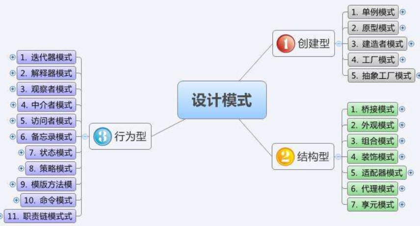

# JAVA基础进阶之【设计模式】

## 主要内容

* 设计模式的概念
* 面向对象开发原则
* 单例设计模式
* 工厂设计模式

## 教学目标

* [ ] 了解设计模式
* [ ] 了解面向对象的开发原则
* [ ] 掌握单例设计模式的多种编写方式
* [ ] 理解工厂设计模式

# 第20章 设计模式

## 20.1 设计模式概述

### 20.1.1 什么是设计模式

 设计模式（Design Pattern）是一套被反复使用、多数人知晓的、经过分类的**代码设计经验的总结**。 

> Scott Mayers 在其巨著《Effective C++》就曾经说过：C++老手和 C++新手的区别就是前者手背上有很多伤疤。即所谓的大神都是靠踩过很多坑，一路摸爬滚打成长起来的。

即设计模式是程序员在面对同类软件工程设计问题所总结出来的有用的经验，模式不是代码，而是**某类问题的通用解决方案**，设计模式代表了最佳的实践。这些解决方案是众多软件开发人员经过相当长的一段时间的试验和错误总结出来的。

### 20.1.2 为什么要使用设计模式

编写软件过程中，程序员面临着来自：耦合性，内聚性以及可维护性，可扩展性，重用性，灵活性等多方面的挑战，设计模式是为了让程序(软件)，具有更好的：

* 代码重用性 (即：相同功能的代码，不用多次编写)
* 可读性 (即：编程规范性, 便于其他程序员的阅读和理解)

* 可扩展性 (即：当需要增加新的功能时，非常的方便，维护成本低，称为可维护)
* 可靠性 (即：当我们增加新的功能后，对原来的功能没有影响)
* 使程序呈现高内聚，低耦合的特性

当然，设计模式不局限于某种编程语言：C++，Java，Python，PHP等都可以使用设计模式，因为设计模式不是具体的代码，而是问题的解决方案。

> 一句话：
> 设计模式包含了面向对象的精髓，“懂了设计模式，你就懂了面向对象分析和设计（OOA/D）的精要”

### 20.1.3 设计模式为什么能这么厉害呢？

 二十多年前（95年），软件设计领域的四位大师（GoF，“四人帮”，又称Gang of Four，即Erich Gamma, Richard Helm, Ralph Johnson & John Vlissides）通过论著《设计模式：可复用面向对象软件的基础》阐述了设计模式领域的开创性成果。在这本书中提出了23种设计模式，那么经过这么多年，为什么这些设计模式仍然被广泛使用呢？ 


因为所有设计模式都是遵循面向对象开发原则而设计的解决方案，能够帮助我们提高软件的维护性，通用性和扩展性，并降低软件的复杂度。

### 20.1.4 设计模式学习阶梯

设计模式和开发原则的学习是一条漫长的路程，也是一座不容易攀登的高峰，一般学习设计模式都有几个阶段：

* 第1层：刚开始学编程不久，听说过什么是设计模式
* 第2层：有很长时间的编程经验，自己写了很多代码，其中用到了设计模式，但是自己却不知道
* 第3层：学习过了设计模式，发现自己已经在使用了，并且发现了一些新的模式挺好用的
* 第4层：阅读了很多别人写的源码和框架，在其中看到别人设计模式，并且能够领会设计模式的精妙和带来的好处。
* 第5层：代码写着写着，自己都没有意识到使用了设计模式，并且熟练的写了出来。

> 这个和学习武功差不多。

## 20.2 面向对象开发原则

软件开发中最核心的思想就是“高内聚，低耦合”，主要的目的也是为了方便后期的维护和变更。下面的设计原则也是依靠这个核心思想衍生出来的。

- **开闭原则**【Open Close Principle，缩写是OCP】
- **单一职责原则**【Single Responsibility Principle，缩写是SRP】
- **里氏替换原则**【Liskov Substitution Principle，缩写是LSP】
- **依赖倒置原则**【Dependence Inversion Principle，缩写是DIP】
- **接口隔离原则**【Interface Segregation Principle，缩写是ISP】
- **迪米特法则**【Low of Demeter，缩写是LOD】
- **组合/聚合复用原则**【Composition/Aggregation Reuse Principle(CARP) 】

### 20.2.1 开闭原则

**开闭原则**【Open Close Principle，缩写是OCP】：一个软件实体如模块、类、函数等应该对扩展开放，对修改关闭。开闭原则是Java世界里最基础的设计原则，它指导我们如何建立一个稳定的、灵活的系统，它是总纲。它由 Bertrand Meyer于 1988提出。

例如： 小明去医院看病，医生开了阿司匹林药花了20元， 第二天和朋友聚会聊起这事，小红说道：不对呀，前几天我在医院也拿了阿司匹林药，才 14 块钱呢。小花说：奇怪了，我买的是 16 块钱。小杰回应：怎么我买的是 20 块。怎么这药这么多个价格。小明 Google 搜了一下，发现价格跟社保有关，几个人便发现，原来他们都是“不同人”：小明没有社保，小红社保是一档，小花社保是二挡，小杰社保是三挡。  作为和 IT 工作相关的人，便讨论起医院系统具体实现是怎么实现的。 

```java
class Medicine {
    private String name;
    private double price;
    public Medicine(String name, double price) {
		this.name = name;
		this.price = price;
	}
	public String getName() {
		return name;
	}
	public double getPrice() {
		return price;
	}
}
interface IPatient{
	String getName();
    double pay(Medicine medicines);
}
class Patient implements IPatient{
    private String name;
    private int level;
    
    public Patient(String name) {
    	this.name = name;
	}
    public Patient(String name, int level) {
    	this.name = name;
        this.level = level;
	}

    @Override
	public double pay(Medicine medicines) {
        if (level == 1) {
            return medicines.getPrice()*0.7;
        } else if (level == 2) {
            return medicines.getPrice()*0.8;
        } else if (level == 3) {
            return medicines.getPrice()*0.9;
        }
        return medicines.getPrice();
    }
    @Override
	public String getName() {
		return name;
	}
}
class Hospital {
    private Medicine medicine = new Medicine("阿司匹林", 20.0);

    public void saleMedicine(IPatient patient) {
        double money = patient.pay(medicine);
        System.out.println(patient.getName() + " 花了 " + money + "块钱买了药：" + medicine.getName());
    }

}
public class OcpTest {

    public static void main(String[] args) {
        Hospital hospital = new Hospital();
        IPatient xiaoMing = new Patient("小明");
        hospital.saleMedicine(xiaoMing);
        
        IPatient xiaoHong = new Patient("小红",1);
        hospital.saleMedicine(xiaoHong);
    }

}
```

 小明发话：你们说的方法都可以实现，但是总感觉不对劲，如果以后有社保四挡，还是要修改原来的代码 ？

```java
class Medicine {
    private String name;
    private double price;
    public Medicine(String name, double price) {
		this.name = name;
		this.price = price;
	}
	public String getName() {
		return name;
	}
	public double getPrice() {
		return price;
	}
}
interface IPatient{
	String getName();
    double pay(Medicine medicines);
}
class Patient implements IPatient{
	private String name;
    public Patient(String name) {
    	this.name = name;
	}

    @Override
	public double pay(Medicine medicines) {
        return medicines.getPrice();
    }

	@Override
	public String getName() {
		return name;
	}
    
}
class OneLevelSocialSecurityPatient implements IPatient{
	private String name;
	
    public OneLevelSocialSecurityPatient(String name) {
    	this.name = name;
	}

    @Override
	public double pay(Medicine medicines) {
        return medicines.getPrice()*0.7;
    }

	@Override
	public String getName() {
		return name;
	}
    
}
class TwoLevelSocialSecurityPatient  implements IPatient{
	private String name;
	
    public TwoLevelSocialSecurityPatient (String name) {
    	this.name = name;
	}

    @Override
	public double pay(Medicine medicines) {
        return medicines.getPrice()*0.8;
    }

	@Override
	public String getName() {
		return name;
	}
    
}
class ThreeLevelSocialSecurityPatient   implements IPatient{
	private String name;
	
    public ThreeLevelSocialSecurityPatient  (String name) {
    	this.name = name;
	}

    @Override
	public double pay(Medicine medicines) {
        return medicines.getPrice()*0.9;
    }

	@Override
	public String getName() {
		return name;
	}
    
}
class Hospital {
    private Medicine medicine = new Medicine("阿司匹林", 20.0);

    public void saleMedicine(IPatient patient) {
        double money = patient.pay(medicine);
        System.out.println(patient.getName() + " 花了 " + money + "块钱买了药：" + medicine.getName());
    }

}
public class OcpTest {

    public static void main(String[] args) {
        Hospital hospital = new Hospital();
        IPatient xiaoMing = new Patient("小明");
        hospital.saleMedicine(xiaoMing);
        
        IPatient xiaoHong = new OneLevelSocialSecurityPatient("小红");
        hospital.saleMedicine(xiaoHong);
    }

}
```

 如果新增四挡社保人员，只需要再额外扩展一个四挡社保人员就可以，不用动用其他代码。 

### 20.2.2 单一职责原则

**单一职责原则**【Single Responsibility Principle，缩写是SRP】：单一职责原则想表达的核心思想就是“高内聚”，一个模块只完成一项功能。在面向对象设计中，一个类只应该负责一项职责，如果同时承担太多职责，就等于把这些职责耦合在了一起。后面很可能因为某项职责的变更而导致其他职责的变更、削弱或者抑制其他职责的能力。

类的单一职责的理解和实现，要从方法功能的单一职责开始。例如：

- Math.sqrt(x)只负责实现求x的平方根的功能；
- System.out.println(xx);只负责输出xx然后换行的功能；
- UserDAO中checkUsername(String username)只负责检查用户名是否存在的功能，而真正实现注册是用regist(User user)方法来完成

扩展到类，也要遵循单一职责原则，例如：

- UserDAO中只负责操作和管理用户信息，只访问用户表，不要惨杂进去其他图书、订单管理等职责
- 数组工具类中只负责提供操作数组的相关方法。之前有个同学问我，咱们有那么多工具类，反正都是工具，干嘛不统一放在一个类中。

甚至包的划分，也是这样，例如：

- java.sql包中，只提供和数据库操作相关的类；java.net包中，只提供和网络操作相关的类；....

一句话：职责明确，各司其职

### 20.2.3 里氏替换原则

**里氏替换原则**【Liskov Substitution Principle，缩写是LSP】：任何时候都可以用子类型来替换父类型。 这项原则最早是在1988年，由麻省理工学院一位姓里的女士（Liskov）提出来的。 

里氏替换原则的核心原理是抽象，抽象又依赖于继承这个特性，在OOP当中，继承的优缺点都相当明显。

继承的优点：

- 代码重用：减少创建类的成本，每个子类都拥有父类的方法和属性
- 代码扩展：子类与父类基本相似，但又与父类有所区别

继承的缺点：

- 继承是侵入性的，只要继承就会继承父类的所有属性和方法，那么当父类需要修改时，必须考虑到所有的子类，因为父类修改后，所有涉及到子类的功能都有可能产生故障
- 可能造成子类代码冗余、灵活性降低，因为子类必须继承父类的所有属性和方法。
- 可能造成子类需要重写父类的方法，因为父类的方法实现可能不适用子类

面向对象的三个基本特征是封装、继承、多态，而里氏替换原则就是依赖于继承和多态这两大基本特性的。简单来说，就是引用父类的地方必须能够**透明的**使用其子类的对象。通俗点讲，只要父类能出现的地方子类就可以出现，而且替换为子类也不会产生任何错误或异常，使用者可能根本就不知道是父类还是子类。

在实际编程中，我们常常会通过重写父类的方法完成新的功能，这样写起来虽然简单，但整个继承体系的复用性会比较差，特别是运行多态比较频繁的时候。里氏替换原则告诉我们不能破坏继承体系结构。

例如：鸟类，燕子类，企鹅类的设计。在生物学上，燕子类，企鹅类都是鸟类的子类，但是在Java中如果这么设计就会有问题。

```java
public class TestBird{
    public static void main(String[] args){
        look(new Swallow());
        look(new Penguin());//报错
    }
    public static void look(Bird b){
        b.walk();
        b.fly();
    }
}
class Bird{
	public void walk(){
		System.out.println("走");
	}
	public void fly(){
		System.out.println("飞");
	}
}
class Swallow extends Bird{//燕子
    //...
}
class Penguin extends Bird{//企鹅不会飞，所以选择重写fly()
    public void fly(){
		throw new RuntimeException("企鹅不会飞");
	}
}
```

因此，这就违反了里氏替换原则了，应该修改为：

```java
public class TestBird{
    public static void main(String[] args){
        look(new Swallow());
        look(new Penguin());
    }
    public static void look(Animal b){
        b.walk();
    }
    public static void look(Bird b){
        b.walk();
        b.fly();
    }
}
class Animal{
	public void walk(){
		System.out.println("走");
	}
}
class Bird extends Animal{
	public void fly(){
		System.out.println("飞");
	}
}
class Swallow extends Bird{//燕子
    //...
}
class Penguin extends Animal{//企鹅
    //...
}
```

### 20.2.3 依赖倒置原则

**依赖倒置原则**【Dependence Inversion Principle，缩写是DIP】：我们在编程过程中，要求我们尽量面向抽象编程，声明方法的参数类型、方法的返回类型、变量的引用类型时，尽可能使用抽象类型（抽象类、接口）而不用具体类型，因为抽象类型可以被它的任何一个子类型所替代，请参考里氏替换原则。

### 20.2.4 接口隔离原则

**接口隔离原则**【Interface Segregation Principle，缩写是ISP】：建立单一接口，不要建立庞大臃肿的接口，尽量细化接口。

ISP的定义是：①客户端不应该依赖它不需要的接口；②类间的依赖关系应该建立在最小的接口上。

例如：

如果Inter接口有m1,m2,m3,m4四个抽象方法，而实现类B和D都实现了Inter接口。

```java
interface Inter{
	void m1();
	void m2();
	void m3();
	void m4();
}
class B implements Inter{
    //...
}
class D implements Inter{
    //...
}
```

而现在A类通过依赖Inter接口，间接依赖了B类，但是只依赖其中的m1,m2,m3方法。C类通过依赖Inter接口，间接依赖了D类，但是只依赖其中的m2,m3,m4方法。

```java
class A{//A类通过Inter接口，使用B类的方法m1,m2,m3
	public void test1(Inter i){
		i.m1();
	}
	public void test2(Inter i){
		i.m2();
	}
	public void test3(Inter i){
		i.m3();
	}
}
class C{//C类通过Inter接口，使用D类的方法m4,m2,m3
	public void test1(Inter i){
		i.m4();
	}
	public void test2(Inter i){
		i.m2();
	}
	public void test3(Inter i){
		i.m3();
	}
}
```

那么此时就违反了接口隔离原则。因为A类与B类，C类与D类的类间的依赖关系没有建立在最小的接口上。应该修改如下：

```java
interface Inter1{
	void m1();
}
interface Inter2{
	void m2();
	void m3();
}
interface Inter3{
	void m4();
}
class B implements Inter1,Inter2{
    //...
}
class D implements Inter2,Inter3{
    //...
}
class A{//A类通过Inter接口，使用B类的方法m1,m2,m3
	public void test1(Inter1 i){
		i.m1();
	}
	public void test2(Inter2 i){
		i.m2();
	}
	public void test3(Inter2 i){
		i.m3();
	}
}
class C{//C类通过Inter接口，使用D类的方法m4,m2,m3
	public void test1(Inter3 i){
		i.m4();
	}
	public void test2(Inter2 i){
		i.m2();
	}
	public void test3(Inter2 i){
		i.m3();
	}
}
```

在Java核心类库中的接口都遵循接口隔离原则，例如：Runnable接口，Serializable接口，Comparable接口，Comparator接口，Cloneable接口等。

例如：Collection接口，再细分为List和Set接口。

### 20.2.5 迪米特法则

**迪米特法则**【Low of Demeter，缩写是LOD】：或者也称为最少知识原则（Least Knowledge Principle），即一个对象应当对其他对象有尽可能少的了解，目的是保证低耦合。这些原则于1987年秋天由lan holland在美国东北大学为一个叫做迪米特的项目设计提出的。

通俗的讲，一个类应该对自己需要耦合或调用的类知道的最少，类的内部如何实现与调用者或者依赖者没关系，调用者或者依赖者只需要知道它需要的方法即可，其他的可一概不用管。类与类之间的关系越密切，耦合度越大，当一个类发生改变时，对另一个类的影响也越大。

迪米特法则还有一个英文解释是Only talk to your immediate friends，翻译过来就是：只与直接的朋友通信。什么叫做直接的朋友呢？每个对象都必然会与其他对象有耦合关系，这种关系类型有很多，如组合、聚合、依赖等。

我要租房子，通过中介找房，我们只需要知道位置、房间面积、租金即可，其他一概不管，中介将符合我要求的房子提供给我就可以。

例如，我们遍历Collection集合时，只需要知道Iterator迭代器或foreach遍历即可，至于它底层是用哪个迭代器类实现的，是如何取出集合中的元素的，我们使用者一概不用知道。

> 迪米特法则要求要降低耦合，并不是说完全不要依赖

### 20.2.6 组合/聚合复用原则

**组合/聚合复用原则**【Composition/Aggregation Reuse Principle(CARP) 】：尽量使用组合和聚合，少使用继承的关系来达到复用的原则。类与类之间简单的说有三种关系，is-a关系、has-a关系、use-a关系，分别代表继承、关联和依赖。其中，关联关系根据其关联的强度又可以进一步划分为关联、聚合和组合。

例如：Java的类加载器就是使用组合关系来代替继承关系。

#### 1、依赖关系（Dependency）

对象之间最弱的一种关联方式，是临时性的关联。代码中一般指由局部变量、函数参数、返回值建立的对于其他对象的依赖关系。

```java
class A{
	public B method(C c,D d){
		E e = new E();
		...
		B b = new B();
		...
		return b;
	}
}
```


#### 2、关联关系（Association）

对象之间一种引用关系（has-a关系），这种关系通常使用类的属性表达。

关联可以有方向，即导航。一般不作说明的时候，导航是双向的，不需要在线上标出箭头。大部分情况下导航是单向的，可以加一个箭头表示。

```java
class Employee{
	private int eid;//员工编号
	private String name;//员工姓名
	private Computer coumputer;//员工所使用的电脑
	//....
}
class Computer{
	//...
}
```


```java
class Husband{
	private Wife wife;
}
class Wife{
	private Husband husband;
}
```


关联表示类之间的“持久”关系，这种关系一般表示一种重要的业务之间的关系，需要保存的，或者说需要“持久化”的，或者说需要保存到数据库中的。另外，依赖表示类之间的是一种“临时、短暂”关系，这种关系是不需要保存的。

#### 3、聚合关系（Aggregation）

聚合（关联关系的一种）：也是has-a的关系。与关联关系一样，聚合关系也是通过实例变量来实现这样关系的。关联关系和聚合关系来语法上是没办法区分的，从语义上才能更好的区分两者的区别。

如汽车类与引挚类，轮胎类之间的关系就是整体与个体的关系。

```java
class Car{
	private Engine engine;//引擎
	private Tyre[] tyres;//轮胎
}
```


关联关系所涉及的两个对象是处在同一个层次上的。比如人和自行车就是一种关联关系，而不是聚合关系，因为人不是由自行车组成的。

聚合关系涉及的两个对象处于不平等的层次上，一个代表整体，一个代表部分。比如电脑和它的显示器、键盘、主板以及内存就是聚集关系，因为主板是电脑的组成部分。

#### 4、组合关系（Composite）

对象A包含对象B，对象B离开对象A没有实际意义。是一种更强的关联关系。人包含手，手离开人的躯体就失去了它应有的作用。

组合：表示contains-a的关系，是一种强烈的包含关系。组合类负责被组合类的生命周期。也使用属性表达组合关系，是关联关系的一种，是比聚合关系强的关系。

```java
class Window{
	private Menu menu;//菜单
	private Slider slider;//滑动条
	private Panel panel;//工作区
}
```


#### 5、继承关系（Generalization）

类与类的继承关系，类与接口的实现关系。


## 20.3 23种设计模式

二十多年前（95年），软件设计领域的四位大师（GoF，“四人帮”，又称Gang of Four，即Erich Gamma, Richard Helm, Ralph Johnson & John Vlissides）通过论著《设计模式：可复用面向对象软件的基础》阐述了设计模式领域的开创性成果。在这本书中提出了23种设计模式。

根据模式是用来完成什么工作来划分，可分为创建型模式、结构型模、行为型模式。

1. 创建型模式：用于描述“怎样创建对象”，它的主要特点是“将对象的创建与使用分离”。GoF 中提供了单例、原型、工厂方法、抽象工厂、建造者等 5 种创建型模式。
2. 结构型模式：用于描述如何将类或对象按某种布局组成更大的结构，GoF 中提供了代理、适配器、桥接、装饰、外观、享元、组合等 7 种结构型模式。
3. 行为型模式：用于描述类或对象之间怎样相互协作共同完成单个对象都无法单独完成的任务，以及怎样分配职责。GoF 中提供了模板方法、策略、命令、职责链、状态、观察者、中介者、迭代器、访问者、备忘录、解释器等 11 种行为型模式。



## 20.4 单例设计模式

所谓类的单例设计模式（Singleton  Pattern），就是采取一定的方法保证在整个的软件系统中，对某个类**只能存在一个对象**实例，并且该类只提供一种取得其对象实例的方式。

它的应用场景很多：

*  Windows的Task Manager（任务管理器）就是很典型的单例模式 。
*  windows的Recycle Bin（回收站）也是典型的单例应用。 
*  操作系统的文件系统，也是典型的单例应用， 一个操作系统只能有一个文件系统。  
*  Web应用的配置对象，一般也应用单例模式，这个是由于配置文件是共享的资源。后面web容器，web开发的很多框架都有一个单例来读取它们的配置文件。 
*  数据库连接池的设计一般也是采用单例模式 
*  多线程的线程池的设计一般也是采用单例模式，这是由于线程池要方便对池中的线程进行控制。
* 代表JVM运行环境的Runtime类。

单例设计模式的实现通常有饿汉式和懒汉式两种，但是不管哪种，单例模式有 3 个特点：

1. 单例类只有一个实例对象；
2. 该单例对象必须由单例类自行创建；
3. 单例类对外提供一个访问该单例的全局访问点；

### **20.4.1 饿汉式单例设计模式**

所谓饿汉式，就是在类初始化时，直接创建对象。

优势：因为Java的类加载和初始化的机制可以保证线程安全，所以这类形式的单例设计模式不存在线程安全问题。

劣势：不管你暂时是否需要该实例对象，都会创建，使得类初始化时间加长。

```java
public enum Singleton {
	INSTANCE
}
```

```java
public class Singleton {
	public static final Singleton INSTANCE = new Singleton();
	private Singleton(){
		
	}
}
```

```java
public class Singleton3 {
	private static final Singleton3 INSTANCE = new Singleton3();
	private Singleton3(){
		
	}
	public static Singleton3 getInstance(){
		return INSTANCE;
	}
}
```

### **20.4.2 懒汉式单例设计模式**

所谓懒汉式：即延迟创建对象，直到用户来获取这个对象时，再创建。

优势：不用不创建，用时再创建

劣势：需要考虑线程安全问题

```java
public class Singleton5 {
	private static Singleton5 instance;
	private Singleton5(){
		
	}
	public static Singleton5 getInstance(){
		if(instance == null){
			synchronized (Singleton5.class) {
				if(instance == null){
					try {
						Thread.sleep(1000);
					} catch (InterruptedException e) {
						e.printStackTrace();
					}
					
					instance = new Singleton5();
				}
			}
		}
		return instance;
	}
}
```

```java
public class Singleton6 {
	private Singleton6(){
		
	}
	private static class Inner{
		private static final Singleton6 INSTANCE = new Singleton6();
	}
	
	public static Singleton6 getInstance(){
		return Inner.INSTANCE;
	}
}
```

当调用getInstance()方法，才会去加载和初始化Inner类，所以是懒汉式，因为是在类初始化时创建对象，而Java的类初始化机制一定是线程安全的。

## 20.5 工厂设计模式

工厂（Factory Pattern）模式解决的问题：把对象的创建者与对象的使用者分离，把对象的创建统一到一个地方（工厂）

 在现实生活中社会分工越来越细，越来越专业化。各种产品有专门的工厂生产，彻底告别了自给自足的小农经济时代，这大大缩短了产品的生产周期，提高了生产效率。同样，在软件开发中能否做到软件对象的生产和使用相分离呢？ 

### 20.5.1 简单工厂模式

 简单工厂模式，它不属于 GoF 的 23 种经典[设计模式]，它的缺点是增加新产品时会违背“开闭原则” 

示例代码：

```java
interface Car{
	void run();
}

class BMW implements Car{

	@Override
	public void run() {
		System.out.println("让你在宝马车里哭");
	}
	
}
class Benz implements Car{
	@Override
	public void run() {
		System.out.println("奔驰让你坐在引擎盖上哭");
	}
}

class SimpleFactory{
	public static Car getCar(String type){
		switch(type){
		case "宝马":
			return new BMW();
		case "奔驰":
			return new Benz();
		}
		return null;
	}
}
```

如果有反射，简单工厂模式的工厂类可以优化如下代码，但是以下这种方式也有缺陷，就是无法个性化的初始化实例变量，只能使用无参构造创建对象而已，如果要个性化的初始化实例对象，仍然会违背“开闭原则”

```java
class SimpleFactoryPlus{
	/*
	 * type：类型的全名称
	 */
	public static Car getCar(String type) throws Exception{
		//获取Car的实现类的Class对象
		Class clazz = Class.forName(type);
		//创建Car的实现类的实例对象
		Object obj = clazz.newInstance();
		//强转类并返回车的实例对象
		return (Car)obj;
	}
}
```

### 20.5.2 工厂方法模式

工厂方法模式是对简单工厂模式的进一步抽象化，其好处是可以使系统在不修改原来代码的情况下引进新的产品，即满足开闭原则。

工厂方法模式的主要优点有：

* 用户只需要知道具体工厂的名称就可得到所要的产品，无须知道产品的具体创建过程；
* 在系统增加新的产品时只需要添加具体产品类和对应的具体工厂类，无须对原工厂进行任何修改，满足开闭原则；

其缺点是：每增加一个产品就要增加一个具体产品类和一个对应的具体工厂类，这增加了系统的复杂度。

示例代码：

```java
interface Car{
	void run();
}

class BMW implements Car{

	@Override
	public void run() {
		System.out.println("让你在宝马车里哭");
	}
	
}
class Benz implements Car{
	@Override
	public void run() {
		System.out.println("奔驰让你坐在引擎盖上哭");
	}
}

//工厂的公共接口
interface Factory{
	Car getCar();
}
class BMWFactory implements Factory{

	@Override
	public BMW getCar() {
		return new BMW();
	}
	
}
class BenzFactory implements Factory{

	@Override
	public Benz getCar() {
		return new Benz();
	}
	
}
```

##  20.6 代理模式

 在有些情况下，一个客户不能或者不想直接访问另一个对象，这时需要找一个中介帮忙完成某项任务，这个中介就是代理对象。例如，购买火车票不一定要去火车站买，可以通过 12306 网站或者去火车票代售点买。又如找女朋友、找保姆、找工作等都可以通过找中介完成。 

 代理模式（Proxy Pattern）的定义：由于某些原因需要给某对象提供一个代理以控制对该对象的访问。这时，访问对象不适合或者不能直接引用目标对象，代理对象作为访问对象和目标对象之间的中介。 

代理模式的三要素：

* 代理主题接口
* 代理者
* 被代理者

代理模式的主要优点有：

* 代理模式在客户端与目标对象之间起到一个中介作用和保护目标对象的作用；
* 代理对象可以扩展目标对象的功能；
* 代理模式能将客户端与目标对象分离，在一定程度上降低了系统的耦合度；


其主要缺点是：

* 在客户端和目标对象之间增加一个代理对象，会造成请求处理速度变慢；
* 增加了系统的复杂度；

代理模式有两种实现形式：

* 静态代理模式
* 动态代理模式

### 20.6.1 静态代理模式

静态代理类只能替一个主题接口进行代理工作。

如果主题接口不同，代理工作相同，也需要编写两个代理类。而且如果被代理者实现的代理主题的多个方法的代理工作一样的话，也会出现大量重复代理代码。

示例代码：

```java
public class TestProxy {
	@Test
	public void test1(){
		TimeProxy tp = new TimeProxy(new GoodsDAO());
		tp.add();
        tp.select();
	}
	@Test
	public void test2(){
		TimeProxy tp = new TimeProxy(new UserDAO());
		tp.add();
        tp.select();
	}
}
//主题接口
interface DAO{
	void add();
    void select();
}
//被代理类
class GoodsDAO implements DAO{
	public void add(){
		System.out.println("商品的添加");
	}
    public void select(){
		System.out.println("商品的查询");
	}
}
class UserDAO implements DAO{
	public void add(){
		System.out.println("用户的添加");
	}
    public void select(){
		System.out.println("用户的查询");
	}
}
//代理类
class TimeProxy implements DAO{
	private DAO target;//target表示被代理者对象

	public TimeProxy(DAO target) {
		super();
		this.target = target;
	}

	@Override
	public void add() {
		long start = System.currentTimeMillis();
		target.add();//核心业务逻辑交还给被代理者
		long end = System.currentTimeMillis();
		System.out.println("时间差：" +(end-start));
	}
    @Override
	public void select(){
		long start = System.currentTimeMillis();
		target.select();//核心业务逻辑交还给被代理者
		long end = System.currentTimeMillis();
		System.out.println("时间差：" +(end-start));
	}
}
```

要是此时还有一个主题接口

```java
interface OtherInter{
	void method();
}
class OtherImpl implements OtherInter{
    public void method(){
        //...
    }
}
```

那么就算是要给这个OtherImpl类的method()的代理工作也是计算运行时间，也只能另行编写代理类了。


### 20.6.2 动态代理模式

静态代理类只能替一个主题接口进行代理工作。如果主题接口不同，代理工作相同，也需要编写两个代理类。

动态代理可以替不同的主题接口进行代理工作，只要他们的代理工作内容相同。

步骤：

（1）主题接口

（2）被代理类

（3）动态代理的代理工作处理器

要求必须实现：java.lang.reflect.InvocationHandler接口，重写

Object invoke(Object proxy, Method method,Object[] args)

（4）创建代理类对象

java.lang.reflect.Proxy类型的静态方法

newProxyInstance(ClassLoader loader, Class[] interfaces，InvocationHandler h )

（5）调用对用的方法

示例代码：

```java
 /* 步骤：
 * 1、编写主题接口（和静态代理一样）
 * 2、编写被代理类（和静态代理一样）
 * 3、编写代理工作处理器：即代理类要替被代理类做什么事情
 * 要求：必须实现InvocationHandler，重写
 *   Object invoke(Object proxy, Method method, Object[] args)
 *   第一个参数：代理类对象
 *   第二个参数：被代理类和代理类   要执行的方法
 *   第三个参数：要执行方法的实参列表
 *   
 *   这个invoke方法不是程序员调用，当代理类对象执行对应的代理方法时，自动调用的
 *   
 * 4、创建代理类及其对象
 *   需要：Proxy：提供用于创建动态代理类和实例的静态方法，它还是由这些方法创建的所有动态代理类的超类。
 *   
 *    static Object newProxyInstance(ClassLoader loader, Class<?>[] interfaces, InvocationHandler h) 
 *    第一个参数：被代理类的类加载器，我们希望被代理和代理类使用同一个类加载器
 *    第二个参数：被代理类实现的接口们
 *    第三个参数：代理工作处理器对象
 *    
 * 5、调用被代理的方法   
 */
public class TestProxy2 {
	@Test
	public void test2(){
		//被代理对象
		YongHuDAO sd = new YongHuDAO();
		
		ClassLoader loader = sd.getClass().getClassLoader();//被代理者的类加载器对象
		Class<?>[] interfaces = sd.getClass().getInterfaces();//被代理者实现的接口们
		TimeInvocationHandler h = new TimeInvocationHandler(sd);//代理工作处理器对象
		
		//创建代理类及其对象
		//proxy是代理类的对象，代理类是编译器自动编译生成的一个类
		Object proxy = Proxy.newProxyInstance(loader, interfaces, h);
		
		//这里强转的目的是为了调用增、删、改、查的方法
		//为什么这里强转可以成功了，因为代理类与被代理类实现了相同的主题接口
		DBDAO d = (DBDAO) proxy;
		d.add();
		d.update();
		d.delete();
		d.select();
	}
	
	@Test
	public void test1(){
		//被代理对象
		ShangPinDAO sd = new ShangPinDAO();
		
		ClassLoader loader = sd.getClass().getClassLoader();
		Class<?>[] interfaces = sd.getClass().getInterfaces();
		TimeInvocationHandler h = new TimeInvocationHandler(sd);
		
		//创建代理类及其对象
		//proxy是代理类的对象，代理类是编译器自动编译生成的一个类
		Object proxy = Proxy.newProxyInstance(loader, interfaces, h);
		
		//这里强转的目的是为了调用增、删、改、查的方法
		//为什么这里强转可以成功了，因为代理类与被代理类实现了相同的主题接口
		DBDAO d = (DBDAO) proxy;
		d.add();
		d.update();
		d.delete();
		d.select();
	}
}
//代理工作处理器
class TimeInvocationHandler implements InvocationHandler{
	private Object target;//被代理对象

	public TimeInvocationHandler(Object target) {
		super();
		this.target = target;
	}

	@Override
	public Object invoke(Object proxy, Method method, Object[] args) throws Throwable {
		long start = System.currentTimeMillis();
		
		//被代理对象的xx方法被调用
		/*
		 * 没有反射：  被代理对象.xx方法(args实参列表)
		 * 有了反射：  方法对象.invoke(被代理对象，args实参列表)
		 */
		Object returnValue = method.invoke(target, args);
		
		long end = System.currentTimeMillis();
		System.out.println(method.getName() + "方法运行时间：" + (end-start));
		
		return returnValue;
	}
	
}


//主题接口
interface DBDAO{
	void add();
	void update();
	void delete();
	void select();
}
//被代理类1
class ShangPinDAO implements DBDAO{
	public void add(){
		System.out.println("添加商品");
	}

	@Override
	public void update() {
		System.out.println("修改商品");
	}

	@Override
	public void delete() {
		System.out.println("删除商品");
	}

	@Override
	public void select() {
		System.out.println("查询商品");
	}
}
//被代理类2
class YongHuDAO implements DBDAO{
	public void add(){
		System.out.println("添加用户");
	}

	@Override
	public void update() {
		System.out.println("修改用户");
	}

	@Override
	public void delete() {
		System.out.println("删除用户");
	}

	@Override
	public void select() {
		System.out.println("查询用户");
	}
}
```

