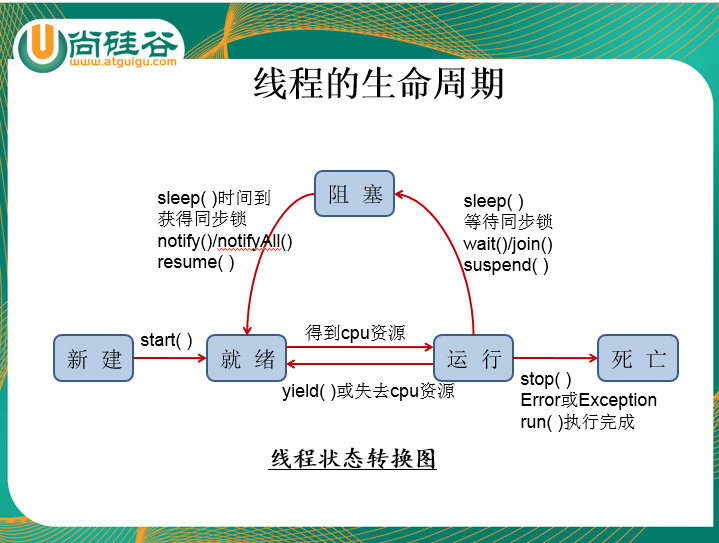
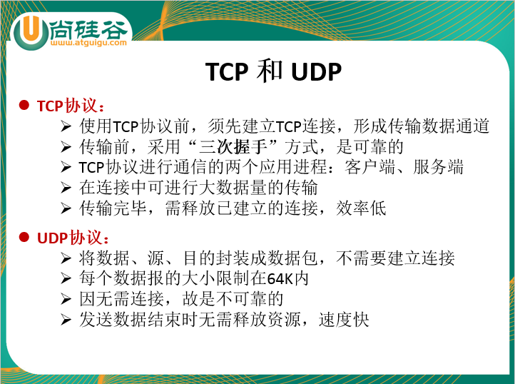
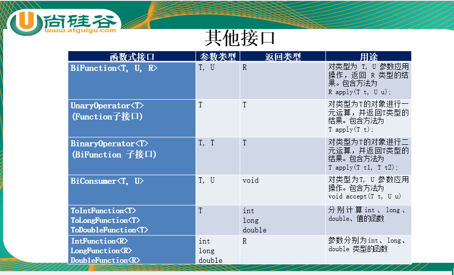
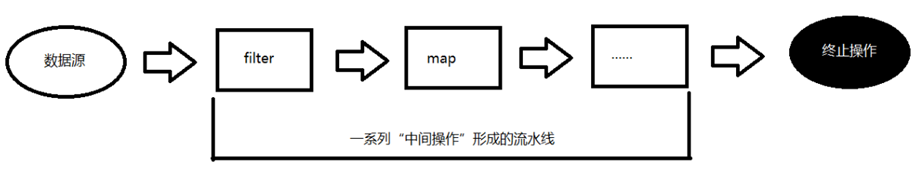
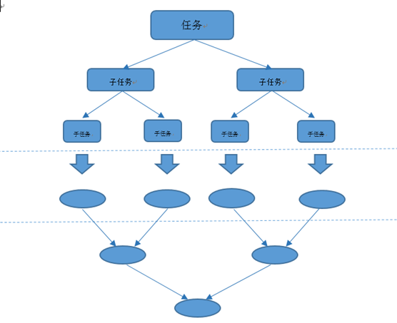

# 第十二章 IO流

## 一、IO 流的分类

1. 按流向不同：输入流、输出流（以程序为主体）
2. 按数据不同：字节流、字符流（字符流用于操作文本文件 .txt  .java  字节流用于操作非文本文件 .avi .mp3 .jpg）
3. 按角色不同：节点流、处理流


## 二、IO 流的结构体系

抽象基类				节点流					缓冲流（处理流的一种）

InputStream			 FileInputStream			BufferedInputStream

OutputStream		     FileOutputStream		     BufferedOutputStream(flush() 强制清空缓冲区)

Reader				  FileReader			          BufferedReader(readLine() 一次读一行，默认读取 \r\n回车换行序列)

Writer				    FileWriter				    BufferedWriter（newLine()）


## 三、缓冲流

处理流的一种，包装现有节点流，用于提高效率，内置缓冲区


```java
//非文本文件的复制
@Test
public void test1(){
	//3. 创建 BufferedInputStream 的实例，包装对应的节点流，用于提高效率
	BufferedInputStream bis = null;
	//4. 创建 BufferedOutputStream 的实例，包装对应的节点流，用于提高效率
	BufferedOutputStream bos = null;
	try {
		//1. 创建 FileInputStream 的实例，同时打开指定文件
		FileInputStream fis = new FileInputStream("C:\\Users\\LI/Desktop/1.jpg");
		
		//2. 创建 FileOutputStream 的实例，同时打开指定文件
		FileOutputStream fos = new FileOutputStream("C:\\Users\\LI\\Desktop\\2.jpg");
		
		bis = new BufferedInputStream(fis);
		
		bos = new BufferedOutputStream(fos);
		
		//5. 通过 read(byte[] b)读取指定文件的内容
		byte[] b = new byte[1024];
		int len = 0; //接收实际读取的字节总数
		while((len = bis.read(b)) != -1){
			//6. 通过 write(byte[] b, int off, int len) 将读取的内容写到目标地点去
			bos.write(b, 0, len);
            //bos.flush();//强制清空换缓冲区，但是会影响效率
		}
	} catch (IOException e) {
		e.printStackTrace();
	} finally {

		//7. 关闭流
		if(bos != null){
			try {
				bos.close();
			} catch (IOException e) {
				e.printStackTrace();
			}
		}
		
		if(bis != null){
			try {
				bis.close();
			} catch (IOException e) {
				e.printStackTrace();
			}
		}
	}
}
```

## 四、对象流

ObjectInputStream & ObjectOutputStream


1. 对象的序列化：将内存中的对象永久的以二进制形式保存到磁盘中。

   ①创建节点流的对象

   ②（可选）使用缓冲流包装现有节点流，用于提高效率

   ③创建对象流包装现有缓冲流，用于序列化

   ④通过 writeXxx() 方法 Xxx: 对应的数据类型，完成对象的序列化操作

   ⑤关闭流

   ⑥需要序列化对象的类必须实现 java.io.Serializable 接口（该类其他属性也必须实现该接口）

   ⑦需要提供一个序列号，保证如何序列化就如何反序列化

   ​	public static final long serialVersionUID = 9239893899894L;

2. 对象的反序列化：将磁盘中的数据进行读取

```java
public class ObjectStreamTest {

	// 反序列化
	@Test
	public void test1() {
		ObjectInputStream ois = null;

		try {
			FileInputStream fis = new FileInputStream("./person.dat");
			BufferedInputStream bis = new BufferedInputStream(fis);
			ois = new ObjectInputStream(bis);

			/*Person p1 = (Person) ois.readObject();
			Person p2 = (Person) ois.readObject();
			Person p3 = (Person) ois.readObject();
			System.out.println(p1);
			System.out.println(p2);
			System.out.println(p3);*/
			
			/*Person[] persons = (Person[]) ois.readObject();
			
			for (Person person : persons) {
				System.out.println(person);
			}*/
			
			List<Person> list = (List<Person>) ois.readObject();
			
			Iterator<Person> it = list.iterator();
			
			while(it.hasNext()){
				Person p = it.next();
				System.out.println(p);
			}
			
		} catch (ClassNotFoundException | IOException e1) {
			e1.printStackTrace();
		} finally {
			if (ois != null) {
				try {
					ois.close();
				} catch (IOException e) {
					e.printStackTrace();
				}
			}
		}
	}

	// 序列化
	public static void main(String[] args) {
		Person p1 = new Person("张三", 18, 98.88);
		Person p2 = new Person("李四", 20, 100.22);
		Person p3 = new Person("王五", 38, 300.33);
		
//		Person[] persons = {p1, p2, p3};
		
		List<Person> list = new ArrayList<>();
		list.add(p1);
		list.add(p2);
		list.add(p3);

		ObjectOutputStream oos = null;
		try {
			FileOutputStream fos = new FileOutputStream("./person.dat");
			BufferedOutputStream bos = new BufferedOutputStream(fos);
			oos = new ObjectOutputStream(bos);

			/*oos.writeObject(p1);
			oos.writeObject(p2);
			oos.writeObject(p3);*/
			
//			oos.writeObject(persons);
			
			oos.writeObject(list);
		} catch (IOException e) {
			e.printStackTrace();
		} finally {
			if (oos != null) {
				try {
					oos.close();
				} catch (IOException e) {
					e.printStackTrace();
				}
			}
		}

	}

}
```

## 五、控制台IO

【了解】

1. System.in : “标准”的输入流
2. System.out : "标准"的输出流(System.setOut() 可以改变 println 方法的默认输出位置)
3. System.err :"标准"的错误输出流


打印流：PrintStream & PrintWriter


## 六、转换流 

InputStreamReader & OutputStreamWriter

编码：字符串  -> 字节数组

解码：字节数组 -> 字符串

```java
	//解码
	@Test
	public void test3(){
		BufferedReader br = null;
		try {
			FileInputStream fis = new FileInputStream("hello.txt");
			InputStreamReader isr = new InputStreamReader(fis, "ISO8859-1");
			br = new BufferedReader(isr);
			
			String str = br.readLine();
			
			System.out.println(str);
		} catch (UnsupportedEncodingException e) {
			e.printStackTrace();
		} catch (IOException e) {
			e.printStackTrace();
		} finally {
			try {
				br.close();
			} catch (IOException e) {
				e.printStackTrace();
			}
		}
	}
	
	//编码
	@Test
	public void test2(){
		String str = "我大尚硅谷威武！好好学习天天向上！";
		
		BufferedWriter bw = null;
		try {
			//注意：应该使用字符流操作文本文件，暂时为了掩饰转换流的用法，使用字节流操作文本文件
			FileOutputStream fos = new FileOutputStream("hello.txt");
			OutputStreamWriter osw = new OutputStreamWriter(fos, "GBK");
			bw = new BufferedWriter(osw);
			
			bw.write(str);
		} catch (IOException e) {
			e.printStackTrace();
		} finally {
			if(bw != null){
				try {
					bw.close();
				} catch (IOException e) {
					e.printStackTrace();
				}
			}
		}
	}
```


## 七、java.io.File 类 

描述文件或目录，用于操作文件或目录新建、删除、重命名等基本操作

若需要操作文件的内容，File 对象将无能为力，需要使用 IO 流

通常 File 对象与 IO 配合使用，将 File对象作为参数传递给 IO 流的构造器。


- **访问文件名：**

  getName()：获取文件名

  getPath()：获取相对路径

  File getAbsoluteFile() ：获取绝对路径的 File 对象

  String getAbsolutePath() ：获取绝对路径对应的字符串

  getParent()：获取父路径

  renameTo(File newName)：重命名

  ​		file1.renameTo(file2) : file1 必须存在，file2 必须不存在

- **文件检测**
  exists() ： 判断文件或目录是否存在
  canWrite() ： 判断是否可写
  canRead() ：是否可读
  isFile() ：判断是不是一个文件
  isDirectory() ：判断是不是一个目录

- **获取常规文件信息**
  lastModified() ：获取最后修改时间对应的毫秒值
  length()：获取文件的大小，但是注意目录没有大小

- **文件操作相关**
  createNewFile() ：创建一个“文件”
  delete() ：删除文件，若需要删除目录必须将目录中所有的内容全部删掉再删当前目录

- **目录操作相关**
  mkDir() ：新建一个目录，如：e:/io/abc  若io包不存在则abc不能创建，若io存在则abc可以创建成功
  mkDirs() ：新建目录，如：e:/io/abc 若io包不存在则自动创建io包
  String[] list()：获取指定目录下所有的文件列表字符串名称
  File[] listFiles()：获取指定目录下所有文件和目录的 File 对象

  

------

# 第十三章 多线程

## 一、程序、进程、线程

1. 什么是程序？为了完成某项特定的任务，使用某种语言，编写一组指令的集合

2. 什么是进程？一个正在进行中程序

3. 什么是线程？在一个进程中，执行的一套功能流程，成为线程

   ​                      在一个进程中，执行的多套功能流程，成为多线程


## 二、为什么使用多线程

抢占式策略系统：系统会为每个执行任务的线程，分配一个很小的时间段，若该时间段用完后

系统会强制剥夺其 cpu 执行权，交给其他线程完成任务


1. 可以提高效率，提高效率的方式是可以尽可能的利用 cpu 的资源
2. 可以增强用户体验


## 三、如何使用多线程 Thread

两种创建执行线程的方式（实际上创建执行线程的方式有四种 Callable 线程池 - JUC）

方式一：继承 Thread 类的方式

1. 声明一个类继承 Thread
2. 重写 Thread 类的 run() 方法，同时编写线程执行体
3. 创建该子类的实例
4. 调用继承的 start() 方法，启动线程，默认调用 run()


方式二：实现 Runnable 接口的方式

1. 声明一个类实现 Runnable 接口
2. 实现接口中的 run() 方法，同时编写线程执行体
3. 创建该实现类的实例
4. 创建 Thread 类的实例
5. 将实现类的实例作为参数，传递给 Thread 类的构造器
6. 调用 Thread 类的start() 方法，启动线程，默认调用 run() 


两种方式的区别？

1. 若多个线程需要访问共享数据时，首选使用 Runnable 接口
2. 实现 Runnable 接口的方式解决了 Java 中单继承的局限性


## 四、线程的常用方法

Thread currentThread() : 是Thread 类的静态方法，用于获取当前执行的线程

String getName() : 获取线程名字（可以使用如下方式：Thread.currentThread().getName()）

setName() : 为线程设置名称

start() ：启动线程，默认执行线程执行体 run() 


线程的控制

sleep(long millis) : 是一个静态方法，使当前线程进入睡眠状态

join() / join(long millis): 是一个实例方法，使当前线程进入阻塞状态

interrupt() : 中断阻塞状态的线程，使阻塞状态的线程发生 InterruptedException

isAlive() : 判断当前线程是否处于存活状态

yield() : 线程让步


## 五、线程的生命周期




## 六、死锁问题

当多个线程彼此使用对方的资源不放弃，我们在开发过程中一定要避免死锁的发生

1. 减少共享资源的定义
2. 使用一些算法

```java
package com.atguigu.java;

/*
 * 死锁问题：
 */
public class DeadLockTest {
	
	public static void main(String[] args) {
		DeadLock dl = new DeadLock();
		Thread t1 = new Thread(dl);
		t1.start();
		
		DeadLock dl2 = new DeadLock();
		dl2.flag = false;
		Thread t2 = new Thread(dl2);
		t2.start();
	}

}

class DeadLock implements Runnable{
	
	static Object obj1 = new Object(); //共享资源1
	static Object obj2 = new Object(); //共享资源2
	
	public boolean flag = true;
	
	@Override
	public void run() {
		
		if(flag){
			
			synchronized (obj1) {
				System.out.println("获取共享资源1，等待共享资源2……");
				
				synchronized (obj2) {
					System.out.println("---------------------");
				}
				
			}
			
		}else{
			
			synchronized (obj2) {
				System.out.println("获取共享资源2，等待共享资源1……");
				
				synchronized (obj1) {
					System.out.println("************************");
				}
			}
			
		}
		
	}
	
	
	
}
```

## 七、线程同步

模拟案例，实现三个窗口同时售票100张

问题：当多个线程同时访问共享数据时，产生了无序、重复、负数等多线程安全问题

解决：将多个线程需要访问的共享数据包装起来，视为一个整体，确保一次只有一个线程执行流访问该数据


Java 为上述问题提供了相应的解决办法：


1. 同步代码块

   synchronized(同步监视器){

   ​	//需要访问的共享数据

   }

   同步监视器：俗称“锁”，可以使用任意对象充当，但是必须保证多个线程持有同一把锁（同一个对象）

2. 同步方法：在方法的声明处加 synchronized 关键字

   修饰符 synchronized 返回值类型 方法名(参数列表){

   

   }

   注意：

    	1. 非静态同步方法的锁为 this
    	2. 静态同步方法的锁为当前类对应的 Class 实例

3. 同步锁jdk1.5后：Lock

   	> 1. lock() 上锁
      	>
         	> 2. unlock() 释放锁
         	>
         	>    注意：必须保证 unlock 释放锁被执行，因此通常将 unlock 放到 finally 中

```java
public class ThreadTest {
	
	public static void main(String[] args) {
		Ticket ticket = new Ticket();
		
		Thread t1 = new Thread(ticket, "1号窗口");
		t1.start();
		
		Thread t2 = new Thread(ticket, "2号窗口");
		t2.start();
		
		Thread t3 = new Thread(ticket, "3号窗口");
		t3.start();
	}

}

class Ticket implements Runnable{
	
	int tick = 100;
	Object obj = new Object();
	
	Lock l = new ReentrantLock();

	@Override
	public void run() {
		
		while(true){
			
			//同步代码块，obj 俗称的“锁”
			/*synchronized (obj){
			
				if(tick > 0){
					
					try {
						Thread.sleep(50);
					} catch (InterruptedException e) {
					}
					
					System.out.println(Thread.currentThread().getName() + " 完成售票，余票为：" + --tick);
				}
			}*/
			
			//同步方法
			//test();
			
			//同步锁
			l.lock();//上锁
			
			try{
				if(tick > 0){
					
					try {
						Thread.sleep(50);
					} catch (InterruptedException e) {
					}
					
					System.out.println(Thread.currentThread().getName() + " 完成售票，余票为：" + --tick);
				}
			}finally{
				l.unlock();//释放锁
			}
		}
		
	}
	
	public synchronized void test(){
		if(tick > 0){
			
			try {
				Thread.sleep(50);
			} catch (InterruptedException e) {
			}
			
			System.out.println(Thread.currentThread().getName() + " 完成售票，余票为：" + --tick);
		}
	}
	
}

```

## 八、单例设计模式之懒汉式的多线程安全问题

```java
package com.atguigu.review;

public class SingletonTest {
	
	public static void main(String[] args) {
		Singleton s1 = Singleton.getInstance();
		Singleton s2 = Singleton.getInstance();
		
		System.out.println(s1 == s2);
		
	}

}

class Singleton{
	
	//2. 类的内部创建一个对象
	private static Singleton instance = null;
	
	//1. 私有化构造器
	private Singleton(){
		
	}
	
	public static Singleton getInstance(){
		if(instance == null){
			synchronized (Singleton.class) {
				if(instance == null){
					instance = new Singleton();
				}
			}
		}
		
		return instance;
	}
}

```

## 九、线程通信

线程通信 （线程交互），当多个线程完成某些任务时，时线程之间需要一定的通信，即线程通信


【等待唤醒机制】

wait() : 使当前“同步监视器”上的线程进入等待状态

notify() / notifyAll() : 唤醒当前“同步监视器”上（一个/所有）等待状态的线程

注意：

1. 上述方法必须使用在同步监视器（俗称：锁）中
2. wait() 处于等待状态的同时，释放锁的资源

【例题】

```java
package com.atguigu.review;

/*
1.创建和启动2个子线程，一个打印1-10之间奇数，一个打印1-10之间偶数，

（1）要求每个线程要么不打印，要么就连续打印5个数，每个数打印间隔500毫秒

（2）但两个线程要求交替打印。
 */
public class ReviewTest {
	
	public static void main(String[] args) {
		PrintOdd po = new PrintOdd();
		new Thread(po, "奇数").start();
		
		PrintEven pe = new PrintEven();
		new Thread(pe, "偶数").start();
	}

}

class PrintOdd implements Runnable{
	
	int num = 1;

	@Override
	public void run() {
		while(true){
			synchronized (Thread.class) {
                //注意知识点
				Thread.class.notify();
				
				for (int i = 0; i < 5; i++) {
					System.out.println(Thread.currentThread().getName() + ":" + num);
					num += 2;
					try {
						Thread.sleep(500);
					} catch (InterruptedException e) {
					}
				}
				
				try {
                    //注意知识点
					Thread.class.wait();
				} catch (InterruptedException e) {
				}
			}
		}
	}
	
}

class PrintEven implements Runnable{
	int num = 0;

	@Override
	public void run() {
		while(true){
			synchronized (Thread.class) {
				Thread.class.notify();
				
				for (int i = 0; i < 5; i++) {
					System.out.println(Thread.currentThread().getName() + ":" + num);
					num += 2;
					try {
						Thread.sleep(500);
					} catch (InterruptedException e) {
					}
				}
				
				try {
					Thread.class.wait();
				} catch (InterruptedException e) {
				}
			}
		}
	}
	
	
}
```


【经典案例】生产者消费者案例

添加或创建数据的线程：生产者线程

删除或销毁数据的线程：消费者线程

若生产者线程过快，可能造成数据丢失

若消费者线程过快，可能造成接收错误数据


```java
package com.atguigu.java;

/*
 * 生产者(Productor)将产品交给店员(Clerk)，而消费者(Customer)从店员处取走产品，
 * 店员一次只能持有固定数量的产品(比如:20），如果生产者试图生产更多的产品，店员会叫生产者停一下，
 * 如果店中有空位放产品了再通知生产者继续生产；如果店中没有产品了，店员会告诉消费者等一下，
 * 如果店中有产品了再通知消费者来取走产品。
 */
public class ProductorAndCustomerTest {
	
	public static void main(String[] args) {
		Clerk clerk = new Clerk();
		
		Productor pro = new Productor(clerk);
		Customer cus = new Customer(clerk);
		
		new Thread(pro, "生产者A").start();
		new Thread(cus, "消费者B").start();

		new Thread(pro, "生产者C").start();
		new Thread(cus, "消费者D").start();
	}

}

class Clerk{
	
	private int product;

	public Clerk() {
	}

	public Clerk(int product) {
		this.product = product;
	}
	
	//进货
	public synchronized void get(){//剩余循环次数：0
		while(product >= 20){
			System.out.println("产品已满");
			
			try {
				this.wait();
			} catch (InterruptedException e) {
			}
			
		}
		
		System.out.println("生产者生产了第" + ++product + " 个产品");
		this.notifyAll();
		
	}
	
	//卖货
	public synchronized void sale(){//product=0,剩余循环次数：0 
		while(product <= 0){
			System.out.println("缺货");
			
			try {
				this.wait();//虚假唤醒，为了避免虚假唤醒，wait 应该总是使用在循环中
			} catch (InterruptedException e) {
			}
		}
		
		System.out.println("消费者消费了第" + --product + " 个产品");
		this.notifyAll();
		
	}
	
}

//生产者
class Productor implements Runnable{
	private Clerk clerk;

	public Productor() {
	}

	public Productor(Clerk clerk) {
		this.clerk = clerk;
	}

	public Clerk getClerk() {
		return clerk;
	}

	public void setClerk(Clerk clerk) {
		this.clerk = clerk;
	}

	@Override
	public void run() {
		for (int i = 0; i < 20; i++) {
			
			try {
				Thread.sleep(200);
			} catch (InterruptedException e) {
			}
			
			clerk.get();
		}
	}
	
}

//消费者
class Customer implements Runnable{
	private Clerk clerk;

	public Customer() {
	}

	public Customer(Clerk clerk) {
		this.clerk = clerk;
	}

	public Clerk getClerk() {
		return clerk;
	}

	public void setClerk(Clerk clerk) {
		this.clerk = clerk;
	}

	@Override
	public void run() {
		for (int i = 0; i < 20; i++) {
			clerk.sale();
		}
	}
	
	
}
```


# 第十四章 反射机制

## 一、Java程序运行的两种状态

编译时：通过 javac 命令，生成一个或多个.class 字节码文件（每个类对应着一个 .class 字节码）

运行时：通过 java 命令，将一个或多个 .class 字节码文件加载到内存中（由JVM提供类加载器ClassLoader）


## 二、面向对象的过程

类用于描述现实生活中的一类事物，有属性、有方法。若需要具体到某一个事物，

通过 new 关键字，创建对象，然后操作其属性，调用其方法。

（在编译时就可以确定创建什么对象、操作什么属性、调用什么方法）


//反射之前

public void test(){

​	Person p = new Person();

​	p.eat();

}


在某种情况下，需要得知并使用一个编译时完全未知的类，创建其对象，操作其属性，调用其方法

//编写时，利用反射通用的

public T get(Class<T> clazz){

​	//N行代码查询数据库的数据

​	return clazz.newInstance();

} 


//运行时，当方法被调用，该方法进入运行

get(Person.class);

get(Employee.class);


## 三、反射机制

被视为动态语言的关键，可以在运行时创建任意类的对象，操作任意对象的属性，调用任意对象的方法


## 四、反射的功能

在运行时判断任意对象类

在运行时创建任意类的对象

在运行时判断任意类的属性和方法

在运行时操作任意对象的属性和方法

生成动态代理


## 五、Class 是开启反射的源头！

获取 Class 实例的四种方式：

1. 通过运行时类 class 属性 如： Class clazz = Person.class;

2. 通过运行时对象的 getClass() 方法  

   如：

   ​	Person p = new Person();

   ​	Class clazz = p.getClass();

   

3. 通过 Class 类中的静态方法 forName(String className)

   如：

   Class clazz = Class.forName("com.atguigu.java.Person"); 

   //com.atguigu.java.Person 包名+类名称为全限定类名，简称全类名

4. 通过类加载器（了解）

   Class clazz = this.getClass();

   ClassLoader cl = clazz.getClassLoader();

   Class clazz = cl.loadClass("com.atguigu.java.Person");

## 六、Properties 读取属性文件，通过类加载类路径的方式

```java
package com.atguigu.review;

import java.io.IOException;
import java.io.InputStream;
import java.util.Properties;

public class PropertiesTest {
	
	public static void main(String[] args) throws IOException {
		//1. 创建一个 Properties 的实例
		Properties props = new Properties();
		
		//2. 通过 load(InputStream in)与jdbc.properties 关联
		//props.load(new FileInputStream("jdbc.properties"));
		
		ClassLoader cl = PropertiesTest.class.getClassLoader();
		//以流的形式获取资源，参数列表为类加载路径（包路径）
		InputStream in = cl.getResourceAsStream("com/atguigu/review/jdbc.properties");
		props.load(in);
		
		
		//3. 根据 String 类型的 key 获取 String 类型的 value
		String username = props.getProperty("username");
		String password = props.getProperty("password");
		
		System.out.println(username);
		System.out.println(password);
	}

}

```

```java
package com.atguigu.review;

import java.lang.reflect.Constructor;
import java.lang.reflect.Field;
import java.lang.reflect.Method;
import java.lang.reflect.ParameterizedType;
import java.lang.reflect.Type;

import org.junit.Test;

public class ReflectionTest {
	
	//获取并调用运行时类的构造器
	@Test
	public void test5() throws Exception{
		Class<Person> clazz = Person.class;
		Constructor<Person> constructor = clazz.getDeclaredConstructor(String.class, int.class);
		constructor.setAccessible(true);
		Person p = constructor.newInstance("王五", 20);
		System.out.println(p);
	}
	
	//创建运行时类的对象:newInstance() 默认调用无参构造器
	@Test
	public void test4() throws Exception{
		Class<Person> clazz = Person.class;
		Person p = clazz.newInstance();
		System.out.println(p);
	}
	
	//获取并调用运行时类对象的方法
	@Test
	public void test3() throws Exception, SecurityException{
		Class<Person> clazz = Person.class;
		Person p = clazz.newInstance();
		
		//1. 无参无返回值
		Method m1 = clazz.getMethod("eat");
		m1.invoke(p);
		
		System.out.println("----------------------------------");
		
		//2. 有参无返回值
		Method m2 = clazz.getMethod("setName", String.class, int.class, double.class);
		Object obj = m2.invoke(p, "李四", 20, 180);
		System.out.println("接收返回值：" + obj);
		
		//3. 无参有返回值
//		Method m3 = clazz.getMethod("sleep");
		Method m3 = clazz.getDeclaredMethod("sleep");
		m3.setAccessible(true);//忽略访问权限
		Object obj2 = m3.invoke(p);
		System.out.println(obj2);
	}
	
	
	//获取并操作运行时类对象的属性
	@Test
	public void test2() throws Exception{
		Class<Person> clazz = Person.class;
		
		Person p = clazz.newInstance();
		
		Field age = clazz.getField("age");
		//设置属性值
		age.set(p, 18);
		//获取属性值
		Object value = age.get(p);
		System.out.println(value);
		
		System.out.println("-----------------------------");
		
		Field name = clazz.getDeclaredField("name");
		name.setAccessible(true);//忽略访问权限
		name.set(p, "张三");
		Object value2 = name.get(p);
		System.out.println(value2);
		
	}
	
	//获取运行时类带泛型父类的泛型类型
	@Test
	public void test1() throws Exception{
		Class clazz = Class.forName("com.atguigu.review.Person");
		
		//1. 获取带泛型父类的类型 com.atguigu.review.Creature<java.lang.String> c;
		Type type = clazz.getGenericSuperclass();
		
		//2. 参数化类型
		ParameterizedType pt = (ParameterizedType) type;
		
		//3. 获取真实实际参数的类的数组
		Type[] actualTypeArguments = pt.getActualTypeArguments();
		
		/*for (Type type2 : actualTypeArguments) {
			Class cl = (Class) type2;
			System.out.println(cl.getName());
		}*/
		Class cl = (Class) actualTypeArguments[0];
		System.out.println(cl.getName());
	}

}

```

# 第十五章 网络编程

## 一、网络通信需要考虑两点要素

### 1、确定通信双方的地址

​	IP 地址：192.168.1.8

​	域名： www.atguigu.com


​	Java 中使用 InetAddress 表示 IP 地址

​		getByName(String host) : 通过主机名或IP地址获取一个 InetAddress 实例

​		getHostName() ：获取主机名

​		getHostAddress(): 获取主机地址

2、若需要可靠高效的完成数据传输，需要满足一定的规则，即网络通信协议（TCP、UDP）



## 二、使用 TCP 协议完成网络通信

客户端：Socket ：套接字（一个IP地址和一个端口号的组合）

服务端：ServerSocket

​		>>accpet() : 监听并获取当前连接的那个 Socket

## 三、使用 UDP 协议完成网络通信

接收端 & 发送端：DatagramSocket 、DatagramPacket

## 四、使用 URL 编程

URL 称为统一资源定位符，表示指定某一站点的资源

Øpublic String getProtocol(  )     获取该URL的协议名

Øpublic String getHost(  )           获取该URL的主机名

Øpublic String getPort(  )            获取该URL的端口号

Øpublic String getPath(  )           获取该URL的文件路径

Øpublic String getFile(  )             获取该URL的文件名

Øpublic String getRef(  )             获取该URL在文件中的相对位置

Øpublic String getQuery(   )        获取该URL的查询名


openStream() : 获取指定站点资源对应 InputStream

openConnection() : 得到 URLConnection 与指定站点建立连接

URLConnection:

	>getInputStream()
	>
	>getOutputStream()

# 第十六章 设计模式

## 一、面向对象的回顾

面向对象编程（Object Oriented Programming OOP）

面向对象与面向过程：

面向过程：强调的是功能行为。

面向对象：将功能行为封装进对象，强调那个具备了功能行为的对象


【经典案例】把大象装冰箱一共分几步？

1. 打开冰箱 2.把大象装进去（存储大象）3. 关闭冰箱

如何运用面向对象思想思考上述问题？

驯兽师{

​	脑子；（组合，强拥有）

​	电器；（成员变量，关联）

​	动物实物[];


​	推（）{

​		电器.关闭（）；

​	}


​	/*玩游戏（王者荣耀）{ 违反了单一职责原则


​	}*/


​	指挥（动物）{

​		动物.进入（）;

​	}


​	拉（）{

​		电器.打开（）；

​	}

}


interface 电器{

​	打开（）；

​	存储（）；

​	关闭（）；

}


冰箱 impements 电器{

​	打开（）{}

​	存储（）{}

​	关闭（）{}

}


微波炉 impements 电器{

​	打开（）{}

​	存储（）{}

​	关闭（）{}

}


abstract 动物{

​	进入（）；

}


interface 水生动物{

​	游泳（）；

}


interface 飞禽{

​	飞翔（）；

}


interface 陆地动物{

​	奔跑（）；

}


大象 extends 动物 implements 陆地动物{

​	进入（）{}

​	奔跑（）{}

}


猴子 extends 动物{

​	进入（）{}

}


大老虎 extends 动物{

​	进入（）{}

}


企鹅 implements飞禽{

​	飞翔（）{}//企鹅并不会飞，因此违背了里氏替换原则

}

面向对象更加注重前期的设计，一旦设计好了就具备很好的通用性和可扩展性。

## 二、面向对象开发原则

软件开发中尽量做到高内聚、低耦合

### 1、单一职责原则

各司其职，一个类的功能尽量不要依赖另一个类。一个类中应该仅有一个让其变化的原因。

### 2、开闭（开放封闭）原则

对扩展开放、对修改关闭

### 3、依赖倒置（倒转）原则

面向接口编程思想的一种表现，高层模块不应该依赖低层模块，抽象不应该依赖细节，应倒置过来，细节依赖抽象

### 4、接口隔离原则

与单一职责原则类似，接口模块之间应该相互隔离

### 5、里氏替换原则

子类必须能够替换父类。

继承缺点：

1. 继承是侵入性的，一旦继承某个类，继承了该类中所有的属性和方法
2. 增加了耦合性，一旦父类做了修改，所有子类都随之修改，有可能发生故障

### 6、迪米特法则（最少知道法则）

一个类对自己依赖的类知道的越少越好。该隐藏的隐藏起来，该暴露的暴露出来。

### 7、合成/聚集复用原则

对象的关联关系：泛化（继承）、实现、依赖、关联、合成（组合）、聚合

除了泛化、实现，其余的关联关系在Java只有两种体现，一个是成员变量、一个是局部变量

依赖，一个类中使用了另一个对象的功能。人过河-依赖船

关联，强依赖关系。我上课依赖-电脑

​	class Teacher{

​		Computer comuter;

​	}

聚合：整体和部分的关系 has a ，弱拥有。西游记，师徒四人西天取经。孙悟空若没有唐僧可以吗？可以。

组合：整体和部分的关系 has a ，强拥有。西游记，师徒四人西天取经。唐僧若没有孙悟空可以取经吗？不可以

## 三、设计模式

设计模式就是在大量的实践中总结和理论化的优选的代码结构、编程风格、以及解决问题的方式。

可以把设计模式理解成棋谱，不同的棋局使用不同的棋谱，免去我们过多的思考和探索。

设计模式共有23种：

创建型：**单例模式、工厂模式、**抽象工厂模式、建造者模式、原型模式

结构型：**代理模式、装饰者模式**、适配器模式、组合模式、享元模式、桥接模式、外观模式

行为型：**迭代器模式、观察者模式、模板方法模式、**命令模式、访问者模式、备忘录模式、中介模式、解释器模式

**策略模式**、状态模式、责任链模式

### 1、单例模式

整个软件系统运行过程中，某个类只有一个实例

```java
package com.atguigu.singleton;

/*
 * 单例模式
 */
public class SingletonTest {
	
	public static void main(String[] args) {
		Singleton7 instance1 = Singleton7.getInstance();
		Singleton7 instance2 = Singleton7.getInstance();
		
		System.out.println(instance1 == instance2);
	}

}

//饿汉式
//对象随着类的加载被创建，类只加载一次，因此饿汉式无多线程安全问题
//缺点：若某个实例不被使用，有点浪费资源
enum Singleton1{
	INSTANCE;
}

class Singleton2{
	public static final Singleton2 INSTANCE = new Singleton2();
}

class Singleton3{
	private static final Singleton3 INSTANCE = new Singleton3();
	
	private Singleton3(){
		
	}
	
	public static Singleton3 getInstance(){
		return INSTANCE;
	}
}

//懒汉式
//不考虑多线程安全问题
class Singleton4{
	private static Singleton4 instance = null;
	
	private Singleton4(){
		
	}
	
	public static Singleton4 getInstance(){
		if(instance == null){
			instance = new Singleton4();
		}
		
		return instance;
	}
}

//懒汉式需要考虑多线程安全问题
//缺点：每次调用方法，都需要先判断锁的操作，因此效率低，不建议使用
class Singleton5{
	private static Singleton5 instance = null;
	
	private Singleton5(){
		
	}
	
	public static synchronized Singleton5 getInstance(){//Singleton5.class
		if(instance == null){
			instance = new Singleton5();
		}
		
		return instance;
	}
}

//懒汉式，虽然第一次多判断了一个if，但是后续的线程不需要每次都判断锁的操作，因此效率略高，建议使用
class Singleton6{
	private static Singleton6 instance = null;
	
	private Singleton6(){
		
	}
	
	public static Singleton6 getInstance(){
		if(instance == null){
			synchronized (Singleton6.class) {
				if(instance == null){
					instance = new Singleton6();
				}
			}
		}
		
		return instance;
	}
}

//静态内部类:该方式，外部类被加载，内部类中对象不会被创建，也可实现延迟加载，因此建议使用
class Singleton7{
	
	private static class InnerClass{
		private static final Singleton7 INSTANCE = new Singleton7();
	}
	
	public static Singleton7 getInstance(){
		return InnerClass.INSTANCE;
	}
}
```

### 2、工厂模式

当有大量对象需要创建时，可以选择使用工厂模式

#### 1）简单工厂模式

```java

//简单工厂设计模式
class SimpleFactory{
	
	public static Mobile createMobile(String type){
		if("安卓".equals(type)){
			return new Android();
		}else if("苹果".equals(type)){
			return new Iphone();
		}
		
		return null;
	}
	
}

interface Mobile{
	
	//打电话
	
	//发短信
	
	//上网
	
}

class Android implements Mobile{
	
	//打电话
	
	//发短信
	
	//上网

}

class Iphone implements Mobile{

	//打电话
	
	//发短信
	
	//上网

	
}

class WinPhone implements Mobile{
	//打电话
	
	//发短信
	
	//上网

}
```

#### 2）工厂方法模式

```java
package com.atguigu.factory;

public class FactoryMethodTest {
	
	public static void main(String[] args) {
		
		FuTuKangFactory ftk1 = new AndroidFactory();
		Android a1 = (Android) ftk1.createMobile();
		System.out.println(a1);
		
		System.out.println("---------------------");
		
		FuTuKangFactory ftk2 = new WinPhoneFactory();
		Mobile mobile = ftk2.createMobile();
		System.out.println(mobile);
	}

}

interface FuTuKangFactory{
	
	public Mobile createMobile();
	
}

class AndroidFactory implements FuTuKangFactory{

	@Override
	public Mobile createMobile() {
		return new Android();
	}
	
}

class IphoneFactory implements FuTuKangFactory{

	@Override
	public Mobile createMobile() {
		return new Iphone();
	}
	
}

class WinPhoneFactory implements FuTuKangFactory{

	@Override
	public Mobile createMobile() {
		return new WinPhone();
	}
	
}
```

### 3、代理模式

一个类的对象不想或者不能直接被访问的时候，可以使用代理模式

#### 1）静态代理

```java
package com.atguigu.proxy;

public class ProxyTest {
	
	public static void main(String[] args) {
		CoalBossProxy cbp = new CoalBossProxy();
		cbp.meet();
		cbp.consume();
	}

}

interface Boss{
	
	public void meet();
	
	public void consume();
	
}

//被代理类
class CoalBoss implements Boss{

	@Override
	public void meet() {
		System.out.println("与煤老板见面");
	}

	@Override
	public void consume() {
		System.out.println("让煤老板消费");
	}
	
}

//代理类
class CoalBossProxy implements Boss{
	
	private CoalBoss cb;
	
	public CoalBossProxy(){
		cb = new CoalBoss();
	}

	@Override
	public void meet() {
		System.out.println("-----------代理开始-----------");
		cb.meet();
		System.out.println("-----------代理结束-----------");
	}

	@Override
	public void consume() {
		System.out.println("-----------代理开始-----------");
		cb.consume();
		System.out.println("-----------代理结束-----------");
	}
	
}

```

#### 2）动态代理

```java
package com.atguigu.proxy;

import java.lang.reflect.InvocationHandler;
import java.lang.reflect.Method;
import java.lang.reflect.Proxy;

/*
 * 动态代理:需要实现 java.lang.reflect.InvocationHandler; 接口
 * 
 * public Object invoke(Object proxy, Method method, Object[] args) 
 * 
 * proxy : 传递的是动态生成的代理对象
 * method : 需要执行方法的 Method 的实例
 * args : method.invoke() 需要的实际参数值
 */
public class DynamicProxyTest {
	
	public static void main(String[] args) {
		DynamicProxyHandler dph = new DynamicProxyHandler();
		Boss cb = (Boss) dph.newProxyInstance(new CoalBoss());
		cb.meet();
		cb.consume();
		
		Boss sb = (Boss) dph.newProxyInstance(new SteelBoss());
		sb.meet();
		sb.consume();
	}

}

class DynamicProxyHandler implements InvocationHandler{
	
	//目标对象
	private Object target;
	
	//生成动态代理对象
	public Object newProxyInstance(Object target){
		this.target = target;
		
		/*
		 * 第一个参数：通常与目标对象的类加载器一致。（目标对象由哪个类加载器加载，动态代理类就由哪个类加载器加载）
		 * 第二个参数：通常与目标对象实现的接口保持一致。（实现了哪些接口，就相当于有哪些方法）
		 * 第三个参数：需要实现了 InvocationHandler 接口实现类的实例。（目的执行该接口中的 invoke() 方法）
		 * 			invoke 动态执行目标对象的方法（Method实例）
		 */
		return Proxy.newProxyInstance(target.getClass().getClassLoader(), target.getClass().getInterfaces(), this);
	}
	
	
	@Override
	public Object invoke(Object proxy, Method method, Object[] args) throws Throwable {
		System.out.println("-----------代理开始-----------");
		
		Object obj = method.invoke(target);
		
		System.out.println("-----------代理结束-----------");
		
		return obj;
	}
	
}
```

### 4、装饰者模式

在现有功能基础上添加新功能，不会影响原来的功能，动态的给对象添加新功能。

装饰者典型案例：IO流

```java
package com.atguigu.decorator;

public class DecoratorTest2 {
	
	public static void main(String[] args) {
		Person p = new Person("丹阳");
		XiFu xf = new XiFu(p);
		RenZiTuo rzt = new RenZiTuo(xf);
		
		System.out.println(rzt.show() + " 去约会喽~");
		
		Person p2 = new Person("明州");
		PiFeng pf = new PiFeng(p2);
		XiFu xf2 = new XiFu(pf);
		ChenShan cs = new ChenShan(xf2);
		
		System.out.println(cs.show() + " 去见如花喽~");
	}

}

// 抽象组件接口
interface Component {

	public String show();

}

// 具体的构建对象
class Person implements Component {

	private String name;

	public Person(String name) {
		this.name = name;
	}

	public Person() {
	}

	public String getName() {
		return name;
	}

	public void setName(String name) {
		this.name = name;
	}

	@Override
	public String show() {
		return getName() + " 穿着";
	}
}

//抽象装饰者
abstract class Decorator extends Person{
	private Person person;
	
	//没有提供无参构造器
	
	public Decorator(Person person){
		this.person = person;
	}
	
	public String show(){
		return person.show();
	}
}

//具体装饰
class XiFu extends Decorator{

	public XiFu(Person person) {
		super(person);
	}
	
	public String show(){
		return super.show() + " 西服";
	}
}

class ChenShan extends Decorator{

	public ChenShan(Person person) {
		super(person);
	}
	
	public String show(){
		return super.show() + " 衬衫";
	}
	
}

class RenZiTuo extends Decorator{

	public RenZiTuo(Person person) {
		super(person);
	}
	
	public String show(){
		return super.show() + " 人字拖";
	}
	
}

class PiFeng extends Decorator{

	public PiFeng(Person person) {
		super(person);
	}
	
	public String show(){
		return super.show() + " 红披风";
	}
}
```

### 5、模板方法模式

当某个类中某一部分功能是确定的，一部分功能是不确定的，将不确定的部分交给子类完成

```java
package com.atguigu.template;

/*
 * 模板方法模式
 */
public class TemplateTest {

	public static void main(String[] args) {
		/*SubClass sc = new SubClass();
		sc.getTime();*/
		
		SubClass2 sc = new SubClass2();
		sc.getTime();
	}
	
}

//需求：计算一段程序的执行时间
abstract class Template{
	
	//钩子方法:可以提供实现，也可以不提供具体的实现
	public void hook(){
		
	}
	
	public void getTime(){
		
		long start = System.currentTimeMillis();
		
		//
		code();
		
		long end = System.currentTimeMillis();
		
		System.out.println("耗费时间为：" + (end - start));
		
	}
	
	public abstract void code();
}

class SubClass extends Template{

	@Override
	public void code() {
		for (int i = 0; i < 1000; i++) {
			if(i % 2 == 0){
				System.out.println(i);
			}
		}
	}
}

class SubClass2 extends Template{
	
	public void hook(){
		System.out.println("时间不够，代码来凑！");
	}

	@Override
	public void code() {
		for (int i = 0; i < 1000; i++) {
			if(i % 2 != 0){
				System.out.println(i);
			}
		}
		
		hook();
	}
	
}
```

### 6、迭代器模式

也叫游标模式，源自于集合 List、Set

```java
package com.atguigu.iterator;

import java.util.Iterator;
import java.util.LinkedList;

public class IteratorTest {
	
	public static void main(String[] args) {
		MyQueue<String> mq = new MyQueue<>();
		mq.add("AA");
		mq.add("BB");
		mq.add("CC");
		mq.add("DD");
		mq.add("EE");
		
		Iterator<String> it = mq.getIterator();
		
		while(it.hasNext()){
			System.out.println(it.next());
		}
	}

}

//堆栈：先进后出
//队列：先进先出
class MyQueue<T>{
	
	private LinkedList<T> ll = new LinkedList<>();
	
	//添加
	public void add(T t){
		ll.addFirst(t);
	}
	
	//获取
	public T get(){
		return ll.removeFirst();
	}
	
	//判断
	public boolean isNull(){
		return ll.isEmpty();
	}
	
	public Iterator<T> getIterator(){
		return new MyIteractor();
	}
	
	private class MyIteractor implements Iterator<T>{

		@Override
		public boolean hasNext() {
			return !isNull();
		}

		@Override
		public T next() {
			return get();
		}
		
	}
}
```

### 7、观察者模式（发布-订阅模式）

一对多的关系，维护着多个观察者对象监听同一个主体对象，一旦主体对象发生变化，会通知所有观察者，使观察者们能够自动更新

```java
package com.atguigu.observer;

import java.util.ArrayList;
import java.util.List;

/*
 * 观察者模式
 */
public class ObserverTest {
	
	public static void main(String[] args) {
		/*SchoolActivitySubject sas = new ConActivitySubJect();
		sas.add(new JuanJuanTeacher());
		sas.add(new YingyingTeacher());
		
		sas.activity();*/
		
		SchoolActivitySubject sas = new ConActivitySubJect2();
		sas.add(new JuanJuanTeacher());
		sas.add(new YingyingTeacher());
		sas.add(new NiniTeacher());
		
		sas.activity();
	}

}

//抽象主体：用于被所有观察者监听，维护着所有观察者
abstract class SchoolActivitySubject{
	
	//维护的所有观察者集合可以被继承
	protected List<TeacherObserver> list = new ArrayList<>();
	
	//添加观察者
	public void add(TeacherObserver o){
		list.add(o);
	}
	
	//删除观察者
	public void remove(TeacherObserver o){
		list.remove(o);
	}
	
	//抽象主体活动发布
	public abstract void activity();
}

class ConActivitySubJect extends SchoolActivitySubject{

	@Override
	public void activity() {
		System.out.println("全体请注意：");
		for (TeacherObserver teacherObserver : list) {
			teacherObserver.inform("全体师生4.1日春游");
		}
	}
	
}

class ConActivitySubJect2 extends SchoolActivitySubject{

	@Override
	public void activity() {
		System.out.println("全体特别注意：");
		for (TeacherObserver teacherObserver : list) {
			teacherObserver.inform("4.1愚人节，逗你们玩~");
		}
	}
	
}

//抽象观察者
abstract class TeacherObserver{
	
	//更新操作
	public abstract void inform(String str);
	
}

//具体观察者之一
class JuanJuanTeacher extends TeacherObserver{

	@Override
	public void inform(String str) {
		System.out.println("通知北京200211班全体同学：" + str);
	}
	
}

class YingyingTeacher extends TeacherObserver{

	@Override
	public void inform(String str) {
		System.out.println("通知深圳200211班全体同学：" + str);
	}
	
}

class NiniTeacher extends TeacherObserver{

	@Override
	public void inform(String str) {
		System.out.println("通知上海200211班全体同学：" + str);
	}
	
}
```

```java
package com.atguigu.observer;

import java.util.Observable;
import java.util.Observer;

/*
 * Java API 中为我们提供了“观察者模式”的支持
 * java.util.Observable : 相当于主题
 * java.util.Observer : 是一个借口，相当于观察者
 */
public class ObserverTest2 {
	
	public static void main(String[] args) {
		SchoolSubject ss = new SchoolSubject();
		ss.addObserver(new XuJuanJuanTeacher());
		ss.addObserver(new LiYingyingTeacher());
		ss.addObserver(new AnNiniTeacher());
		
		ss.activity();
	}

}

//主题
class SchoolSubject extends Observable{
	
	public void activity(){
		System.out.println("全体请注意：");
		this.setChanged();
		this.notifyObservers("今晚7：00考试，一首凉凉送给大家~");
	}
	
}

class XuJuanJuanTeacher implements Observer{

	@Override
	public void update(Observable o, Object arg) {
		System.out.println("通知北京全体：" + arg.toString());
	}
	
}

class LiYingyingTeacher implements Observer{

	@Override
	public void update(Observable o, Object arg) {
		System.out.println("通知深圳全体：" + arg.toString());
	}
	
}

class AnNiniTeacher implements Observer{

	@Override
	public void update(Observable o, Object arg) {
		System.out.println("通知上海全体：" + arg.toString());
	}
	
}
```

### 8、策略模式

```java
	//优化方式一：策略设计模式：将算法封装起来，让算法之间可以互相替换，使算法的变化不会影响调用者
	@Test
	public void test4(){
		List<Employee> emps = filterEmployees(employees, new FilterEmployeeByAge());
		
		for (Employee employee : emps) {
			System.out.println(employee);
		}
		
		System.out.println("-----------------------------------");
		
		List<Employee> emps2 = filterEmployees(employees, new FilterEmployeeBySalary());
		
		for (Employee employee : emps2) {
			System.out.println(employee);
		}
	}
	
	public List<Employee> filterEmployees(List<Employee> list, MyPredicate<Employee> mp){
		List<Employee> newList = new ArrayList<>();
		
		for (Employee employee : list) {
			if(mp.test(employee)){
				newList.add(employee);
			}
		}
		
		return newList;
	
	}
	
	public interface MyPredicate<T> {
	
	public boolean test(T t);

}

public class FilterEmployeeByAge implements MyPredicate<Employee>{

	@Override
	public boolean test(Employee t) {
		return t.getAge() > 35;
	}

}

```

# 第十七章 Java8特性

- 速度更快
  - 对 HashMap 、ConcurrentHashMap低层的数据结构（数组+链表+二叉树）
  - 低层的内存结构（将永久区更新为元空间，元空间使用的是物理内存）
- 代码更少（增加了新的语法 Lambda 表达式）
- 强大 Stream API
- 便于并行
- 最大化减少空指针异常 Optional
- 关于时间日期的 API

其中最为重要的两个 ：Lambda 表达式 和 Stream API

## 一、为什么使用 Lambda 表达式

```java
	//原来将匿名内部类作为参数进行传递
	@Test
	public void test1(){
		TreeSet<String> ts = new TreeSet<>(new Comparator<String>() {
			@Override
			public int compare(String o1, String o2) {
				return o1.compareTo(o2);
			}
		});
	}
	
	//java8中的 Lambda 表达式
	@Test
	public void test2(){
		TreeSet<String> ts = new TreeSet<>((x, y) -> x.compareTo(y));
	}
```


## 二、Lambda 表达式的基础语法

Lambda 提供了一个全新的操作符，该操作符为“ -> ”, 该操作符称为箭头操作或Lambda操作符。

箭头操作符将 Lambda 表达式分为两部分：

左侧：对应函数式接口中抽象方法的参数列表

右侧：对函数式接口中抽象方法的实现，即 Lambda 体


1. 语法格式一：无参，无返回值

   ```java
   Runnable r1 = () -> System.out.println("Hello Lambda!");
   ```

2. 语法格式二：有一个参数，无返回值

   ```java
   Cusumer<String> cus = (x) -> System.out.println(x);
   ```

3. 语法格式三：若Lambda表达式左侧只有一个参数

   ```java
   Cusumer<String> cus = x -> System.out.println(x);
   ```

   

4. 语法格式四：有两个以上参数，Lambda体中有多个条语句，有返回值

   ```java
   Comparator<Integer> com = (x, y) -> {
     	System.out.println("Lambda体中多条语句");
       return Integer.compare(x, y);
   };
   ```

5. 语法格式五：若 Lambda 体中只有一条语句，return 和 大括号可以省略不写

   ```
   Comparator<Integer> com = (x, y) -> Integer.compare(x, y);
   ```

6. 语法格式六：Lambda 左侧参数列表可以省略不写，因为 Java 编译器可以通过上下文推断出数据类型，即“**类型推断**”

   ```
   Comparator<Integer> com = (Integer x, Integer y) -> Integer.compare(x, y);
   ```

注意：Lambda 表达式需要函数式接口的支持

## 三、函数式接口

若一个接口中只有一个抽象方法，该接口为函数式接口。可以使用 @FunctionalInterface 修饰，说明该接口必须是函数式接口	

```java
@FunctionalInterface
public interface MyFunction<T>{
    T apply(T t);
}
```

## 四、Java8内置四大核心函数式接口

Consumer<T> : 消费型接口

​	void accept(T t);


Supplier<T>:供给型接口

​	T get();


Function<T, R>: 函数型接口

​	R apply(T t);


Predicate<T> : 判断型接口

​	boolean test(T t);





## 五、方法引用、构造器引用、数组引用

**方法引用**：若 Lambda 体中需要完成的功能，已经有现成的方法，提供了实现，可以选择使用方法引用替代Lambda表达式。（方法引用是 Lambda 表达式的另外一种表现形式）

**格式：**

对象::实例方法名

```java
Consumer<String> con = (x) -> System.out.println(x);
Consumer<String> con2 = System.out::println;
```

注意：接口中抽象方法的参数列表必须与Lambda体中调用方法的参数列表保持一致！

类::静态方法名

```java
Compartor<Integer> com = Integer::compare;
```

类::实例方法名

```java
BiPredicate<String, String> bp = (x, y) -> x.equals(y);
BiPredicate<String, String> bp2 = String::equals;
```

注意：若Lambda参数列表中第一个参数，是 Lambda体中方法的调用者，第二个参数是Lambda体中方法的参数

## 六、Stream API



### Stream 操作的三个步骤：

1. #### 创建 Stream

   ```java
   	//1. 创建 Stream 的四种方式
   	@Test
   	public void test1(){
   		//1. 通过 Collection 系列集合提供两个 stream() 和 parallelStream()
   		List<String> list = new ArrayList<>();
   		Stream<String> stream1 = list.stream();
   		
   		//2. 通过 Arrays 中的 stream() 获取一个数组流
   		Integer[] nums = new Integer[10];
   		Stream<Integer> stream2 = Arrays.stream(nums);
   		
   		//3. 通过 Stream 类中静态方法 of
   		Stream stream3 = Stream.of("aaa", "bb", "cc");
   		
   		//4. 创建无限流
   		//迭代
   		/*Stream stream4 = Stream.iterate(0, (x) -> x + 2);
   		stream4.forEach(System.out::println);*/
   
   		//生成
   		Stream stream5 = Stream.generate(Math::random).limit(2);
   		stream5.forEach(System.out::println);
   	}
   ```

   

2. #### 中间操作

   中间操作流不会进行任何操作，只有做了终止操作后，流一次性的执行全部，“惰性求值”

   **筛选与切片**
   filter——接收 Lambda ， 从流中排除某些元素。
   limit——截断流，使其元素不超过给定数量。
   skip(n) —— 跳过元素，返回一个扔掉了前 n 个元素的流。若流中元素不足 n 个，则返回一个空流。与 limit(n) 互补
   distinct——筛选，通过流所生成元素的 hashCode() 和 equals() 去除重复元素

   **映射**
   map——接收 Lambda ， 将元素转换成其他形式或提取信息。接收一个函数作为参数，该函数会被应用到每个元素上，并将其映射成一个新的元素。
   flatMap——接收一个函数作为参数，将流中的每个值都换成另一个流，然后把所有流连接成一个流

3. #### 终止操作

   查找与匹配
   allMatch——检查是否匹配所有元素
   anyMatch——检查是否至少匹配一个元素
   noneMatch——检查是否没有匹配所有元素
   findFirst——返回第一个元素
   findAny——返回当前流中的任意元素
   count——返回流中元素的总个数
   max——返回流中最大值
   min——返回流中最小值

   归约
   reduce(T identity, BinaryOperator) / reduce(BinaryOperator) ——可以将流中元素反复结合起来，得到一个值。

   收集
   collect——将流转换为其他形式。接收一个 Collector接口的实现，用于给Stream中元素做汇总的方法

## 七、并行流与顺序流

Stream API 可以声明性地通过 parallel() 与 sequential() 在并行流与顺序流之间进行切换。

Java8中的并行流采用**Fork/Join** **框架：**就是在必要的情况下，将一个大任务，进行拆分(fork)成若干个小任务（拆到不可再拆时），再将一个个的小任务运算的结果进行 join 汇总.



## 八、新日期时间API

请查看 java.time包下

## 九、Optional 容器类

Optional<T> 类(java.util.Optional) 是一个容器类，代表一个值存在或不存在，原来用 null 表示一个值不存在，现在 Optional 可以更好的表达这个概念。并且可以避免空指针异常。

**常用方法：**

Optional.of(T t) : 创建一个 Optional 实例

Optional.empty() : 创建一个空的 Optional 实例

Optional.ofNullable(T t):若 t 不为 null,创建 Optional 实例,否则创建空实例

isPresent() : 判断是否包含值

orElse(T t) :  如果调用对象包含值，返回该值，否则返回t

orElseGet(Supplier s) :如果调用对象包含值，返回该值，否则返回 s 获取的值

map(Function f): 如果有值对其处理，并返回处理后的Optional，否则返回 Optional.empty()

flatMap(Function mapper):与 map 类似，要求返回值必须是Optional

## 十、其他新特性

1. 接口中的静态方法与默认方法
2. 重复注解与类型注解