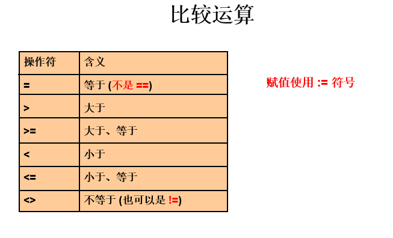
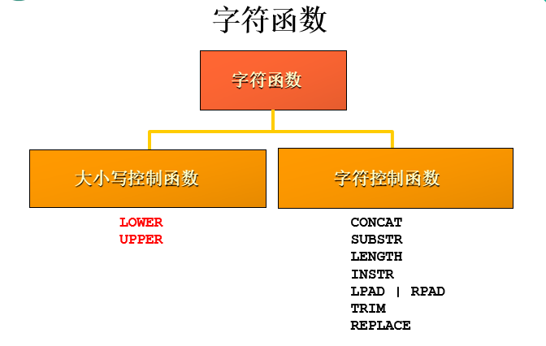
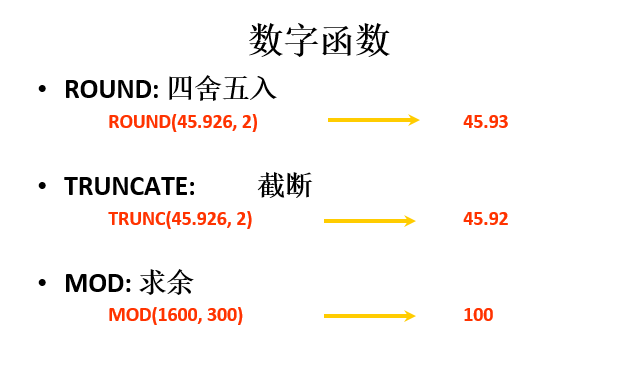
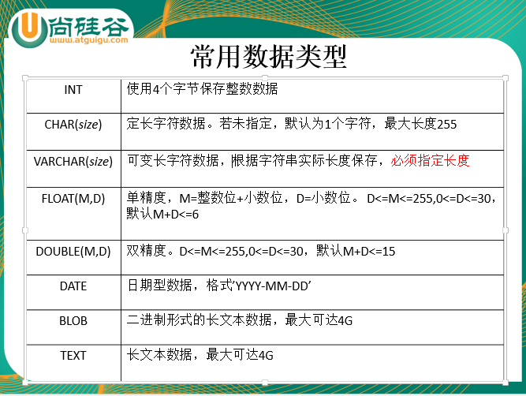

# 一、MySQL 数据库

MySQL是一种开放源代码的关系型数据库管理系统，开发者为瑞典MySQL AB公司。

DBMS：数据库管理系统（Database Management System）是一种操纵和管理数据库的大型软件，例如建立、使用和维护数据库。

DB：数据库（Database）

MySQL：其中的一款关系型数据库管理系统

# 二、SQL：结构化查询语言

（Structure Query Language），专门用来操作/访问数据库的通用语言。

## DML：数据操纵语言

### SELECT :用于查询

​	SELECT : 筛选列 

​	FROM : 删选表

#### 	一、基本 SELECT 使用注意事项：

```mysql
SELECT employee_id, last_name FROM employees;
```

1. 列的别名: 通过 AS 子句。在 SQL 中只有给列起别名时，使用双引号。若别名中含有特殊字符如：空格，则必须使用双引号，否则可以不适用双引号

```mysql
SELECT employee_id AS "id", last_name name FROM employees;
```

2. 空值问题：空值参与运算结果还是空值

```mysql
SELECT employee_id AS "id", last_name， salary * 12 * (1 + commisstion_pc) 
FROM employees;
```

3. MySQL 中默认大小写不敏感
4. 关键字不可以换行

#### 二、显示表结构

DESCRIBE 表名;

DESC 表名;

#### 三、过滤

WHERE : 使用 WHERE 子句进行过滤



```mysql
SELECT * FROM employees WHERE salary > 9000;
```


**特殊比较运算符：**

**between ... and ...** : 在两者之间。（包含边界）

```mysql
SELECT * FROM employees WHERE salary BETWEEN 3000 AND 5000;
```

**in(..., ..., ... )** :等于值列表中的任意一个

```mysql
SELECT * FROM employees WHERE department_id in(60, 80, 90)
```

**like : 模糊查询**

**%** : 表示零个或多个任意字符。

**_** : 一个任意字符

```mysql
SELECT * FROM employees WHERE last_name like '%a%';
```

**is (not) null**: 空（非）值

```mysql
SELECT * FROM employees WHERE commisstion_pct is null;
```


#### 四、排序 ORDER BY

ASC:升序（默认为升序）

DESC:降序

```mysql
SELECT * FROM employees WHERE salary BETWEEN 3000 AND 5000 ORDER BY salary DESC;
```


多列排序：

```mysql
SELECT * FROM employees WHERE salary BETWEEN 3000 AND 5000 
ORDER BY salary DESC， employee_id;
```


#### 五、单行函数

日期型：now()

字符型：



数值型：



#### 六、分组函数

分组函数(多行函数)： MAX()  MIN() AVG() SUM() COUNT()

```mysql
SELECT MAX(salary), MIN(salary) FROM employees;
```


**GROUP BY 分组（重要）**

如：求各个部门的平均工资（按照部门进行分组）

```mysql
SELECT AVG(salary) FROM employees GROUP BY department_id;
```

注意：出现在 SELECT 子句后的非分组函数，一定出现在 GROUP BY 子句后

多列分组

```mysql
SELECT AVG(salary) department_id, job_id department_id 
FROM employees 
GROUP BY department_id, job_id;
```

#### 七、多表连接查询

**按查询情况不同：**

等值连接：连接条件为等式

```mysql
SELECT employee_id, department_name
FROM employees e, departments d
WHERE e.department_id = d.department_id;
```

非等值连接：连接条件为非等式

```mysql
SELECT employee_id, salary, grade_level
FROM employees e, job_grades j
WHERE e.salary BETWEEN j.lowest_sal AND j.highest_sal;
```

内连接：查询结果都为满足连接条件的数据

```mysql
SELECT employee_id, department_name
FROM employees e, departments d
WHERE e.department_id = d.department_id;
```


SQL99 语法：INNER JOIN ... ON ...(inner 可以省略不写)

```mysql
SELECT employee_id, department_name
FROM employees e
JOIN departments d
on e.department_id = d.department_id
```

外连接：

​	左外连接：不仅将满足条件的数据查出，还将“左表”中不满足条件的数据也查出

​		（LEFT OUTER JOIN...ON...）-OUTER 可以省略不写

```mysql
SELECT employee_id, department_name
FROM employees e 
LEFT JOIN departments d
on e.department_id = d.department_id
```

​	右外连接：不仅将满足条件的数据查出，还将“右表”中不满足条件的数据也查出

​		（RIGHT OUTER JOIN...ON...）

```mysql
SELECT employee_id, department_name
FROM employees e 
RIGHT JOIN departments d
on e.department_id = d.department_id
```

非自连接：不同表之间的连接

```mysql
SELECT employee_id, department_name
FROM employees e
JOIN departments d
on e.department_id = d.department_id
```

自连接：自己表连接自己表

如：xxx works for xxx

```mysql
SELECT CONCAT(emp.last_name, ' works for ', mgr.last_name)
FROM employees emp
JOIN employees mgr
ON emp.manager_id = mgr.employee_id;
```

#### 八、子查询

子查询解决的问题：

如：求谁的工资比 Abel 的高

非子查询的做法:增加 IO 访问，效率低且繁琐

```mysql
SELECT salary FROM employees WHERE last_name = 'Abel';   #11000
SELECT * FROM employees WHERE salary > 11000;
```

子查询解决：

```mysql
#主查询（外查询）
SELECT * FROM employees WHERE salary > (
	#子查询（内查询）
	SELECT salary FROM employees WHERE last_name = 'Abel'
);
```

#### 九、分页 LIMIT(重要)

公式：(当前页数-1) * 每页条数， 每页条数

```mysql
SELECT *
FROM employees
ORDER BY salary DESC
LIMIT (当前页数-1) * 每页条数， 每页条数
```

注意：LIMIT 用在 SELECT 子句的末尾

### INSERT:用于添加数据到表中

INSERT INTO 表名(列名) VALUES(添加的值)；

```mysql
INSERT INTO employees(employee_id, last_name) VALUES(101, 'TOM');
```

基于现有表导入数据

```mysql
INSERT INTO emp
SELECT *
FROM employees;
```

### DELETE:删除表中数据

DELETE FROM 表名 WHERE 删除条件

```mysql
DELETE FROM employees WHERE employee_id = 10;
```

注意：若不提供删除条件，默认删除所有

### UPDATE:更新表中数据

UPDATE 表名 SET 更新的列 = 更新的值  WHERE 更新条件

```mysql
UPDATE employees SET last_name = 'Tom' WHERE employee_id = 101;
```

注意：若不提供修改条件，默认修改所有

## DDL：数据定义语言

### 创建和管理表



1. 创建表  CREATE TABLE ...	

   ```mysql
   -- 方式一：
   CREATE TABLE emp1(
   	id INT(10),
   	`name` VARCHAR(20),
   	salary DOUBLE(10, 2),
   	hire_date DATE
   );
   
   CREATE TABLE emp2(
   	id INT(10) AUTO_INCREMENT,
   	NAME VARCHAR(20),
   	salary DOUBLE(10, 2),
   	PRIMARY KEY(id)
   );
   
   
   DESC emp1;
   
   SELECT * FROM emp1;
   
   -- 方式二：基于现有表创建新表(相当于表的复制)
   CREATE TABLE emp3
   AS
   SELECT employee_id, last_name, salary
   FROM employees
   WHERE department_id = 90;
   
   SELECT * FROM emp3;
   
   DESC employees;
   DESC emp3;
   
   -- 方式三：基于现有表创建新表，但是不导入数据
   CREATE TABLE emp4
   AS
   SELECT *
   FROM employees
   WHERE 1 = 2;
   ```

    

2. 修改表 ALTER TABLE ...

   ```mysql
   -- ①添加列
   ALTER TABLE emp3
   ADD age INT;
   
   ALTER TABLE emp3
   ADD gender VARCHAR(2) DEFAULT '男';
   
   -- ②修改列
   ALTER TABLE emp3
   MODIFY gender VARCHAR(30);
   
   DESC emp3;
   
   -- ③重命名列
   ALTER TABLE emp3
   CHANGE gender gender22 VARCHAR(2);
   
   -- ④删除列
   ALTER TABLE emp3
   DROP COLUMN gender22;
   ```

   

3. 删除表 DROP TABLE ...

   ```mysql
   DROP TABLE emp3;
   ```

   

4. 重命名表 

   ```mysql
   ALTER TABLE emp5
   RENAME employees;
   ```

   

5. 清空表

   ```mysql
   TRUNCATE TABLE emp5;
   ```

   注意：DDL 是不可回滚的，每个 DDL 都自动提交

### 约束

–**NOT NULL** **非空约束，规定某个字段不能为空**

```mysql
CREATE TABLE emp1(
	id INT,
	NAME VARCHAR(20) NOT NULL DEFAULT 'Tom'
);

#添加非空约束(实际就是修改列的操作)
ALTER TABLE emp1
MODIFY id INT(10) NOT NULL;

#删除非空约束
ALTER TABLE emp1
MODIFY NAME VARCHAR(20) NULL;
```


–**UNIQUE**  **唯一约束，规定某个字段在整个表中是唯一的**

```mysql
-- 表级约束：声明表时，在表的末尾指定的约束
CREATE TABLE emp2(
	id INT(10),
	NAME VARCHAR(20),
	CONSTRAINT emp2_name_un UNIQUE(NAME)
);

-- 组合约束:可以同时为多个列设置唯一约束，当多个列都重复的情况下，视为重复数据
CREATE TABLE emp3(
	id INT(10),
	NAME VARCHAR(20),
	phone VARCHAR(30),
	email VARCHAR(30),
	CONSTRAINT emp3_phoneAndEmail_un UNIQUE(phone, email)
);

#添加唯一约束
ALTER TABLE emp4
ADD CONSTRAINT emp4_name_un UNIQUE(NAME);

#删除唯一约束
ALTER TABLE emp4
DROP INDEX emp4_name_un;
```

–**PRIMARY KEY**  **主键(非空且唯一)**：通常用于确定唯一一条数据

```mysql
CREATE TABLE emp5(
	id INT(10) AUTO_INCREMENT PRIMARY KEY,
	NAME VARCHAR(20)
);

CREATE TABLE emp7(
	id INT(10),
	NAME VARCHAR(20),
	CONSTRAINT emp7_id_pk PRIMARY KEY(id)
);

#添加主键约束
ALTER TABLE emp7
ADD CONSTRAINT emp7_id_pk PRIMARY KEY(id);

#删除主键约束
ALTER TABLE emp7
DROP PRIMARY KEY;
```

–**FOREIGN KEY**  **外键**：通常关联一个表的主键，出现在外键表中的数据，一定出现在主键表中

```mysql
CREATE TABLE dept(
	department_id INT(10) PRIMARY KEY,
	department_name VARCHAR(20)
);

CREATE TABLE emp8(
	id INT(10),
	NAME VARCHAR(20),
	dept_id INT(10),
	CONSTRAINT emp8_deptId_fk FOREIGN KEY(dept_id) REFERENCES dept(department_id)
	-- ON DELETE CASCADE (级联删除): 当父表中的列被删除时，子表中相对应的列也被删除
	ON DELETE SET NULL -- (级联置空): 子表中相应的列置空
);

#添加外键约束
ALTER TABLE emp9
ADD CONSTRAINT emp9_deptId_fk FOREIGN KEY(dept_id) REFERENCES dept(department_id);

#删除外键约束
ALTER TABLE emp9
DROP FOREIGN KEY emp9_deptId_fk;


```

CHECK  检查约束:MySQL无任何效果，但是 Oracle 中可以的

```mysql
CREATE TABLE emp10(
	id INT(10),
	NAME VARCHAR(20),
	salary DOUBLE(10, 2),
	CONSTRAINT emp10_salary_ck CHECK(salary > 3000)
);
```


## DCL：数据控制语言

事务：指从一组逻辑操作单元，到另外一种逻辑操作单元。

（一个 COMMIT 和 一个 ROLLBACK 之间的一个或多个的 DML ）

COMMIT;  提交。之前的操作将永久生效

ROLLBACK; 回滚。默认回滚到上一次 COMMIT;